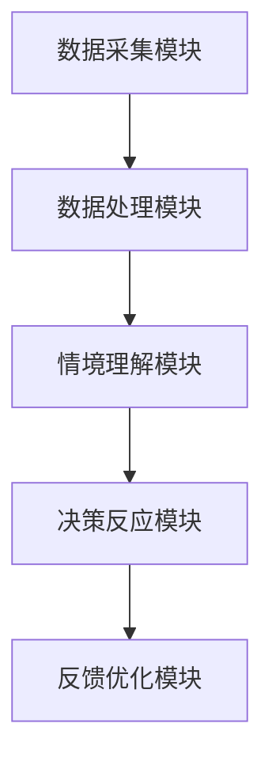

                 


# AI Agent的多模态情境感知与反应系统

> 关键词：AI Agent, 多模态情境感知, 反应系统, 机器学习, 深度学习, 多模态数据融合

> 摘要：本文章深入探讨了AI Agent在多模态情境下的感知与反应系统。通过分析多模态数据融合、情境理解、决策反应等关键环节，结合实际应用场景，系统性地阐述了构建高效AI Agent系统的原理与方法。文章从背景介绍、核心概念、算法原理、系统架构到项目实战，全面解析了多模态情境感知与反应系统的构建过程，为读者提供了理论支持和实践指导。

---

## 第1章: 多模态情境感知与反应系统背景介绍

### 1.1 问题背景

#### 1.1.1 AI Agent的基本概念
- AI Agent：智能体，能够感知环境、自主决策并执行任务的实体。
- 特性：自主性、反应性、目标导向性、学习能力。

#### 1.1.2 多模态数据的定义与特点
- 多模态数据：结合多种数据类型（如文本、图像、语音、视频）的信息。
- 特点：互补性、多样性、复杂性。

#### 1.1.3 情境感知与反应系统的重要性
- 情境感知：理解当前环境状态，识别关键信息。
- 反应系统：基于感知结果，实时响应并调整行为。

### 1.2 问题描述

#### 1.2.1 当前AI Agent的局限性
- 单一模态处理：难以全面理解复杂环境。
- 情境理解不足：缺乏对上下文的深度理解。
- 反应机制简单：决策依赖有限规则，缺乏灵活性。

#### 1.2.2 多模态数据处理的挑战
- 数据异构性：不同模态的数据格式和特性差异大。
- 数据融合困难：如何有效整合多模态信息是关键。
- 计算资源需求高：处理多模态数据需要强大的计算能力。

#### 1.2.3 情境感知与反应系统的目标
- 实现多模态数据的有效融合。
- 提高情境理解的准确性和深度。
- 构建高效的反应机制，实现智能决策。

### 1.3 问题解决

#### 1.3.1 多模态数据融合的方法
- 数据级融合：在数据采集阶段进行融合。
- 特征级融合：提取各模态的特征后进行融合。
- 决策级融合：在决策阶段结合各模态的信息。

#### 1.3.2 情境感知的实现路径
- 数据采集：多模态数据的获取与预处理。
- 特征提取：利用深度学习提取有用特征。
- 上下文理解：基于语义网络或知识图谱进行情境推理。

#### 1.3.3 反应系统的构建策略
- 反应规则：基于知识库或经验的规则制定。
- 动态调整：根据实时反馈优化反应策略。
- 多目标优化：平衡不同目标，实现最优反应。

### 1.4 边界与外延

#### 1.4.1 系统的边界定义
- 输入：多模态数据流。
- 输出：智能反应动作。
- 约束：计算资源限制、实时性要求。

#### 1.4.2 相关领域的区别与联系
- 与计算机视觉的区别：多模态处理更复杂。
- 与自然语言处理的联系：结合文本和图像信息。
- 与强化学习的联系：基于反馈优化反应策略。

#### 1.4.3 应用场景的限制与扩展
- 限制：特定场景下的应用，如智能家居。
- 扩展：扩展到更多领域，如自动驾驶。

### 1.5 核心要素组成

#### 1.5.1 多模态数据源
- 文本、图像、语音、视频等多种数据源。

#### 1.5.2 情境感知模型
- 用于理解当前环境状态的模型，如多模态融合网络。

#### 1.5.3 反应策略库
- 包含多种反应策略的知识库，支持动态调整。

---

## 第2章: AI Agent的核心概念与多模态技术

### 2.1 AI Agent的基本概念

#### 2.1.1 AI Agent的定义
- AI Agent：智能体，具备自主性、反应性、目标导向性。

#### 2.1.2 AI Agent的分类
- 按智能水平：反应式、认知式。
- 按应用领域：服务型、监控型。

#### 2.1.3 AI Agent的关键特性
- 自主性：独立决策能力。
- 反应性：实时响应环境变化。
- 目标导向性：为实现目标而行动。

### 2.2 多模态技术的定义与特点

#### 2.2.1 多模态数据的类型
- 文本、图像、语音、视频等。

#### 2.2.2 多模态数据的融合方式
- 数据级、特征级、决策级融合。

#### 2.2.3 多模态技术的优势
- 提高信息理解的全面性。
- 增强系统的鲁棒性和适应性。

### 2.3 多模态技术在AI Agent中的应用

#### 2.3.1 多模态数据的采集与处理
- 多传感器数据融合：如摄像头、麦克风的数据整合。

#### 2.3.2 多模态数据的分析与理解
- 跨模态特征提取：利用深度学习提取文本、图像特征。
- 语义理解：基于语义网络进行信息关联。

#### 2.3.3 多模态数据的决策与反馈
- 融合多模态信息进行决策。
- 根据反馈优化决策策略。

---

## 第3章: 多模态情境感知的原理与方法

### 3.1 多模态数据融合的原理

#### 3.1.1 数据融合的基本概念
- 数据融合：将多个数据源的信息整合，提高信息质量。

#### 3.1.2 多模态数据融合的层次结构
- 数据级：原始数据的融合。
- 特征级：特征向量的融合。
- 决策级：决策结果的融合。

#### 3.1.3 数据融合的数学模型
- 线性组合：$y = w_1x_1 + w_2x_2 + ... + w_nx_n$
- 加权融合：$y = \sum_{i=1}^{n} w_i x_i$

### 3.2 情境感知的实现路径

#### 3.2.1 数据采集与预处理
- 多模态数据采集：文本、图像、语音等。
- 数据清洗：去除噪声，提取有用特征。

#### 3.2.2 多模态特征提取
- 文本特征：词向量、句向量。
- 图像特征：CNN提取的特征向量。

#### 3.2.3 情境理解与推理
- 语义理解：基于BERT进行文本理解。
- 图像理解：基于FRCN进行目标检测。

---

## 第4章: 多模态情境反应系统的设计与实现

### 4.1 情境反应机制

#### 4.1.1 反应规则的制定
- 基于知识库的规则：如“当检测到火灾警报时，触发报警系统”。

#### 4.1.2 动态调整策略
- 根据反馈实时优化反应策略。

### 4.2 决策模型的构建

#### 4.2.1 基于强化学习的决策模型
- 状态空间：环境状态的表示。
- 动作空间：可能的反应动作。
- 奖励函数：衡量决策的好坏。

#### 4.2.2 基于策略网络的决策模型
- 策略网络：直接输出最优动作。
- 网络结构：全连接层、RNN层。

### 4.3 反馈优化

#### 4.3.1 反馈机制的设计
- 立即反馈：实时反馈反应结果。
- 延时反馈：延迟反馈优化决策。

#### 4.3.2 反馈优化的实现
- 调整权重：优化模型参数。
- 更新策略：更新反应策略库。

---

## 第5章: 多模态情境感知与反应系统的算法原理

### 5.1 算法原理概述

#### 5.1.1 算法流程
- 数据预处理 → 特征提取 → 情境理解 → 决策反应。

#### 5.1.2 算法选择
- 感知算法：多模态融合网络。
- 反应算法：强化学习模型。

### 5.2 算法实现

#### 5.2.1 感知算法
- 使用多模态融合网络进行情境理解。
- 网络结构：融合文本和图像特征。

#### 5.2.2 反应算法
- 基于强化学习的决策模型。
- 网络结构：策略网络、Q网络。

---

## 第6章: 多模态情境感知与反应系统的系统架构

### 6.1 系统模块划分

#### 6.1.1 数据采集模块
- 功能：多模态数据的采集。
- 接口：数据输入接口。

#### 6.1.2 数据处理模块
- 功能：数据清洗、特征提取。
- 接口：与数据采集模块和情境理解模块相连。

#### 6.1.3 情境理解模块
- 功能：基于多模态数据进行情境理解。
- 接口：与决策反应模块相连。

#### 6.1.4 决策反应模块
- 功能：基于情境理解结果进行决策。
- 接口：与数据处理模块和反馈优化模块相连。

#### 6.1.5 反馈优化模块
- 功能：优化决策策略。
- 接口：与决策反应模块相连。

### 6.2 系统架构设计

#### 6.2.1 系统架构图


#### 6.2.2 模块交互设计
- 数据流：从数据采集到反馈优化。
- 控制流：基于反馈优化决策策略。

---

## 第7章: 多模态情境感知与反应系统的项目实战

### 7.1 项目环境安装

#### 7.1.1 安装Python环境
- 使用Anaconda或virtualenv管理环境。

#### 7.1.2 安装依赖库
- 深度学习框架：TensorFlow、PyTorch。
- 数据处理库：Pandas、NumPy。
- 可视化库：Matplotlib、Seaborn。

### 7.2 项目核心代码实现

#### 7.2.1 数据预处理代码
```python
import numpy as np
import pandas as pd

def preprocess_data(data):
    # 数据清洗
    data = data.dropna()
    # 特征提取
    features = data[['text', 'image']]
    return features
```

#### 7.2.2 情境理解模型代码
```python
import tensorflow as tf
from tensorflow.keras import layers

def build_model():
    # 多模态融合模型
    input_text = layers.Input(shape=(None, 128))
    input_image = layers.Input(shape=(224, 224, 3))
    
    # 文本分支
    text_branch = layers.Bidirectional(layers.LSTM(128))(input_text)
    
    # 图像分支
    image_branch = layers.Conv2D(64, (3,3), activation='relu')(input_image)
    image_branch = layers.MaxPooling2D((2,2))(image_branch)
    image_branch = layers.Flatten()(image_branch)
    
    # 融合层
    merged = layers.Concatenate()([text_branch, image_branch])
    output = layers.Dense(1, activation='sigmoid')(merged)
    
    model = tf.keras.Model(inputs=[input_text, input_image], outputs=output)
    return model
```

### 7.3 代码实现与解读

#### 7.3.1 数据预处理解读
- 功能：清洗数据，提取特征。
- 输入：原始数据。
- 输出：处理后的特征数据。

#### 7.3.2 情境理解模型解读
- 输入：文本和图像数据。
- 输出：情境理解结果。
- 结构：双向LSTM处理文本，CNN处理图像，融合层整合特征。

### 7.4 项目案例分析

#### 7.4.1 案例背景
- 应用场景：智能家居中的多模态情境感知。

#### 7.4.2 案例分析
- 数据采集：用户指令、环境传感器数据。
- 情境理解：识别用户需求，如“打开灯”。
- 决策反应：执行相应操作。

### 7.5 项目小结

#### 7.5.1 核心功能总结
- 数据预处理：清洗和特征提取。
- 情境理解：多模态数据融合与语义理解。
- 决策反应：基于强化学习的动态调整。

#### 7.5.2 项目实现的关键点
- 多模态数据融合的实现。
- 深度学习模型的训练与优化。
- 反馈机制的实时调整。

---

## 第8章: 多模态情境感知与反应系统的最佳实践与未来展望

### 8.1 最佳实践

#### 8.1.1 数据处理
- 确保数据质量和多样性。
- 处理异构数据时使用适当的融合方法。

#### 8.1.2 模型选择
- 根据任务需求选择合适的模型。
- 结合领域知识优化模型结构。

### 8.2 小结

#### 8.2.1 核心知识点回顾
- 多模态数据融合方法。
- 情境理解与决策反应的实现。
- 系统架构设计与优化。

#### 8.2.2 实践中的注意事项
- 处理多模态数据时要注意数据异构性。
- 模型训练时要平衡计算资源和准确率。

### 8.3 未来展望

#### 8.3.1 技术发展趋势
- 更高效的多模态数据处理方法。
- 更智能的情境理解模型。
- 更灵活的决策反应机制。

#### 8.3.2 应用领域的扩展
- 智能家居、智能交通、智能医疗。
- 更多行业的应用探索。

---

## 作者：AI天才研究院/AI Genius Institute & 禅与计算机程序设计艺术 /Zen And The Art of Computer Programming

