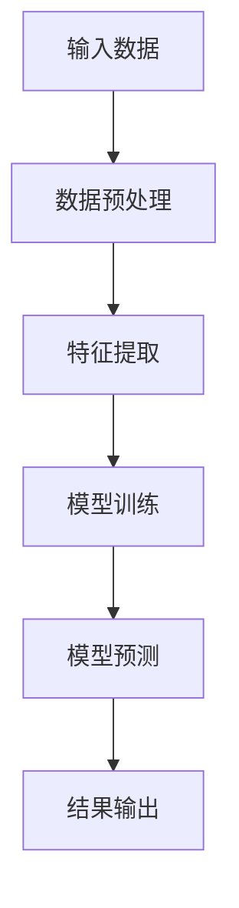
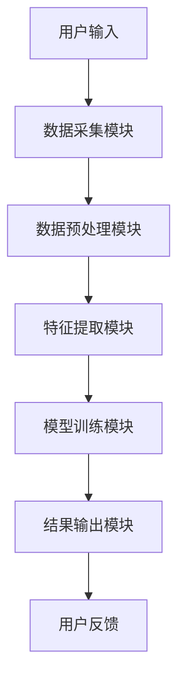

                 


# AI Agent的多模态情感分析系统

> 关键词：AI Agent，多模态情感分析，自然语言处理，深度学习，系统架构

> 摘要：本文探讨了AI Agent在多模态情感分析系统中的应用，系统地分析了该系统的核心算法、架构设计以及实现方案。通过详细的技术分析和案例解读，深入阐述了如何利用多模态数据提升情感分析的准确性和鲁棒性，并提供了从理论到实践的完整实现方案。

---

## 第一部分：AI Agent与多模态情感分析的背景与概念

### 第1章：AI Agent的基本概念与应用

#### 1.1 AI Agent的定义与核心特征

AI Agent（智能代理）是指能够感知环境、自主决策并执行任务的智能系统。AI Agent的核心特征包括：

- **自主性**：能够自主决策，无需人工干预。
- **反应性**：能够实时感知环境并做出反应。
- **目标导向性**：具有明确的目标，能够为实现目标而行动。
- **学习能力**：能够通过经验改进自身性能。

AI Agent的应用场景广泛，包括智能助手、推荐系统、自动驾驶、智能客服等。

#### 1.2 多模态数据的基本概念

多模态数据是指来自不同感官渠道（如文本、语音、图像、视频等）的数据。常见的多模态数据类型包括：

- 文本：包括自然语言文本、社交媒体评论等。
- 语音：包括音频数据、语调、语气等。
- 图像：包括图片、视频流等。
- 姿势：包括肢体动作、面部表情等。

多模态数据处理的挑战在于如何有效地融合多种数据源，提取有用的特征信息。

---

### 第2章：多模态情感分析的背景与意义

#### 2.1 情感分析的定义与应用

情感分析（Sentiment Analysis）是一种自然语言处理任务，旨在判断文本中表达的情感倾向（如正面、负面或中性）。情感分析的主要应用领域包括：

- **社交媒体分析**：分析用户对品牌或产品的评价。
- **客服系统**：通过分析客户反馈优化服务质量。
- **金融市场**：通过分析新闻和评论预测股票走势。

#### 2.2 多模态情感分析的优势

多模态情感分析相较于传统的单模态情感分析具有以下优势：

- **信息丰富性**：多模态数据能够提供更丰富的语境信息。
- **鲁棒性**：通过融合多种数据源，可以弥补单一模态数据的不足。
- **应用场景广泛**：适用于视频通话、虚拟助手、智能客服等场景。

---

## 第二部分：多模态情感分析的核心算法与实现

### 第3章：情感分析的算法原理

#### 3.1 基于传统机器学习的情感分析

传统机器学习方法依赖于人工特征提取，常用算法包括支持向量机（SVM）和朴素贝叶斯（Naive Bayes）。

- **SVM**：通过构建超平面实现分类，适用于小规模数据集。
- **Naive Bayes**：基于贝叶斯定理，假设特征之间独立，适用于文本分类。

#### 3.2 基于深度学习的情感分析

深度学习模型在情感分析中表现优异，常用模型包括循环神经网络（RNN）、长短期记忆网络（LSTM）和Transformer。

- **RNN/LSTM**：适用于序列数据，能够捕捉上下文信息。
- **Transformer**：基于自注意力机制，能够并行处理大规模数据。

#### 3.3 多模态情感分析的算法流程

以下是多模态情感分析的算法流程图：



---

## 第三部分：多模态情感分析系统的架构设计

### 第4章：系统功能设计

#### 4.1 系统功能模块

多模态情感分析系统主要包括以下功能模块：

- **数据采集模块**：从多种数据源采集文本、语音、图像等数据。
- **数据预处理模块**：对采集的数据进行清洗、归一化处理。
- **特征提取模块**：将预处理后的数据转化为模型可识别的特征向量。
- **模型训练模块**：基于特征向量训练情感分析模型。
- **结果输出模块**：输出模型预测的情感结果。

#### 4.2 系统架构设计

以下是系统的架构图：



---

## 第四部分：项目实战

### 第5章：环境配置与代码实现

#### 5.1 环境配置

以下是Python环境的配置示例：

```python
# 安装依赖
pip install numpy
pip install pandas
pip install tensorflow
pip install matplotlib
pip install scikit-learn
```

#### 5.2 核心代码实现

以下是基于深度学习的情感分析代码示例：

```python
import tensorflow as tf
from tensorflow.keras import layers

model = tf.keras.Sequential()
model.add(layers.Embedding(input_dim=10000, output_dim=50))
model.add(layers.LSTM(64, return_sequences=True))
model.add(layers.Dense(3, activation='softmax'))

model.compile(optimizer='adam', loss='sparse_categorical_crossentropy', metrics=['accuracy'])

model.fit(x_train, y_train, epochs=5, batch_size=32)
```

---

## 第五部分：总结与注意事项

### 第6章：总结与优化建议

#### 6.1 总结

本文系统地介绍了AI Agent在多模态情感分析中的应用，详细分析了算法原理和系统架构设计。通过项目实战，展示了如何实现一个多模态情感分析系统。

#### 6.2 注意事项

- 在实际应用中，需注意数据隐私问题。
- 模型训练时，建议使用高质量的数据集以提高准确率。
- 系统部署时，需考虑计算资源的限制。

---

## 作者

作者：AI天才研究院 & 禅与计算机程序设计艺术

---

通过以上思考和规划，我可以逐步完成整篇文章的撰写，确保内容详实、逻辑清晰。

