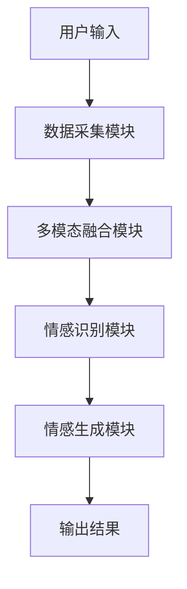

                 


# AI Agent的多模态情感识别与生成

> 关键词：AI Agent, 多模态情感识别, 情感生成, 机器学习, 深度学习

> 摘要：本文详细探讨了AI Agent在多模态情感识别与生成中的应用，从核心概念到算法实现，再到系统架构设计，结合实际案例，全面分析了多模态情感识别与生成的技术细节和实现方法，最后总结了项目成果并展望了未来发展方向。

---

## 第1章: AI Agent与多模态情感识别的背景介绍

### 1.1 AI Agent的基本概念

#### 1.1.1 AI Agent的定义与特点
AI Agent（人工智能代理）是一种能够感知环境并采取行动以实现目标的智能实体。它具备自主性、反应性、目标导向性和社交能力等特点。AI Agent广泛应用于自然语言处理、计算机视觉、智能推荐等领域。

#### 1.1.2 多模态数据的定义与类型
多模态数据是指结合了多种数据形式（如文本、语音、图像、视频等）的信息。常见的多模态数据类型包括：
- 文本：如聊天记录、社交媒体帖子。
- 语音：如音频片段、语音信号。
- 图像：如面部表情、手势动作。
- 视频：如动态视频流。

#### 1.1.3 情感识别与生成的背景与意义
情感识别是通过分析多模态数据来推断个体的情感状态，而情感生成则是根据给定的情感信息生成相应的多模态内容。情感识别与生成在人机交互、智能客服、教育科技等领域具有重要应用价值，能够提升用户体验和系统智能化水平。

---

### 1.2 多模态情感识别的核心问题

#### 1.2.1 情感识别的定义与目标
情感识别旨在从多模态数据中提取情感特征，通过模型训练来预测目标的情感状态。其核心目标是提高识别的准确性和鲁棒性。

#### 1.2.2 多模态数据的融合方法
多模态数据的融合方法包括：
1. **早期融合**：在特征提取阶段结合多种数据。
2. **晚期融合**：在高层进行特征融合。
3. **混合融合**：结合时间维度的特征融合。

#### 1.2.3 情感生成的挑战与解决方案
情感生成的挑战在于如何生成自然、连贯且符合情感目标的多模态内容。解决方案包括使用生成对抗网络（GAN）、变自编码器（VAE）等深度学习模型。

---

## 第2章: 多模态情感识别的核心概念与联系

### 2.1 情感识别的核心原理

#### 2.1.1 情感识别的流程与步骤
1. **数据采集**：获取多模态数据。
2. **特征提取**：提取文本、语音、图像等特征。
3. **模型训练**：使用监督学习方法训练分类器。
4. **情感预测**：输入新数据，输出情感标签。

#### 2.1.2 多模态数据的特征提取方法
- 文本：词袋模型、词嵌入。
- 语音：频域特征、时域特征。
- 图像：CNN提取视觉特征。

#### 2.1.3 情感识别的性能评估指标
- 准确率、召回率、F1分数。
- 混淆矩阵、ROC曲线。

### 2.2 情感生成的核心原理

#### 2.2.1 情感生成的定义与目标
情感生成旨在根据输入的情感信息生成相应的内容，如情感文本生成、情感图像生成。

#### 2.2.3 情感生成的模型选择与优化
- 基于RNN的序列生成。
- 基于GAN的图像生成。
- 基于VAE的多样生成。

### 2.3 多模态情感识别与生成的联系

#### 2.3.1 多模态数据融合的策略
- 融合层次：浅层特征融合与深层语义融合。
- 融合方式：加法融合、注意力机制融合。

#### 2.3.2 情感识别与生成的协同优化
通过联合优化识别和生成任务，提升模型的整体性能。

---

## 第3章: 多模态情感识别的算法原理

### 3.1 情感识别的算法实现

#### 3.1.1 基于文本的情感识别算法
- 使用词嵌入（如Word2Vec）提取文本特征。
- 通过CNN或RNN进行文本分类。

#### 3.1.2 基于语音的情感识别算法
- 从语音信号中提取MFCC特征。
- 使用深度神经网络（DNN）进行分类。

#### 3.1.3 基于图像的情感识别算法
- 使用CNN（如VGG、ResNet）提取图像特征。
- 通过分类器（如SVM、随机森林）进行分类。

### 3.2 情感生成的算法实现

#### 3.2.1 基于文本的情感生成算法
- 使用Transformer模型进行文本生成。
- 通过条件生成对抗网络（CGAN）实现情感导向生成。

#### 3.2.2 基于语音的情感生成算法
- 使用语音合成模型（如Tacotron）生成情感语音。
- 调整语调、语速等参数来表达情感。

#### 3.2.3 基于图像的情感生成算法
- 使用生成对抗网络（GAN）生成情感图像。
- 通过情感标签引导生成过程。

---

## 第4章: 多模态情感识别的系统架构设计

### 4.1 系统功能设计

#### 4.1.1 多模态数据采集模块
- 支持文本、语音、图像等多种数据输入方式。
- 提供数据预处理功能，如降噪、归一化。

#### 4.1.2 情感识别模块
- 提供多模态融合功能，实现特征提取与分类。
- 输出情感标签（如快乐、悲伤、愤怒）。

#### 4.1.3 情感生成模块
- 根据情感标签生成相应的多模态内容。
- 提供生成结果的展示与反馈功能。

### 4.2 系统架构设计

#### 4.2.1 系统架构图


#### 4.2.2 模块之间的交互关系
- 数据采集模块接收输入数据。
- 多模态融合模块处理数据并传递给情感识别模块。
- 情感识别模块输出情感标签，传递给情感生成模块。
- 情感生成模块生成内容并输出结果。

---

## 第5章: 多模态情感识别的项目实战

### 5.1 环境安装与配置

#### 5.1.1 开发工具的选择与安装
- Python 3.8+
- PyTorch、Keras、OpenCV等库的安装。

#### 5.1.2 数据集的准备与预处理
- 数据清洗、归一化、特征提取。

### 5.2 系统核心实现

#### 5.2.1 情感识别模块的代码实现
```python
import torch
import torch.nn as nn

class TextCNN(nn.Module):
    def __init__(self, embedding_dim, num_classes):
        super().__init__()
        self.conv1 = nn.Conv2d(1, 10, kernel_size=(3, embedding_dim))
        self.pool = nn.MaxPool2d(pool_size=(2,1))
        self.fc = nn.Linear(10, num_classes)

    def forward(self, x):
        x = self.conv1(x)
        x = self.pool(x)
        x = x.view(-1, 10)
        x = self.fc(x)
        return x
```

#### 5.2.2 情感生成模块的代码实现
```python
import torch
import torch.nn as nn

class Generator(nn.Module):
    def __init__(self, latent_dim, output_dim):
        super().__init__()
        self.fc = nn.Linear(latent_dim, output_dim)

    def forward(self, z):
        return self.fc(z)
```

### 5.3 实际案例分析

#### 5.3.1 案例背景与需求分析
案例目标是通过多模态数据生成带有情感的情感文本和图像。

#### 5.3.2 系统实现与结果展示
- 使用训练好的模型进行情感识别和生成。
- 展示生成的文本和图像，并分析其情感一致性。

---

## 第6章: 总结与展望

### 6.1 项目总结

#### 6.1.1 项目成果与不足
- 成功实现了多模态情感识别与生成系统。
- 系统性能有待进一步优化，特别是在复杂情感场景下的准确率提升。

#### 6.1.2 项目经验与教训
- 数据质量对模型性能影响巨大。
- 多模态融合方法的选择需根据具体场景调整。

### 6.2 未来展望

#### 6.2.1 技术发展趋势
- 更深度的多模态融合技术。
- 更高效的生成模型（如扩散模型）。

#### 6.2.2 应用前景与挑战
- 情感识别与生成技术在教育、医疗、娱乐等领域的广泛应用。
- 隐私保护和伦理问题需要进一步关注。

---

作者：AI天才研究院/AI Genius Institute & 禅与计算机程序设计艺术 /Zen And The Art of Computer Programming

