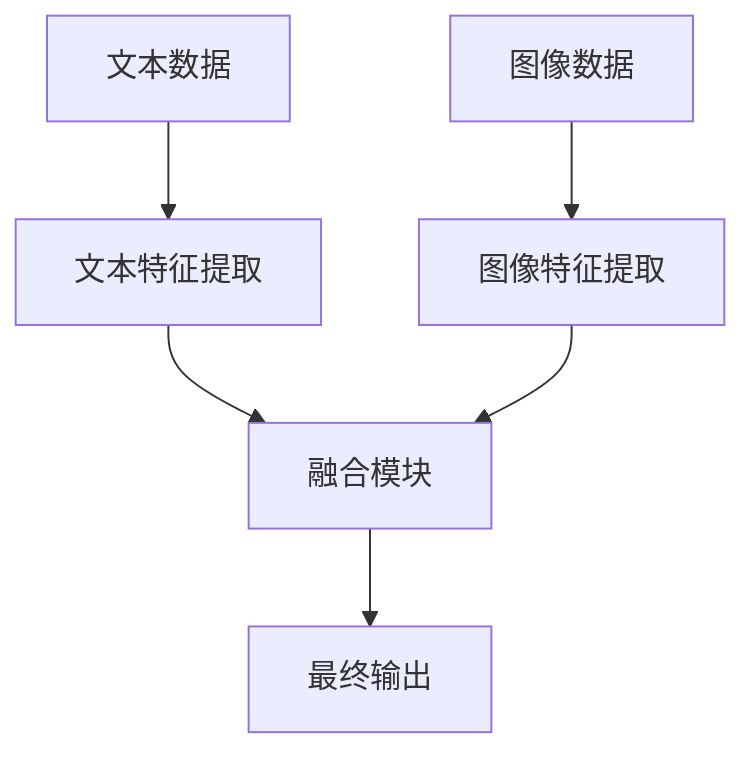
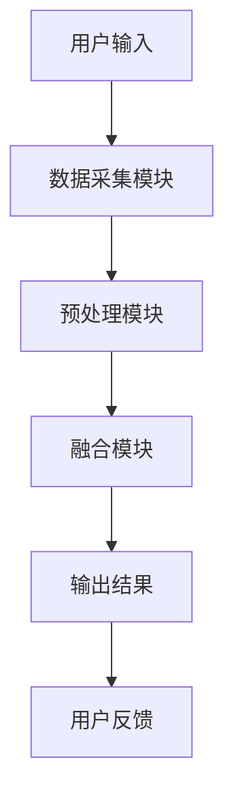

                 


# AI Agent的多模态融合与交互设计

> **关键词**：AI Agent，多模态融合，交互设计，自然语言处理，视觉反馈，语音识别，系统架构

> **摘要**：本文详细探讨了AI Agent在多模态数据融合与交互设计中的关键技术和实践方法。通过分析多模态数据的融合原理、交互设计的核心要素，结合实际案例，展示了如何构建高效且用户友好的AI Agent系统。文章从背景、原理、算法、系统架构到项目实战，全面解析了AI Agent的多模态融合与交互设计的各个环节。

---

## 第一部分: AI Agent的多模态融合与交互设计基础

### 第1章: AI Agent的基本概念与问题背景

#### 1.1 AI Agent的定义与核心概念

AI Agent（人工智能代理）是指能够感知环境、执行任务并与其他实体（包括用户和系统）交互的智能实体。它具备以下几个核心特征：

- **自主性**：能够在没有外部干预的情况下独立执行任务。
- **反应性**：能够根据环境变化动态调整行为。
- **社会性**：能够与人类或其他智能实体进行交互和协作。

**多模态融合**是AI Agent实现复杂任务的核心技术之一。多模态数据（如文本、图像、语音等）的融合能够提升AI Agent的理解能力和交互体验。例如，在客服机器人中，结合语音识别和自然语言处理技术，可以实现更高效的用户支持。

#### 1.2 多模态融合的背景与问题背景

随着AI技术的快速发展，单一模态的处理能力已经难以满足复杂场景的需求。例如，在医疗领域，医生需要结合患者的病历文本、医学图像（如X光片）和生理数据（如心率、体温）来做出准确诊断。此时，AI Agent需要能够整合多种数据源，实现多模态数据的高效融合。

然而，多模态融合也面临诸多挑战，例如：

- **数据异构性**：不同模态的数据格式和特征维度差异较大。
- **计算复杂性**：多模态数据的处理需要更高的计算资源。
- **用户体验**：复杂的交互设计需要确保用户能够轻松理解和使用AI Agent。

---

### 第2章: 多模态融合的核心概念与原理

#### 2.1 多模态数据的分类与特征

多模态数据可以分为以下几类：

1. **文本数据**：包括自然语言文本、结构化数据等。
2. **图像数据**：包括RGB图像、深度图等。
3. **语音数据**：包括音频信号和语音特征。
4. **行为数据**：包括用户点击、滑动等操作记录。

每种数据都有其独特的特征：

- 文本数据具有语义丰富但结构化程度低的特点。
- 图像数据具有空间信息丰富但语义理解困难的特点。
- 语音数据能够传递情感信息但抗噪声能力较弱。

#### 2.2 多模态融合的原理与方法

多模态融合的目的是将不同模态的数据进行整合，以提高AI Agent的理解和决策能力。常见的融合方法包括：

- **特征融合**：将不同模态的特征向量进行线性组合或非线性变换。
- **模型融合**：通过集成学习将多个模态的模型结果进行融合。
- **注意力机制**：在多模态数据中引入注意力机制，突出重要信息。

---

### 第3章: 多模态融合的算法原理与实现

#### 3.1 多模态融合的算法概述

基于深度学习的多模态融合算法是当前的研究热点。以下是一个典型的多模态融合模型的流程图：



在融合模块中，文本特征和图像特征通过全连接层进行融合，最终输出融合后的特征向量。

#### 3.2 多模态融合的数学模型与公式

多模态融合的数学模型可以通过以下公式表示：

$$
f_{\text{融合}}(x_{\text{文本}}, x_{\text{图像}}) = W_{\text{文本}}x_{\text{文本}} + W_{\text{图像}}x_{\text{图像}} + b
$$

其中，$W_{\text{文本}}$和$W_{\text{图像}}$是对应的特征权重矩阵，$b$是偏置项。

---

### 第4章: 多模态融合的系统架构与设计

#### 4.1 系统功能设计

AI Agent的多模态融合系统通常包括以下几个模块：

1. **数据采集模块**：负责采集多模态数据。
2. **预处理模块**：对数据进行清洗和标准化处理。
3. **融合模块**：将不同模态的数据进行融合。
4. **交互模块**：实现与用户的实时交互。

#### 4.2 系统架构设计

系统的整体架构可以分为以下几层：



---

### 第5章: 交互设计的核心方法与实践

#### 5.1 多模态交互设计的基本原则

交互设计是AI Agent成功的关键。以下是几个核心原则：

1. **以用户为中心**：设计交互流程时，应充分考虑用户的使用习惯和需求。
2. **简洁直观**：交互界面和操作流程应尽可能简洁，避免复杂性。
3. **反馈及时**：系统应能够快速响应用户的操作并提供明确的反馈。

#### 5.2 多模态交互设计的实现方法

在实现多模态交互设计时，可以采用以下方法：

1. **自然语言处理**：通过NLP技术实现文本交互。
2. **视觉反馈**：通过图像和图形提供直观的反馈。
3. **语音交互**：通过语音识别和合成实现语音交互。

---

### 第6章: 项目实战与案例分析

#### 6.1 环境搭建与数据准备

以一个简单的多模态融合项目为例，首先需要安装以下环境：

- Python 3.8+
- TensorFlow或PyTorch框架
- 媒体处理库（如OpenCV）

数据准备包括文本数据和图像数据的下载与预处理。

#### 6.2 系统核心实现

以下是多模态融合的代码实现示例：

```python
import tensorflow as tf
import numpy as np

# 文本特征提取
text_input = tf.keras.Input(shape=(max_length,))
embedding_layer = tf.keras.layers.Embedding(vocabulary_size, embedding_dim)(text_input)
text_features = tf.keras.layers.GlobalAveragePooling1D()(embedding_layer)

# 图像特征提取
image_input = tf.keras.Input(shape=(height, width, channels,))
conv_layers = tf.keras.layers.Conv2D(32, (3, 3), activation='relu')(image_input)
conv_layers = tf.keras.layers.MaxPooling2D((2, 2))(conv_layers)
image_features = tf.keras.layers.Flatten()(conv_layers)

# 融合模块
merged = tf.keras.layers.concatenate([text_features, image_features])
dense_layer = tf.keras.layers.Dense(64, activation='relu')(merged)
output = tf.keras.layers.Dense(num_classes, activation='softmax')(dense_layer)

model = tf.keras.Model(inputs=[text_input, image_input], outputs=output)
model.compile(optimizer='adam', loss='categorical_crossentropy', metrics=['accuracy'])
```

---

## 结语

AI Agent的多模态融合与交互设计是一个复杂但充满潜力的领域。通过多模态数据的融合，AI Agent能够更好地理解和满足用户需求。然而，实现高效的多模态融合和友好的交互设计仍面临诸多挑战，需要进一步的研究和实践。

