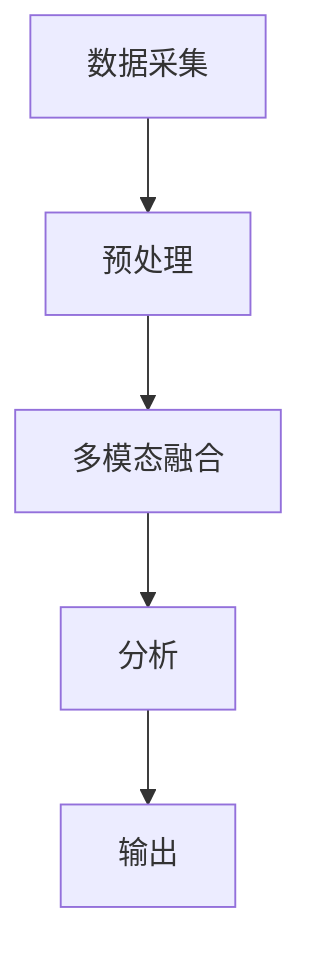
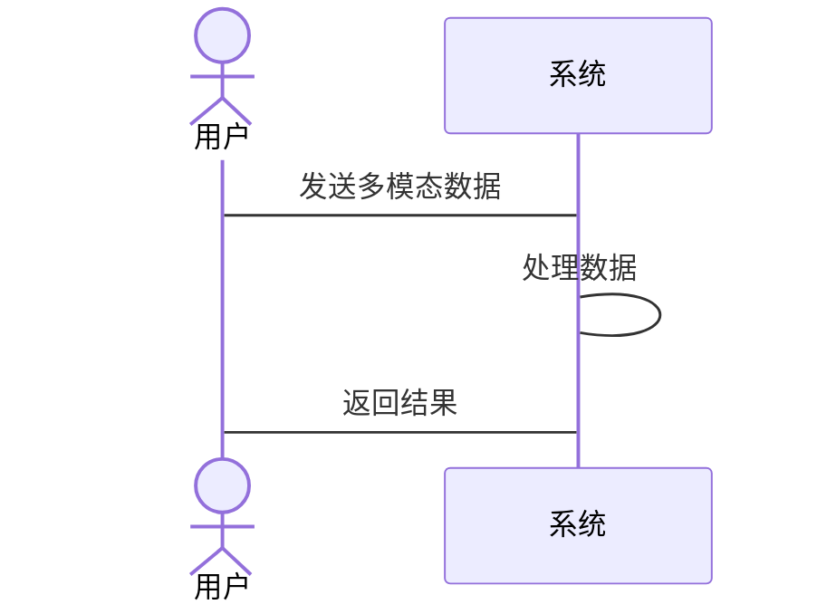

                 


# AI Agent的多模态融合技术

> 关键词：多模态数据，多模态融合，AI Agent，感知与认知，跨模态交互

> 摘要：本文深入探讨了AI Agent的多模态融合技术，从背景与概念、算法原理、系统架构、项目实战到最佳实践，全面解析了多模态融合技术在AI Agent中的应用。通过详细的技术分析和实际案例，展示了多模态融合如何提升AI Agent的能力，为相关领域的研究和实践提供了有价值的参考。

---

# 第一部分: AI Agent的多模态融合技术背景与概念

## 第1章: 多模态数据的背景与定义

### 1.1 多模态数据的背景介绍

#### 1.1.1 多模态数据的定义与特征
多模态数据指的是来自不同感官或数据源的信息，例如视觉（图像、视频）、听觉（语音、音乐）、触觉（力反馈）、嗅觉（气味）和文本（文字、结构化数据）等。每种模态数据都有其独特的特征和优势，例如图像具有丰富的空间信息，语音包含情感和语调信息，文本则承载语义信息。

| 模态类型 | 特征描述 | 应用场景 |
|----------|----------|----------|
| 视觉     | 空间信息丰富，细节丰富 | 图像识别、视频分析 |
| 听觉     | 情感和语调信息丰富 | 语音识别、情感分析 |
| 文本     | 语义信息明确 | 机器翻译、文本分类 |

#### 1.1.2 多模态数据的分类与应用场景
多模态数据可以分为以下几类：
1. **结构化数据**：如表格数据，通常用于统计分析。
2. **非结构化数据**：如文本、图像、语音等，通常用于模式识别。
3. **混合数据**：结合多种模态的数据，如视频加语音。

#### 1.1.3 多模态数据在AI Agent中的重要性
在AI Agent中，多模态数据的融合能够提升其感知和认知能力，使其能够更全面地理解环境和任务需求。例如，在智能音箱中，结合语音识别和视觉识别可以实现更精准的交互。

### 1.2 多模态融合技术的核心概念

#### 1.2.1 多模态融合的定义
多模态融合技术是指将来自不同模态的数据进行整合，以获得更全面的信息理解和更强的决策能力。

#### 1.2.2 多模态融合的基本原理
多模态融合的基本原理是通过将不同模态的数据进行对齐、关联和融合，提取出共同特征，从而提升模型的性能。

#### 1.2.3 多模态融合的目标与优势
- **目标**：通过融合多模态数据，提升AI Agent的感知和认知能力。
- **优势**：提升鲁棒性、准确性和用户体验。

### 1.3 AI Agent与多模态融合的关系

#### 1.3.1 AI Agent的基本概念
AI Agent是一种能够感知环境、执行任务并做出决策的智能实体，广泛应用于机器人、自动驾驶、智能助手等领域。

#### 1.3.2 多模态融合在AI Agent中的作用
多模态融合技术能够帮助AI Agent更好地感知环境、理解用户意图，并做出更准确的决策。

#### 1.3.3 多模态融合技术对AI Agent能力的提升
通过多模态融合，AI Agent能够更全面地感知环境，从而提升其在复杂场景下的表现。

---

## 第2章: 多模态融合技术的发展与应用

### 2.1 多模态融合技术的发展历程

#### 2.1.1 多模态融合技术的起源
多模态融合技术起源于多模态学习的研究，早期主要集中在模式识别领域。

#### 2.1.2 多模态融合技术的关键发展阶段
- **单模态分析阶段**：专注于单一模态数据的处理。
- **跨模态关联阶段**：研究不同模态数据之间的关联性。
- **多模态融合阶段**：将多种模态数据进行融合，提升性能。

#### 2.1.3 当前多模态融合技术的研究热点
当前研究热点包括跨模态对齐、注意力机制、自适应融合等。

### 2.2 多模态融合技术的主要应用领域

#### 2.2.1 计算机视觉中的多模态融合
- **图像与文本融合**：用于图像描述生成和图像检索。
- **图像与语音融合**：用于视频分析和语音辅助识别。

#### 2.2.2 自然语言处理中的多模态融合
- **文本与语音融合**：用于情感分析和语音辅助翻译。
- **文本与视觉融合**：用于跨模态检索和视觉问答。

#### 2.2.3 跨模态检索与推荐系统中的应用
- **跨模态检索**：支持用户通过不同模态的数据进行搜索。
- **推荐系统**：结合用户行为数据和物品属性数据，提升推荐精准度。

### 2.3 多模态融合技术的未来发展趋势

#### 2.3.1 技术融合与创新
未来，多模态融合技术将更加注重不同模态数据的协同优化和自适应调整。

#### 2.3.2 应用场景的拓展
随着技术的成熟，多模态融合将应用于更多领域，如教育、医疗和娱乐。

---

# 第三部分: 多模态融合技术的算法原理

## 第3章: 多模态对齐与注意力机制

### 3.1 多模态对齐的算法原理

#### 3.1.1 多模态对齐的目标
多模态对齐的目标是将不同模态的数据对齐到同一个语义空间，以便后续的融合和分析。

#### 3.1.2 多模态对齐的实现方法
- **跨模态对比学习**：通过对比不同模态的数据，学习其共同特征。
- **自监督学习**：利用未标记数据进行预训练。

#### 3.1.3 多模态对齐的数学模型
跨模态对比学习的数学模型如下：

$$ L = -\frac{1}{N}\sum_{i=1}^{N} [\log(\text{sim}(x_i, y_i))] + \log(\text{sim}(x_i, y_j))] $$

其中，$x_i$和$y_i$分别表示同一样本的不同模态数据，$y_j$表示其他样本的模态数据。

### 3.2 注意力机制的实现原理

#### 3.2.1 注意力机制的基本原理
注意力机制通过计算不同位置的重要性权重，实现对关键信息的聚焦。

#### 3.2.2 多模态注意力机制的实现方法
- **自注意力机制**：用于处理同一模态内的数据。
- **跨模态注意力机制**：用于处理不同模态之间的数据。

#### 3.2.3 多模态注意力机制的数学模型
自注意力机制的数学模型如下：

$$ \text{Attention}(Q, K, V) = \text{softmax}(\frac{QK^T}{\sqrt{d}})V $$

其中，$Q$、$K$和$V$分别是查询、键和值矩阵，$d$是维度数。

---

## 第4章: 多模态融合的系统架构

### 4.1 系统架构设计

#### 4.1.1 系统功能设计
系统功能包括数据采集、预处理、融合、分析和输出。

#### 4.1.2 系统架构图


#### 4.1.3 系统接口设计
- **输入接口**：接收多模态数据。
- **输出接口**：输出融合后的结果。

### 4.2 系统交互流程

#### 4.2.1 系统交互图


---

## 第5章: 项目实战与案例分析

### 5.1 项目实战

#### 5.1.1 环境安装
需要安装Python、TensorFlow和相关库。

#### 5.1.2 核心功能实现
实现多模态数据的预处理、融合和分析。

#### 5.1.3 代码实现
```python
import tensorflow as tf
from tensorflow.keras import layers

model = tf.keras.Sequential([
    layers.Dense(64, activation='relu'),
    layers.Dense(1, activation='sigmoid')
])
model.compile(optimizer='adam', loss='binary_crossentropy', metrics=['accuracy'])
model.fit(x_train, y_train, epochs=10, batch_size=32)
```

### 5.2 案例分析

#### 5.2.1 实际案例
分析一个多模态融合在智能音箱中的应用。

#### 5.2.2 案例解读
通过融合语音和视觉数据，提升智能音箱的交互能力。

---

## 第6章: 最佳实践与总结

### 6.1 最佳实践

#### 6.1.1 实践建议
- 数据预处理要充分。
- 注意力机制要合理设计。
- 系统架构要清晰。

#### 6.1.2 注意事项
- 数据质量和多样性要保证。
- 模型训练要防止过拟合。
- 系统优化要持续进行。

### 6.2 总结与展望

#### 6.2.1 小结
本文系统地介绍了多模态融合技术在AI Agent中的应用，从背景到算法，再到系统设计和项目实战，全面解析了相关技术。

#### 6.2.2 未来展望
未来，多模态融合技术将更加智能化和个性化，推动AI Agent的发展。

---

作者：AI天才研究院 & 禅与计算机程序设计艺术

