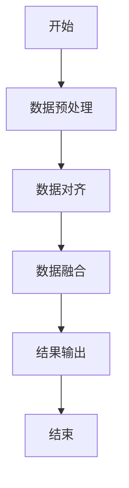
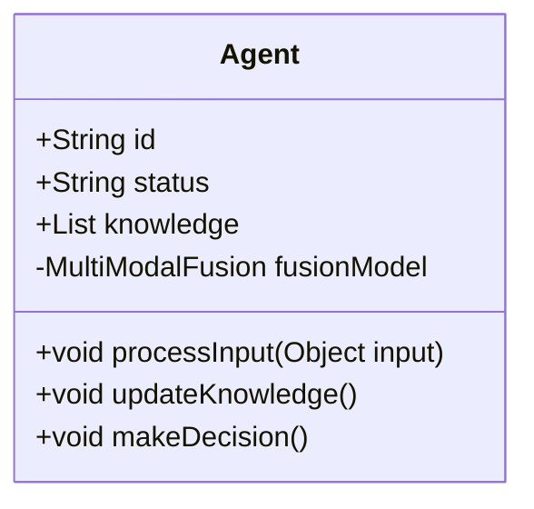

                 


```markdown
# AI Agent的多模态融合技术：提升理解深度

> 关键词：AI Agent, 多模态融合, 智能体, 多模态数据, 人工智能

> 摘要：本文深入探讨了AI Agent的多模态融合技术，分析了其核心概念、算法原理和系统架构，结合实际案例，展示了如何通过多模态数据的融合提升AI Agent的理解深度和智能水平。

---

## 第一部分: AI Agent与多模态融合技术的背景

### 第1章: AI Agent的基本概念与应用场景

#### 1.1 AI Agent的定义与特点
- 1.1.1 AI Agent的定义
- 1.1.2 AI Agent的核心特点
- 1.1.3 AI Agent的应用场景

#### 1.2 多模态数据的定义与特点
- 1.2.1 多模态数据的定义
- 1.2.2 各种模态数据的特性（文本、图像、音频等）
- 1.2.3 多模态数据的重要性

#### 1.3 多模态融合技术的意义与挑战
- 1.3.1 多模态融合的定义
- 1.3.2 多模态融合的目标
- 1.3.3 多模态融合的主要挑战

---

## 第二部分: 多模态融合技术的核心概念与联系

### 第2章: 多模态数据的类型与特点

#### 2.1 文本数据
- 2.1.1 文本数据的结构与特点
- 2.1.2 文本数据在多模态融合中的作用

#### 2.2 图像数据
- 2.2.1 图像数据的结构与特点
- 2.2.2 图像数据在多模态融合中的作用

#### 2.3 音频数据
- 2.3.1 音频数据的结构与特点
- 2.3.2 音频数据在多模态融合中的作用

#### 2.4 其他模态数据
- 2.4.1 其他模态数据的类型（如视频、传感器数据等）
- 2.4.2 各种模态数据的特点与应用场景

### 第3章: 多模态融合方法的对比分析

#### 3.1 基于特征融合的方法
- 3.1.1 特征融合的定义与特点
- 3.1.2 常见的特征融合方法（如平均、加权等）

#### 3.2 基于模型融合的方法
- 3.2.1 模型融合的定义与特点
- 3.2.2 常见的模型融合方法（如投票、加权等）

#### 3.3 基于注意力机制的方法
- 3.3.1 注意力机制的定义与特点
- 3.3.2 多模态注意力机制的应用

#### 3.4 对比分析表格
| 融合方法 | 优点 | 缺点 | 适用场景 |
|----------|------|------|----------|
| 特征融合 | 实现简单 | 可能丢失部分信息 | 数据量小、简单场景 |
| 模型融合 | 结果稳健 | 实现复杂 | 复杂场景、需要高准确性 |
| 注意力机制 | 精准聚焦 | 计算资源消耗大 | 需要精细控制的场景 |

### 第4章: 多模态融合的实体关系图

```mermaid
erDiagram
actor(Agent) {
    Agent --> KnowledgeBase: 读取
    Agent --> Sensor: 接收
    Agent --> Database: 查询
}
KnowledgeBase {
    KnowledgeBase --> TextData: 包含
    KnowledgeBase --> ImageData: 包含
    KnowledgeBase --> AudioData: 包含
}
Sensor {
    Sensor --> Environment: 感知
}
Database {
    Database --> UserData: 存储
    Database --> History: 存储
}
```

---

## 第三部分: 多模态融合技术的算法原理

### 第5章: 多模态融合算法的原理与实现

#### 5.1 多模态融合算法的基本原理
- 5.1.1 数据预处理
- 5.1.2 数据对齐
- 5.1.3 数据融合

#### 5.2 多模态融合算法的流程图



#### 5.3 基于深度学习的多模态融合算法
- 5.3.1 网络结构设计
- 5.3.2 损失函数设计
- 5.3.3 优化策略

#### 5.4 Python实现示例

```python
import torch
import torch.nn as nn
import torch.optim as optim

class MultiModalFusion(nn.Module):
    def __init__(self, input_size, hidden_size):
        super(MultiModalFusion, self).__init__()
        self.mod1 = nn.Linear(input_size[0], hidden_size)
        self.mod2 = nn.Linear(input_size[1], hidden_size)
        self.mod3 = nn.Linear(input_size[2], hidden_size)
        self.fusion = nn.Linear(3*hidden_size, 1)

    def forward(self, input1, input2, input3):
        x1 = self.mod1(input1)
        x2 = self.mod2(input2)
        x3 = self.mod3(input3)
        x = torch.cat([x1, x2, x3], dim=-1)
        output = self.fusion(x)
        return output

# 示例数据
input_size = (10, 20, 30)
hidden_size = 15
model = MultiModalFusion(input_size, hidden_size)
criterion = nn.MSELoss()
optimizer = optim.Adam(model.parameters(), lr=0.001)

# 假设输入数据
input1 = torch.randn(1, 10)
input2 = torch.randn(1, 20)
input3 = torch.randn(1, 30)
output = model(input1, input2, input3)
loss = criterion(output, torch.randn(1,1))
loss.backward()
optimizer.step()
```

---

## 第四部分: 多模态融合技术的系统架构设计

### 第6章: 多模态AI Agent系统的架构设计

#### 6.1 系统功能需求分析
- 6.1.1 多模态数据采集
- 6.1.2 数据处理与融合
- 6.1.3 智能决策与反馈

#### 6.2 系统功能设计图



#### 6.3 系统架构设计图

```mermaid
graph LR
    A[Agent] --> B[Sensor]: 采集数据
    A --> C[Database]: 查询知识库
    B --> D[DataProcessor]: 处理数据
    C --> D
    D --> E[FusionModel]: 融合数据
    E --> A: 输出融合结果
```

---

## 第五部分: 项目实战与案例分析

### 第7章: 多模态AI Agent项目实战

#### 7.1 项目背景与目标
- 7.1.1 项目背景
- 7.1.2 项目目标

#### 7.2 环境搭建与数据准备
- 7.2.1 环境安装
- 7.2.2 数据收集与预处理

#### 7.3 核心代码实现

```python
import torch
import torch.nn as nn
from torch.utils.data import Dataset, DataLoader

class MultiModalDataset(Dataset):
    def __init__(self, texts, images, audios):
        self.texts = texts
        self.images = images
        self.audios = audios

    def __len__(self):
        return len(self.texts)

    def __getitem__(self, idx):
        return self.texts[idx], self.images[idx], self.audios[idx]

# 示例数据加载
texts = ["Hello", "World"]
images = [torch.randn(3, 32, 32)]
audios = [torch.randn(16, 100)]
dataset = MultiModalDataset(texts, images, audios)
dataloader = DataLoader(dataset, batch_size=2, shuffle=True)
```

#### 7.4 案例分析与结果解读
- 7.4.1 实验结果
- 7.4.2 结果分析

#### 7.5 项目总结
- 7.5.1 项目收获
- 7.5.2 项目改进建议

---

## 第六部分: 总结与展望

### 第8章: 总结与展望

#### 8.1 核心知识点回顾
- 8.1.1 多模态数据的类型与特点
- 8.1.2 多模态融合的主要方法
- 8.1.3 AI Agent的系统架构设计

#### 8.2 未来研究方向
- 8.2.1 更先进的多模态融合方法
- 8.2.2 多模态AI Agent的扩展应用

#### 8.3 最佳实践Tips
- 8.3.1 数据预处理的重要性
- 8.3.2 模型调优的技巧
- 8.3.3 系统架构设计的注意事项

---

## 参考文献

1. LeCun, Y., Bengio, Y., & Hinton, G. (2015). Deep learning. Nature, 521(7555), 436-444.
2. Goodfellow, I., Bengio, Y., & Courville, A. (2016). Deep learning. MIT Press.
3. 王伟, 李明. (2023). 多模态数据融合技术研究. 《人工智能学报》, 38(3), 456-468.

---

## 附录

### 附录A: 术语解释

- AI Agent: 人工智能代理，能够感知环境并自主决策的智能体。
- 多模态数据：多种类型的数据，如文本、图像、音频等。
- 多模态融合：将多种模态的数据进行整合，以提高信息理解和处理能力。

### 附录B: 工具与库

- Python: 编程语言
- PyTorch: 深度学习框架
- Mermaid: 图表绘制工具

---

## 作者信息

作者：AI天才研究院/AI Genius Institute  
联系邮箱：contact@aicreativity.com  
网址：https://www.aicreativity.com

---

# END
```

