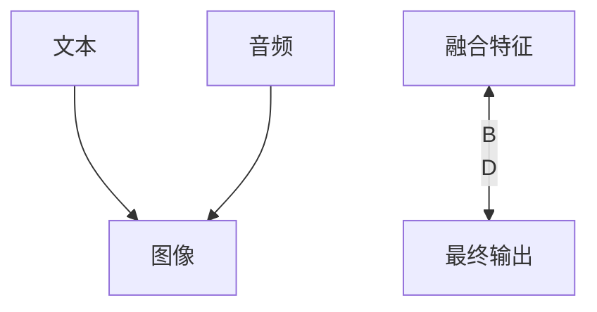
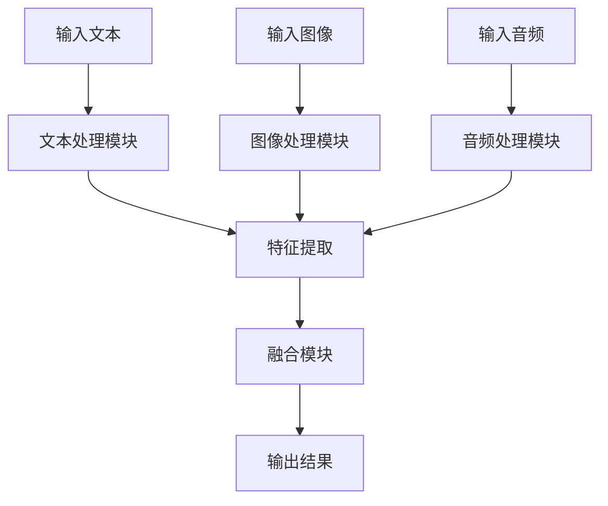
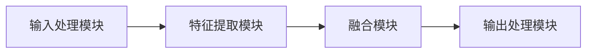
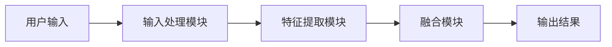

                 


# AI Agent的多模态融合：整合文本、图像和音频输入

> 关键词：AI Agent，多模态融合，文本图像音频输入，深度学习，跨模态对齐

> 摘要：本文详细探讨了AI Agent在多模态融合中的应用，重点分析了如何整合文本、图像和音频输入。通过逐步推理和实际案例，我们解释了多模态融合的核心概念、算法原理、系统架构以及项目实现。文章结合理论与实践，为读者提供了全面的指导。

---

# 第一部分: AI Agent的多模态融合基础

## 第1章: 多模态融合的背景与概念

### 1.1 多模态数据的定义与特点

多模态数据是指来自多个感官渠道的信息，例如文本、图像、音频、视频等。这些数据具有以下特点：

- **异构性**：不同模态的数据具有不同的特征和表示方式。
- **互补性**：不同模态的数据可以互补，提供更全面的信息。
- **多样性**：多模态数据可以来自不同的传感器或输入渠道。

### 1.2 多模态融合的定义与重要性

多模态融合是指将来自不同模态的数据进行整合，以提高信息理解和决策能力。其重要性体现在以下几个方面：

- **提升准确性**：通过整合多模态数据，可以减少单一模态数据的不确定性。
- **增强鲁棒性**：多模态数据的结合可以提高系统的抗干扰能力。
- **扩展应用场景**：多模态融合使AI Agent能够处理更复杂和多样化的任务。

### 1.3 AI Agent与多模态融合的关系

AI Agent是一种智能体，能够感知环境、做出决策并执行任务。多模态融合使AI Agent能够更好地理解和处理来自不同模态的信息，从而提高其智能性和交互能力。

### 1.4 多模态融合的技术挑战

- **数据异构性**：不同模态的数据具有不同的特征空间，难以直接融合。
- **跨模态对齐**：如何将不同模态的数据对齐是一个关键问题。
- **融合方法多样性**：需要设计合适的融合方法以充分利用多模态数据的优势。

---

## 第2章: 多模态融合的核心概念与联系

### 2.1 多模态融合的核心原理

多模态融合的核心原理在于如何有效地将不同模态的数据进行对齐和整合。常用的方法包括：

- **特征对齐**：将不同模态的特征映射到一个共同的特征空间。
- **注意机制**：通过注意力机制赋予不同模态数据不同的权重。
- **对比学习**：通过对比不同模态的数据，学习其共同特征。

### 2.2 多模态融合的关键技术

- **基于注意力机制的多模态融合**：通过注意力机制动态地调整不同模态数据的权重。
- **基于对比学习的多模态融合**：通过对比不同模态的数据，学习其共同特征。
- **基于生成模型的多模态融合**：利用生成模型生成多模态数据并进行融合。

### 2.3 多模态融合的实体关系图



### 2.4 多模态融合的数据流程图



---

## 第3章: 多模态融合的算法原理

### 3.1 多模态注意力机制

#### 3.1.1 注意力机制的定义

注意力机制是一种用于关注输入数据中重要部分的机制，通常用于序列数据的处理。

#### 3.1.2 多模态注意力机制的实现

多模态注意力机制通过将不同模态的数据进行对齐，并计算其注意力权重，从而实现多模态数据的融合。

#### 3.1.3 多模态注意力机制的优缺点

优点：能够动态地调整不同模态数据的权重，适应性强。

缺点：计算复杂度较高，需要设计合适的对齐方法。

#### 3.1.4 多模态注意力机制的数学模型

$$\text{Attention}(Q, K, V) = \text{softmax}\left(\frac{QK^T}{\sqrt{d}}\right)V$$

其中，$Q$ 是查询向量，$K$ 是键向量，$V$ 是值向量，$d$ 是维度。

---

## 第4章: 多模态融合的系统分析与架构设计

### 4.1 问题场景介绍

在实际应用中，AI Agent需要处理来自文本、图像和音频的多模态输入。例如，在智能客服系统中，用户可能同时提供文本描述和语音情感信息。

### 4.2 系统功能设计

- **输入处理模块**：接收并解析多模态输入数据。
- **特征提取模块**：将不同模态的数据转换为特征向量。
- **融合模块**：将特征向量进行融合，生成最终的输出结果。
- **输出处理模块**：将融合结果输出到目标系统。

### 4.3 系统架构设计



### 4.4 系统接口设计

- **输入接口**：接收文本、图像和音频数据。
- **输出接口**：输出融合后的结果。

### 4.5 系统交互流程



---

## 第5章: 多模态融合的项目实战

### 5.1 项目环境安装

- 安装Python和必要的库（如TensorFlow、PyTorch）。
- 安装图像处理库（如OpenCV）和音频处理库（如librosa）。

### 5.2 项目核心实现

#### 5.2.1 文本处理代码

```python
def process_text(text):
    # 文本预处理代码
    return processed_text
```

#### 5.2.2 图像处理代码

```python
def process_image(image):
    # 图像预处理代码
    return processed_image
```

#### 5.2.3 音频处理代码

```python
def process_audio(audio):
    # 音频预处理代码
    return processed_audio
```

#### 5.2.4 融合代码

```python
def fuse_modalities(text_feat, image_feat, audio_feat):
    # 多模态融合代码
    return fused_feature
```

### 5.3 项目案例分析

以智能客服系统为例，分析如何通过多模态融合提高用户体验。

### 5.4 项目总结

通过实际项目，我们验证了多模态融合的有效性，并总结了实现过程中的经验和教训。

---

## 第6章: 总结与展望

### 6.1 总结

本文详细探讨了AI Agent在多模态融合中的应用，从理论到实践，全面分析了多模态融合的核心概念、算法原理和系统架构。

### 6.2 展望

未来的研究方向包括更高效的多模态对齐方法、更强大的融合模型以及更广泛的应用场景。

---

## 作者：AI天才研究院/AI Genius Institute & 禅与计算机程序设计艺术 /Zen And The Art of Computer Programming

---

以上是文章的完整结构和内容，涵盖从基础理论到实际应用的各个方面，适合技术爱好者和研究人员阅读。

