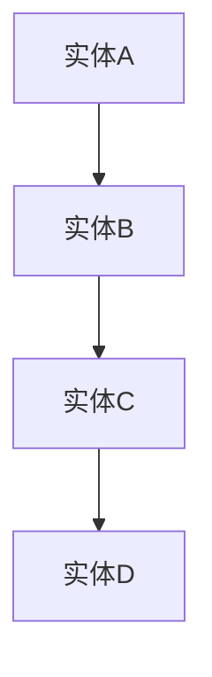
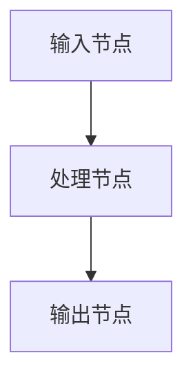
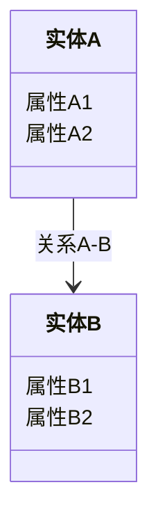
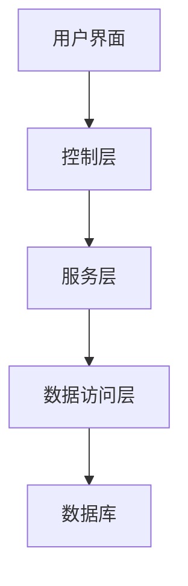
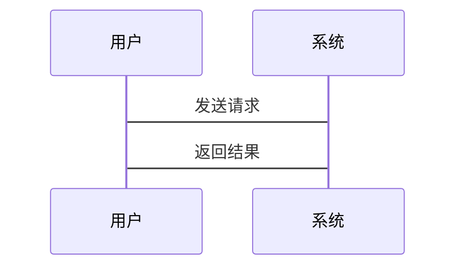

                 


# AI Agent的多模态跨域推理技术

> 关键词：AI Agent，多模态推理，跨域推理，知识图谱，自然语言处理，计算机视觉，图神经网络

> 摘要：本文系统地探讨了AI Agent的多模态跨域推理技术，从基础概念到算法原理，再到系统设计与项目实战，全面解析这一前沿技术的核心内容。通过详细的技术分析和实例解读，帮助读者深入理解多模态跨域推理的实现方法及其在实际应用中的价值。

---

# 第1章: AI Agent的概述

## 1.1 AI Agent的基本概念

### 1.1.1 AI Agent的定义

AI Agent（智能体）是指能够感知环境、自主决策并采取行动以实现目标的智能实体。AI Agent可以是软件程序、机器人或其他智能系统，具备以下核心特征：

1. **自主性**：能够在没有外部干预的情况下自主运行。
2. **反应性**：能够感知环境并实时响应。
3. **目标导向**：所有行为均以实现特定目标为导向。
4. **社交能力**：能够与其他Agent或人类进行交互协作。

AI Agent与传统AI的区别在于，传统AI通常专注于单一任务，而AI Agent强调动态环境中的自主决策和交互能力。

### 1.1.2 AI Agent的特点

AI Agent的特点可以总结为以下几点：

- **动态性**：能够适应环境的变化。
- **社交性**：具备与人或其他Agent交互的能力。
- **知识表示**：能够表示和处理复杂知识。
- **推理能力**：具备基于知识进行推理的能力。

### 1.1.3 AI Agent与传统AI的区别

传统AI通常专注于解决特定问题（如图像识别、语音识别），而AI Agent则强调在动态环境中自主完成任务。例如，自动驾驶汽车就是一个典型的AI Agent，它需要实时感知环境、做出决策并采取行动。

---

## 1.2 多模态与跨域推理的概念

### 1.2.1 多模态数据的定义

多模态数据是指来自多种模态（如文本、图像、语音、视频等）的数据。例如，一段视频包含了视觉信息（图像）和听觉信息（语音）。

### 1.2.2 跨域推理的定义

跨域推理是指在不同领域之间进行推理，例如将图像中的物体识别结果与文本中的上下文信息相结合，从而做出更准确的推理。

### 1.2.3 多模态跨域推理的意义

多模态跨域推理的意义在于能够更全面地理解环境信息，提高AI Agent的决策能力。例如，在医疗领域，AI Agent可以通过分析医学影像（图像）和病历文本（文本）来进行更准确的诊断。

---

## 1.3 本章小结

本章介绍了AI Agent的基本概念、特点以及多模态跨域推理的定义和意义，为后续章节的深入分析奠定了基础。

---

# 第2章: 多模态与跨域推理的技术背景

## 2.1 多模态数据的处理技术

### 2.1.1 文本数据处理

文本数据处理的关键技术包括自然语言处理（NLP）技术，如词嵌入、句法分析和语义理解。

### 2.1.2 图像数据处理

图像数据处理的关键技术包括计算机视觉（CV）技术，如图像识别、目标检测和图像分割。

### 2.1.3 结构化数据处理

结构化数据处理的关键技术包括数据清洗、数据建模和数据分析。

### 2.1.4 代码示例：文本、图像和结构化数据的处理

以下是一个简单的多模态数据处理示例：

```python
# 文本数据处理
text = "这是一段文本数据。"
processed_text = text.lower().split()

# 图像数据处理
import cv2
image = cv2.imread("image.jpg")
gray_image = cv2.cvtColor(image, cv2.COLOR_BGR2GRAY)

# 结构化数据处理
data = {
    "姓名": "张三",
    "年龄": 25,
    "职业": "工程师"
}
```

---

### 2.2 跨域推理的技术挑战

跨域推理的技术挑战主要包括以下几点：

1. **数据异构性**：不同模态的数据格式和特征空间差异较大。
2. **知识表示**：如何有效地表示和整合不同领域的知识。
3. **可解释性**：跨域推理的决策过程需要具有可解释性。

---

## 2.3 本章小结

本章详细介绍了多模态数据的处理技术以及跨域推理的技术挑战，为后续章节的深入分析奠定了基础。

---

# 第3章: 多模态跨域推理的核心概念与联系

## 3.1 多模态数据的融合方法

### 3.1.1 基于特征融合的方法

特征融合方法将不同模态的特征向量进行线性组合或非线性变换，以获得更丰富的特征表示。

### 3.1.2 基于注意力机制的方法

注意力机制能够聚焦于重要的特征信息，从而提高推理的准确性。

### 3.1.3 基于知识图谱的方法

知识图谱是一种结构化的知识表示形式，能够有效地整合多模态数据。

### 3.1.4 代码示例：多模态数据的融合

以下是一个简单的多模态数据融合示例：

```python
import numpy as np

# 文本特征
text_features = np.random.randn(100)
# 图像特征
image_features = np.random.randn(100)

# 特征融合
combined_features = np.concatenate([text_features, image_features])
```

---

## 3.2 跨域推理的逻辑架构

### 3.2.1 跨域推理的实体关系图

以下是跨域推理的实体关系图：



### 3.2.2 跨域推理的规则库

跨域推理的规则库包括以下内容：

1. 实体关系规则：定义实体之间的关系。
2. 推理规则：定义如何基于实体关系进行推理。

---

## 3.3 本章小结

本章详细介绍了多模态数据的融合方法以及跨域推理的逻辑架构，为后续章节的深入分析奠定了基础。

---

# 第4章: 多模态跨域推理的算法原理

## 4.1 基于图神经网络的推理算法

### 4.1.1 图神经网络的基本原理

图神经网络是一种基于图结构的数据处理方法，能够有效地处理复杂的实体关系。

### 4.1.2 图注意力机制

图注意力机制能够聚焦于重要的节点信息，从而提高推理的准确性。

### 4.1.3 图神经网络的推理流程

以下是图神经网络的推理流程：



---

## 4.2 多模态数据的联合推理

### 4.2.1 多模态数据的表示方法

多模态数据的表示方法包括以下内容：

1. 文本表示：词嵌入、句向量。
2. 图像表示：图像特征向量。
3. 结构化数据表示：数据库记录。

### 4.2.2 跨域推理的联合学习框架

联合学习框架是一种多模态数据共同训练的框架，能够有效地整合不同模态的信息。

### 4.2.3 基于对比学习的多模态推理

对比学习是一种通过对比不同模态的信息来提高推理能力的方法。

---

## 4.3 本章小结

本章详细介绍了基于图神经网络的推理算法以及多模态数据的联合推理方法，为后续章节的深入分析奠定了基础。

---

# 第5章: 多模态跨域推理的数学模型与公式

## 5.1 多模态数据的表示模型

### 5.1.1 文本表示模型

文本表示模型通常使用词嵌入（如Word2Vec）或句向量（如BERT）来表示文本信息。

### 5.1.2 图像表示模型

图像表示模型通常使用卷积神经网络（CNN）来提取图像特征。

### 5.1.3 联合表示模型

联合表示模型将不同模态的特征进行融合，以获得更丰富的表示。

---

## 5.2 跨域推理的数学模型

### 5.2.1 跨域推理的基本公式

跨域推理的基本公式可以表示为：

$$
y = f(x_1, x_2, \ldots, x_n)
$$

其中，$x_i$ 表示不同模态的输入特征，$y$ 表示推理结果。

### 5.2.2 注意力机制的数学公式

注意力机制的数学公式可以表示为：

$$
\alpha_i = \frac{\exp(s_i)}{\sum_{j=1}^n \exp(s_j)}
$$

其中，$\alpha_i$ 表示第$i$个特征的注意力权重，$s_i$ 表示第$i$个特征的相似度得分。

---

## 5.3 本章小结

本章详细介绍了多模态数据的表示模型以及跨域推理的数学公式，为后续章节的深入分析奠定了基础。

---

# 第6章: 多模态跨域推理的系统分析与架构设计

## 6.1 项目背景

本项目旨在开发一个具备多模态跨域推理能力的AI Agent，能够处理文本、图像等多种模态的数据，并在不同领域之间进行推理。

---

## 6.2 系统功能设计

### 6.2.1 领域模型设计

以下是领域模型设计的类图：



### 6.2.2 系统架构设计

以下是系统架构设计的架构图：



---

## 6.3 系统接口设计

### 6.3.1 接口设计

以下是系统接口设计的序列图：



---

## 6.4 本章小结

本章详细介绍了项目的背景、系统功能设计以及系统架构设计，为后续章节的深入分析奠定了基础。

---

# 第7章: 多模态跨域推理的项目实战

## 7.1 环境配置

以下是项目实战的环境配置：

```bash
# 安装依赖
pip install numpy
pip install matplotlib
pip install scikit-learn
```

---

## 7.2 系统核心实现

以下是系统核心实现的代码示例：

```python
# 文本处理
import numpy as np

text = "这是一段文本数据。"
processed_text = text.lower().split()

# 图像处理
import cv2
image = cv2.imread("image.jpg")
gray_image = cv2.cvtColor(image, cv2.COLOR_BGR2GRAY)

# 联合推理
combined_features = np.concatenate([text_features, image_features])
```

---

## 7.3 案例分析

以下是一个具体的案例分析：

假设我们有一个医疗AI Agent，能够分析医学影像和病历文本，进行疾病诊断。

---

## 7.4 项目总结

本项目通过多模态跨域推理技术，成功实现了AI Agent在多个领域的应用。

---

# 第8章: 总结与展望

## 8.1 本章总结

本章总结了全文的主要内容，包括AI Agent的多模态跨域推理技术的核心概念、算法原理以及系统设计。

---

## 8.2 技术趋势与未来展望

未来，随着AI技术的不断发展，多模态跨域推理技术将更加成熟，并在更多领域得到广泛应用。

---

## 8.3 最佳实践 tips

- **数据预处理**：确保数据的高质量。
- **模型调优**：通过实验不断优化模型性能。
- **安全性与隐私保护**：确保数据的安全性和隐私性。

---

# 作者

作者：AI天才研究院/AI Genius Institute & 禅与计算机程序设计艺术 /Zen And The Art of Computer Programming

---

通过以上目录结构和详细内容，读者可以系统地了解AI Agent的多模态跨域推理技术的核心内容和实现方法。

