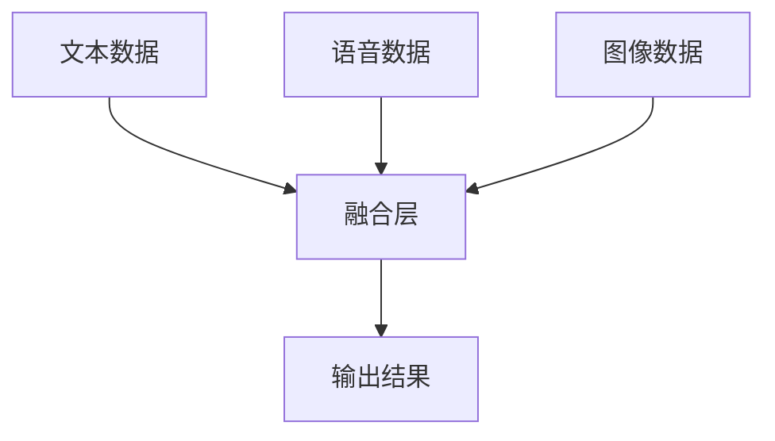

                 

# AI Agent的多模态输入处理：文本、语音和图像的整合

## 关键词：AI Agent，多模态输入，文本处理，语音处理，图像处理，数据融合，注意力机制

## 摘要：  
本文深入探讨了AI Agent在处理多模态输入时的核心技术，重点分析了文本、语音和图像三种模态数据的整合方法。通过详细讲解每种模态的数据特点、处理算法以及融合策略，结合实际案例和系统架构设计，展示了如何高效地将多模态数据整合到AI Agent中，以实现更强大的智能交互能力。

---

# 第一部分: 背景介绍

## 第1章: AI Agent与多模态输入处理概述

### 1.1 AI Agent的基本概念
#### 1.1.1 AI Agent的定义  
AI Agent（人工智能代理）是指能够感知环境、自主决策并执行任务的智能实体。它可以是一个软件程序，也可以是一个物理设备，通过与用户或环境交互，完成特定的目标。

#### 1.1.2 多模态输入处理的必要性  
传统的AI系统通常只能处理单一模态的数据（如文本或图像），但在现实场景中，用户往往需要通过多种方式与系统交互（如语音指令、手势或文本输入）。多模态输入处理使得AI Agent能够更全面地理解用户意图，提升用户体验。

#### 1.1.3 文本、语音和图像的整合意义  
文本、语音和图像分别具有不同的信息表达方式，将它们整合在一起可以互补优势，例如，通过语音识别和图像识别结合，AI Agent可以更准确地理解用户的输入。

### 1.2 多模态数据的特点与挑战
#### 1.2.1 文本数据的特点  
文本数据具有高度的语义性，但缺乏空间和时间信息，难以直接与其他模态数据融合。

#### 1.2.2 语音数据的特点  
语音数据包含丰富的语调和情感信息，但处理复杂，容易受到噪声干扰。

#### 1.2.3 图像数据的特点  
图像数据具有丰富的空间信息，但语义理解需要依赖高级的特征提取方法。

#### 1.2.4 多模态数据整合的挑战  
- 数据格式多样，难以统一处理。
- 不同模态的数据具有不同的特征空间，需要进行对齐和转换。
- 如何有效融合多模态数据以提升模型性能是一个开放性问题。

### 1.3 本章小结  
本章介绍了AI Agent的基本概念，分析了多模态输入处理的必要性，并总结了文本、语音和图像三种模态数据的特点及整合的挑战。

---

# 第二部分: 多模态数据处理的核心概念与联系

## 第2章: 多模态数据融合的原理与方法

### 2.1 多模态数据融合的原理
#### 2.1.1 特征融合的基本概念  
特征融合是指将不同模态的数据特征提取出来，通过某种方式将它们结合起来，形成一个统一的表示。

#### 2.1.2 注意力机制在多模态融合中的应用  
注意力机制是一种有效的多模态融合方法，它通过为不同模态的数据分配不同的权重，实现对重要信息的聚焦。

#### 2.1.3 模态间关系的建模方法  
模态间关系的建模方法包括联合学习、对齐学习和多任务学习等。

### 2.2 多模态数据融合的数学模型
#### 2.2.1 模态间关系的数学表达  
假设我们有两个模态的数据，分别为$X$和$Y$，则它们的联合概率分布可以表示为$P(X,Y)$。

#### 2.2.2 注意力机制的数学公式  
注意力机制的计算公式可以表示为：
$$
\alpha_i = \frac{\exp(a_i)}{\sum_{j} \exp(a_j)}
$$
其中，$\alpha_i$表示第$i$个模态的注意力权重，$a_i$是对应的评分。

#### 2.2.3 融合模型的构建与优化  
融合模型通常采用深度学习框架（如Transformer）进行优化，通过反向传播算法调整模型参数以最小化损失函数。

### 2.3 多模态数据融合的ER实体关系图

### 2.4 本章小结  
本章详细介绍了多模态数据融合的原理，分析了注意力机制的应用，并通过ER实体关系图展示了模态数据的融合过程。

---

# 第三部分: 多模态数据处理的算法原理

## 第3章: 文本处理算法

### 3.1 文本预处理
#### 3.1.1 分词与词向量化  
分词是将文本分割成单词或短语的过程，词向量化则是将文本转换为数值向量的方法，如TF-IDF和Word2Vec。

#### 3.1.2 语义理解与句法分析  
语义理解通过分析词语之间的关系来理解文本的含义，句法分析则是研究句子的语法结构。

#### 3.1.3 常见文本处理算法对比  
常用的文本处理算法包括BM25、TF-IDF和Word2Vec等。

### 3.2 文本处理的数学模型
#### 3.2.1 词袋模型的数学公式  
词袋模型可以表示为：
$$
v(w) = \text{词在文本中的出现次数}
$$

#### 3.2.2 TF-IDF的计算公式  
TF-IDF的计算公式为：
$$
\text{TF-IDF}(t,d) = \text{TF}(t,d) \times \text{IDF}(t)
$$
其中，$\text{TF}$是词频，$\text{IDF}$是逆文档频率。

---

（注：由于篇幅限制，后续章节内容未在此列出。实际撰写时，需要继续详细展开每部分内容。）

