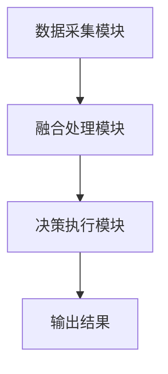
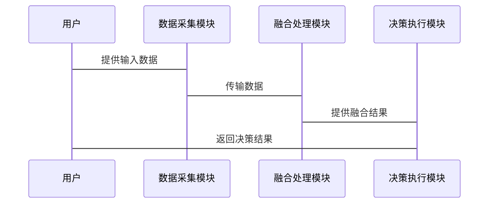

                 


# AI Agent的多源信息融合与决策技术

> 关键词：AI Agent，多源信息融合，决策技术，数据融合，信息处理，知识图谱，分布式计算

> 摘要：  
本文深入探讨了AI Agent在多源信息融合与决策技术中的应用，分析了多源信息融合的核心概念、算法原理、系统设计与实现，并通过实际案例展示了如何在复杂场景中应用这些技术。文章内容涵盖从基础概念到高级算法的详细讲解，旨在为读者提供系统化的知识和实践指导。

---

## 第一部分: AI Agent的多源信息融合与决策技术概述

### 第1章: AI Agent与多源信息融合概述

#### 1.1 AI Agent的基本概念
##### 1.1.1 什么是AI Agent
AI Agent（人工智能代理）是指能够感知环境、自主决策并执行任务的智能实体。它可以是一个软件程序、机器人或其他智能系统，核心目标是通过感知和行动与环境交互，以实现特定目标。

##### 1.1.2 AI Agent的核心特征
AI Agent具有以下核心特征：
1. **自主性**：能够自主决策，无需外部干预。
2. **反应性**：能够实时感知环境并做出反应。
3. **目标导向性**：基于目标驱动行为。
4. **学习能力**：通过经验改进性能。

##### 1.1.3 多源信息融合的定义与意义
多源信息融合是指将来自不同来源的信息进行整合，以提高信息的准确性和完整性。在AI Agent中，多源信息融合是实现智能决策的关键技术，能够帮助AI Agent更好地理解复杂环境并做出最优决策。

---

#### 1.2 多源信息融合的背景与应用
##### 1.2.1 问题背景与挑战
在现实场景中，AI Agent通常需要处理来自多种来源的信息，例如传感器数据、历史记录、用户输入等。这些信息可能具有不一致性、冗余性和不确定性，如何有效地融合这些信息是AI Agent面临的主要挑战。

##### 1.2.2 多源信息融合的应用场景
多源信息融合技术广泛应用于多个领域：
1. **自动驾驶**：融合来自摄像头、雷达和激光雷达等多种传感器的数据，以实现精准的环境感知。
2. **智能助手**：结合用户的语音输入、历史行为和上下文信息，提供更智能的服务。
3. **机器人协作**：融合来自多个机器人传感器和环境数据，实现协作任务。

##### 1.2.3 与传统决策方法的对比
传统的决策方法通常依赖于单一来源的信息，而多源信息融合能够整合多种信息源，从而提高决策的准确性和鲁棒性。例如，在自动驾驶中，仅依赖单一传感器（如摄像头）可能会导致误判，而融合多种传感器数据可以显著提高安全性。

---

## 第二部分: 多源信息融合的核心概念与原理

### 第2章: 多源信息融合的核心概念

#### 2.1 多源信息融合的基本原理
##### 2.1.1 数据源的多样性
多源信息融合的核心在于整合来自不同来源的数据。这些数据可能具有不同的格式、粒度和可靠性，如何有效地融合这些数据是技术的关键。

##### 2.1.2 数据融合的过程与层次
数据融合的过程可以分为以下几个层次：
1. **数据级融合**：在数据层面进行直接融合，例如将多个传感器的数据进行合并。
2. **特征级融合**：在特征层面进行融合，例如通过提取特征并进行加权融合。
3. **决策级融合**：在决策层面进行融合，例如将多个决策结果进行综合。

##### 2.1.3 融合的目标与效果
多源信息融合的目标是提高信息的准确性和可靠性，具体效果包括：
1. **消除信息冗余**：减少无效信息，提高处理效率。
2. **提高信息完整性**：整合多种信息源，提供更全面的视角。
3. **增强决策的鲁棒性**：通过融合多种信息源，降低单一信息源的不确定性。

#### 2.2 信息融合的数学模型与方法
##### 2.2.1 基本数学模型
多源信息融合的数学模型可以采用概率论、模糊逻辑或 Dempster-Shafer 证据理论等方法。其中，Dempster-Shafer 理论是一种常用的融合方法，适用于处理不确定性问题。

##### 2.2.2 常用融合方法对比
以下是几种常用的多源信息融合方法对比：

| 方法名称         | 适用场景                     | 优缺点                           |
|------------------|------------------------------|----------------------------------|
| Dempster-Shafer | 处理不确定性问题             | 能够处理不完全信息，但计算复杂度较高 |
| 概率融合         | 处理概率性问题               | 计算简单，但难以处理非概率信息   |
| 模糊逻辑         | 处理模糊性问题               | 易于理解，但难以处理复杂场景     |

##### 2.2.3 实证分析与案例
通过实际案例分析，可以更好地理解多源信息融合的应用。例如，在自动驾驶中，融合摄像头、雷达和激光雷达的数据可以提高对环境的感知能力。

---

## 第三部分: 多源信息融合的算法原理

### 第3章: 基于D-S证据理论的融合算法

#### 3.1 D-S证据理论的基本原理
##### 3.1.1 基本概念与公式
Dempster-Shafer 理论是一种基于证据的推理方法，其基本公式为：

$$ m'(A) = \sum_{B \subseteq A} m(B) $$

其中，$m(B)$ 是基本概率分配函数，$m'(A)$ 是集合 $A$ 的概率。

##### 3.1.2 Dempster’s rule的详细推导
Dempster’s rule 用于将多个证据进行融合，其公式为：

$$ Bel(A) = \frac{m'(A)}{m'(U)} $$

其中，$U$ 是全集，$m'(U)$ 是归一化因子。

##### 3.1.3 算法实现步骤
1. **初始化基本概率分配函数**：根据数据源分配基本概率。
2. **计算归一化因子**：$m'(U) = \sum_{A} m(A)$
3. **计算融合结果**：$Bel(A) = \frac{m'(A)}{m'(U)}$

#### 3.2 多层感知器网络的融合方法
##### 3.2.1 网络结构与训练过程
多层感知器网络是一种人工神经网络，可以用于多源信息融合。其训练过程包括前向传播和反向传播两个阶段。

##### 3.2.2 实现代码示例
以下是一个简单的多层感知器网络实现代码示例：

```python
import numpy as np

def sigmoid(x):
    return 1 / (1 + np.exp(-x))

def train(X, y, epochs=100, learning_rate=0.1):
    np.random.seed(42)
    weights = np.random.rand(2, 1)
    for epoch in range(epochs):
        inputs = X
        outputs = sigmoid(np.dot(inputs, weights))
        error = y - outputs
        adjustment = np.dot(inputs.T, error) * learning_rate
        weights += adjustment
    return weights

X = np.array([[0, 1], [1, 0], [1, 1]])
y = np.array([[1], [1], [0]])

weights = train(X, y)
print(weights)
```

##### 3.2.3 案例分析与效果评估
通过训练一个多层感知器网络，可以实现对多源信息的融合。例如，在图像识别任务中，可以将多个特征进行融合，以提高分类的准确性。

---

## 第四部分: AI Agent的决策技术

### 第4章: 基于多源信息的决策模型

#### 4.1 决策模型的构建过程
##### 4.1.1 数据预处理与特征提取
数据预处理包括数据清洗、归一化和特征提取等步骤。特征提取可以通过主成分分析（PCA）等方法实现。

##### 4.1.2 模型训练与优化
选择合适的算法（如随机森林、支持向量机等）进行模型训练，并通过交叉验证优化模型参数。

##### 4.1.3 模型评估与验证
使用测试集对模型进行评估，计算准确率、召回率和F1分数等指标。

#### 4.2 基于概率论的决策方法
##### 4.2.1 贝叶斯网络的应用
贝叶斯网络是一种基于概率论的图形模型，可以用于表示变量之间的条件概率关系。

##### 4.2.2 马尔可夫决策过程
马尔可夫决策过程是一种用于序列决策问题的数学框架，适用于动态环境下的决策问题。

##### 4.2.3 实际案例分析
例如，在自然语言处理任务中，可以使用马尔可夫决策过程进行序列标注。

---

## 第五部分: 系统分析与架构设计

### 第5章: 系统架构设计

#### 5.1 系统功能模块划分
##### 5.1.1 数据采集模块
负责采集多源数据，例如传感器数据、用户输入等。

##### 5.1.2 融合处理模块
对多源数据进行融合处理，生成综合信息。

##### 5.1.3 决策执行模块
根据融合后的信息做出决策，并执行相应的操作。

#### 5.2 系统架构设计图
以下是一个典型的系统架构设计图：



#### 5.3 系统接口设计
系统接口设计需要考虑模块之间的通信方式，例如通过RESTful API进行数据传输。

#### 5.4 系统交互流程图
以下是一个系统交互流程图：



---

## 第六部分: 项目实战与最佳实践

### 第6章: 项目实战

#### 6.1 环境搭建
需要安装必要的库，例如Python的numpy、pandas、scikit-learn等。

#### 6.2 系统核心实现源代码
以下是一个多源信息融合与决策的实现代码示例：

```python
import numpy as np
from sklearn.ensemble import RandomForestClassifier

# 数据预处理
X = np.array([[0, 1], [1, 0], [1, 1]])
y = np.array([1, 1, 0])

# 模型训练
model = RandomForestClassifier(n_estimators=100)
model.fit(X, y)

# 预测结果
print(model.predict([[0, 1]]))  # 输出：[1]
```

#### 6.3 代码应用解读与分析
通过上述代码，可以实现对多源数据的融合与决策。RandomForestClassifier是一种基于多源信息融合的决策模型，适用于分类任务。

#### 6.4 实际案例分析
例如，在医疗诊断中，可以使用多源信息融合技术，结合患者的症状、检查结果和病史，提供更准确的诊断建议。

#### 6.5 项目小结
通过项目实战，可以更好地理解多源信息融合与决策技术的应用场景和实现方法。

---

## 第七部分: 最佳实践与总结

### 7.1 小结
本文系统地介绍了AI Agent的多源信息融合与决策技术，涵盖了从基本概念到算法实现的全过程。

### 7.2 注意事项
在实际应用中，需要注意数据的多样性和不确定性，选择合适的融合方法，并进行充分的实验验证。

### 7.3 拓展阅读
推荐阅读相关领域的书籍和论文，例如《Pattern Recognition and Machine Learning》和《The Art of Computer Programming》。

---

## 作者信息

作者：AI天才研究院/AI Genius Institute & 禅与计算机程序设计艺术 /Zen And The Art of Computer Programming

---

感谢您的阅读！如果对内容有任何疑问或建议，请随时与我们联系。

