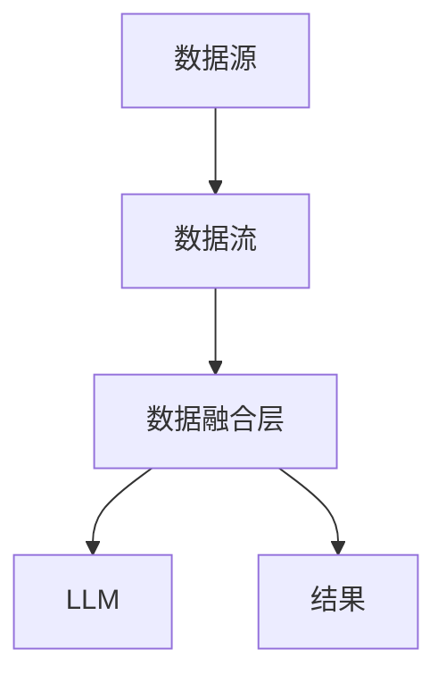
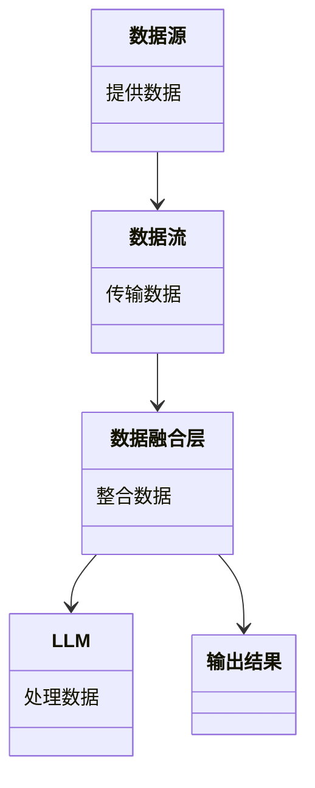
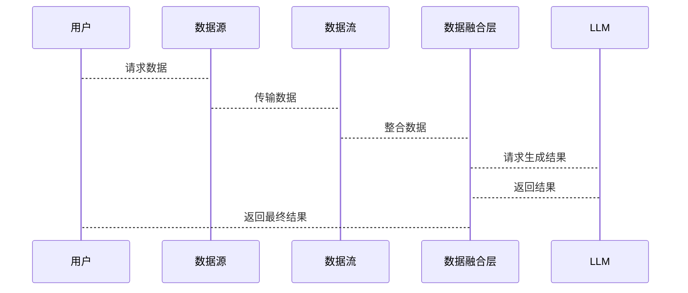

                 


# AI Agent的多源数据融合：整合LLM与多种数据流

> 关键词：AI Agent, 多源数据融合, LLM, 数据流, 数据整合, 知识表示

> 摘要：随着人工智能技术的快速发展，AI Agent在各个领域的应用越来越广泛。为了提升AI Agent的智能性和决策能力，多源数据融合技术变得至关重要。本文将深入探讨如何整合大型语言模型（LLM）与多种数据流，实现高效的数据融合。通过分析数据融合的核心原理、算法实现、系统架构设计以及实际应用案例，本文旨在为读者提供一个全面的技术指南。

---

# 第一部分: AI Agent的多源数据融合概述

## 第1章: AI Agent与多源数据融合概述

### 1.1 AI Agent的基本概念

#### 1.1.1 什么是AI Agent
AI Agent（人工智能代理）是指能够感知环境、自主决策并执行任务的智能实体。它可以是一个软件程序、机器人或其他智能系统，具备以下核心特征：
- **自主性**：能够自主决策和行动。
- **反应性**：能够感知环境并实时响应。
- **目标导向**：以特定目标为导向执行任务。
- **学习能力**：能够通过数据和经验优化自身性能。

#### 1.1.2 AI Agent的核心特征
1. **自主性**：AI Agent无需外部干预，能够独立完成任务。
2. **反应性**：能够实时感知环境变化并做出响应。
3. **目标导向**：所有行动都围绕实现特定目标展开。
4. **学习能力**：通过数据和经验不断优化自身性能。

#### 1.1.3 AI Agent的应用场景
- **智能助手**：如Siri、Alexa等。
- **自动驾驶**：如自动驾驶汽车。
- **智能推荐系统**：如电商推荐系统。
- **工业自动化**：如智能工厂中的机器人。

---

### 1.2 多源数据融合的背景与意义

#### 1.2.1 数据融合的概念
数据融合是指将来自不同来源、形式或粒度的数据进行整合，以提高信息的准确性和完整性。数据融合的核心目标是消除数据冗余、填补数据空缺，并提升数据的可用性。

#### 1.2.2 多源数据融合的挑战
1. **数据异构性**：不同数据源的格式、语义和粒度可能存在差异。
2. **数据不一致**：同一实体在不同数据源中的表示可能不同。
3. **数据噪声**：数据中可能存在噪声或错误信息。
4. **实时性要求**：某些场景下需要实时处理数据。

#### 1.2.3 数据融合在AI Agent中的作用
1. **提升决策能力**：通过整合多源数据，AI Agent能够获得更全面的信息支持决策。
2. **增强鲁棒性**：多源数据的整合可以降低单一数据源失效的风险。
3. **提高准确性**：通过融合不同来源的数据，可以减少信息偏差。

---

### 1.3 LLM与多源数据流的整合

#### 1.3.1 LLM的基本原理
LLM（Large Language Model）是一种基于深度学习的自然语言处理模型，能够理解和生成人类语言。其核心是通过大量文本数据的训练，学习语言的语义和语法结构。

#### 1.3.2 多种数据流的类型
1. **文本数据流**：如新闻报道、社交媒体帖子。
2. **结构化数据流**：如数据库中的表格数据。
3. **非结构化数据流**：如图像、音频、视频等。
4. **实时数据流**：如物联网设备的实时传感器数据。

#### 1.3.3 LLM与多源数据流的结合
通过将LLM与多种数据流结合，可以实现跨模态的数据理解和生成。例如，结合文本和图像数据，LLM可以生成与图像相关的描述性文本。

---

### 1.4 本章小结
本章介绍了AI Agent的基本概念、多源数据融合的背景与意义，以及LLM与多源数据流的整合。通过这些内容，我们为后续章节的深入探讨奠定了基础。

---

# 第二部分: 多源数据融合的核心概念与原理

## 第2章: 多源数据融合的核心概念

### 2.1 数据融合的基本原理

#### 2.1.1 数据融合的定义
数据融合是指将来自不同来源、形式或粒度的数据进行整合，以提高信息的准确性和完整性。

#### 2.1.2 数据融合的分类
1. **基于统计的融合**：利用概率统计方法对数据进行融合，如加权平均、贝叶斯融合等。
2. **基于规则的融合**：基于预定义的规则对数据进行融合，如冲突消解规则。
3. **基于机器学习的融合**：利用机器学习模型对数据进行融合，如深度学习模型。

#### 2.1.3 数据融合的关键技术
1. **数据清洗**：去除噪声数据，填补数据空缺。
2. **数据对齐**：将不同来源的数据对齐到同一语义空间。
3. **数据融合策略**：选择合适的融合方法和参数。

---

### 2.2 LLM在数据融合中的角色

#### 2.2.1 LLM作为知识表示工具
LLM可以将多种数据源中的信息统一表示为文本形式，便于后续处理。

#### 2.2.2 LLM作为推理工具
LLM可以对融合后的数据进行推理，生成新的知识或结论。

#### 2.2.3 LLM作为生成工具
LLM可以生成符合要求的文本输出，如自然语言描述、摘要等。

---

### 2.3 多源数据流的特征对比

#### 2.3.1 数据流的异构性
不同数据源的格式、语义和粒度可能存在差异，导致数据异构性。

#### 2.3.2 数据流的实时性
某些数据流需要实时处理，如物联网设备的实时传感器数据。

#### 2.3.3 数据流的准确性
不同数据源的准确性可能不同，需要通过融合技术提升整体准确性。

---

### 2.4 数据融合的实体关系图



---

### 2.5 本章小结
本章详细介绍了多源数据融合的核心概念，包括数据融合的基本原理、LLM在数据融合中的角色，以及多源数据流的特征对比。通过这些内容，我们可以更好地理解数据融合的复杂性和挑战。

---

# 第三部分: 数据融合的算法原理

## 第3章: 数据融合算法概述

### 3.1 数据融合的主要算法

#### 3.1.1 基于统计的融合算法
基于统计的融合算法通过概率统计方法对数据进行融合，如贝叶斯融合。

#### 3.1.2 基于规则的融合算法
基于规则的融合算法通过预定义的规则对数据进行融合，如冲突消解规则。

#### 3.1.3 基于机器学习的融合算法
基于机器学习的融合算法利用机器学习模型对数据进行融合，如深度学习模型。

---

### 3.2 基于LLM的融合算法

#### 3.2.1 基于LLM的文本融合
通过LLM对文本数据进行融合，生成更准确的文本描述。

#### 3.2.2 基于LLM的多模态融合
将文本、图像等多种数据源进行融合，生成跨模态的输出。

#### 3.2.3 基于LLM的实时融合
对实时数据流进行融合，生成实时的输出结果。

---

### 3.3 数学模型与公式

#### 3.3.1 基于概率的融合公式
$$ P(A|B) = \frac{P(B|A)P(A)}{P(B)} $$

#### 3.3.2 基于加权平均的融合公式
$$ y = \sum_{i=1}^{n} w_i x_i $$

---

### 3.4 本章小结
本章介绍了数据融合的主要算法，包括基于统计、规则和机器学习的算法，以及基于LLM的融合算法。同时，我们还给出了相关的数学模型和公式，为后续的实现提供了理论基础。

---

## 第4章: 系统分析与架构设计

### 4.1 问题场景介绍

#### 4.1.1 问题背景
我们需要设计一个AI Agent，能够整合来自多种数据源的数据，通过LLM进行融合，生成准确的输出结果。

#### 4.1.2 问题描述
AI Agent需要处理来自文本、图像、传感器等多种数据源的数据，并通过LLM进行融合，生成符合要求的输出。

---

### 4.2 系统功能设计

#### 4.2.1 领域模型类图



---

### 4.3 系统架构设计

#### 4.3.1 系统架构图


---

### 4.4 接口与交互设计

#### 4.4.1 接口设计
- 数据源接口：提供数据获取API。
- 数据融合层接口：提供数据整合API。
- LLM接口：提供文本生成API。

#### 4.4.2 交互流程



---

### 4.5 本章小结
本章通过问题场景分析、系统功能设计和架构设计，展示了如何将AI Agent与多源数据融合技术结合起来，实现高效的系统设计。

---

## 第5章: 项目实战

### 5.1 环境安装

#### 5.1.1 安装Python
```bash
python --version
pip install --upgrade pip
```

#### 5.1.2 安装LLM库
```bash
pip install transformers
pip install numpy
```

---

### 5.2 核心代码实现

#### 5.2.1 数据融合代码

```python
import numpy as np
from transformers import AutoTokenizer, AutoModelForSeq2Seq

# 加载LLM模型
tokenizer = AutoTokenizer.from_pretrained("t5-base")
model = AutoModelForSeq2Seq.from_pretrained("t5-base")

# 数据融合函数
def fuse_data(data_sources):
    # 整合数据
    fused_data = []
    for source in data_sources:
        # 对每个数据源进行处理
        processed_data = process_source(source)
        fused_data.append(processed_data)
    return fused_data

# 数据处理函数
def process_source(source):
    # 处理单个数据源
    pass
```

#### 5.2.2 LLM调用代码

```python
# 调用LLM生成结果
def generate_result(input_data):
    inputs = tokenizer(input_data, return_tensors="np")
    outputs = model.generate(inputs.input_ids)
    result = tokenizer.decode(outputs[0], skip_special_tokens=True)
    return result
```

---

### 5.3 案例分析与总结

#### 5.3.1 实际案例分析
假设我们有一个AI Agent，需要整合文本和图像数据，生成描述性文本。

#### 5.3.2 代码实现与分析
通过上述代码，我们可以实现数据的整合和LLM的调用，生成符合要求的输出。

---

### 5.4 本章小结
本章通过项目实战，展示了如何将AI Agent与多源数据融合技术结合起来，实现高效的系统设计。

---

# 第六部分: 总结与展望

## 第6章: 总结与展望

### 6.1 本章总结
本文详细探讨了AI Agent的多源数据融合技术，包括核心概念、算法原理、系统架构设计以及实际应用案例。通过这些内容，我们展示了如何将AI Agent与多源数据流结合起来，实现高效的系统设计。

---

### 6.2 未来展望

#### 6.2.1 实际应用中的挑战
1. **数据异构性**：如何处理不同数据源的异构性。
2. **实时性要求**：如何实现高效的实时数据融合。
3. **模型优化**：如何进一步优化LLM模型，提升融合效果。

#### 6.2.2 未来研究方向
1. **多模态数据融合**：研究如何进一步提升多模态数据的融合效果。
2. **实时数据流处理**：研究如何实现更高效的实时数据流处理。
3. **分布式系统设计**：研究如何在分布式系统中实现多源数据融合。

---

### 6.3 本章小结
本文总结了AI Agent的多源数据融合技术的核心内容，并展望了未来的研究方向和发展趋势。

---

# 作者信息

作者：AI天才研究院/AI Genius Institute & 禅与计算机程序设计艺术 /Zen And The Art of Computer Programming

---

# 结束语

通过本文的详细探讨，我们希望能够为读者提供一个全面的技术指南，帮助他们在实际应用中更好地理解和实现AI Agent的多源数据融合技术。

