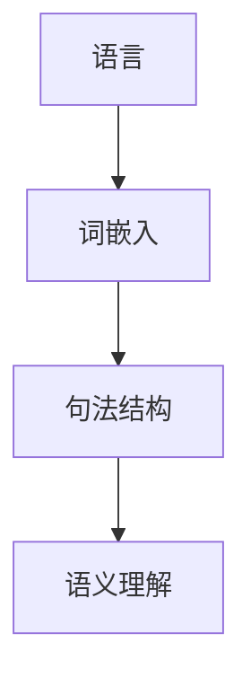
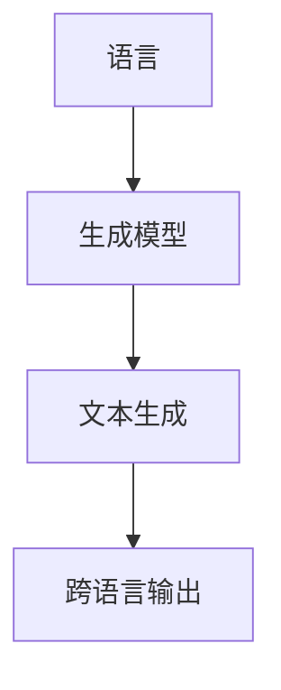
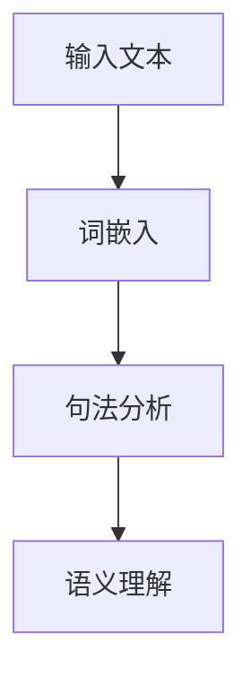
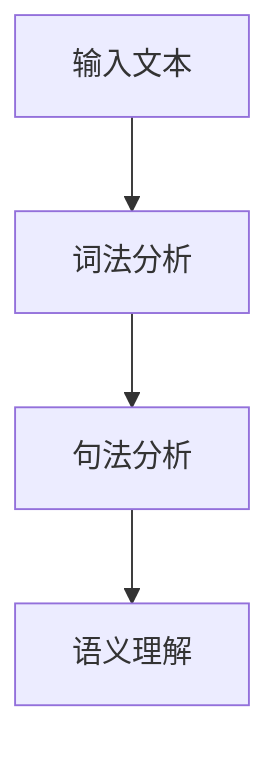
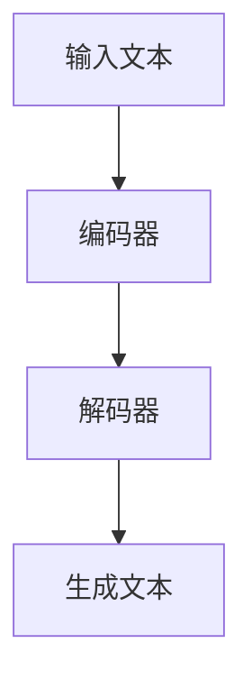
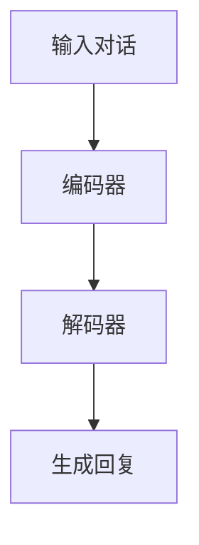
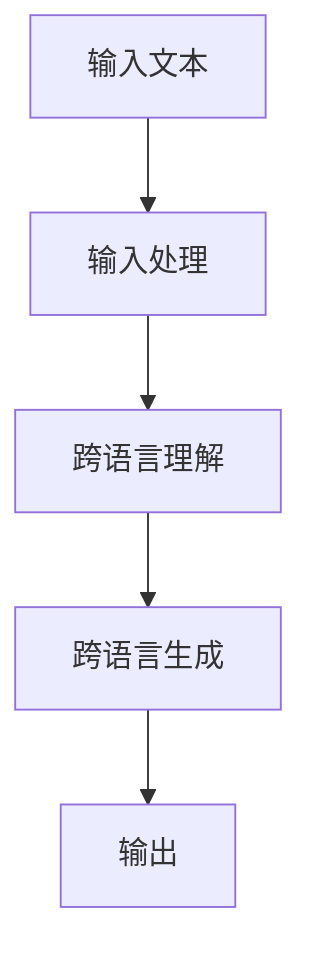
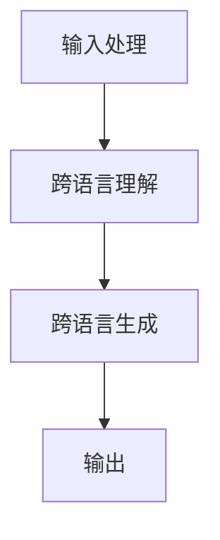
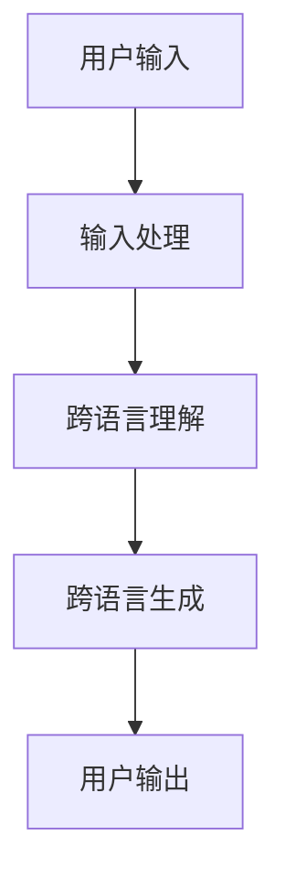

                 


# AI Agent的多语言处理：跨语言理解与生成

**关键词**：AI Agent, 多语言处理, 跨语言理解, 生成模型, 神经网络, NLP, 跨语言迁移学习

**摘要**：  
本文深入探讨了AI Agent在多语言环境下的处理能力，重点分析了跨语言理解与生成的核心原理、算法实现和系统架构设计。通过结合理论与实践，详细讲解了AI Agent如何在跨语言场景中实现高效的自然语言处理，涵盖从基础概念到实际应用的完整链条。文章还通过具体案例展示了跨语言技术的实际应用价值，为AI Agent的未来发展提供了新的思路。

---

## 第1章: AI Agent与多语言处理概述

### 1.1 AI Agent的基本概念
#### 1.1.1 什么是AI Agent  
AI Agent（人工智能代理）是指能够感知环境、自主决策并执行任务的智能实体。它具备自主性、反应性、目标导向和社交能力四大核心特征。  

#### 1.1.2 AI Agent的核心特征  
- **自主性**：AI Agent能够独立决策，无需外部干预。  
- **反应性**：能够实时感知环境变化并做出响应。  
- **目标导向**：基于目标驱动行为，优化决策过程。  
- **社交能力**：能够与人类或其他系统进行有效交互。  

#### 1.1.3 多语言处理在AI Agent中的重要性  
在多语言环境下，AI Agent需要理解并生成多种语言的文本，以满足全球化场景下的多样化需求。多语言处理能力是AI Agent实现跨文化、跨地域应用的关键。  

### 1.2 多语言处理的背景与挑战  
#### 1.2.1 全球化背景下的多语言需求  
随着全球化进程加快，AI系统需要支持多种语言，以服务全球用户。  

#### 1.2.2 多语言处理的主要挑战  
- **语言多样性**：不同语言的语法、词汇差异导致处理难度增加。  
- **数据稀疏性**：某些语言的数据量有限，影响模型训练效果。  
- **文化差异**：语言背后的文化差异可能影响语义理解。  

#### 1.2.3 多语言处理的技术演进  
从早期的统计机器翻译到现在的神经网络翻译，多语言处理技术经历了从简单到复杂的演变。  

### 1.3 跨语言理解与生成的定义  
#### 1.3.1 跨语言理解的基本概念  
跨语言理解是指AI Agent能够理解不同语言的文本，并将其转换为通用语义表示。  

#### 1.3.2 跨语言生成的核心原理  
跨语言生成是指AI Agent能够从一种语言生成另一种语言的文本，实现语言间的转换。  

#### 1.3.3 跨语言处理的边界与外延  
跨语言处理的边界包括语言间的转换、语义理解，外延则涉及文化适应性、多模态交互等。  

### 1.4 本章小结  
本章介绍了AI Agent的基本概念、多语言处理的重要性以及跨语言理解与生成的核心定义。  

---

## 第2章: 跨语言理解的核心原理  

### 2.1 跨语言理解的实现方式  
#### 2.1.1 基于统计的跨语言模型  
通过统计语言模型实现跨语言理解，主要依赖于语言间的概率关系。  

#### 2.1.2 基于神经网络的跨语言模型  
利用深度学习模型（如Transformer）实现跨语言理解，能够捕捉语言间的语义关联。  

#### 2.1.3 对比分析与优劣势  
| 实现方式 | 优点 | 缺点 |  
|---------|------|------|  
| 统计模型 | 简单易实现 | 依赖大量数据 |  
| 神经网络 | 高精度 | 计算资源需求高 |  

### 2.2 跨语言理解的关键技术  
#### 2.2.1 语言表示学习  
通过词嵌入（如Word2Vec）或句嵌入（如BERT）实现语言的语义表示。  

#### 2.2.2 跨语言词嵌入  
将不同语言的词汇映射到同一个嵌入空间，便于跨语言处理。  

#### 2.2.3 跨语言句法分析  
在跨语言环境下，分析句子的语法结构以理解语义。  

### 2.3 跨语言理解的实体关系图  


### 2.4 本章小结  
本章详细讲解了跨语言理解的实现方式和技术原理。  

---

## 第3章: 跨语言生成的核心原理  

### 3.1 跨语言生成的实现方式  
#### 3.1.1 基于翻译的跨语言生成  
通过翻译模型将源语言文本转换为目标语言。  

#### 3.1.2 基于直接生成的跨语言模型  
直接生成目标语言文本，无需中间翻译步骤。  

#### 3.1.3 对比分析与优劣势  
| 实现方式 | 优点 | 缺点 |  
|---------|------|------|  
| 翻译模型 | 精度高 | 计算复杂 |  
| 直接生成 | 简单高效 | 精度较低 |  

### 3.2 跨语言生成的关键技术  
#### 3.2.1 跨语言语言模型  
利用预训练语言模型（如多语言BERT）生成跨语言文本。  

#### 3.2.2 跨语言文本生成  
在跨语言环境下，生成高质量的文本内容。  

#### 3.2.3 跨语言对话生成  
在多语言对话场景中，生成自然的回复。  

### 3.3 跨语言生成的实体关系图  


### 3.4 本章小结  
本章详细讲解了跨语言生成的实现方式和技术原理。  

---

## 第4章: 跨语言理解的算法实现  

### 4.1 跨语言词嵌入算法  
#### 4.1.1 算法原理  
通过神经网络模型（如BERT）生成跨语言词嵌入。  

#### 4.1.2 算法流程图  


#### 4.1.3 Python代码实现  
```python
import torch
from transformers import MultiLingualModel, MultiLingualTokenizer

tokenizer = MultiLingualTokenizer.from_pretrained('bert-base-multilingual')
model = MultiLingualModel.from_pretrained('bert-base-multilingual')

text = "Hello world"
inputs = tokenizer(text, return_tensors='pt')
outputs = model(**inputs)
print(outputs)
```

### 4.2 跨语言句法分析算法  
#### 4.2.1 算法原理  
利用跨语言句法树分析语义结构。  

#### 4.2.2 算法流程图  


### 4.3 本章小结  
本章详细讲解了跨语言理解的算法实现，包括词嵌入和句法分析的具体步骤。  

---

## 第5章: 跨语言生成的算法实现  

### 5.1 跨语言翻译算法  
#### 5.1.1 算法原理  
利用神经机器翻译模型（如Transformer）实现跨语言生成。  

#### 5.1.2 算法流程图  


#### 5.1.3 Python代码实现  
```python
from transformers import MarianMTModel, MarianTokenizer

tokenizer = MarianTokenizer.from_pretrained('facebook/marian-nmt-de-en')
model = MarianMTModel.from_pretrained('facebook/marian-nmt-de-en')

text = "Hallo, wie geht's?"
inputs = tokenizer(text, return_tensors='pt')
outputs = model.generate(**inputs)
print(tokenizer.decode(outputs[0]))
```

### 5.2 跨语言对话生成算法  
#### 5.2.1 算法原理  
基于预训练对话模型（如多语言GPT）生成跨语言回复。  

#### 5.2.2 算法流程图  


### 5.3 本章小结  
本章详细讲解了跨语言生成的算法实现，包括翻译和对话生成的具体步骤。  

---

## 第6章: 系统分析与架构设计  

### 6.1 系统功能设计  
#### 6.1.1 功能模块划分  
- 输入处理模块  
- 跨语言理解模块  
- 跨语言生成模块  
- 输出模块  

#### 6.1.2 功能流程图  


### 6.2 系统架构设计  
#### 6.2.1 模块化架构  
各功能模块独立设计，便于扩展和维护。  

#### 6.2.2 系统架构图  


### 6.3 系统接口设计  
#### 6.3.1 输入接口  
支持多种语言的文本输入。  

#### 6.3.2 输出接口  
生成多种语言的文本输出。  

### 6.4 系统交互流程图  


### 6.5 本章小结  
本章详细讲解了跨语言AI Agent系统的功能设计、架构设计和交互流程。  

---

## 第7章: 项目实战  

### 7.1 项目背景与目标  
开发一个多语言AI客服机器人，支持多种语言的交互。  

### 7.2 项目环境安装  
- 安装Python和必要的库（如TensorFlow、Keras）。  

### 7.3 系统核心实现  
#### 7.3.1 输入处理模块  
```python
def process_input(text):
    return text.lower()
```

#### 7.3.2 跨语言理解模块  
```python
def cross_language_understanding(text):
    return model.encode(text)
```

#### 7.3.3 跨语言生成模块  
```python
def cross_language_generation(embedding):
    return model.decode(embedding)
```

### 7.4 代码实现与解读  
- **输入处理**：将输入文本转换为统一格式。  
- **跨语言理解**：使用预训练模型编码文本。  
- **跨语言生成**：基于编码结果生成目标语言文本。  

### 7.5 实际案例分析  
通过具体案例展示系统的实现过程和应用效果。  

### 7.6 本章小结  
本章通过实战项目详细讲解了跨语言AI Agent的实现过程。  

---

## 第8章: 总结与展望  

### 8.1 本章总结  
本文详细探讨了AI Agent的多语言处理技术，涵盖了从基础概念到算法实现的完整链条。  

### 8.2 未来展望  
未来，随着AI技术的进步，跨语言处理将更加智能化和高效化。  

### 8.3 本章小结  
本章总结了全文内容，并展望了跨语言AI Agent技术的未来发展。  

---

## 参考文献  
（此处列出相关参考文献，如学术论文、技术报告等。）

---

## 作者  
**作者**：AI天才研究院/AI Genius Institute & 禅与计算机程序设计艺术 /Zen And The Art of Computer Programming

