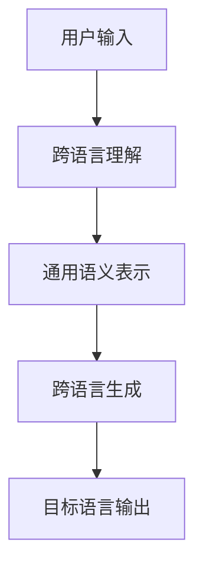
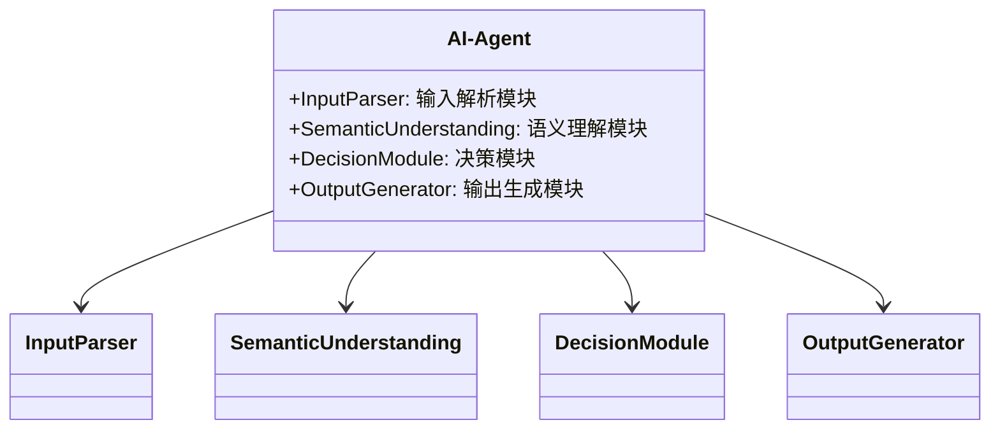
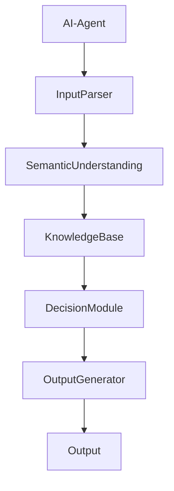
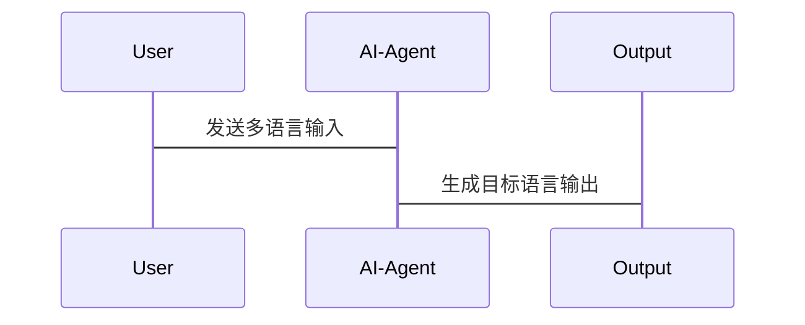

                 


# AI Agent的多语言支持：跨语言理解与生成

> 关键词：AI Agent, 多语言支持, 跨语言理解, 跨语言生成, NLP模型, 多任务学习

> 摘要：本文深入探讨了AI Agent在多语言支持中的实现技术，重点分析了跨语言理解与生成的核心原理，系统架构设计，以及实际项目中的实现方案。文章从AI Agent的基本概念出发，逐步展开对多语言NLP模型的训练方法、系统设计与优化策略的详细分析，并通过实际案例展示如何在AI Agent中实现跨语言能力。最后，本文总结了多语言支持在AI Agent中的最佳实践和未来发展方向。

---

## 第1章: AI Agent的基本概念与多语言支持的重要性

### 1.1 AI Agent的定义与核心功能

AI Agent（人工智能代理）是指能够感知环境、自主决策并执行任务的智能体。它通常具备以下核心功能：

- **感知环境**：通过传感器或API接口获取外部信息。
- **理解意图**：通过NLP技术理解用户需求。
- **决策与推理**：基于知识库和推理引擎做出决策。
- **执行任务**：通过调用服务或触发动作完成目标。

AI Agent的应用场景广泛，包括智能助手、客服机器人、自动化系统等。

### 1.2 多语言支持的背景与问题背景

在全球化背景下，AI Agent需要处理多种语言的输入和输出，以满足全球用户的需求。然而，当前AI Agent在多语言支持中面临以下挑战：

- **语言多样性**：不同语言的语法结构和文化背景差异较大，增加了模型训练的复杂性。
- **数据稀缺性**：某些语言的数据量有限，导致模型性能不足。
- **计算资源限制**：跨语言处理需要更多的计算资源。

### 1.3 多语言支持的核心概念与边界

多语言支持的核心概念包括：

- **跨语言理解**：将多种语言的文本转换为通用语义表示。
- **跨语言生成**：从通用语义表示生成目标语言的文本。

其边界包括：

- 仅支持特定语言对。
- 不处理语言无关的任务（如图像识别）。

---

## 第2章: 跨语言理解与生成技术的核心原理

### 2.1 跨语言理解的核心技术

#### 2.1.1 多语言NLP模型的基本原理

多语言NLP模型通过共享跨语言的语义信息，实现多种语言的统一处理。其基本原理如下：

1. **词向量表示**：使用词嵌入技术（如Word2Vec）生成跨语言词向量。
2. **语义表示**：通过预训练模型（如BERT）捕获跨语言的语义信息。
3. **句法分析**：利用跨语言句法树分析语法结构。

#### 2.1.2 跨语言词向量与语义表示

跨语言词向量通过对比学习或对齐技术，将不同语言的词汇映射到同一语义空间。语义表示则利用预训练模型的上下文信息，捕捉跨语言的语义关联。

#### 2.1.3 跨语言句法分析与语义解析

跨语言句法分析通过构建通用语法框架，分析多种语言的句法结构。语义解析则基于句法树和外部知识库，生成语义表示。

### 2.2 跨语言生成的核心技术

#### 2.2.1 多语言文本生成的挑战

多语言文本生成面临以下挑战：

- **语言差异**：不同语言的表达习惯不同。
- **数据不平衡**：某些语言的数据量较少。
- **生成质量**：跨语言生成的文本可能缺乏自然流畅性。

#### 2.2.2 跨语言语言模型的训练方法

跨语言语言模型的训练方法包括：

1. **预训练模型扩展**：在多语言数据上进行预训练。
2. **多任务学习**：结合多种语言任务进行联合优化。
3. **数据增强**：通过数据合成技术增加数据多样性。

#### 2.2.3 跨语言生成的优化策略

优化策略包括：

- **语言适配**：根据目标语言调整生成模型。
- **反馈机制**：通过用户反馈优化生成质量。
- **跨语言对比学习**：通过对比不同语言的生成结果，提升模型的通用性。

### 2.3 跨语言理解与生成的对比分析

#### 2.3.1 对比表格

| **技术特点**       | **跨语言理解**                     | **跨语言生成**                     |
|--------------------|------------------------------------|------------------------------------|
| **核心任务**       | 将多种语言文本转换为通用语义表示     | 从通用语义表示生成目标语言文本     |
| **主要挑战**       | 语义对齐难度大                     | 生成质量控制                     |
| **典型技术**       | 跨语言词向量、预训练模型            | 多任务学习、生成对抗网络          |

#### 2.3.2 ER实体关系图（Mermaid）



---

## 第3章: 多语言模型的训练与优化

### 3.1 多语言模型的训练方法

#### 3.1.1 预训练模型的多语言扩展

预训练模型（如BERT）通过在多语言数据上进行微调，扩展其多语言能力。

#### 3.1.2 多任务学习在多语言模型中的应用

多任务学习通过联合优化多种语言任务（如翻译、问答），提升模型的跨语言能力。

#### 3.1.3 跨语言数据增强技术

数据增强技术通过数据合成（如机器翻译）增加数据多样性。

### 3.2 多语言模型的优化策略

#### 3.2.1 数据增强与模型微调

通过数据增强技术生成更多样化数据，并对模型进行微调。

#### 3.2.2 跨语言对比学习

通过对比不同语言的表示，提升模型的跨语言对齐能力。

---

## 第4章: AI Agent的架构与设计

### 4.1 系统功能设计

AI Agent的系统功能模块包括：

1. **输入解析模块**：解析多语言输入。
2. **语义理解模块**：生成通用语义表示。
3. **决策模块**：基于语义表示做出决策。
4. **生成模块**：生成目标语言的输出。

#### 4.1.1 领域模型（Mermaid类图）



### 4.2 系统架构设计

#### 4.2.1 系统架构（Mermaid架构图）



### 4.3 系统接口设计

系统接口包括：

- **输入接口**：接收多语言输入。
- **输出接口**：生成目标语言的输出。

#### 4.3.1 系统交互（Mermaid序列图）



---

## 第5章: 系统实现与实战

### 5.1 环境安装与配置

- **安装Python**：确保安装Python 3.8以上版本。
- **安装依赖库**：安装`transformers`, `numpy`, `torch`等库。

### 5.2 核心实现代码

#### 5.2.1 输入解析模块

```python
from transformers import AutoTokenizer, AutoModelForMaskedLM

class InputParser:
    def __init__(self, model_name):
        self.tokenizer = AutoTokenizer.from_pretrained(model_name)
        self.model = AutoModelForMaskedLM.from_pretrained(model_name)
```

#### 5.2.2 语义理解模块

```python
import torch

class SemanticUnderstanding:
    def __init__(self, model_name):
        self.tokenizer = AutoTokenizer.from_pretrained(model_name)
        self.model = AutoModelForMaskedLM.from_pretrained(model_name)
    
    def encode(self, text):
        inputs = self.tokenizer(text, return_tensors="pt")
        return inputs
```

### 5.3 实际案例分析

#### 5.3.1 案例分析

假设用户输入为中文：“请帮我翻译成英文。”，系统解析后生成英文输出：“Please translate into English for me.”

---

## 第6章: 总结与展望

### 6.1 本章小结

本文详细探讨了AI Agent在多语言支持中的实现技术，从核心概念到系统架构，再到实际应用，全面分析了跨语言理解与生成的关键技术。

### 6.2 未来展望

未来研究方向包括：

- 更高效的数据处理方法。
- 更先进的模型结构。
- 更广泛的应用场景。

---

作者：AI天才研究院 & 禅与计算机程序设计艺术

