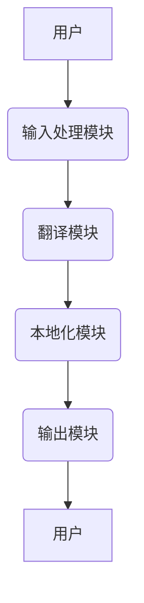
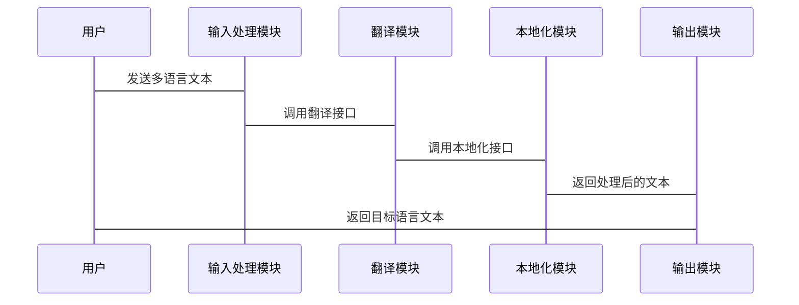

                 


# AI Agent的多语言翻译与本地化

> 关键词：AI Agent, 多语言翻译, 本地化, 自然语言处理, 系统架构, 项目实战

> 摘要：本文深入探讨了AI Agent在多语言翻译与本地化领域的应用，从技术原理到系统架构，从算法实现到项目实战，全面解析了如何构建一个支持多语言的AI Agent系统。文章结合理论与实践，详细介绍了自然语言处理的核心技术、机器翻译的实现原理、本地化的文化适配策略，以及系统架构设计与优化方法。通过具体案例分析和代码实现，展示了如何在实际项目中应用这些技术，为读者提供了一套完整的解决方案。

---

# 第一部分: AI Agent的多语言翻译与本地化基础

## 第1章: AI Agent的基本概念

### 1.1 AI Agent的定义与核心能力
AI Agent（人工智能代理）是指能够感知环境、自主决策并执行任务的智能体。它具备以下核心能力：
- **感知能力**：通过传感器或API获取环境信息。
- **推理能力**：基于感知信息进行逻辑推理和决策。
- **执行能力**：通过执行器或API与外部系统交互。

AI Agent与传统程序的区别在于其自主性和智能性，能够适应动态变化的环境。

### 1.2 多语言翻译与本地化的背景
在全球化背景下，语言障碍已成为信息交流的主要障碍。AI Agent需要支持多语言翻译和本地化，以满足全球用户的需求。本地化不仅仅是语言的转换，还包括文化适配和用户体验优化。

### 1.3 本章小结
本章介绍了AI Agent的基本概念及其在多语言翻译与本地化中的应用背景，为后续内容奠定了基础。

---

# 第二部分: 多语言翻译与本地化的技术原理

## 第2章: 自然语言处理基础

### 2.1 自然语言处理的核心任务
自然语言处理（NLP）的核心任务包括：
- **语言理解**：通过词袋模型、TF-IDF、BM25等方法进行文本分析。
- **语言生成**：基于RNN、LSTM、Transformer等模型生成自然语言文本。
- **语言翻译**：通过统计机器翻译（SMT）和神经机器翻译（NMT）实现跨语言转换。

### 2.2 机器翻译的原理与挑战
机器翻译的实现依赖于以下技术：
- **统计机器翻译**：基于语料库的对齐和翻译规则。
- **神经机器翻译**：基于编码器-解码器架构的Transformer模型。
- **挑战**：翻译的准确性、可解释性以及文化差异的适应性。

### 2.3 本地化的技术实现
本地化不仅仅是语言的转换，还包括文化适配。本地化的技术实现包括：
- **文本处理与格式化**：使用国际化字符串和资源文件。
- **文化适配**：考虑日期、时间、货币格式等文化差异。
- **本地化工具**：使用Gettext、i18next等工具实现多语言支持。

### 2.4 本章小结
本章详细介绍了自然语言处理的核心任务、机器翻译的原理与挑战，以及本地化的技术实现，为后续AI Agent的多语言翻译与本地化实现提供了理论基础。

---

# 第三部分: AI Agent的多语言翻译与本地化实现

## 第3章: AI Agent的多语言翻译技术

### 3.1 多语言翻译的模型训练
多语言翻译的模型训练包括以下步骤：
1. **数据准备**：收集多语言平行语料库。
2. **模型选择**：基于Transformer架构构建多语言模型。
3. **预训练与微调**：使用大规模多语言数据进行预训练，并在目标语言上进行微调。

### 3.2 多语言翻译的实现流程
多语言翻译的实现流程如下：
1. **文本预处理**：分词、去除停用词等。
2. **模型调用**：通过API调用翻译模型。
3. **结果后处理**：语法检查、上下文优化。

### 3.3 本地化与文化适配
本地化与文化适配需要考虑以下因素：
- **语言习惯**：不同语言的语序和表达习惯。
- **文化差异**：节日、习俗等文化背景对翻译的影响。
- **本地化工具**：使用自动化工具提高效率。

### 3.4 本章小结
本章详细介绍了AI Agent的多语言翻译技术及其实现流程，探讨了本地化与文化适配的策略。

---

# 第四部分: 系统架构与项目实战

## 第4章: 系统架构设计

### 4.1 问题场景介绍
假设我们开发一个支持多语言的AI客服系统，需要实现以下功能：
- **用户输入**：支持多种语言的文本输入。
- **翻译与本地化**：将用户输入翻译为目标语言，并进行文化适配。
- **反馈输出**：以目标语言生成回复，并返回给用户。

### 4.2 系统功能设计
系统功能设计包括以下模块：
- **输入处理模块**：接收用户输入并进行预处理。
- **翻译模块**：调用翻译模型进行翻译。
- **本地化模块**：进行文化适配和格式化处理。
- **输出模块**：生成回复并返回给用户。

### 4.3 系统架构设计
系统架构设计如下：



### 4.4 系统接口设计
系统接口设计如下：
- **输入接口**：提供RESTful API，接收多语言文本。
- **翻译接口**：调用翻译模型进行翻译。
- **本地化接口**：进行文化适配和格式化处理。

### 4.5 系统交互设计
系统交互流程如下：



## 第5章: 项目实战

### 5.1 环境安装
项目实战需要以下环境：
- Python 3.8+
- PyTorch 1.9+
- Transformers库
- Mermaid图表工具

### 5.2 核心代码实现
以下是多语言翻译的核心代码实现：

```python
from transformers import AutoTokenizer, AutoModelForSeq2Seq
import requests

class Translator:
    def __init__(self, model_name):
        self.tokenizer = AutoTokenizer.from_pretrained(model_name)
        self.model = AutoModelForSeq2Seq.from_pretrained(model_name)
    
    def translate(self, source_text, target_lang):
        inputs = self.tokenizer(source_text, return_tensors="np")
        outputs = self.model.generate(inputs.input_ids, max_length=50)
        return self.tokenizer.decode(outputs[0], skip_special_tokens=True)

# 初始化翻译器
translator = Translator("facebook/m2m")
# 调用翻译接口
translated_text = translator.translate("Hello", "es")
print(translated_text)  # 输出：Hola
```

### 5.3 案例分析与解读
案例分析：假设我们需要将一段中文文本翻译成西班牙语，并进行本地化处理。

1. **输入处理**：接收中文文本。
2. **翻译**：调用翻译模型将中文翻译成西班牙语。
3. **本地化**：调整日期格式、货币单位等文化差异。
4. **输出**：返回西班牙语文本。

### 5.4 本章小结
本章通过项目实战，详细介绍了AI Agent的多语言翻译与本地化的实现过程，展示了如何在实际项目中应用相关技术。

---

# 第五部分: 总结与展望

## 第6章: 总结与展望

### 6.1 本章总结
本文深入探讨了AI Agent在多语言翻译与本地化领域的应用，从技术原理到系统架构，从算法实现到项目实战，全面解析了如何构建一个支持多语言的AI Agent系统。

### 6.2 未来展望
未来，AI Agent的多语言翻译与本地化将朝着以下方向发展：
- **更准确的翻译模型**：通过改进算法和增加数据量，提高翻译的准确性。
- **更智能的本地化**：结合上下文和用户行为，实现更个性化的本地化。
- **更高效的系统架构**：通过分布式计算和边缘计算，优化系统的响应速度。

### 6.3 最佳实践 tips
- **选择合适的工具**：根据需求选择适合的翻译和本地化工具。
- **注重文化适配**：本地化不仅仅是语言的转换，还包括文化差异的处理。
- **持续优化模型**：通过反馈机制不断优化翻译模型的性能。

### 6.4 本章小结
本文总结了AI Agent的多语言翻译与本地化的实现过程，并展望了未来的发展方向，为读者提供了进一步的研究方向和实践建议。

---

# 作者：AI天才研究院/AI Genius Institute & 禅与计算机程序设计艺术 /Zen And The Art of Computer Programming

