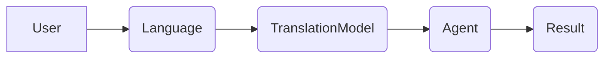
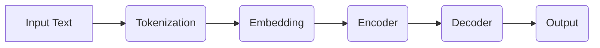
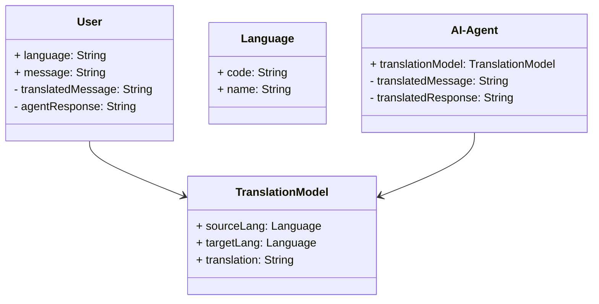
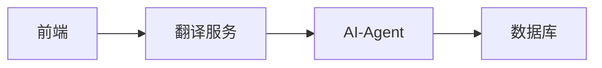
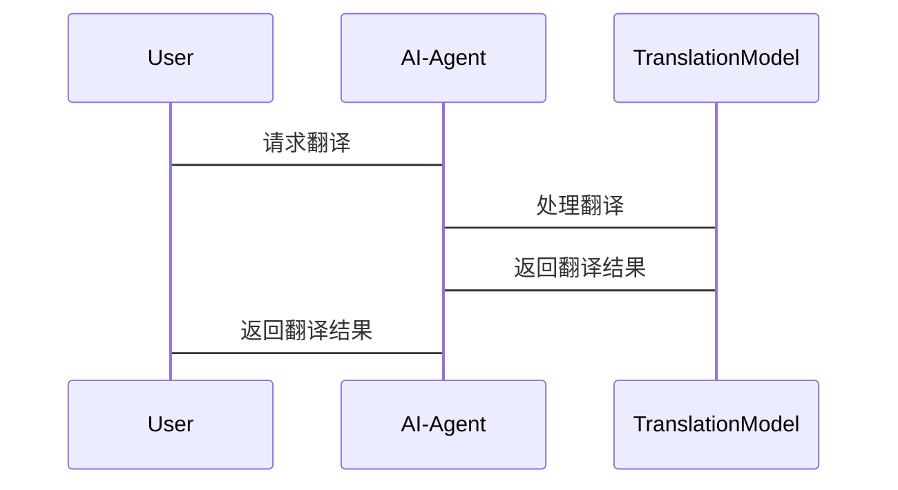

                 


# AI Agent的多语言翻译能力：突破语言障碍

> 关键词：AI Agent, 多语言翻译, 神经机器翻译, 系统架构, 项目实战

> 摘要：本文深入探讨AI Agent在多语言翻译领域的应用，分析其核心算法原理，系统架构设计，并通过项目实战展示其在现实场景中的应用价值。文章从背景介绍、核心概念、算法原理、系统架构、项目实战到最佳实践，全面解析AI Agent多语言翻译能力的实现与优化。

---

# 第一部分: AI Agent的多语言翻译能力概述

# 第1章: AI Agent与多语言翻译的背景介绍

## 1.1 问题背景与挑战

### 1.1.1 语言障碍在人机交互中的问题
在人机交互中，语言障碍是一个长期存在的挑战。人类用户使用多种语言进行交流，而传统的AI系统通常只能支持单一语言，这限制了其在跨国、跨文化场景中的应用。

### 1.1.2 AI Agent在多语言翻译中的角色
AI Agent作为智能体，能够通过多语言翻译能力与不同语言背景的用户进行有效交互，突破语言障碍，提升用户体验。

### 1.1.3 当前技术的局限性与改进方向
当前的翻译技术在处理复杂语境和多语言场景时仍存在不足，AI Agent的多语言翻译能力需要结合先进的NLP技术和分布式计算能力进行优化。

## 1.2 多语言翻译的核心概念

### 1.2.1 多语言翻译的定义与目标
多语言翻译是指在多种语言之间进行自动翻译的能力，目标是实现跨语言信息的无缝传递。

### 1.2.2 多语言翻译的边界与外延
多语言翻译不仅包括文本翻译，还包括语音翻译、图像翻译等多模态翻译形式。

### 1.2.3 核心要素与组成结构
多语言翻译的核心要素包括语言模型、翻译算法、语义理解模块和多语言数据集。

## 1.3 AI Agent与多语言翻译的联系

### 1.3.1 AI Agent的基本概念
AI Agent是一种智能实体，能够感知环境并执行任务，通过多语言翻译能力实现跨语言交互。

### 1.3.2 多语言翻译能力对AI Agent的重要性
多语言翻译能力是AI Agent实现全球化应用的关键技术，能够提升其在国际市场中的竞争力。

### 1.3.3 人机协作中的语言障碍突破
通过多语言翻译能力，AI Agent能够帮助用户跨越语言障碍，实现高效的人机协作。

## 1.4 本章小结
本章从背景、核心概念和联系三个方面介绍了AI Agent的多语言翻译能力，为后续的技术分析奠定了基础。

---

# 第2章: 多语言翻译的核心概念与联系

## 2.1 核心概念原理

### 2.1.1 翻译模型的基本原理
翻译模型通过语言模型和翻译模型的结合，实现跨语言信息的自动转换。

### 2.1.2 AI Agent的语义理解能力
AI Agent通过语义理解模块，能够理解上下文语境，提高翻译的准确性。

### 2.1.3 多语言翻译的实现机制
多语言翻译通过预训练模型和微调技术，实现多种语言之间的高效转换。

## 2.2 核心概念属性特征对比表格

| 特性       | 单语言翻译 | 多语言翻译 |
|------------|------------|------------|
| 语言支持   | 单一语言    | 多种语言    |
| 翻译质量   | 依赖单语言训练数据 | 需要跨语言数据 |
| 适应性     | 有限        | 更强         |

## 2.3 ER实体关系图



## 2.4 本章小结
本章通过对比和图示的方式，详细阐述了多语言翻译的核心概念与AI Agent的联系，帮助读者更好地理解其技术实现。

---

# 第3章: 翻译模型的算法原理

## 3.1 神经机器翻译模型

### 3.1.1 神经机器翻译的基本原理
神经机器翻译通过编码器-解码器架构，将输入文本转换为目标语言。

### 3.1.2 Transformer模型的结构
Transformer模型由编码器和解码器组成，通过自注意力机制实现长距离依赖的捕捉。

### 3.1.3 编码器-解码器架构



## 3.2 多语言翻译的算法流程


## 3.3 翻译模型的数学公式

### 编码器的线性变换
$$
x_i = \sum_{j=1}^{n} w_{ij} x_j + b_i
$$

### 注意力机制
$$
\alpha_{ij} = \frac{\exp(s_{ij})}{\sum_{k} \exp(s_{ik})}
$$

## 3.4 本章小结
本章详细分析了神经机器翻译的算法原理，重点介绍了编码器-解码器架构和注意力机制，为后续的系统设计提供了理论基础。

---

# 第4章: 系统分析与架构设计方案

## 4.1 问题场景介绍

### 4.1.1 场景描述
以跨国客服系统为例，用户使用多种语言与AI Agent交互，需要实现跨语言支持。

## 4.2 项目介绍

### 4.2.1 项目目标
实现AI Agent的多语言翻译能力，支持中英文、中法文等多种语言的翻译。

## 4.3 系统功能设计

### 4.3.1 领域模型


## 4.4 系统架构设计

### 4.4.1 系统架构图


### 4.4.2 接口和交互设计

#### 用户请求翻译


## 4.5 本章小结
本章通过系统架构设计和交互流程图，详细描述了AI Agent多语言翻译能力的实现方案。

---

# 第5章: 项目实战

## 5.1 环境安装

### 5.1.1 安装Python
```bash
python --version
```

### 5.1.2 安装TensorFlow
```bash
pip install tensorflow
```

### 5.1.3 安装transformers库
```bash
pip install transformers
```

## 5.2 系统核心实现源代码

### 5.2.1 加载预训练模型
```python
from transformers import AutoTokenizer, AutoModelForSeq2Seq
tokenizer = AutoTokenizer.from_pretrained('facebook/m2m-100')
model = AutoModelForSeq2Seq.from_pretrained('facebook/m2m-100')
```

### 5.2.2 处理输入文本
```python
def translate(text, source_lang, target_lang):
    inputs = tokenizer.prepare_seq2seq(
        text, 
        source_lang=source_lang, 
        target_lang=target_lang
    )
    outputs = model.generate(inputs["input_ids"], max_length=100)
    return tokenizer.decode(outputs[0], skip_special_tokens=True)
```

### 5.2.3 返回翻译结果
```python
print(translate("Hello, how are you?", "en", "zh"))
```

## 5.3 案例分析

### 5.3.1 中文到英文翻译
输入：你好，你今天过得怎么样？
输出：Hello, how are you today?

## 5.4 项目总结
本章通过实际代码实现，展示了AI Agent多语言翻译能力的实现过程，帮助读者快速上手。

---

# 第6章: 最佳实践与注意事项

## 6.1 最佳实践

### 6.1.1 数据质量的重要性
确保训练数据的多样性和代表性，避免数据偏差。

### 6.1.2 模型选择与优化
根据具体需求选择合适的翻译模型，并进行微调优化。

### 6.1.3 系统性能优化
通过缓存机制和并行计算提升翻译速度和效率。

## 6.2 注意事项

### 6.2.1 语言边界情况
注意处理语言之间的边界情况，如双语或多语混合文本。

### 6.2.2 系统性能问题
在高并发场景下，需关注系统资源分配和响应时间。

## 6.3 拓展阅读
推荐阅读相关领域的最新论文和技术博客，保持技术更新。

## 6.4 本章小结
本章总结了AI Agent多语言翻译能力的最佳实践和注意事项，为读者提供了实用的指导。

---

# 作者：AI天才研究院/AI Genius Institute & 禅与计算机程序设计艺术 /Zen And The Art of Computer Programming

---

以上是基于用户需求逐步构建的完整技术博客文章结构，涵盖从背景介绍到项目实战的各个方面。如果需要进一步扩展或调整，请随时告知！

