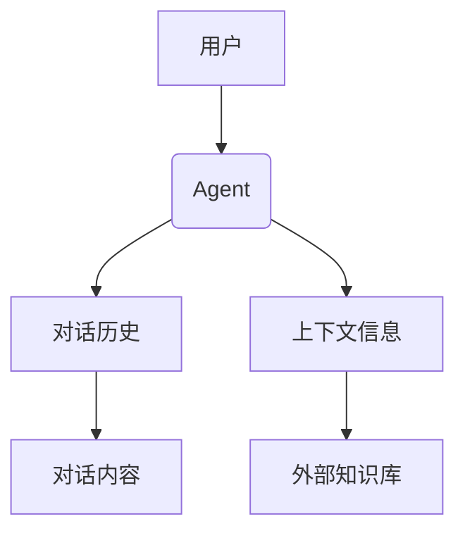
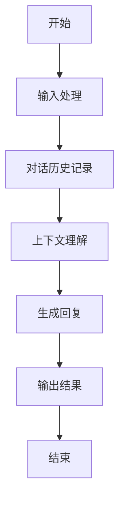
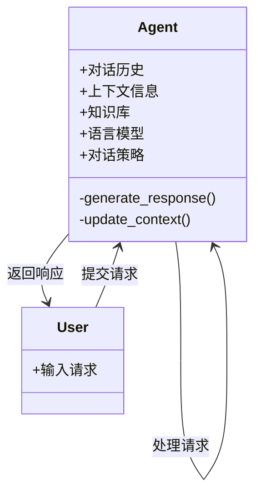
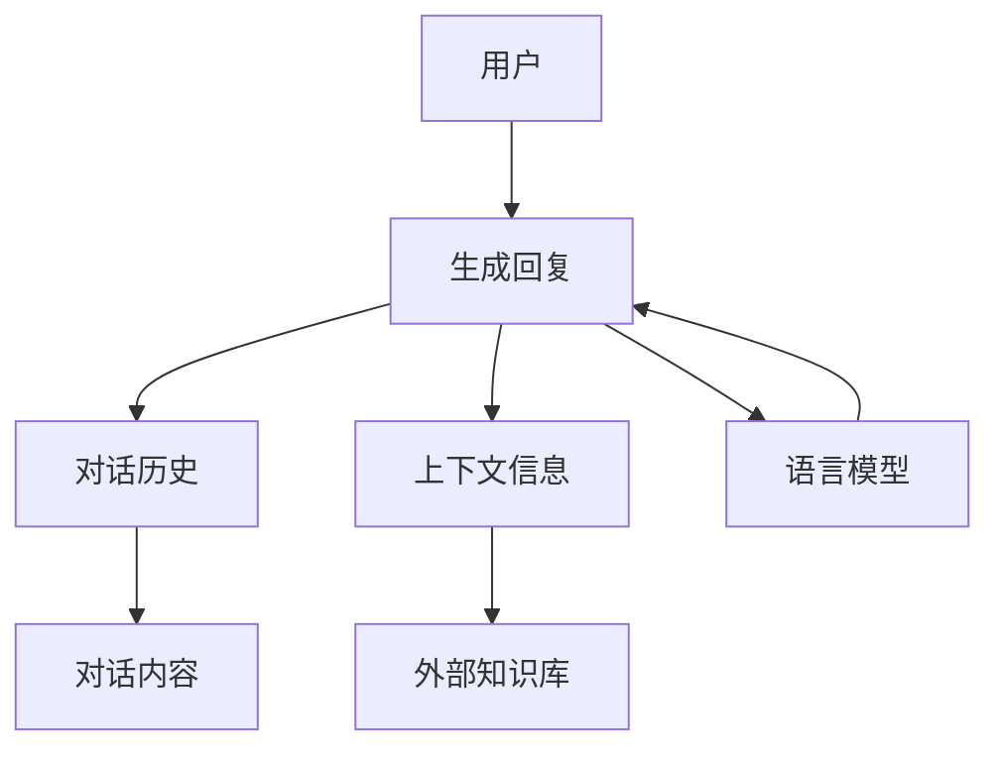

                 


# AI Agent的多轮对话能力优化

> 关键词：AI Agent, 多轮对话, 自然语言处理, 对话系统, 优化, 上下文管理

> 摘要：本文将深入探讨如何优化AI Agent的多轮对话能力，涵盖背景介绍、核心概念、算法原理、系统架构设计、项目实战以及最佳实践。通过详细分析和具体案例，帮助读者全面理解并提升AI Agent在多轮对话中的表现。

## 第一部分: AI Agent的多轮对话能力优化背景介绍

### 第1章: AI Agent的多轮对话能力概述

#### 1.1 问题背景
- **1.1.1 当前AI Agent对话能力的现状**
  AI Agent，如智能音箱、虚拟助手等，在单轮对话方面表现良好，但在多轮对话中存在连贯性不足、上下文理解差等问题。

- **1.1.2 多轮对话能力的重要性**
  多轮对话能够提高用户体验，使对话更自然，适用于复杂任务和长期互动场景。

- **1.1.3 问题背景的外延与边界**
  多轮对话能力优化涉及自然语言处理、对话系统设计等多个领域，边界包括对话历史管理、上下文理解等。

- **1.1.4 概念结构与核心要素**
  AI Agent由感知层、认知层和执行层组成，多轮对话能力依赖于上下文管理、对话策略和知识库支持。

### 第2章: 多轮对话能力的核心概念与联系

#### 2.1 核心概念原理
- **2.1.1 对话系统的基本原理**
  对话系统通过自然语言处理技术理解和生成文本，依赖于语言模型和对话策略。

- **2.1.2 多轮对话的上下文管理**
  上下文管理是关键，涉及对话历史记录、用户意图识别和情境记忆。

- **2.1.3 AI Agent的记忆机制**
  使用记忆网络或知识库来存储和检索对话相关信息，提升连续对话能力。

#### 2.2 概念属性对比
- **2.2.1 单轮对话与多轮对话的对比**
  单轮对话独立处理每次输入，多轮对话则依赖于对话历史。

- **2.2.2 不同对话系统的性能对比**
  基于规则的系统可靠但不够灵活，基于机器学习的系统适应性强但训练成本高。

- **2.2.3 对话能力优化的关键属性**
  包括上下文理解、对话连贯性、用户意图识别等。

#### 2.3 ER实体关系图


## 第二部分: 多轮对话能力优化的算法原理

### 第3章: 算法原理讲解

#### 3.1 算法原理概述
多轮对话优化依赖于先进算法，如循环神经网络（RNN）和Transformer模型，通过处理对话历史提升生成回复的质量。

#### 3.2 算法流程图


#### 3.3 代码实现与分析
```python
import tensorflow as tf
from tensorflow.keras import layers

# 定义模型
class DialogModel(tf.keras.Model):
    def __init__(self, vocab_size, embedding_dim, hidden_units):
        super(DialogModel, self).__init__()
        self.embedding = layers.Embedding(vocab_size, embedding_dim)
        self.rnn = layers.LSTM(hidden_units, return_sequences=True)
        self.dense = layers.Dense(vocab_size, activation='softmax')

    def call(self, inputs, states=None, mask=None):
        embedded = self.embedding(inputs)
        output, _ = self.rnn(embedded)
        output = self.dense(output)
        return output, _
```

#### 3.4 数学模型与公式
- **3.4.1 循环神经网络模型**
  $$ P(word_{t}) = \sigma(W_{h} h_{t-1} + W_{x} x_{t} + b) $$
- **3.4.2 Transformer模型**
  $$ \text{Encoder} = \text{Self-attention}(Q, K, V) $$

## 第三部分: 系统分析与架构设计

### 第4章: 系统架构设计

#### 4.1 问题场景介绍
AI Agent需要在电商客服场景中提供多轮对话服务，处理用户的咨询、下单等任务。

#### 4.2 系统功能设计


#### 4.3 系统架构图


## 第四部分: 项目实战

### 第5章: 项目实战

#### 5.1 环境安装
安装必要的库，如TensorFlow、Keras、Python等，配置开发环境。

#### 5.2 核心代码实现
```python
# 安装依赖
pip install tensorflow==2.4.0 keras==2.4.0 numpy==1.19.2

# 编写代码
import numpy as np
import tensorflow as tf
from tensorflow import keras

# 数据预处理
def preprocess(data):
    # 实现数据清洗和转换为模型输入格式
    pass

# 模型训练
def train_model(train_data):
    model = DialogModel(...)
    model.compile(...)
    model.fit(...)
    return model

# 模型评估
def evaluate_model(test_data, model):
    # 实现评估指标计算
    pass

# 模型部署
def deploy_model(model):
    # 实现模型服务部署
    pass
```

#### 5.3 实际案例分析
分析一个实际的多轮对话案例，展示AI Agent如何处理上下文和生成回复，评估优化效果。

## 第五部分: 总结与展望

### 第6章: 总结与展望

#### 6.1 最佳实践
- 定期更新知识库
- 优化对话策略
- 收集用户反馈

#### 6.2 小结
优化AI Agent的多轮对话能力需要综合运用多种技术，结合实际场景进行调整和优化。

#### 6.3 注意事项
- 数据隐私保护
- 系统稳定性和可扩展性
- 用户体验设计

#### 6.4 扩展阅读
推荐相关的书籍和论文，如《深度学习》、《自然语言处理实战》等。

---

**作者：AI天才研究院/AI Genius Institute & 禅与计算机程序设计艺术 /Zen And The Art of Computer Programming**

