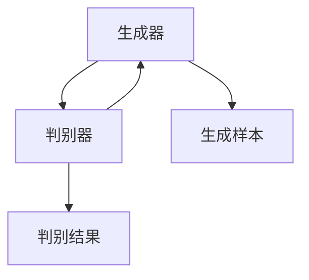
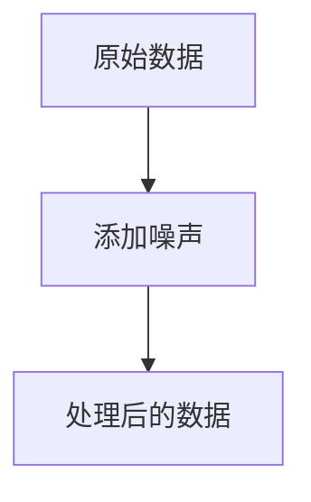
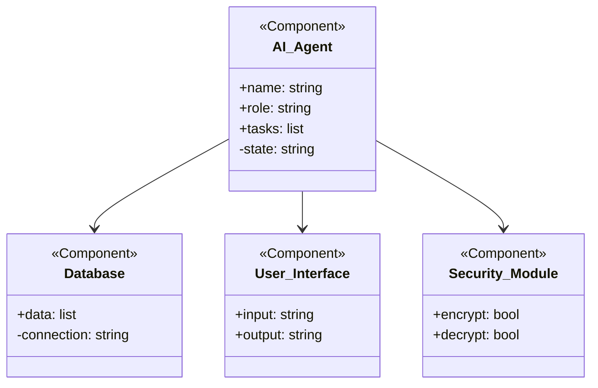
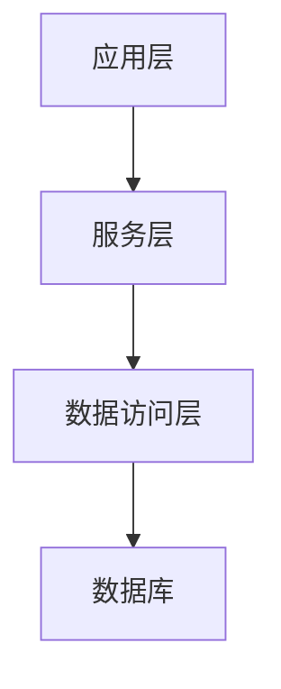

                 


# AI Agent的安全性设计：防范潜在风险

## 关键词：AI Agent，安全性设计，风险防范，对抗训练，差分隐私，系统架构

## 摘要：  
随着人工智能技术的快速发展，AI Agent（智能体）在各个领域的应用越来越广泛。然而，AI Agent的安全性问题也随之凸显，例如数据泄露、模型攻击、滥用等。本文从AI Agent的基本概念出发，分析其潜在的安全威胁与风险，并详细介绍对抗训练和差分隐私等安全性设计算法。通过系统架构设计、项目实战案例以及最佳实践，为读者提供一套全面的AI Agent安全性设计方法论，帮助防范潜在风险。

---

## 第三部分: AI Agent 的安全性设计算法

## 第5章: 对抗训练算法

### 5.1 对抗训练的基本原理

对抗训练是一种通过训练对抗网络来增强模型鲁棒性的技术。它由两个神经网络组成：生成器（Generator）和判别器（Discriminator）。生成器的目标是生成能够欺骗判别器的样本，而判别器的目标是识别出生成的样本与真实样本之间的差异。

对抗训练的损失函数如下：

$$\mathcal{L} = \mathcal{L}_{\text{D}} + \mathcal{L}_{\text{G}}$$

其中，$\mathcal{L}_{\text{D}}$ 是判别器的损失函数，$\mathcal{L}_{\text{G}}$ 是生成器的损失函数。通过交替优化这两个网络，可以提高模型的鲁棒性。

### 5.2 对抗训练的数学模型

生成对抗网络（GAN）的核心思想是通过对抗训练来生成高质量的样本。生成器和判别器的博弈过程可以用以下公式表示：

$$\min_{G} \max_{D} \mathbb{E}_{x \sim p_{\text{data}}}[\log D(x)] + \mathbb{E}_{z \sim p_{z}}[\log (1 - D(G(z)))]$$

其中，$G$ 是生成器，$D$ 是判别器，$z$ 是输入噪声，$p_{\text{data}}$ 是真实数据的分布。

### 5.3 对抗训练的实现代码

以下是使用Python和TensorFlow实现对抗训练的简单代码示例：

```python
import tensorflow as tf
from tensorflow import keras

# 定义生成器
def generator():
    model = keras.Sequential([
        keras.layers.Dense(256, activation='relu'),
        keras.layers.Dense(128, activation='relu'),
        keras.layers.Dense(784, activation='sigmoid'),
    ])
    return model

# 定义判别器
def discriminator():
    model = keras.Sequential([
        keras.layers.Dense(128, activation='relu'),
        keras.layers.Dense(64, activation='relu'),
        keras.layers.Dense(1, activation='sigmoid'),
    ])
    return model

# 初始化生成器和判别器
generator = generator()
discriminator = discriminator()

# 定义损失函数和优化器
cross_entropy = keras.losses.BinaryCrossentropy()

# 生成器的损失函数
def generator_loss(fake_output):
    return cross_entropy(tf.ones_like(fake_output), fake_output)

# 判别器的损失函数
def discriminator_loss(real_output, fake_output):
    return cross_entropy(tf.ones_like(real_output), real_output) + cross_entropy(tf.zeros_like(fake_output), fake_output)

# 优化器
generator_optimizer = tf.keras.optimizers.Adam(0.0002)
discriminator_optimizer = tf.keras.optimizers.Adam(0.0002)

# 训练循环
for epoch in range(100):
    for _ in range(2):
        # 判别器训练
        with tf.GradientTape() as tape:
            real_output = discriminator(real_images)
            fake_output = discriminator(generator(noise))
            d_loss = discriminator_loss(real_output, fake_output)
        gradients = tape.gradient(d_loss, discriminator.trainable_weights)
        discriminator_optimizer.apply_gradients(zip(gradients, discriminator.trainable_weights))
        
        # 生成器训练
        with tf.GradientTape() as tape:
            fake_output = discriminator(generator(noise))
            g_loss = generator_loss(fake_output)
        gradients = tape.gradient(g_loss, generator.trainable_weights)
        generator_optimizer.apply_gradients(zip(gradients, generator.trainable_weights))
```

### 5.4 对抗训练的流程图

以下是一个简单的对抗训练流程图：



---

## 第6章: 差分隐私保护算法

### 6.1 差分隐私的基本概念

差分隐私是一种通过在数据中添加噪声来保护个体隐私的技术。其核心思想是确保在任何数据点上，添加噪声后的结果与不添加噪声的结果之间的差异不超过一定的阈值。

### 6.2 差分隐私的数学模型

差分隐私的定义如下：对于任意两个相邻的数据集 $D$ 和 $D'$，以及任何可能的输出结果 $S$，满足：

$$\Pr[S(D) = S] \leq \Pr[S(D') = S] + \epsilon$$

其中，$\epsilon$ 是隐私预算，控制隐私泄露的程度。

### 6.3 差分隐私的实现代码

以下是使用Python和TensorFlow实现差分隐私的简单代码示例：

```python
import numpy as np
import tensorflow as tf

# 生成真实数据
data = np.array([1, 2, 3, 4, 5])

# 添加拉普拉斯噪声
def add_laplace_noise(data, b):
    noise = np.random.laplace(0, b, len(data))
    noisy_data = data + noise
    return noisy_data

# 设置隐私预算
b = 0.1
noisy_data = add_laplace_noise(data, b)
print("Noisy data:", noisy_data)
```

### 6.4 差分隐私的流程图

以下是一个简单的差分隐私流程图：



---

## 第四部分: AI Agent 的系统分析与架构设计

### 7.1 项目背景与目标

本项目旨在设计一个基于AI Agent的智能客服系统，其核心目标是确保系统的安全性，防止数据泄露和模型攻击。

### 7.2 系统功能设计

以下是系统功能模块的类图：



### 7.3 系统架构设计

以下是系统的分层架构图：



---

## 第五部分: AI Agent 的项目实战

### 8.1 环境安装与配置

安装所需的依赖：

```bash
pip install tensorflow keras numpy
```

### 8.2 核心代码实现

以下是实现AI Agent的核心代码：

```python
class AI_Agent:
    def __init__(self, name, role):
        self.name = name
        self.role = role
        self.tasks = []
        self.state = 'idle'
    
    def add_task(self, task):
        self.tasks.append(task)
        self.state = 'busy'
    
    def execute_task(self, task):
        # 具体任务实现
        pass
```

### 8.3 实际案例分析

以智能客服AI Agent为例，分析其安全性设计：

1. 数据加密：对用户输入和输出进行加密处理。
2. 模型保护：使用对抗训练和差分隐私保护模型。
3. 访问控制：限制非授权用户访问敏感数据。

---

## 第六部分: AI Agent 的最佳实践

### 9.1 设计原则

1. 最小化数据暴露：仅收集必要的数据。
2. 强化模型训练：使用对抗训练和差分隐私等技术。
3. 实施访问控制：防止非授权访问。

### 9.2 注意事项

1. 定期进行安全审计。
2. 及时修复已知漏洞。
3. 建立完善的应急响应机制。

### 9.3 未来研究方向

1. 更先进的隐私保护技术。
2. 更高效的对抗训练方法。
3. 更智能的访问控制策略。

---

## 作者：AI天才研究院 & 禅与计算机程序设计艺术

---

以上是《AI Agent的安全性设计：防范潜在风险》的完整内容。希望本文能为AI Agent的安全性设计提供有价值的参考和指导。

