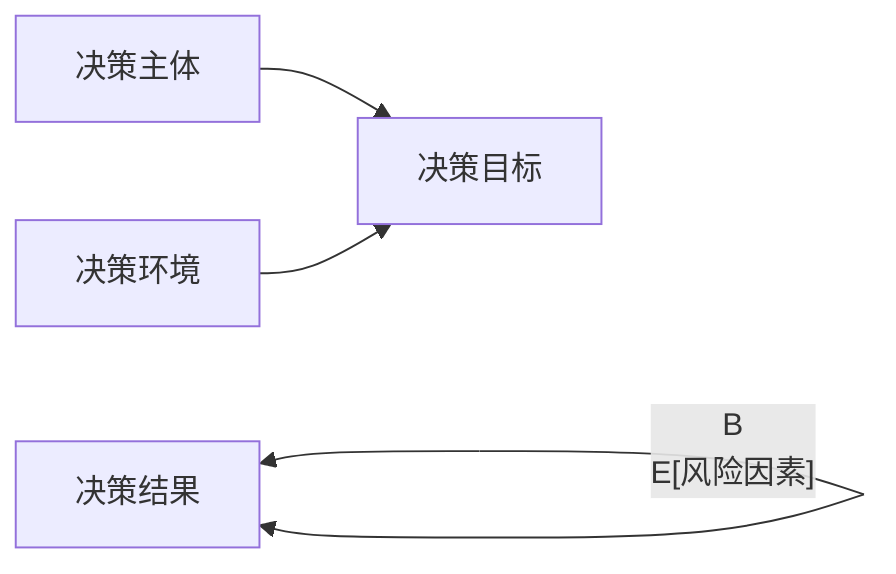
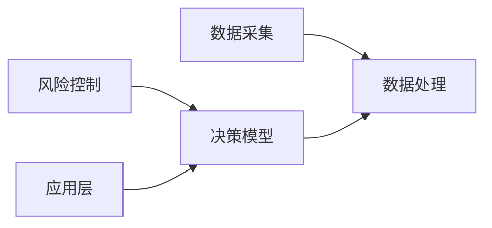

                 


# AI Agent的实时决策与风险评估系统

> 关键词：AI Agent, 实时决策, 风险评估, 决策算法, 系统架构, 数学模型

> 摘要：本文详细探讨了AI Agent在实时决策与风险评估系统中的核心作用，分析了实时决策算法和风险评估模型的数学基础，结合系统架构设计与实际案例，提供了完整的实现方案和优化建议。通过本文，读者将掌握AI Agent在实时决策领域的关键技术和实践方法。

---

# 第1章: AI Agent的背景与概念

## 1.1 问题背景

### 1.1.1 从传统决策系统到AI Agent的演进
传统决策系统依赖于固定的规则和逻辑，缺乏灵活性和适应性。随着AI技术的发展，AI Agent通过学习和自适应能力，能够实时调整决策策略，显著提升了决策效率和准确性。

### 1.1.2 当前决策系统的主要挑战
- 数据实时性要求高，传统系统难以应对。
- 决策的复杂性增加，规则系统难以覆盖所有场景。
- 风险评估的不确定性增加，需要更复杂的模型支持。

### 1.1.3 AI Agent的核心优势
- 强大的学习能力，能够自适应复杂环境。
- 实时决策能力，能够在动态环境中快速响应。
- 风险评估的准确性，基于概率和统计模型。

## 1.2 问题描述

### 1.2.1 实时决策的需求分析
- 高效性：在极短时间内完成决策。
- 精确性：确保决策的准确性。
- 可解释性：决策过程需要可追溯和解释。

### 1.2.2 风险评估的必要性
- 识别潜在风险，提前制定应对策略。
- 量化风险，为决策提供依据。
- 动态调整风险评估模型。

### 1.2.3 AI Agent在决策中的角色定位
AI Agent作为决策的核心，通过感知环境、分析数据、评估风险，最终做出最优决策。它能够实时更新策略，适应环境变化。

## 1.3 问题解决

### 1.3.1 AI Agent的决策机制
- 基于规则的决策：简单场景下的快速响应。
- 基于模型的决策：复杂场景下的模拟和预测。
- 基于强化学习的决策：通过奖励机制优化决策策略。

### 1.3.2 风险评估的核心算法
- 概率模型：如贝叶斯网络。
- 统计模型：如马尔可夫过程。
- 深度学习模型：如神经网络。

### 1.3.3 系统设计的整体思路
- 数据采集与处理：实时收集环境数据。
- 模型训练与优化：建立并优化决策和风险评估模型。
- 系统集成与测试：整合各模块，进行全面测试。

## 1.4 边界与外延

### 1.4.1 AI Agent的适用场景
- 金融交易：实时股票交易、外汇交易。
- 自动驾驶：实时路径规划和风险控制。
- 游戏AI：实时策略调整和对手行为预测。

### 1.4.2 系统的局限性
- 数据依赖性：高度依赖实时数据。
- 模型的可解释性：复杂模型难以解释。
- 算法的计算资源需求：高计算要求可能限制应用场景。

### 1.4.3 与其他技术的关联
- 与大数据技术的结合：高效数据处理能力。
- 与云计算的结合：提供强大的计算资源。
- 与物联网的结合：实现物理世界与数字世界的互动。

## 1.5 概念结构与核心要素

### 1.5.1 AI Agent的基本构成
- 感知模块：环境数据采集。
- 决策模块：基于数据的决策制定。
- 执行模块：决策的执行和反馈。
- 风险评估模块：风险识别和量化。

### 1.5.2 决策与风险评估的关系
- 决策是目标导向的，风险评估是手段。
- 风险评估为决策提供支持，确保决策的稳健性。

### 1.5.3 系统的核心要素分析
- 数据流：实时数据的流动和处理。
- 模型：决策和风险评估的数学模型。
- 算法：实现决策和评估的核心算法。
- 结果：最终的决策和风险控制策略。

---

# 第2章: AI Agent的核心概念与联系

## 2.1 决策机制的原理

### 2.1.1 基于规则的决策
- 简单场景下的快速响应。
- 例如：交通信号灯控制。

### 2.1.2 基于模型的决策
- 使用概率模型预测结果。
- 例如：医疗诊断系统。

### 2.1.3 基于强化学习的决策
- 通过奖励机制优化决策策略。
- 例如：游戏AI的实时策略调整。

### 2.1.4 决策机制的特征对比
| 特性 | 基于规则 | 基于模型 | 基于强化学习 |
|------|----------|----------|--------------|
| 适用场景 | 简单场景 | 复杂场景 | 动态变化场景 |
| 决策速度 | 快速 | 较慢 | 较慢 |
| 灵活性 | 低 | 高 | 高 |

## 2.2 决策机制的特征对比

### 2.2.1 不同决策方法的对比分析
- 基于规则的方法简单但缺乏灵活性。
- 基于模型的方法准确但计算复杂。
- 基于强化学习的方法适应性强但需要大量数据。

### 2.2.2 决策效率与准确性的权衡
- 高效率可能牺牲准确性。
- 高准确性可能需要更多计算资源。

### 2.2.3 决策系统的可解释性
- 基于规则的方法高度可解释。
- 基于模型的方法部分可解释。
- 基于强化学习的方法通常不可解释。

## 2.3 实体关系图



---

## 3.1 风险评估机制的原理

### 3.1.1 风险识别
- 识别潜在风险因素。
- 例如：金融市场的波动因素。

### 3.1.2 风险量化
- 量化风险的大小和影响程度。
- 例如：计算投资组合的风险值。

### 3.1.3 风险控制
- 制定风险控制策略。
- 例如：调整投资组合以降低风险。

### 3.1.4 风险评估的特征对比

| 特性 | 概率模型 | 统计模型 | 深度学习模型 |
|------|----------|----------|--------------|
| 精度 | 中等 | 高 | 高 |
| 计算复杂度 | 低 | 中 | 高 |
| 可解释性 | 高 | 中 | 低 |

## 3.2 风险评估的特征对比

### 3.2.1 风险识别的准确性
- 准确识别风险是风险评估的基础。

### 3.2.2 风险量化的方法
- 使用概率、统计和机器学习方法量化风险。

### 3.2.3 风险控制的策略
- 根据风险评估结果制定控制策略。

---

# 第4章: AI Agent的决策机制与风险评估的协同

## 4.1 决策与风险评估的协同关系

### 4.1.1 决策依赖于风险评估
- 决策需要基于风险评估的结果。

### 4.1.2 风险评估依赖于决策目标
- 风险评估的目标是支持决策。

### 4.1.3 两者共同优化
- 决策优化可以降低风险，风险降低可以支持更好的决策。

---

# 第5章: AI Agent的算法原理与数学模型

## 5.1 实时决策算法

### 5.1.1 基于强化学习的实时决策
- 使用Q-learning算法实时更新决策策略。

### 5.1.2 基于概率模型的实时决策
- 使用贝叶斯网络实时预测结果。

## 5.2 风险评估模型

### 5.2.1 基于马尔可夫过程的风险评估
- 使用马尔可夫链模型分析风险的动态变化。

### 5.2.2 基于贝叶斯网络的风险评估
- 使用贝叶斯网络建模风险因素之间的关系。

## 5.3 数学模型

### 5.3.1 强化学习的Q-learning算法
- 状态转移概率：$$ P(s'|s,a) $$
- 状态动作价值函数：$$ Q(s,a) = r + \gamma \max_{a'} Q(s',a') $$
- 探索与利用策略：平衡探索新策略和利用已知好策略。

### 5.3.2 贝叶斯网络的风险评估模型
- 贝叶斯网络结构：$$ P(R|E) $$
- 其中，R为风险，E为环境变量。

---

# 第6章: AI Agent的系统架构与设计

## 6.1 系统分析与设计

### 6.1.1 问题场景介绍
- 例如：实时股票交易系统。

### 6.1.2 系统功能设计
- 数据采集模块：实时收集市场数据。
- 决策模块：基于模型做出交易决策。
- 风险控制模块：实时监控和调整风险。

### 6.1.3 系统架构设计
- 使用分层架构，包括数据层、模型层和应用层。

## 6.2 系统架构图



---

# 第7章: AI Agent的项目实战

## 7.1 环境安装与配置

### 7.1.1 安装Python和相关库
- 安装numpy、pandas、scikit-learn等库。

## 7.2 系统核心代码实现

### 7.2.1 数据处理代码
```python
import numpy as np
import pandas as pd

def preprocess_data(data):
    # 数据预处理代码
    return processed_data
```

### 7.2.2 决策模型代码
```python
from sklearn.tree import DecisionTreeClassifier

model = DecisionTreeClassifier()
model.fit(X_train, y_train)
```

## 7.3 代码解读与分析
- 数据预处理：清洗和标准化数据。
- 模型训练：训练决策模型。
- 模型预测：基于模型做出决策。

## 7.4 实际案例分析
- 例如：模拟股票交易系统，实时做出买卖决策。

---

# 第8章: AI Agent的优化与扩展

## 8.1 最佳实践
- 数据质量的重要性。
- 模型的可解释性。
- 系统的实时性优化。

## 8.2 小结
- AI Agent在实时决策与风险评估中的应用前景广阔。
- 需要结合具体场景优化系统性能。

## 8.3 注意事项
- 确保数据的实时性和准确性。
- 选择合适的算法，平衡效率和准确性。
- 定期更新模型，适应环境变化。

## 8.4 拓展阅读
- 推荐阅读《强化学习入门》和《概率图模型》。

---

# 作者：AI天才研究院 & 禅与计算机程序设计艺术

