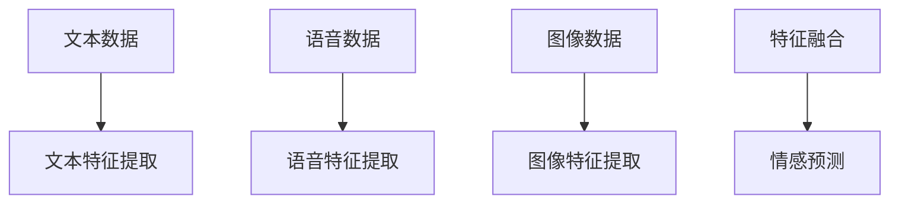
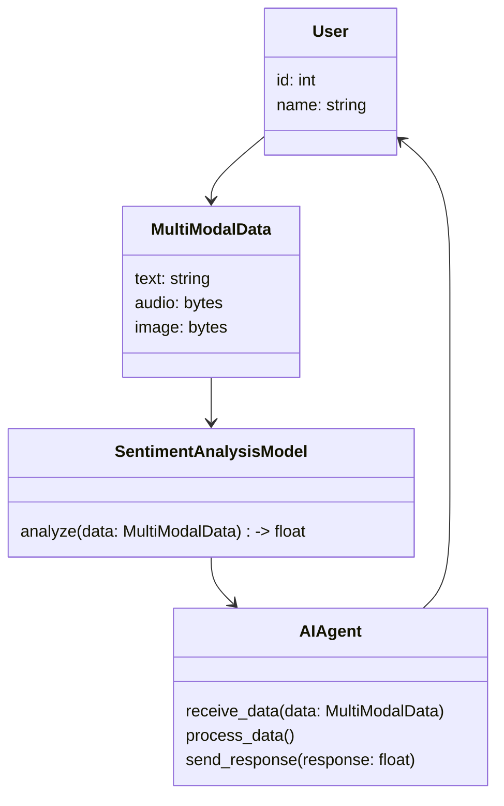
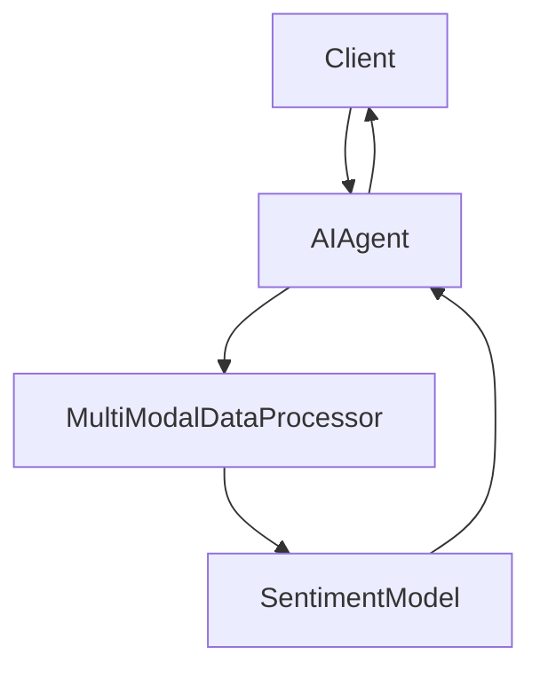

                 


```markdown
# AI Agent的实时多模态情感分析

## 关键词：AI Agent, 多模态情感分析, 实时性, 深度学习, 自然语言处理

## 摘要：本文详细探讨了AI Agent在实时多模态情感分析中的应用，分析了多模态数据处理的核心原理，结合深度学习算法，通过Mermaid图和Python代码展示了系统设计与实现。文章还提供了项目实战和优化建议，帮助读者全面掌握AI Agent的情感分析技术。

---

# 第1章: AI Agent与实时多模态情感分析概述

## 1.1 问题背景与描述
### 1.1.1 情感分析的定义与重要性
- 情感分析是通过计算机技术分析文本中的情感倾向，帮助企业进行客户情绪监控和市场分析。
- 在实时场景中，快速准确的情感分析对客户服务和决策至关重要。

### 1.1.2 多模态数据的特点与挑战
- 多模态数据包括文本、语音、图像等多种类型，增加了数据处理的复杂性。
- 实时处理需要高效的数据融合和快速响应机制。

### 1.1.3 AI Agent在情感分析中的作用
- AI Agent能够实时接收、处理和分析多模态数据，提供情感反馈和决策支持。

## 1.2 核心概念与作用
### 1.2.1 多模态数据处理
- 需要同时处理文本、语音和图像数据，提取多种情感特征。

### 1.2.2 实时性要求
- 系统必须在极短时间内完成数据处理和分析，确保实时反馈。

### 1.2.3 AI Agent的设计原则
- 强调模块化设计，确保各模块协同工作，提升处理效率。

## 1.3 问题解决与边界
### 1.3.1 情感分析的主要问题
- 数据噪声、情感极性判定、多模态数据融合等挑战。

### 1.3.2 多模态数据处理的边界
- 数据量限制、处理延迟、计算资源分配等问题。

### 1.3.3 实时性对系统性能的要求
- CPU/GPU资源分配、内存管理、算法优化等技术要点。

## 1.4 概念结构与核心要素
### 1.4.1 情感分析的三要素
- 数据输入、分析模型、结果输出。

### 1.4.2 多模态数据的整合方式
- 并行处理、特征融合、联合建模等方法。

### 1.4.3 AI Agent的决策机制
- 基于情感分析结果进行决策，提供反馈和自适应学习。

---

# 第2章: 多模态情感分析的核心原理

## 2.1 多模态数据处理原理
### 2.1.1 文本、语音、图像的数据特征
- 文本的语义特征，语音的语调特征，图像的表情特征。

### 2.1.2 多模态数据融合方法
- 特征级融合、决策级融合和混合融合策略。

### 2.1.3 数据预处理与标准化
- 数据清洗、特征提取、数据增强等技术。

## 2.2 实时分析的算法优化
### 2.2.1 算法的实时性优化
- 减少计算复杂度、优化数据流处理流程。

### 2.2.2 并行计算与分布式处理
- 利用多核处理器和分布式计算框架提升处理速度。

### 2.2.3 模型轻量化与剪枝技术
- 通过模型压缩和参数优化降低计算开销。

## 2.3 AI Agent的决策机制
### 2.3.1 基于情感分析的决策树构建
- 构建决策树模型，根据情感倾向进行决策。

### 2.3.2 情感倾向对AI Agent行为的影响
- 根据情感强度调整响应策略。

### 2.3.3 反馈机制与自适应学习
- 基于用户反馈优化情感分析模型。

## 2.4 核心概念对比与ER实体关系图
### 2.4.1 多模态数据与单模态数据的对比
- 数据类型、特征维度、处理难度等方面的对比。

### 2.4.2 实时性与非实时性的情感分析对比
- 处理速度、资源消耗、应用场景的差异。

### 2.4.3 ER实体关系图展示
```mermaid
er
actor: 用户
model: 情感分析模型
data: 多模态数据
agent: AI Agent
actor --> data
data --> model
model --> agent
agent --> actor
```

---

# 第3章: 算法原理与实现

## 3.1 多模态数据融合算法
### 3.1.1 多模态融合模型
- 使用深度学习模型如Transformer进行多模态特征融合。

### 3.1.2 模型流程图


### 3.1.3 Python代码实现
```python
import numpy as np
from tensorflow.keras.models import Model
from tensorflow.keras.layers import Input, Dense

# 输入层
input_text = Input(shape=(100,))
input_audio = Input(shape=(100,))
input_image = Input(shape=(100,))

# 特征提取层
text_features = Dense(50, activation='relu')(input_text)
audio_features = Dense(50, activation='relu')(input_audio)
image_features = Dense(50, activation='relu')(input_image)

# 特征融合层
features = Concatenate()([text_features, audio_features, image_features])
dense_layer = Dense(10, activation='relu')(features)
output_layer = Dense(1, activation='sigmoid')(dense_layer)

# 定义模型
model = Model(inputs=[input_text, input_audio, input_image], outputs=output_layer)
model.compile(optimizer='adam', loss='binary_crossentropy', metrics=['accuracy'])
```

## 3.2 实时计算优化
### 3.2.1 并行计算优化
- 使用多线程或多进程处理不同数据流。

### 3.2.2 算法优化策略
- 剪枝技术、低精度计算、模型量化等方法。

### 3.2.3 优化后的模型性能对比
- 对比优化前后的处理速度和准确率变化。

---

# 第4章: 系统分析与架构设计

## 4.1 问题场景介绍
### 4.1.1 情感分析系统应用场景
- 在线客服、智能音箱、情感陪护机器人等。

## 4.2 系统功能设计
### 4.2.1 领域模型类图


### 4.2.2 系统架构图


### 4.2.3 接口设计
- 数据输入接口、模型调用接口、结果反馈接口。

### 4.2.4 交互设计
- 用户输入、系统处理、系统反馈的交互流程。

---

# 第5章: 项目实战与案例分析

## 5.1 环境安装与配置
### 5.1.1 安装依赖
```bash
pip install numpy tensorflow keras
```

### 5.1.2 环境配置
- 设置GPU加速、多线程处理等。

## 5.2 核心代码实现
### 5.2.1 数据预处理
```python
import numpy as np

def preprocess_data(data):
    # 文本处理
    text = data['text'].lower()
    # 语音处理
    audio = data['audio'] / 1000
    # 图像处理
    image = data['image'] / 255
    return text, audio, image
```

### 5.2.2 模型训练
```python
model.fit([text, audio, image], labels, epochs=10, batch_size=32)
```

## 5.3 案例分析
### 5.3.1 情感分析案例
- 输入文本、语音和图像数据，模型输出情感倾向。

### 5.3.2 系统性能测试
- 测试实时处理速度和准确率。

## 5.4 项目总结
- 成功实现AI Agent的实时多模态情感分析系统。

---

# 第6章: 最佳实践与优化建议

## 6.1 优化建议
### 6.1.1 算法优化
- 使用更高效的模型结构，如Transformer变体。

### 6.1.2 系统优化
- 优化数据流处理，减少资源消耗。

## 6.2 小结
- 总结全文内容，强调关键点。

## 6.3 注意事项
- 数据隐私保护、模型泛化能力等。

## 6.4 拓展阅读
- 推荐相关书籍和论文。

---

# 作者：AI天才研究院/AI Genius Institute & 禅与计算机程序设计艺术 /Zen And The Art of Computer Programming
```

