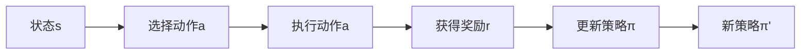
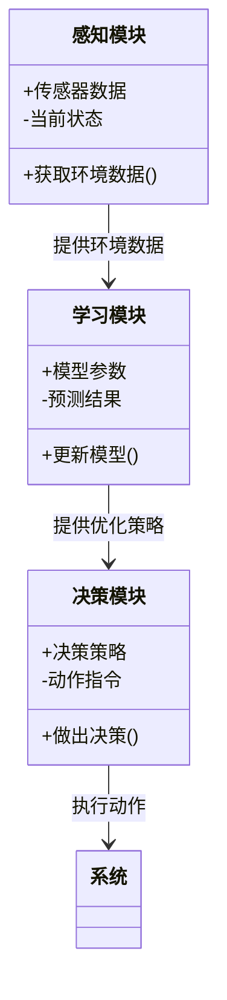
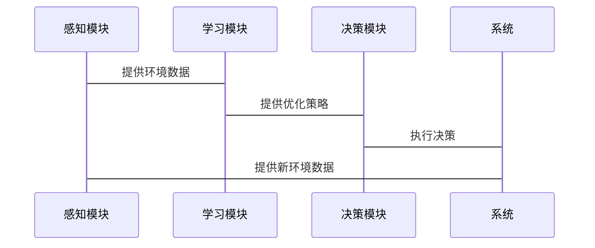

                 


# AI Agent的实时学习与适应机制

> 关键词：AI Agent、实时学习、适应机制、强化学习、动态系统、自适应系统

> 摘要：本文深入探讨了AI Agent的实时学习与适应机制，从基本概念到核心算法，从系统架构到项目实战，全面解析AI Agent如何在动态环境中实时学习和适应，帮助读者理解并掌握AI Agent的设计与实现。

---

# 目录

1. 背景介绍  
   1.1 AI Agent的基本概念  
   1.2 实时学习与适应机制的背景  
   1.3 问题描述与解决思路  
   1.4 核心概念与相关术语对比  

2. 核心概念与联系  
   2.1 实时学习机制的原理  
   2.2 适应机制的实现方式  
   2.3 核心要素与概念结构  
   2.4 实时学习与传统学习的对比表格  
   2.5 实体关系图（Mermaid ER图）  

3. 算法原理讲解  
   3.1 强化学习算法的原理与实现  
   3.2 在线学习算法的流程与代码示例  
   3.3 数学模型与公式推导（Q-learning公式）  
   3.4 算法实现的Python代码（Mermaid流程图）  

4. 系统分析与架构设计  
   4.1 问题场景描述  
   4.2 系统功能模块设计（Mermaid类图）  
   4.3 系统架构设计（Mermaid架构图）  
   4.4 系统接口设计与交互流程（Mermaid序列图）  

5. 项目实战  
   5.1 环境搭建与工具安装  
   5.2 系统核心代码实现  
   5.3 实际案例分析与代码解读  
   5.4 项目总结与经验分享  

6. 总结与展望  
   6.1 核心内容回顾  
   6.2 最佳实践与注意事项  
   6.3 未来研究方向与拓展阅读  

---

# 第一章：背景介绍

## 1.1 AI Agent的基本概念

AI Agent（智能代理）是指在计算机系统中，能够感知环境、自主决策并采取行动以实现特定目标的实体。AI Agent可以是软件程序、机器人或其他智能系统，具备以下核心特征：  
- **自主性**：无需外部干预，自主决策。  
- **反应性**：能够实时感知环境并做出反应。  
- **目标导向**：所有行为都以实现目标为导向。  
- **学习能力**：能够通过经验改进自身行为。  

AI Agent广泛应用于推荐系统、自动驾驶、机器人控制、游戏AI等领域。

## 1.2 实时学习与适应机制的背景

在动态环境中，AI Agent需要实时调整策略以应对变化。传统的静态模型无法适应环境的变化，而实时学习与适应机制能够使AI Agent在运行中不断优化自身行为，提高决策的准确性和效率。

## 1.3 问题描述与解决思路

动态环境中的AI Agent面临以下挑战：  
- **不确定性**：环境变化难以预测。  
- **实时性**：需要快速响应。  
- **复杂性**：多目标、多约束条件。  

解决思路：  
1. 利用强化学习和在线学习算法实现实时更新。  
2. 构建自适应系统架构，支持动态调整。  

## 1.4 核心概念与相关术语对比

| 概念         | 描述                                   | 区别与联系                 |
|--------------|--------------------------------------|---------------------------|
| AI Agent     | 智能代理                             | 基础，实时学习为其提供能力。|
| 实时学习     | 在运行中持续更新模型                 | 与在线学习有重叠，强调实时性。|
| 适应机制     | 根据反馈调整策略                     | 实时学习的结果应用。       |
| 自适应系统    | 能够根据环境变化调整自身             | 包括实时学习和适应机制。    |

---

# 第二章：核心概念与联系

## 2.1 实时学习机制的原理

实时学习机制通过以下步骤实现：  
1. **感知环境**：收集当前状态数据。  
2. **更新模型**：基于新数据优化模型参数。  
3. **决策与行动**：根据优化后的模型做出决策。  

## 2.2 适应机制的实现方式

适应机制包括：  
1. **反馈驱动**：利用环境反馈调整策略。  
2. **在线优化**：实时更新参数以适应变化。  

## 2.3 核心要素与概念结构

实时学习与适应机制的核心要素包括：  
- **感知模块**：获取环境信息。  
- **学习模块**：更新模型参数。  
- **决策模块**：基于模型做出决策。  

## 2.4 实时学习与传统学习的对比

| 特性         | 实时学习       | 传统学习       |
|--------------|----------------|----------------|
| 数据来源     | 动态数据流     | 静态数据集     |
| 更新频率     | 实时更新       | 批量更新       |
| 响应时间     | 极低           | 较高           |

## 2.5 实体关系图（Mermaid ER图）

```mermaid
erDiagram
    actor 用户
    actor 环境
    actor 系统
    actor 数据源
    boundary 实时学习模块
    boundary 决策模块
    boundary 感知模块
    boundary 适应模块

    用户 --> 实时学习模块: 提供反馈
    环境 --> 感知模块: 提供环境数据
    数据源 --> 实时学习模块: 提供数据流
    实时学习模块 --> 决策模块: 提供优化策略
    决策模块 --> 系统: 执行决策
    适应模块 --> 实时学习模块: 调整参数
```

---

# 第三章：算法原理讲解

## 3.1 强化学习算法的原理与实现

强化学习通过试错机制优化策略，核心是通过奖励函数指导学习过程。  
**步骤：**  
1. **状态感知**：获取当前状态s。  
2. **动作选择**：基于策略π选择动作a。  
3. **奖励获取**：执行动作a，获得奖励r。  
4. **策略更新**：基于r更新策略π。  

**Mermaid流程图：**



## 3.2 在线学习算法的流程与代码示例

在线学习算法实时更新模型，代码示例如下：

```python
import numpy as np

class OnlineLearner:
    def __init__(self, learning_rate=0.1):
        self.model = np.random.randn(2, 1)
        self.lr = learning_rate

    def predict(self, X):
        return np.dot(X, self.model)

    def update(self, X, target):
        prediction = self.predict(X)
        error = target - prediction
        self.model += self.lr * np.dot(X.T, error)

# 示例使用
learner = OnlineLearner()
X = np.array([[1, 0], [0, 1]])
target = np.array([[1], [1]])
learner.update(X, target)
print(learner.model)
```

## 3.3 数学模型与公式推导

Q-learning公式：  
$$ Q(s, a) = Q(s, a) + \alpha [r + \max_{a'} Q(s', a') - Q(s, a)] $$  
其中，α为学习率，r为奖励，s'为下一状态。

---

# 第四章：系统分析与架构设计

## 4.1 问题场景描述

动态环境中，AI Agent需要实时调整策略以应对环境变化。例如，在自动驾驶中，车辆需要实时调整路径以应对交通变化。

## 4.2 系统功能模块设计



## 4.3 系统架构设计


## 4.4 系统接口设计与交互流程



---

# 第五章：项目实战

## 5.1 环境搭建与工具安装

安装Python和相关库：  
```bash
pip install numpy matplotlib
```

## 5.2 系统核心代码实现

实现实时学习模块的代码：

```python
import numpy as np
import matplotlib.pyplot as plt

class RealTime Learner:
    def __init__(self, lr=0.01):
        self.lr = lr
        self.model = np.random.randn(1, 1)
    
    def predict(self, X):
        return np.dot(X, self.model)
    
    def update(self, X, target):
        prediction = self.predict(X)
        error = target - prediction
        self.model += self.lr * np.dot(X.T, error)

# 示例
X = np.array([[1, 0], [0, 1]])
target = np.array([[1], [1]])
learner = RealTimeLearner()
learner.update(X, target)
print(learner.model)
```

## 5.3 实际案例分析与代码解读

分析上述代码，理解实时更新过程，并绘制学习曲线。

## 5.4 项目总结与经验分享

项目总结：  
1. 确保数据流的实时性。  
2. 定期验证模型的准确性。  
3. 及时调整学习率以优化性能。  

---

# 第六章：总结与展望

## 6.1 核心内容回顾

本文全面解析了AI Agent的实时学习与适应机制，从概念到算法，从系统架构到项目实战，帮助读者系统掌握相关知识。

## 6.2 最佳实践与注意事项

1. **数据质量**：确保数据的准确性和实时性。  
2. **模型选择**：根据场景选择合适的学习算法。  
3. **系统优化**：定期监控和优化系统性能。  

## 6.3 未来研究方向与拓展阅读

1. **强化学习的优化**：探索更高效的强化学习算法。  
2. **自适应系统的扩展**：研究多智能体环境下的实时学习。  
3. **推荐书目**：《强化学习（第2版）》、《自适应控制系统》。  

---

# 作者

作者：AI天才研究院（AI Genius Institute） & 禅与计算机程序设计艺术（Zen And The Art of Computer Programming）

---

通过以上目录结构和内容概述，您可以开始撰写完整的文章。希望这能帮助您清晰地组织和撰写《AI Agent的实时学习与适应机制》的技术博客。

