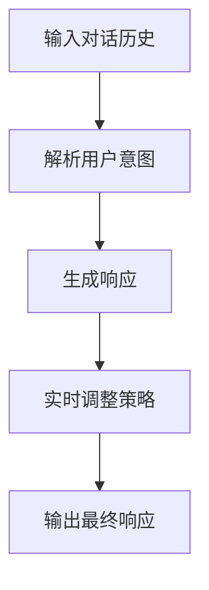
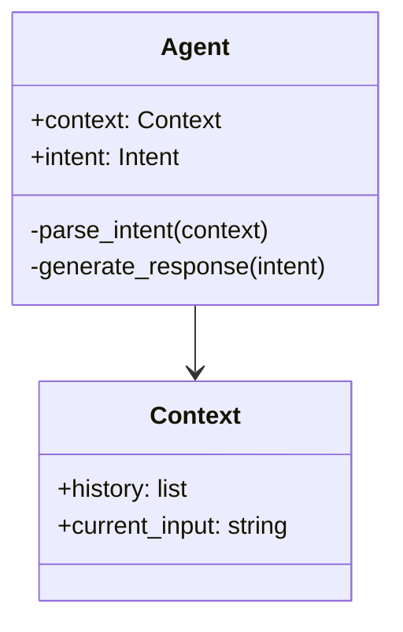
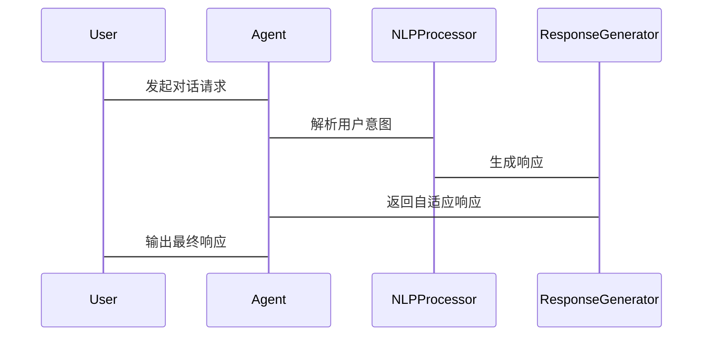

                 


# AI Agent的实时自适应对话管理系统

> 关键词：AI Agent、实时对话管理、自适应系统、多轮对话、自然语言处理

> 摘要：本文详细探讨了AI Agent在实时自适应对话管理中的应用，分析了其核心概念、算法原理、系统架构及实际案例，旨在为读者提供全面的技术解读。

---

## 第一部分：AI Agent的实时自适应对话管理背景介绍

### 第1章：问题背景与描述

#### 1.1 问题背景
- **当前对话系统面临的挑战**：传统对话系统在实时性和自适应性方面存在不足，难以应对复杂多变的用户需求。
- **AI Agent的作用**：AI Agent通过自主学习和决策，能够实时调整对话策略，提升用户体验。
- **实时自适应对话管理的需求**：在快节奏的交互环境中，系统需要快速响应并根据上下文动态调整对话内容。

#### 1.2 问题描述
- **实时性要求**：对话系统需要在毫秒级响应用户输入。
- **自适应定义**：系统能够根据用户反馈实时调整对话策略。
- **核心问题**：如何在多轮对话中保持上下文一致性并实时优化响应。

#### 1.3 问题解决与边界
- **解决方案**：采用机器学习模型实时解析用户意图并生成响应。
- **边界与外延**：限定于文本对话场景，不考虑语音或视频交互。
- **核心要素**：包括意图识别、上下文管理、实时反馈机制。

---

## 第二部分：AI Agent的核心概念与联系

### 第2章：核心概念与联系

#### 2.1 核心概念原理
- **AI Agent**：具备自主决策和学习能力，能够处理复杂任务。
- **实时自适应对话管理**：通过动态调整策略，确保对话流畅。
- **多轮对话**：依赖上下文理解和生成，保持对话连贯性。

#### 2.2 概念属性特征对比
| 概念       | 属性       | 特征                           |
|------------|------------|--------------------------------|
| AI Agent   | 智能性     | 自主决策、持续学习             |
| 对话系统   | 实时性     | 毫秒级响应、动态调整           |
| 多轮对话   | 上下文性   | 关联性、情感识别               |

#### 2.3 ER实体关系图
```mermaid
er
  actor(Agent, User)
  role(Agent, "处理对话请求")
  role(User, "发起对话请求")
  relationship(Request, "通过对话进行交互")
```

---

## 第三部分：算法原理与流程

### 第3章：算法原理与流程

#### 3.1 算法概述
- **输入**：对话历史、当前输入。
- **处理流程**：解析意图、生成响应、实时调整策略。
- **输出**：自适应的对话响应。

#### 3.2 算法流程图


#### 3.3 算法实现代码
```python
def adaptive_dialogue_management(context):
    # 解析用户意图
    intent = parse_intent(context)
    # 生成响应
    response = generate_response(intent)
    # 实时调整策略
    updated_context = update_context(context, response)
    return response, updated_context
```

---

## 第四部分：数学模型与公式

### 第4章：数学模型与公式

#### 4.1 对话评分模型
$$ score = \sum_{i=1}^{n} w_i \cdot f_i(x_i) $$

其中，$w_i$ 是权重，$f_i(x_i)$ 是特征函数。

#### 4.2 损失函数
$$ L = -\sum_{i=1}^{m} \log(p(y_i|x_i)) $$

#### 4.3 优化算法
$$ \theta = \theta - \eta \cdot \frac{\partial L}{\partial \theta} $$

---

## 第五部分：系统架构与设计

### 第5章：系统架构设计

#### 5.1 问题场景介绍
- **场景描述**：实时对话环境中，AI Agent需要快速响应用户输入。
- **系统功能设计**：包括意图识别、上下文管理、实时反馈机制。

#### 5.2 领域模型类图


#### 5.3 系统架构图


#### 5.4 系统接口与交互


---

## 第六部分：项目实战

### 第6章：项目实战

#### 6.1 环境安装
- **工具**：Python 3.8+、TensorFlow 2.0+、Flask。

#### 6.2 核心代码实现
```python
def parse_intent(context):
    # 使用预训练模型解析用户意图
    pass

def generate_response(intent):
    # 根据意图生成响应
    pass

def update_context(context, response):
    # 更新上下文
    pass
```

#### 6.3 案例分析
- **案例**：用户输入“我需要帮助”，系统生成响应并实时调整策略。

---

## 第七部分：最佳实践与小结

### 第7章：最佳实践

#### 7.1 关键点总结
- **实时性**：确保毫秒级响应。
- **自适应性**：动态调整对话策略。
- **上下文管理**：保持对话连贯性。

#### 7.2 注意事项
- 避免过度优化，保持代码简洁。
- 定期更新模型，提升准确率。

#### 7.3 拓展阅读
- 推荐书籍：《深度学习》、《自然语言处理实战》。

---

## 小结

本文详细探讨了AI Agent在实时自适应对话管理中的应用，通过核心概念、算法原理、系统架构及实际案例的分析，为读者提供了全面的技术解读。AI Agent通过自主学习和实时调整，显著提升了对话系统的性能和用户体验。

---

作者：AI天才研究院/AI Genius Institute & 禅与计算机程序设计艺术 /Zen And The Art of Computer Programming

