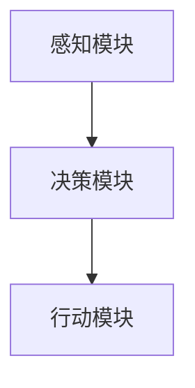
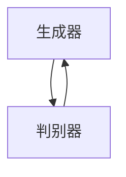
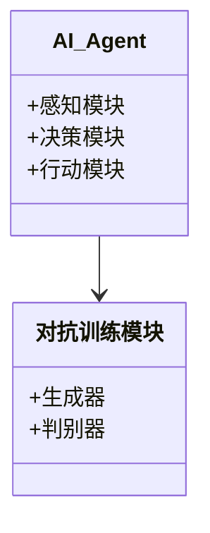

                 


```markdown
# AI Agent的对抗训练：增强LLM的鲁棒性与安全性

> 关键词：AI Agent，对抗训练，大语言模型（LLM），鲁棒性，安全性

> 摘要：本文深入探讨了AI Agent的对抗训练方法，重点分析了如何通过对抗训练来增强大语言模型的鲁棒性和安全性。文章从AI Agent和对抗训练的基本概念出发，结合算法原理、系统设计和项目实战，详细讲解了对抗训练在提升LLM性能中的重要作用，并通过具体案例展示了对抗训练的实际应用。

---

## 第一部分：AI Agent与对抗训练的基础

### 第1章：AI Agent的基本概念

#### 1.1 AI Agent的定义与特点
AI Agent（智能体）是一种能够感知环境、自主决策并采取行动的实体。与传统算法不同，AI Agent具备主动性、目标导向性和适应性。

| **特点**       | **描述**                                                                 |
|----------------|--------------------------------------------------------------------------|
| 主动性         | AI Agent能够主动采取行动，而非被动响应输入。                              |
| 目标导向性     | AI Agent的行为以实现特定目标为导向。                                      |
| 适应性         | 能够根据环境变化调整策略和行为。                                        |

#### 1.2 AI Agent的核心要素
AI Agent由感知模块、决策模块和行动模块组成，这些模块共同协作完成任务。



### 第2章：对抗训练的基本原理

#### 2.1 对抗训练的定义
对抗训练是一种机器学习方法，通过两个模型（生成器和判别器）的对抗过程来优化模型性能。



#### 2.2 对抗训练的核心原理
对抗训练通过最小化生成样本与真实样本的区分难度，迫使生成器生成更逼真的数据。

$$ \text{生成器损失函数} = -\log(D(G(x))) $$
$$ \text{判别器损失函数} = -(\log(D(x)) + \log(1 - D(G(x)))) $$

---

## 第二部分：对抗训练在LLM中的应用

### 第3章：大语言模型的鲁棒性与安全性

#### 3.1 LLM的鲁棒性问题
LLM在面对异常输入时可能出现错误或不安全的输出，对抗训练可增强模型的鲁棒性。

#### 3.2 对抗训练提升LLM安全性
通过设计对抗样本，检测和防御模型的潜在攻击点。

### 第4章：对抗训练的算法实现

#### 4.1 对抗训练的数学模型
在对抗训练中，生成器和判别器通过优化目标函数进行迭代训练。

$$ \min_G \max_D \mathbb{E}_{x}[ \log D(x)] + \mathbb{E}_{z}[ \log (1 - D(G(z)))] $$

#### 4.2 对抗训练的实现步骤
1. 初始化生成器和判别器参数。
2. 训练判别器以区分真实数据和生成数据。
3. 训练生成器以欺骗判别器。
4. 重复步骤2-3，直到模型收敛。

---

## 第三部分：系统分析与架构设计

### 第5章：系统架构设计

#### 5.1 系统功能模块
系统包括数据输入、对抗训练模块和模型评估模块。



#### 5.2 系统交互流程
1. AI Agent接收输入并触发对抗训练模块。
2. 生成器生成对抗样本，判别器进行评估。
3. AI Agent根据判别器的反馈调整策略。

```mermaid
sequenceDiagram
    participant AI_Agent
    participant 对抗训练模块
    AI_Agent -> 对抗训练模块: 触发训练
    对抗训练模块 -> 生成器: 生成样本
    对抗训练模块 -> 判别器: 评估样本
    判别器 --> 生成器: 反馈
    AI_Agent <-- 对抗训练模块: 训练完成
```

---

## 第四部分：项目实战与最佳实践

### 第6章：对抗训练的项目实战

#### 6.1 环境配置
安装必要的库，如TensorFlow、Keras等。

#### 6.2 核心代码实现
实现生成器和判别器的神经网络模型，并进行训练。

```python
import tensorflow as tf
from tensorflow.keras.layers import Dense, Input

# 定义生成器
generator = tf.keras.Sequential([
    Input(shape=(100,)),
    Dense(256, activation='relu'),
    Dense(784, activation='sigmoid')
])

# 定义判别器
discriminator = tf.keras.Sequential([
    Input(shape=(784,)),
    Dense(256, activation='relu'),
    Dense(1, activation='sigmoid')
])

# 定义损失函数
cross_entropy = tf.keras.losses.BinaryCrossentropy()

# 定义优化器
generator_optimizer = tf.keras.optimizers.Adam(0.0002)
discriminator_optimizer = tf.keras.optimizers.Adam(0.0002)

# 训练过程
def train_step(images):
    noise = tf.random.normal([batch_size, 100])
    generated_images = generator(noise)
    
    real_output = discriminator(images)
    generated_output = discriminator(generated_images)
    
    # 计算损失
    gen_loss = cross_entropy(tf.ones_like(generated_output), generated_output)
    disc_loss = cross_entropy(tf.ones_like(real_output), real_output) + cross_entropy(tf.zeros_like(generated_output), generated_output)
    
    # 反向传播
    generator trainable_vars = generator.trainable_weights
    generator_gradients = tape.gradient(gen_loss, generator trainable_vars)
    generator_optimizer.apply_gradients(zip(generator_gradients, generator trainable_vars))
    
    discriminator trainable_vars = discriminator.trainable_weights
    discriminator_gradients = tape.gradient(disc_loss, discriminator trainable_vars)
    discriminator_optimizer.apply_gradients(zip(discriminator_gradients, discriminator trainable_vars))
```

### 第7章：总结与展望

#### 7.1 总结
对抗训练在提升AI Agent的鲁棒性和安全性方面具有显著优势，能够有效防御对抗攻击。

#### 7.2 未来展望
未来的研究方向包括多目标对抗训练、动态对抗训练等，以应对更复杂的挑战。

---

## 作者信息

作者：AI天才研究院/AI Genius Institute & 禅与计算机程序设计艺术 /Zen And The Art of Computer Programming
```

