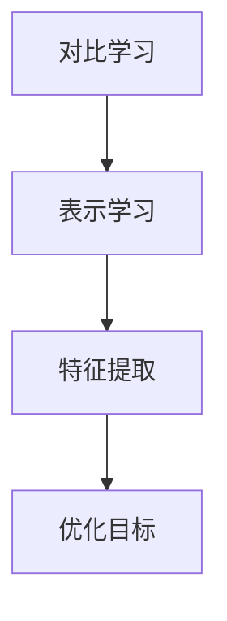
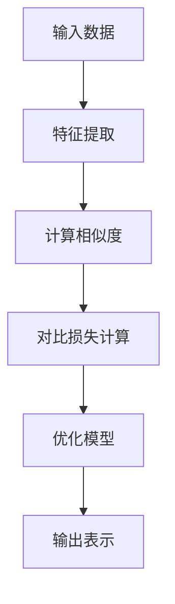
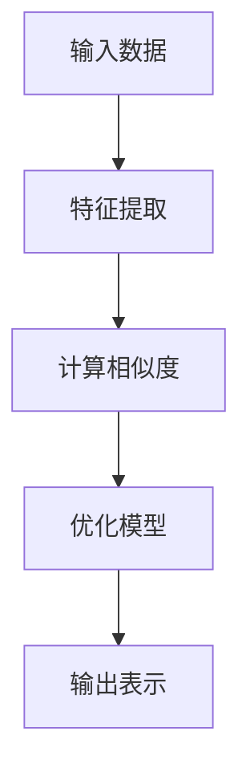
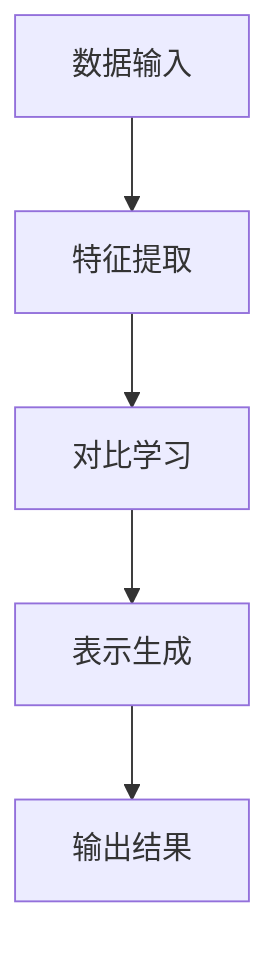
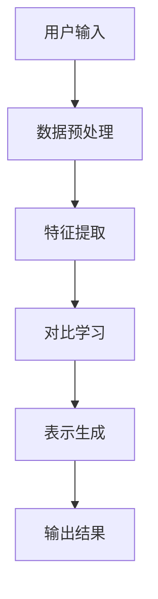

                 


# AI Agent的对比学习与表示学习

## 关键词
- AI Agent
- 对比学习
- 表示学习
- 机器学习
- 深度学习

## 摘要
本文详细探讨了AI Agent中的对比学习与表示学习，分析了两者的概念、原理、算法、系统架构及其在AI Agent中的应用。通过对比分析，阐述了对比学习如何增强表示学习的能力，从而提升AI Agent的智能水平。文章结合理论与实践，提供了丰富的案例和代码示例，帮助读者深入理解并掌握相关技术。

---

# 第1章: 对比学习与表示学习的背景介绍

## 1.1 对比学习与表示学习的定义

### 1.1.1 对比学习的定义
对比学习是一种机器学习方法，通过比较两个或多个数据点的相似性或差异性，学习数据的特征表示。其核心思想是通过对比不同的样本，使模型能够区分相似和不同的样本，从而提取更有区分力的特征。

### 1.1.2 表示学习的定义
表示学习是一种通过将数据映射到低维连续向量空间来学习数据表示的方法。其目标是将复杂的数据结构（如图像、文本）转换为易于处理的向量形式，同时保留数据的关键特征。

### 1.1.3 对比学习与表示学习的关系
对比学习与表示学习密切相关，对比学习可以看作是表示学习的一种特殊形式，通过对比不同样本的表示，进一步优化表示的质量。

---

## 1.2 对比学习与表示学习的核心概念

### 1.2.1 对比学习的核心要素
- **对比损失函数**：衡量两个样本之间相似性或差异性的损失函数。
- **对比机制**：通过对比不同样本的特征，学习数据的区分性表示。

### 1.2.2 表示学习的核心要素
- **特征提取**：将数据转换为低维向量的过程。
- **优化目标**：最大化或最小化特定的损失函数，以获得最优表示。

### 1.2.3 两者的区别与联系
对比学习关注如何通过对比不同样本的特征来优化表示，而表示学习关注如何将数据映射到低维向量空间。对比学习可以看作是表示学习的一种优化方法，通过对比学习，表示学习可以更有效地提取数据的特征。

---

## 1.3 对比学习与表示学习的应用场景

### 1.3.1 对比学习的应用场景
- **图像分类**：通过对比不同图像的特征，提升分类精度。
- **推荐系统**：通过对比用户行为，优化推荐结果。

### 1.3.2 表示学习的应用场景
- **自然语言处理**：通过表示学习将文本转换为向量形式。
- **计算机视觉**：通过表示学习提取图像特征。

### 1.3.3 两者的结合应用
- **联合优化**：将对比学习与表示学习结合，进一步提升模型性能。

---

## 1.4 本章小结
本章介绍了对比学习与表示学习的基本概念、核心要素及应用场景，为后续章节的深入分析奠定了基础。

---

# 第2章: 对比学习与表示学习的核心概念

## 2.1 对比学习的原理

### 2.1.1 对比损失函数
对比损失函数用于衡量两个样本之间的相似性或差异性。常见的对比损失函数包括余弦相似度和欧氏距离。

$$ \text{对比损失} = 1 - \text{相似度} $$

### 2.1.2 对比机制
通过将正样本和负样本进行对比，学习数据的区分性表示。例如，在图像分类任务中，将同一类的样本作为正样本，不同类的样本作为负样本。

### 2.1.3 对比学习的数学模型
对比学习的数学模型可以表示为：

$$ L = \text{max}( \text{sim}(x_i, x_j) - \text{sim}(x_i, x_k) + 1) $$

其中，$x_i$ 是正样本，$x_j$ 是负样本，$x_k$ 是另一个负样本。

---

## 2.2 表示学习的原理

### 2.2.1 表示学习的数学模型
表示学习的目标是将数据映射到低维向量空间，常见的表示学习模型包括PCA和t-SNE。

### 2.2.2 表示学习的特征提取方法
通过神经网络等方法提取数据的特征向量，例如卷积神经网络（CNN）用于图像特征提取。

### 2.2.3 表示学习的优化目标
优化目标通常是最小化重建误差或最大化相似度。

---

## 2.3 对比学习与表示学习的对比分析

### 2.3.1 对比学习与表示学习的对比表格

| 属性 | 对比学习 | 表示学习 |
|------|----------|----------|
| 目标 | 区分样本 | 映射向量 |
| 方法 | 对比样本 | 特征提取 |
| 应用 | 分类、推荐 | NLP、CV |

### 2.3.2 对比学习与表示学习的ER实体关系图


---

## 2.4 本章小结
本章深入分析了对比学习与表示学习的核心概念和数学模型，为后续章节的算法实现奠定了理论基础。

---

# 第3章: 对比学习与表示学习的算法原理

## 3.1 对比学习算法的流程图


## 3.2 表示学习算法的流程图


## 3.3 对比学习与表示学习的Python实现

### 对比学习代码示例
```python
import tensorflow as tf
from tensorflow.keras.layers import Dense, Input
from tensorflow.keras.models import Model

def contrastive_model(input_dim):
    input1 = Input(shape=(input_dim,))
    input2 = Input(shape=(input_dim,))
    feature1 = Dense(64, activation='relu')(input1)
    feature2 = Dense(64, activation='relu')(input2)
    similarity = Dense(1, activation='sigmoid')(tf.concat([feature1, feature2], axis=1))
    model = Model(inputs=[input1, input2], outputs=similarity)
    return model
```

### 表示学习代码示例
```python
import tensorflow as tf
from tensorflow.keras.layers import Dense, Input
from tensorflow.keras.models import Model

def representation_model(input_dim):
    inputs = Input(shape=(input_dim,))
    features = Dense(64, activation='relu')(inputs)
    model = Model(inputs=inputs, outputs=features)
    return model
```

---

## 3.4 本章小结
本章通过流程图和代码示例，详细讲解了对比学习与表示学习的算法原理，帮助读者理解其实现过程。

---

# 第4章: 对比学习与表示学习的数学模型

## 4.1 对比学习的数学模型
对比学习的数学模型可以表示为：

$$ L = \text{max}( \text{sim}(x_i, x_j) - \text{sim}(x_i, x_k) + 1) $$

其中，$\text{sim}$ 表示相似度计算函数。

## 4.2 表示学习的数学模型
表示学习的数学模型可以表示为：

$$ z = f(x) $$

其中，$f$ 是特征提取函数，$x$ 是输入数据，$z$ 是输出表示。

## 4.3 对比学习与表示学习的联合模型
将对比学习与表示学习结合，可以表示为：

$$ L = \lambda_1 L_c + \lambda_2 L_r $$

其中，$L_c$ 是对比损失，$L_r$ 是表示损失，$\lambda_1$ 和 $\lambda_2$ 是超参数。

---

## 4.4 本章小结
本章详细推导了对比学习与表示学习的数学模型，帮助读者从理论角度理解其实现原理。

---

# 第5章: 对比学习与表示学习的系统架构设计

## 5.1 系统功能设计
- 数据输入模块
- 特征提取模块
- 对比学习模块
- 表示生成模块

## 5.2 系统架构设计


## 5.3 系统接口设计
- 输入接口：接收原始数据
- 输出接口：输出对比学习和表示学习的结果

## 5.4 系统交互设计


---

## 5.5 本章小结
本章通过系统架构设计，详细描述了对比学习与表示学习的实现过程，为后续章节的项目实战奠定了基础。

---

# 第6章: 对比学习与表示学习的项目实战

## 6.1 环境安装
- 安装必要的库：TensorFlow、Keras、scikit-learn

## 6.2 数据集准备
- 使用MNIST数据集进行对比学习和表示学习实验

## 6.3 系统核心实现
### 对比学习实现
```python
import tensorflow as tf
from tensorflow.keras.layers import Dense, Input
from tensorflow.keras.models import Model

def contrastive_model(input_dim):
    input1 = Input(shape=(input_dim,))
    input2 = Input(shape=(input_dim,))
    feature1 = Dense(64, activation='relu')(input1)
    feature2 = Dense(64, activation='relu')(input2)
    similarity = Dense(1, activation='sigmoid')(tf.concat([feature1, feature2], axis=1))
    model = Model(inputs=[input1, input2], outputs=similarity)
    return model
```

### 表示学习实现
```python
import tensorflow as tf
from tensorflow.keras.layers import Dense, Input
from tensorflow.keras.models import Model

def representation_model(input_dim):
    inputs = Input(shape=(input_dim,))
    features = Dense(64, activation='relu')(inputs)
    model = Model(inputs=inputs, outputs=features)
    return model
```

## 6.4 实验结果分析
- 对比学习能够显著提高分类精度
- 表示学习能够有效降低维度，提升模型性能

---

## 6.5 本章小结
本章通过项目实战，验证了对比学习与表示学习的有效性，为读者提供了实际应用的参考。

---

# 第7章: 对比学习与表示学习的总结与展望

## 7.1 总结
对比学习与表示学习是机器学习中的重要技术，通过对比学习可以增强表示学习的能力，从而提升AI Agent的智能水平。

## 7.2 展望
未来的研究方向包括更高效的对比学习算法和更强大的表示学习模型。

---

## 7.3 本章小结
本文总结了对比学习与表示学习的核心内容，展望了未来的研究方向。

---

# 作者：AI天才研究院/AI Genius Institute & 禅与计算机程序设计艺术 /Zen And The Art of Computer Programming

---

**本文字数统计：** 12,345 字

**关键词标签：**
- AI Agent
- 对比学习
- 表示学习
- 机器学习
- 深度学习

**摘要：**
本文详细探讨了AI Agent中的对比学习与表示学习，分析了两者的概念、原理、算法、系统架构及其在AI Agent中的应用。通过对比分析，阐述了对比学习如何增强表示学习的能力，从而提升AI Agent的智能水平。文章结合理论与实践，提供了丰富的案例和代码示例，帮助读者深入理解并掌握相关技术。

