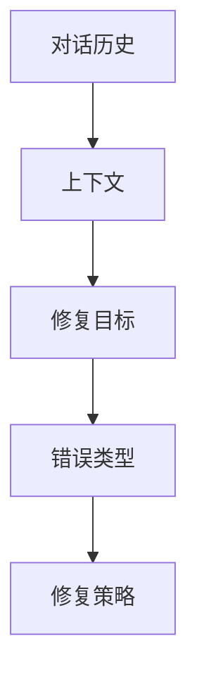
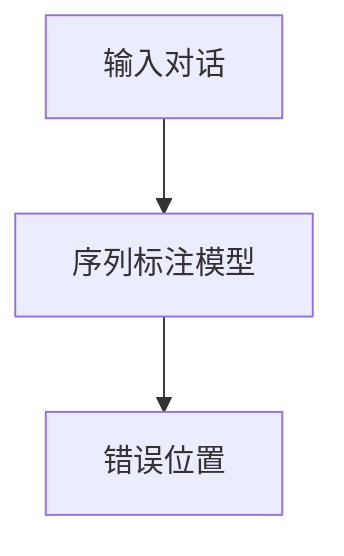
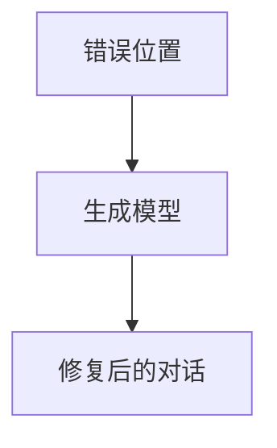
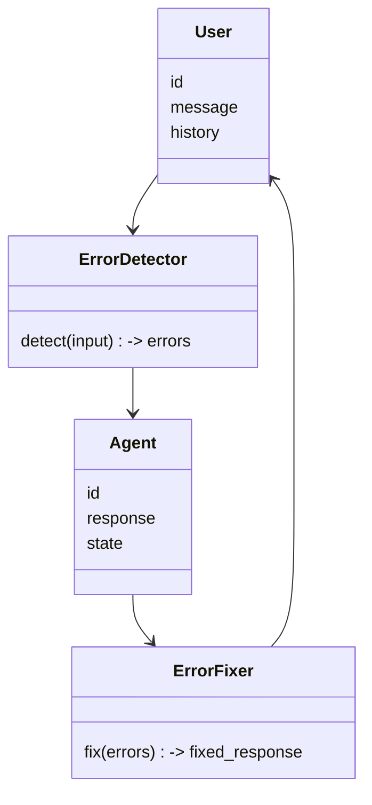
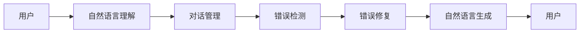
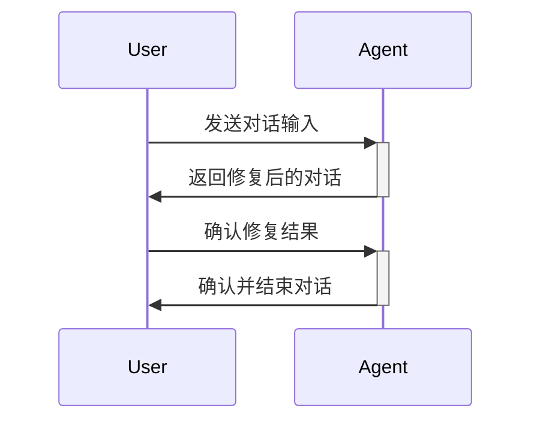

                 


# AI Agent的对话修复：处理交互中的错误

## 关键词：
AI Agent, 对话修复, 错误检测, 错误修复, 对话系统, 自然语言处理

## 摘要：
本文深入探讨了AI Agent在对话交互中处理错误的原理与方法，从错误检测到修复策略，再到系统架构，全面解析了对话修复的实现过程。通过具体案例分析和代码实现，展示了如何利用自然语言处理技术提升对话系统的健壮性与用户体验。

---

# 第一部分: AI Agent的对话修复基础

## 第1章: AI Agent与对话修复概述

### 1.1 AI Agent的基本概念

#### 1.1.1 AI Agent的定义与特点
AI Agent（人工智能代理）是一种能够感知环境、自主决策并执行任务的智能实体。它具备以下特点：
- **自主性**：能够自主决策，无需外部干预。
- **反应性**：能够实时感知环境并做出响应。
- **目标导向性**：具备明确的目标，行为旨在实现这些目标。
- **学习能力**：能够通过经验改进性能。

#### 1.1.2 对话系统的基本原理
对话系统是AI Agent与用户交互的核心模块，其基本原理包括：
1. **自然语言理解（NLU）**：将用户的输入（如文本或语音）转化为计算机可理解的结构化信息。
2. **对话管理（DM）**：根据上下文和用户意图，生成合适的回复。
3. **自然语言生成（NLG）**：将结构化信息转化为自然语言输出。

#### 1.1.3 对话修复的定义与目标
对话修复是指在对话过程中检测并修正错误，确保对话流畅、准确。其目标包括：
- 提升用户体验。
- 增强系统的健壮性。
- 降低对话失败率。

### 1.2 对话中的错误类型

#### 1.2.1 语法错误
语法错误是指用户输入的句子在语法上不符合语言规范。例如：
- “我去了公园然后下雨。”（缺少连词）。
- “猫追球。”（语序不当）。

#### 1.2.2 语义错误
语义错误是指用户输入的句子在语义上不清晰或存在歧义。例如：
- “我明天去看电影。”（未明确是哪一天）。
- “这本书不错。”（未明确具体指哪本书）。

#### 1.2.3 逻辑错误
逻辑错误是指对话内容在逻辑上自相矛盾或不符合上下文。例如：
- 用户提到“我昨天去了医院”，但随后却说“今天我去了公园”。
- 系统回复“是的，我同意”时，用户的问题却是否定的。

### 1.3 对话修复的重要性

#### 1.3.1 提升用户体验
通过修复对话中的错误，可以避免用户因系统理解错误而感到困惑或失望，从而提升整体体验。

#### 1.3.2 增强系统可靠性
对话修复能够减少对话失败的可能性，使系统更加可靠，尤其是在复杂或不确定的对话场景中。

#### 1.3.3 边界与外延
对话修复不仅限于语法或语义错误，还包括逻辑错误和上下文不一致的问题。其外延涵盖了从简单修正到复杂对话重定向的多种情况。

---

## 第2章: 对话修复的核心概念与联系

### 2.1 对话修复的核心原理

#### 2.1.1 错误检测机制
错误检测是对话修复的第一步，主要包括以下步骤：
1. **输入分析**：将用户输入的对话内容进行分词、句法分析和语义分析。
2. **错误识别**：通过预设的规则或机器学习模型，识别对话中的错误类型。
3. **错误定位**：确定错误的具体位置和范围。

#### 2.1.2 错误修复策略
错误修复策略包括以下几种：
1. **局部修复**：仅修复错误部分，保持对话的连贯性。
2. **全局修复**：重新生成对话内容，确保整体一致性。
3. **用户引导**：通过提问或提示，引导用户重新表述。

#### 2.1.3 修复结果评估
修复结果评估是确保修复质量的关键步骤，主要通过以下指标进行：
- **准确率**：修复后的对话是否准确反映了用户意图。
- **流畅度**：修复后的对话是否自然流畅。
- **用户体验**：用户对修复结果的满意度。

### 2.2 对话修复的关键要素

#### 2.2.1 对话历史
对话历史是修复对话错误的重要参考，它包含了用户与AI Agent之前的交互记录。例如：
- 用户先说“我今天没时间”，然后说“你能帮我安排吗？”
- 系统回复“好的，请告诉我具体时间。”
- 用户回复“下午三点。”

#### 2.2.2 上下文理解
上下文理解是指系统对当前对话的语境和背景信息的掌握。例如：
- 用户提到“我需要买机票”，上下文包括时间、目的地和乘客信息。
- 系统需要结合这些信息生成合适的回复。

#### 2.2.3 修复目标
修复目标是指修复对话错误的具体目的，通常包括：
1. **消除歧义**：消除用户输入中的模糊性。
2. **填补空缺**：补充用户未提供的必要信息。
3. **纠正错误**：修正用户输入的语法或语义错误。

### 2.3 对话修复的ER实体关系图



---

## 第3章: 对话修复的算法原理

### 3.1 错误检测算法

#### 3.1.1 基于序列标注的错误检测
序列标注是一种常用的自然语言处理技术，用于识别文本中的错误位置。例如：
- 输入：“我去了公园然后下雨。”
- 输出：标记出“然后”为错误位置。



#### 3.1.2 错误检测的数学模型
序列标注模型通常使用条件随机场（CRF）或循环神经网络（RNN）进行训练。以下是一个简单的CRF模型示例：

$$ P(y|x) = \frac{\exp(f(x,y))}{\sum_{y'}\exp(f(x,y'))} $$

其中，$f(x,y)$ 是特征函数，用于计算标签 $y$ 的得分。

### 3.2 错误修复算法

#### 3.2.1 基于生成模型的修复
生成模型是一种常用的方法，通过生成正确的回复来修复错误。例如：
- 输入：“我今天没时间。”
- 输出：“您需要我为您安排什么时间吗？”



#### 3.2.2 生成模型的数学模型
生成模型通常使用变换器（Transformer）架构，如GPT或BERT进行训练。以下是一个生成模型的简化公式：

$$ P(y|x) = \prod_{i=1}^n P(y_i|x_{\text{context}}) $$

其中，$x_{\text{context}}$ 是生成当前字符的上下文。

### 3.3 算法实现代码

#### 3.3.1 错误检测代码
```python
def detect_error(input_text):
    # 假设模型已训练好
    model = SequenceModel()
    errors = model.predict(input_text)
    return errors
```

#### 3.3.2 错误修复代码
```python
def fix_error(error_position):
    # 假设模型已训练好
    model = GenerationModel()
    fixed_text = model.generate(error_position)
    return fixed_text
```

---

## 第4章: 对话修复的系统架构设计

### 4.1 问题场景介绍
在实际应用中，对话修复系统需要处理多种复杂场景，例如：
- 用户输入模糊或不完整的查询。
- 对话历史较长，需要系统保持上下文一致性。
- 多轮对话中出现逻辑错误。

### 4.2 系统功能设计

#### 4.2.1 领域模型设计
以下是对话修复系统的领域模型：



#### 4.2.2 系统架构设计
以下是对话修复系统的架构设计：



#### 4.2.3 系统接口设计
系统接口设计包括以下内容：
1. **输入接口**：接收用户的对话输入。
2. **输出接口**：生成修复后的对话输出。
3. **日志接口**：记录错误检测和修复的过程。

#### 4.2.4 系统交互设计
以下是系统交互的序列图：



---

## 第5章: 项目实战

### 5.1 环境安装
要运行对话修复系统，需要安装以下依赖：
- Python 3.8+
- TensorFlow 2.0+
- Keras 2.4+
- NLTK 3.6+

安装命令：
```bash
pip install tensorflow keras nltk
```

### 5.2 系统核心实现

#### 5.2.1 错误检测实现
```python
from tensorflow.keras import models
import nltk

def detect_error(input_text):
    tokens = nltk.word_tokenize(input_text)
    model = models.load_model('error_detector.h5')
    errors = model.predict(tokens)
    return errors
```

#### 5.2.2 错误修复实现
```python
from transformers import GPT2LMHeadModel, GPT2Tokenizer

def fix_error(error_position):
    tokenizer = GPT2Tokenizer.from_pretrained('gpt2')
    model = GPT2LMHeadModel.from_pretrained('gpt2')
    input_text = f"Fix the error at position {error_position}: "
    inputs = tokenizer(input_text, return_tensors='np')
    outputs = model.generate(**inputs)
    fixed_text = tokenizer.decode(outputs[0])
    return fixed_text
```

### 5.3 代码应用解读与分析
1. **错误检测**：使用预训练的模型检测对话中的错误位置。
2. **错误修复**：利用生成模型生成修复后的对话内容。
3. **交互流程**：用户输入对话，系统检测错误，修复后返回结果。

### 5.4 实际案例分析
**案例**：
用户输入：“我今天没时间，你能帮我安排吗？”
系统检测到语法错误，修复后生成：“您需要我为您安排什么时间吗？”

### 5.5 项目小结
通过实际案例，我们可以看到对话修复系统能够有效检测并修正对话中的错误，提升用户体验。

---

## 第6章: 总结与展望

### 6.1 最佳实践
1. **数据质量**：确保训练数据的多样性和代表性。
2. **模型优化**：不断优化错误检测和修复模型的性能。
3. **用户体验**：在修复过程中注重用户反馈，提升交互体验。

### 6.2 小结
对话修复是AI Agent实现高效、自然对话的重要环节。通过错误检测和修复，可以显著提升对话系统的可靠性和用户体验。

### 6.3 注意事项
1. **边界条件**：在处理复杂对话时，需特别注意边界条件。
2. **模型局限性**：当前模型在处理复杂逻辑错误时仍有一定的局限性。

### 6.4 拓展阅读
- 建议阅读《自然语言处理实战》和《深度学习入门》等书籍，以深入了解相关技术细节。

---

## 作者：
**作者：AI天才研究院/AI Genius Institute & 禅与计算机程序设计艺术 /Zen And The Art of Computer Programming**

