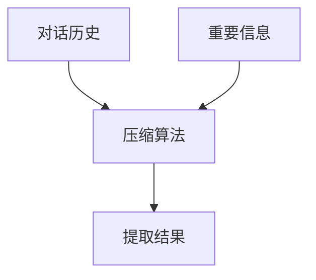
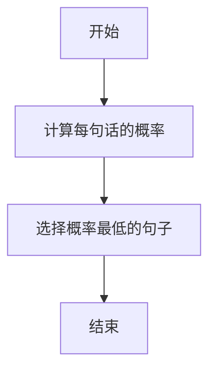
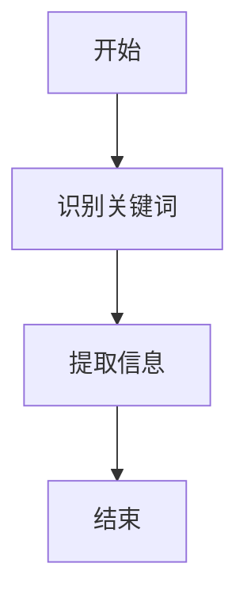
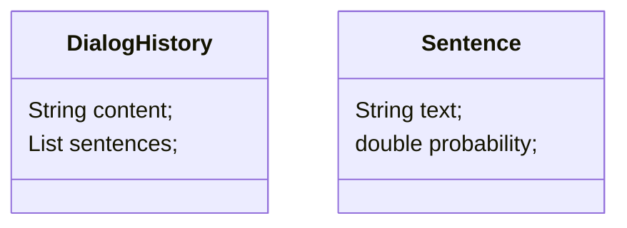
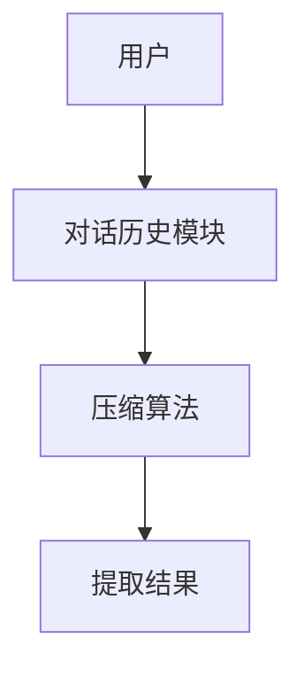

                 


# AI Agent的对话历史压缩与重要信息提取

> 关键词：AI Agent、对话历史、压缩算法、信息提取、自然语言处理、机器学习  
> 摘要：本文探讨了AI Agent在对话历史压缩与重要信息提取中的关键挑战，分析了核心概念和算法原理，提供了系统设计与项目实现的详细指导。

---

# 第一部分: AI Agent的对话历史压缩与重要信息提取背景介绍

## 第1章: 问题背景与描述

### 1.1 问题背景

#### 1.1.1 对话历史压缩的必要性
随着AI Agent的应用场景不断扩大，对话历史的长度也在不断增加。大量的对话数据不仅占用了存储资源，还降低了处理效率。压缩对话历史可以有效减少数据量，提升系统性能。

#### 1.1.2 重要信息提取的挑战
在对话中，只有部分信息对任务是关键的。提取这些信息可以提高AI Agent的决策效率，但如何准确识别这些信息是技术难点。

### 1.2 问题描述

#### 1.2.1 对话数据的膨胀问题
对话数据的快速增长导致存储和计算成本增加，直接影响系统的实时性和响应速度。

#### 1.2.2 信息提取的模糊性
对话中的信息可能涉及多个主题，且语义复杂，如何准确提取关键信息是一个技术难题。

### 1.3 问题解决方法

#### 1.3.1 压缩算法的引入
通过算法对对话历史进行压缩，减少冗余信息。

#### 1.3.2 信息提取的优化策略
利用自然语言处理技术，提取对话中的关键信息。

### 1.4 边界与外延

#### 1.4.1 对话历史的范围界定
对话历史的范围包括所有与当前任务相关的对话内容。

#### 1.4.2 信息提取的适用场景
适用于需要快速决策的任务，如客服系统和智能助手。

### 1.5 概念结构与核心要素

#### 1.5.1 对话历史的组成要素
对话历史由对话内容、时间戳、参与者等要素组成。

#### 1.5.2 重要信息的特征分析
重要信息具有高相关性和高价值性，通常与任务目标直接相关。

---

# 第二部分: 核心概念与联系

## 第2章: 核心概念原理

### 2.1 对话历史压缩算法原理

#### 2.1.1 基于概率的压缩方法
这种方法通过计算每句话的重要性概率来选择保留的关键句子。

#### 2.1.2 基于相似度的压缩策略
通过计算对话内容的相似度，去除冗余信息。

### 2.2 重要信息提取的特征分析

#### 2.2.1 信息的重要性评估
重要性评估基于信息与任务目标的相关性。

#### 2.2.2 信息的相关性判断
相关性判断通过自然语言处理技术实现。

## 第3章: 核心概念对比与联系

### 3.1 对比分析

#### 3.1.1 压缩算法的对比表格
| 算法名称 | 基于概率 | 基于相似度 |
|----------|----------|------------|
| 优点     | 高效性    | 准确性      |
| 缺点     | 可能丢失语境信息 | 计算复杂度高 |

#### 3.1.2 实体关系图


---

# 第三部分: 算法原理讲解

## 第4章: 对话历史压缩算法

### 4.1 基于概率的压缩算法

#### 4.1.1 算法流程图


#### 4.1.2 Python实现代码
```python
def compress_dialogue(dialogue, threshold=0.5):
    compressed = []
    for sentence in dialogue:
        if probability(sentence) > threshold:
            compressed.append(sentence)
    return compressed
```

#### 4.1.3 数学模型
$$ P(sentence) = \frac{\text{出现次数}}{\text{总次数}} $$

---

## 第5章: 重要信息提取算法

### 5.1 基于关键词的信息提取

#### 5.1.1 算法流程图


#### 5.1.2 Python实现代码
```python
def extract_info(dialogue, keywords):
    important_info = []
    for sentence in dialogue:
        if any(keyword in sentence for keyword in keywords):
            important_info.append(sentence)
    return important_info
```

---

# 第四部分: 系统分析与架构设计

## 第6章: 系统分析与架构设计

### 6.1 项目背景

#### 6.1.1 问题场景
AI Agent需要处理大量的对话历史，提取关键信息以辅助决策。

### 6.2 系统功能设计

#### 6.2.1 领域模型


### 6.3 系统架构设计

#### 6.3.1 系统架构图


---

# 第五部分: 项目实战

## 第7章: 项目实战

### 7.1 环境安装

#### 7.1.1 Python环境
安装Python和相关库，如numpy和transformers。

### 7.2 系统核心实现

#### 7.2.1 对话历史压缩实现
```python
def compress_dialogue(dialogue, threshold=0.5):
    compressed = []
    for sentence in dialogue:
        if probability(sentence) > threshold:
            compressed.append(sentence)
    return compressed
```

#### 7.2.2 信息提取实现
```python
def extract_info(dialogue, keywords):
    important_info = []
    for sentence in dialogue:
        if any(keyword in sentence for keyword in keywords):
            important_info.append(sentence)
    return important_info
```

### 7.3 案例分析

#### 7.3.1 实际案例
分析一个客服对话，提取关键问题和解决方案。

### 7.4 项目总结

#### 7.4.1 实践总结
压缩算法和信息提取算法的有效性取决于数据质量和算法参数设置。

---

# 第六部分: 最佳实践和小结

## 第8章: 最佳实践

### 8.1 实践总结

#### 8.1.1 算法选择
根据具体场景选择合适的压缩和提取算法。

#### 8.1.2 参数调整
定期调整算法参数以优化性能。

### 8.2 注意事项

#### 8.2.1 数据预处理
确保数据清洗和预处理的质量。

#### 8.2.2 性能优化
优化算法和系统架构以提高效率。

### 8.3 拓展阅读

#### 8.3.1 相关书籍
《自然语言处理实战》、《机器学习实战》。

---

作者：AI天才研究院 & 禅与计算机程序设计艺术

