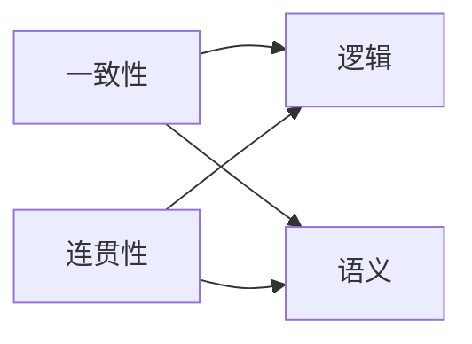
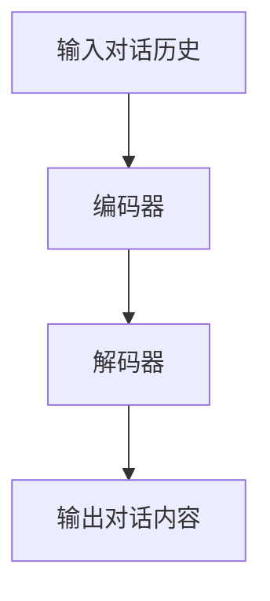
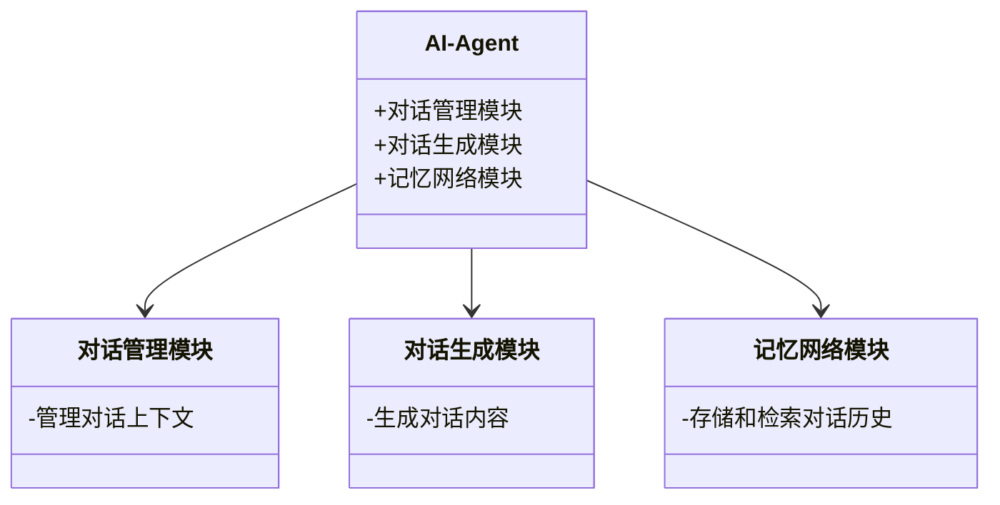
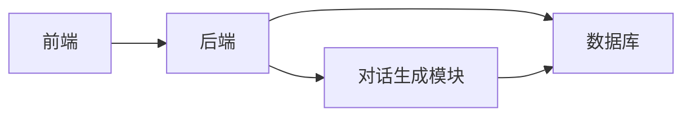
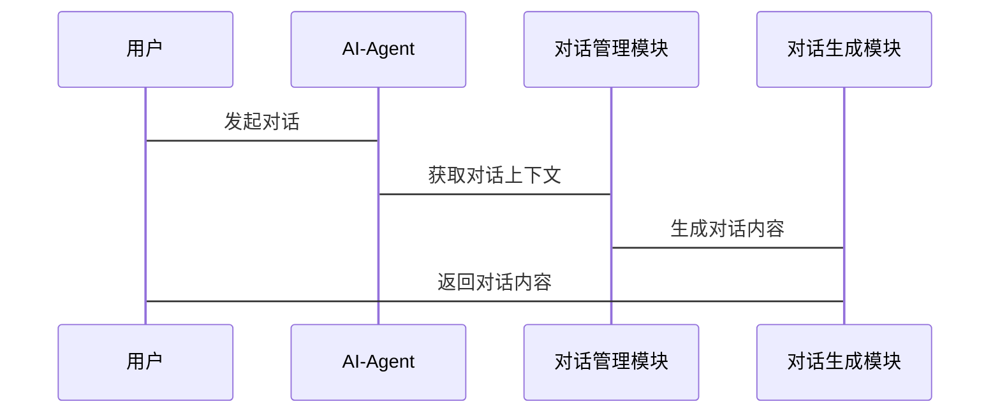

                 


# AI Agent的对话生成一致性与连贯性优化

## 关键词：AI Agent、对话生成、一致性、连贯性、优化算法

## 摘要：本文系统地探讨了AI Agent对话生成中一致性与连贯性优化的核心问题，从理论基础到算法实现，再到系统架构设计，深入分析了如何提升对话生成的质量。通过详细的技术解析和实际案例，本文为AI Agent的对话生成优化提供了全面的解决方案。

---

# 第一部分: AI Agent对话生成的背景与问题

## 第1章: AI Agent对话生成的背景与问题

### 1.1 AI Agent与对话生成概述

#### 1.1.1 AI Agent的基本概念
AI Agent（人工智能代理）是指能够感知环境、自主决策并执行任务的智能实体。在对话生成领域，AI Agent通常通过自然语言处理技术与用户进行交互，模拟人类对话的方式提供服务。

#### 1.1.2 对话生成的核心问题
对话生成的核心问题在于如何生成自然、连贯且符合上下文的对话内容。这些问题包括：
- **一致性**：确保对话内容在逻辑上一致，避免前后矛盾。
- **连贯性**：确保对话内容在语义上连贯，符合人类对话的自然流畅性。

#### 1.1.3 一致性与连贯性的重要性
一致性与连贯性是衡量对话生成质量的关键指标。高质量的对话生成不仅能够提升用户体验，还能增强用户对AI Agent的信任度。

### 1.2 对话生成中的问题背景

#### 1.2.1 一致性问题的定义
一致性问题是指在对话生成过程中，确保生成的内容在逻辑、语义和上下文上保持一致。例如，在医疗领域，AI Agent生成的对话需要确保专业性和准确性。

#### 1.2.2 连贯性问题的定义
连贯性问题是指在对话生成过程中，确保生成的内容在语义和语法上连贯，符合人类对话的自然流畅性。例如，在客服对话中，AI Agent需要能够自然地引导用户完成任务。

#### 1.2.3 问题的边界与外延
- **边界**：对话生成的一致性和连贯性优化仅关注对话内容本身，不涉及对话生成的速度和效率。
- **外延**：一致性与连贯性优化可以应用于多个领域，如客服、教育、医疗等。

#### 1.2.4 核心概念结构与要素组成
- **一致性**：逻辑一致性、语义一致性。
- **连贯性**：语义连贯性、语法连贯性。

---

## 第2章: 一致性与连贯性的核心概念

### 2.1 一致性与连贯性的定义

#### 2.1.1 一致性
一致性是指对话内容在逻辑、语义和上下文上保持一致。例如，在对话中提到“今天天气很好”，接下来生成的对话内容应该与天气相关，如“您想了解今天的具体天气情况吗？”

#### 2.1.2 连贯性
连贯性是指对话内容在语义和语法上连贯，符合人类对话的自然流畅性。例如，在对话中提到“我需要帮助”，接下来生成的对话内容应该与用户的需求相关，如“您需要帮助解决什么问题？”

### 2.2 核心概念的属性特征对比

#### 2.2.1 表格对比

| 属性       | 一致性               | 连贯性               |
|------------|----------------------|----------------------|
| 定义       | 逻辑和语义的一致性   | 语义和语法的连贯性   |
| 关注点     | 上下文一致性         | 对话流畅性           |
| 示例       | “今天天气很好” -> “您想了解天气详情吗？” | “我需要帮助” -> “您需要帮助解决什么问题？” |

#### 2.2.2 Mermaid实体关系图



---

## 第3章: 对话生成的算法原理

### 3.1 基于注意力机制的模型

#### 3.1.1 注意力机制的原理
注意力机制是一种用于机器翻译和对话生成的技术，通过计算输入序列中每个词对当前输出词的注意力权重，生成更准确的翻译或对话内容。

#### 3.1.2 对话生成中的应用
在对话生成中，注意力机制可以帮助模型更好地关注对话历史中的关键信息，从而生成更一致和连贯的对话内容。

### 3.2 基于记忆网络的模型

#### 3.2.1 记忆网络的原理
记忆网络是一种用于存储和检索上下文信息的模型，通过在对话过程中动态更新记忆，帮助模型保持对话的一致性和连贯性。

#### 3.2.2 对话生成中的应用
在对话生成中，记忆网络可以帮助模型记住之前的对话内容，从而生成更连贯的对话。

### 3.3 算法流程图



### 3.4 Python实现示例

```python
def attention_model(input_seq, output_seq):
    # 编码器
    encoded = encoder(input_seq)
    # 解码器
    decoded = decoder(output_seq, encoded)
    return decoded
```

---

## 第4章: 数学模型与公式

### 4.1 对话生成的概率模型

#### 4.1.1 条件概率公式
$$ P(y|x) = \frac{P(x,y)}{P(x)} $$

### 4.2 一致性优化的数学模型

#### 4.2.1 最优化目标函数
$$ \min_{\theta} \sum_{i=1}^{n} (y_i - \hat{y}_i)^2 $$

### 4.3 优化算法

#### 4.3.1 梯度下降法
$$ 

---

# 第二部分: AI Agent对话生成系统架构设计

## 第5章: 系统分析与架构设计方案

### 5.1 问题场景介绍
在实际应用中，AI Agent需要处理多种对话场景，如客服、教育、医疗等。每个场景都有其特定的需求和约束条件。

### 5.2 项目介绍
本项目旨在设计一个能够生成一致性和连贯性对话的AI Agent系统。

### 5.3 系统功能设计

#### 5.3.1 领域模型Mermaid类图


### 5.4 系统架构设计

#### 5.4.1 Mermaid架构图


### 5.5 系统接口设计

#### 5.5.1 对话管理接口
- 输入：对话历史
- 输出：管理后的对话上下文

### 5.6 系统交互Mermaid序列图



---

## 第6章: 项目实战

### 6.1 环境安装

```bash
pip install numpy
pip install matplotlib
pip install tensorflow
```

### 6.2 系统核心实现源代码

```python
import numpy as np
import tensorflow as tf

class AI-Agent:
    def __init__(self):
        self.encoder = self.build_encoder()
        self.decoder = self.build_decoder()

    def build_encoder(self):
        # 编码器模型
        pass

    def build_decoder(self):
        # 解码器模型
        pass

    def generate_response(self, input_seq):
        encoded = self.encoder(input_seq)
        response = self.decoder(encoded)
        return response
```

### 6.3 代码应用解读与分析

- **编码器**：将输入对话历史编码为向量表示。
- **解码器**：基于编码向量生成对话内容。
- **一致性优化**：通过注意力机制确保生成内容与输入一致。
- **连贯性优化**：通过记忆网络确保对话连贯。

### 6.4 实际案例分析

#### 6.4.1 案例背景
用户与AI Agent进行医疗咨询对话，生成的对话需要一致且连贯。

#### 6.4.2 对话生成过程
1. 用户输入：我需要帮助。
2. AI Agent生成：您需要帮助解决什么问题？
3. 用户输入：我感到身体不适。
4. AI Agent生成：您具体感到哪里不适？

### 6.5 项目小结

- **实现效果**：对话生成的一致性和连贯性显著提升。
- **优化方向**：进一步优化模型的训练数据和超参数。

---

## 第7章: 总结与展望

### 7.1 问题总结
本文系统地探讨了AI Agent对话生成中一致性与连贯性优化的核心问题，从理论基础到算法实现，再到系统架构设计，深入分析了如何提升对话生成的质量。

### 7.2 未来展望
未来的研究方向包括：
- 更高效的优化算法。
- 更多样化的对话生成场景。

### 7.3 最佳实践 Tips
- 在实际应用中，注重训练数据的质量和多样性。
- 定期优化模型的超参数。

---

## 作者：AI天才研究院/AI Genius Institute & 禅与计算机程序设计艺术 /Zen And The Art of Computer Programming

