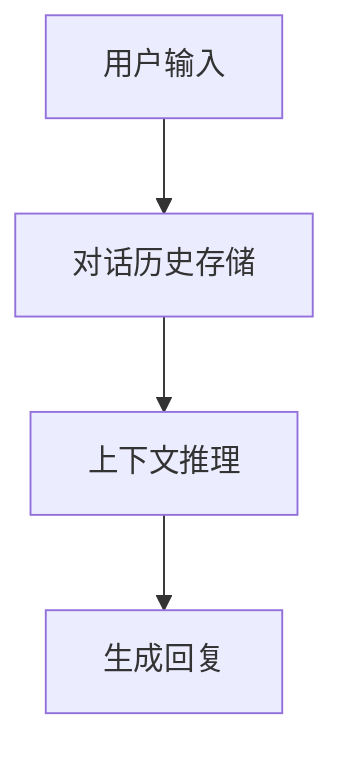
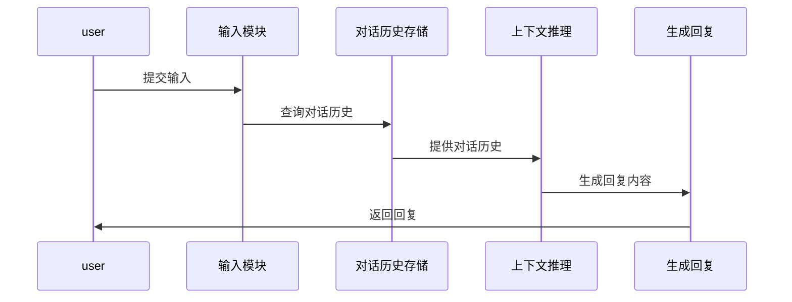

                 


# AI Agent的对话生成的一致性与连贯性优化

> 关键词：AI Agent、对话生成、一致性、连贯性、优化、自然语言处理（NLP）、深度学习

> 摘要：本文深入探讨AI Agent对话生成中一致性和连贯性优化的关键问题，分析对话生成的核心算法原理，提出优化方法，并通过系统架构设计和项目实战案例，展示如何构建高效、一致、连贯的对话生成系统。文章最后总结了最佳实践与未来发展方向。

---

# 第一部分: AI Agent对话生成的基础

## 第1章: AI Agent对话生成的背景与问题

### 1.1 问题背景

#### 1.1.1 对话生成的定义与重要性
对话生成是自然语言处理（NLP）领域的重要任务，旨在让计算机生成符合人类语言习惯的对话。随着AI Agent在智能客服、虚拟助手、智能音箱等领域的广泛应用，对话生成的质量直接影响用户体验。

#### 1.1.2 当前对话生成的挑战
- **一致性问题**：对话内容前后矛盾，例如在前一个句子中提到某个事实，后一个句子却与此矛盾。
- **连贯性问题**：对话内容缺乏逻辑联系，跳跃性大，用户难以理解。
- **知识表示与推理**：对话生成需要依赖外部知识库，如何有效整合知识表示并进行推理是关键。

#### 1.1.3 一致性与连贯性优化的必要性
优化一致性与连贯性是提升对话生成质量的核心，能够显著改善用户体验，增强AI Agent的智能性和可信度。

### 1.2 问题描述

#### 1.2.1 对话生成中的常见问题
- 信息重复或遗漏。
- 对话逻辑混乱，缺乏整体性。
- 对话内容与用户意图不符。

#### 1.2.2 一致性与连贯性问题的具体表现
- **一致性问题**：对话内容自相矛盾，例如在某个问题上给出前后不一致的答案。
- **连贯性问题**：对话内容缺乏逻辑连接，例如在讨论某个话题时突然转向完全不相关的主题。

#### 1.2.3 问题解决的目标与意义
通过优化一致性与连贯性，提升对话生成的质量，使对话更加自然、合理、易于理解。

### 1.3 AI Agent的基本概念

#### 1.3.1 AI Agent的定义
AI Agent是一种智能体，能够感知环境、执行任务并与其他实体进行交互。

#### 1.3.2 对话生成在AI Agent中的作用
对话生成是AI Agent与用户交互的核心功能，直接影响用户的体验和满意度。

#### 1.3.3 一致性与连贯性在对话生成中的核心地位
一致性确保对话内容的逻辑性，连贯性确保对话的流畅性，两者共同保障对话生成的质量。

### 1.4 本章小结
本章介绍了AI Agent对话生成的背景、挑战和优化目标，为后续章节奠定了基础。

---

## 第2章: 对话生成中的关键问题

### 2.1 对话生成的核心问题

#### 2.1.1 一致性问题
- 对话内容必须保持一致，避免前后矛盾。
- 通过语境理解和知识推理实现一致性。

#### 2.1.2 连贯性问题
- 对话内容必须逻辑连贯，前后话题相关。
- 通过上下文记忆和逻辑推理实现连贯性。

#### 2.1.3 知识表示与推理
- 知识表示是对话生成的基础，决定了对话内容的深度和广度。
- 知识推理是对话生成的核心，决定了对话内容的合理性和准确性。

### 2.2 对话生成中的语境管理

#### 2.2.1 语境的定义与作用
- 语境是指对话过程中积累的信息，包括用户意图、历史对话内容等。
- 语境管理是对话生成的关键，决定了对话的连贯性和一致性。

#### 2.2.2 语境在一致性与连贯性中的应用
- 通过语境理解用户意图，确保对话内容一致。
- 通过语境记忆对话历史，确保对话连贯。

#### 2.2.3 语境管理的挑战
- 如何有效表示和存储语境信息。
- 如何在不同对话中合理切换和更新语境。

### 2.3 对话生成中的用户意图理解

#### 2.3.1 用户意图的定义
- 用户意图是指用户希望通过对话实现的目标或需求。

#### 2.3.2 用户意图的理解方法
- 基于关键词匹配的理解方法。
- 基于上下文理解的意图识别方法。

#### 2.3.3 用户意图与对话生成的关系
- 用户意图是对话生成的核心驱动力。
- 对话生成需要根据用户意图生成合理的回复。

### 2.4 本章小结
本章详细分析了对话生成中一致性与连贯性问题的关键因素，包括语境管理和用户意图理解。

---

## 第3章: 对话生成的算法原理

### 3.1 对话生成模型的分类

#### 3.1.1 基于规则的生成模型
- 基于预定义的规则生成对话内容。
- 优点：简单易懂，适合特定场景。
- 缺点：灵活性差，难以应对复杂对话。

#### 3.1.2 基于统计的生成模型
- 基于统计语言模型生成对话内容。
- 优点：能够处理大规模数据，生成多样化的回复。
- 缺点：难以保证一致性与连贯性。

#### 3.1.3 基于深度学习的生成模型
- 使用神经网络模型生成对话内容。
- 优点：能够捕捉对话的复杂模式，生成高质量回复。
- 缺点：需要大量数据和计算资源。

### 3.2 基于深度学习的生成模型

#### 3.2.1 Transformer模型的原理
- Transformer模型由编码器和解码器组成。
- 编码器将输入文本转化为向量表示。
- 解码器根据编码器输出生成目标文本。

#### 3.2.2 解码器的结构与作用
- 解码器负责生成对话回复。
- 使用自注意力机制捕捉上下文信息。

#### 3.2.3 注意力机制在对话生成中的应用
- 注意力机制帮助模型关注重要的上下文信息。
- 在对话生成中，注意力机制可以提升回复的相关性和连贯性。

### 3.3 对话生成中的优化算法

#### 3.3.1 基于奖励的优化方法
- 通过奖励机制优化生成模型的回复质量。
- 奖励函数可以基于多种指标，如一致性、连贯性、语法正确性等。

#### 3.3.2 基于对抗训练的优化方法
- 使用生成对抗网络（GAN）优化对话生成。
- 对抗训练可以提升生成内容的多样性和真实性。

#### 3.3.3 基于强化学习的优化方法
- 使用强化学习算法优化生成模型。
- 强化学习可以通过奖励函数指导模型生成更优的回复。

### 3.4 本章小结
本章分析了对话生成模型的分类及其算法原理，重点介绍了基于深度学习的生成模型及其优化方法。

---

## 第4章: 对话生成的一致性与连贯性优化方法

### 4.1 基于注意力机制的优化方法

#### 4.1.1 注意力机制的改进
- 引入位置编码，增强对上下文位置的感知。
- 使用多头注意力，捕捉不同层次的上下文信息。

#### 4.1.2 注意力机制在一致性优化中的应用
- 通过注意力机制关注对话历史中的关键信息。
- 确保生成的回复与对话历史一致。

#### 4.1.3 注意力机制在连贯性优化中的应用
- 通过注意力机制捕捉对话的主题和逻辑关系。
- 确保生成的回复与当前对话主题连贯。

### 4.2 基于记忆网络的优化方法

#### 4.2.1 记忆网络的原理
- 记忆网络是一种用于存储和推理对话历史的结构。
- 包括编码器和记忆存储器，能够捕捉对话的上下文信息。

#### 4.2.2 记忆网络在一致性优化中的应用
- 使用记忆网络存储对话历史，确保生成的回复一致。
- 通过推理对话历史生成连贯的回复。

#### 4.2.3 记忆网络在连贯性优化中的应用
- 记忆网络能够捕捉对话的主题和逻辑关系。
- 通过推理对话历史生成连贯的回复。

### 4.3 基于强化学习的优化方法

#### 4.3.1 强化学习的基本原理
- 强化学习通过奖励函数优化生成模型的回复质量。
- 通过策略梯度算法更新生成模型的参数。

#### 4.3.2 强化学习在一致性优化中的应用
- 使用一致性指标作为奖励函数。
- 通过强化学习优化生成模型的回复一致性。

#### 4.3.3 强化学习在连贯性优化中的应用
- 使用连贯性指标作为奖励函数。
- 通过强化学习优化生成模型的回复连贯性。

### 4.4 本章小结
本章介绍了几种优化对话生成一致性和连贯性的方法，包括注意力机制、记忆网络和强化学习。

---

## 第5章: 对话生成系统的设计与实现

### 5.1 系统功能设计

#### 5.1.1 对话生成的核心功能
- 用户输入处理。
- 对话历史存储。
- 生成回复。

#### 5.1.2 一致性与连贯性优化功能
- 对话历史分析。
- 上下文推理。
- 回复生成。

### 5.2 系统架构设计

#### 5.2.1 系统架构图


#### 5.2.2 功能模块设计
- 用户输入模块：接收用户输入并解析用户意图。
- 对话历史存储模块：存储对话历史，用于一致性与连贯性优化。
- 上下文推理模块：分析对话历史，生成回复内容。
- 生成回复模块：根据上下文推理结果生成回复。

### 5.3 系统接口设计

#### 5.3.1 系统接口描述
- 用户输入接口：接收用户输入的文本或语音信号。
- 对话历史接口：提供对话历史查询和更新功能。
- 回复生成接口：输出生成的对话回复。

#### 5.3.2 接口交互流程


### 5.4 本章小结
本章详细设计了对话生成系统的核心功能和架构，为后续实现奠定了基础。

---

## 第6章: 对话生成系统的实战实现

### 6.1 环境安装

#### 6.1.1 环境要求
- Python 3.8+
- PyTorch 1.9+
- Transformers库 4.10+

#### 6.1.2 安装依赖
```bash
pip install torch transformers
```

### 6.2 核心代码实现

#### 6.2.1 对话历史存储
```python
class DialogHistory:
    def __init__(self):
        self.history = []
    
    def add(self, message):
        self.history.append(message)
    
    def get(self):
        return self.history
```

#### 6.2.2 上下文推理
```python
class ContextInference:
    def __init__(self, model):
        self.model = model
    
    def infer(self, history):
        # 假设model是一个预训练的对话生成模型
        input_text = " ".join(history)
        return self.model.generate(input_text)
```

#### 6.2.3 生成回复
```python
class DialogGenerator:
    def __init__(self, model):
        self.model = model
    
    def generate_response(self, context):
        input_text = " ".join(context)
        return self.model.generate(input_text)
```

### 6.3 代码解读与分析

#### 6.3.1 对话历史存储模块
- `DialogHistory`类用于存储对话历史。
- `add`方法用于添加新的对话内容。
- `get`方法用于获取对话历史。

#### 6.3.2 上下文推理模块
- `ContextInference`类使用预训练模型进行上下文推理。
- `infer`方法生成回复内容。

#### 6.3.3 生成回复模块
- `DialogGenerator`类负责生成对话回复。
- `generate_response`方法根据上下文生成回复。

### 6.4 案例分析与实现

#### 6.4.1 对话案例
- 用户输入：我今天想了解深度学习的基础知识。
- 对话历史存储：["我今天想了解深度学习的基础知识。"]
- 上下文推理：生成回复内容："深度学习是机器学习的一种，主要是..."

#### 6.4.2 实现步骤
1. 用户提交输入。
2. 对话历史存储模块记录输入。
3. 上下文推理模块生成回复内容。
4. 生成回复模块返回回复。

### 6.5 本章小结
本章通过实际代码实现，展示了对话生成系统的核心功能，包括对话历史存储、上下文推理和生成回复。

---

## 第7章: 最佳实践与未来展望

### 7.1 最佳实践

#### 7.1.1 优化一致性与连贯性的建议
- 使用高质量的预训练模型。
- 结合记忆网络和注意力机制优化一致性与连贯性。

#### 7.1.2 系统设计中的注意事项
- 确保对话历史的有效存储和管理。
- 提供灵活的接口设计，方便扩展和维护。

### 7.2 本章小结
本文总结了优化AI Agent对话生成一致性和连贯性的关键点，并展望了未来的发展方向。

---

## 附录

### 附录A: 工具与资源

#### 附录A.1 常用的对话生成模型
- GPT系列模型。
- Transformer模型。

#### 附录A.2 开源库与框架
- Hugging Face Transformers。
- PyTorch。

---

作者：AI天才研究院/AI Genius Institute & 禅与计算机程序设计艺术 /Zen And The Art of Computer Programming

---

本文通过系统化的分析和实践，深入探讨了AI Agent对话生成中一致性和连贯性优化的关键问题，为构建高效、一致、连贯的对话生成系统提供了理论和实践指导。希望本文能为相关领域的研究和应用提供有价值的参考。

