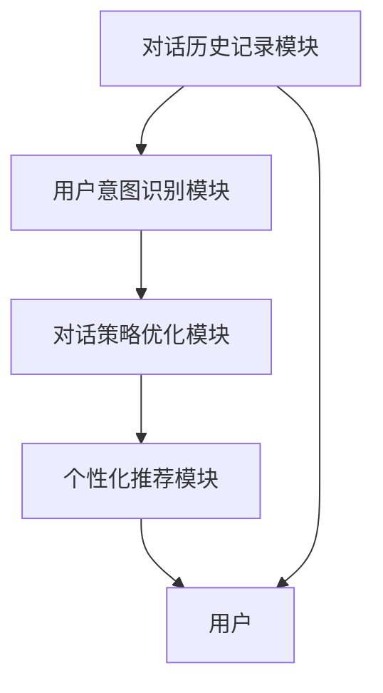

                 


# AI Agent的对话策略优化与个性化

> **关键词**：AI Agent, 对话策略优化, 个性化对话, 强化学习, 系统架构设计, 对话系统, 自然语言处理

> **摘要**：  
本文旨在探讨AI Agent在对话策略优化与个性化方面的核心原理与实现方法。通过分析对话策略优化的必要性及其与个性化对话的关系，结合强化学习算法和系统架构设计，提出了一种高效的对话策略优化与个性化实现方案。文章从背景介绍、核心概念、算法原理、系统架构设计、项目实战等多个维度展开，深入剖析了AI Agent对话策略优化与个性化实现的关键技术，并通过具体案例展示了其实际应用价值。

---

## 第1章: AI Agent的基本概念与背景

### 1.1 AI Agent的定义与特点
AI Agent（人工智能代理）是指能够感知环境、自主决策并执行任务的智能体。AI Agent的特点包括：

- **自主性**：能够在没有外部干预的情况下自主执行任务。
- **反应性**：能够实时感知环境并做出反应。
- **目标导向**：以特定目标为导向，优化决策过程。
- **学习能力**：通过数据和经验不断优化自身的行为。

AI Agent的应用场景广泛，包括智能助手、智能客服、自动驾驶等。

### 1.2 对话策略优化的重要性
对话策略优化是AI Agent实现高效交互的关键。通过优化对话策略，AI Agent能够更好地理解用户需求，提供更精准的回复，从而提升用户体验。具体来说，对话策略优化的目标包括：

- 提高对话的流畅性。
- 增强对话的准确性。
- 降低对话的延迟。

### 1.3 个性化对话的需求与挑战
个性化对话是AI Agent的重要功能之一，旨在根据不同用户的偏好和行为提供定制化的对话体验。然而，个性化对话的实现面临以下挑战：

- **数据多样性**：用户需求和表达方式多样化，需要大量数据支持。
- **实时性要求**：个性化回复需要快速生成，这对计算能力提出了更高的要求。
- **隐私保护**：个性化需要收集和处理用户数据，如何保护用户隐私是一个重要问题。

---

## 第2章: 对话策略优化的核心概念与联系

### 2.1 对话策略优化的原理
对话策略优化的核心在于通过算法不断调整和改进对话策略，以实现更优的对话效果。常见的优化方法包括强化学习和基于规则的策略优化。

- **强化学习**：通过定义奖励函数，AI Agent在与用户的交互过程中不断调整策略，以最大化奖励值。
- **基于规则的策略优化**：通过预定义的规则和模式匹配，优化对话流程。

### 2.2 对话策略优化与个性化的关系
对话策略优化与个性化是相辅相成的。个性化对话需要基于用户的行为和偏好调整对话策略，而对话策略优化则为个性化对话提供了技术支持。

- **协同优化**：通过个性化需求驱动对话策略优化，对话策略优化反过来促进个性化对话的效果。
- **动态调整**：个性化对话需要根据用户的实时反馈动态调整对话策略。

---

## 第3章: 对话策略优化的算法原理

### 3.1 强化学习在对话策略优化中的应用
强化学习是一种通过试错机制优化策略的方法，广泛应用于对话策略优化。其基本流程如下：

1. **状态定义**：定义对话的状态，如用户意图、上下文信息等。
2. **动作选择**：基于当前状态选择一个动作（回复）。
3. **奖励评估**：根据用户反馈评估动作的好坏，调整策略参数。
4. **策略更新**：根据奖励更新策略，优化下一步动作的选择。

**示例代码**：
```python
import numpy as np

# 定义状态空间和动作空间
state_space = 10
action_space = 5

# 初始化策略参数
theta = np.random.randn(state_space, action_space)

# 定义奖励函数
def reward_function(action, state):
    # 简单示例：随机奖励
    return np.random.random() * 0.1 + 0.1

# 强化学习循环
for episode in range(1000):
    state = np.random.randint(state_space)
    action = np.argmax(theta[state])
    reward = reward_function(action, state)
    # 更新策略参数
    theta[state][action] += reward * 0.1
```

### 3.2 对话策略优化的数学模型
对话策略优化的数学模型通常基于概率论和优化理论。以下是一个简单的数学模型示例：

- **状态空间**：$S$，表示所有可能的对话状态。
- **动作空间**：$A$，表示所有可能的回复动作。
- **奖励函数**：$R: S \times A \rightarrow \mathbb{R}$，表示在状态$s$下执行动作$a$得到的奖励。
- **策略函数**：$\pi: S \rightarrow A$，表示在状态$s$下选择动作$a$的概率。

**优化目标**：
$$
\theta^* = \arg\max_{\theta} \mathbb{E}[R]
$$

---

## 第4章: 对话策略优化的系统架构设计

### 4.1 系统功能模块设计
对话策略优化系统通常包括以下几个功能模块：

- **对话历史记录模块**：记录用户与AI Agent的对话历史。
- **用户意图识别模块**：识别用户的意图和需求。
- **对话策略优化模块**：根据历史对话和用户意图优化对话策略。
- **个性化推荐模块**：根据用户偏好推荐个性化回复。

### 4.2 系统架构设计
以下是系统架构的Mermaid图：



### 4.3 接口设计与交互流程
- **接口设计**：系统通过API接口接收用户的输入，返回优化后的回复。
- **交互流程**：用户输入 -> 对话历史记录 -> 用户意图识别 -> 对话策略优化 -> 个性化推荐 -> 返回回复。

---

## 第5章: 项目实战

### 5.1 环境配置
要实现对话策略优化，需要安装以下工具和库：

- Python 3.8+
- NumPy
- TensorFlow
- scikit-learn

### 5.2 核心代码实现
以下是一个简单的对话策略优化代码示例：

```python
import numpy as np
import tensorflow as tf

# 定义对话模型
class DialogModel:
    def __init__(self):
        self.model = self.build_model()
    
    def build_model(self):
        model = tf.keras.Sequential([
            tf.keras.layers.Dense(64, activation='relu'),
            tf.keras.layers.Dense(1, activation='sigmoid')
        ])
        model.compile(optimizer='adam', loss='binary_crossentropy')
        return model
    
    def train(self, states, labels):
        self.model.fit(states, labels, epochs=10, batch_size=32)

# 初始化模型
model = DialogModel()
# 训练数据
states = np.random.random((100, 64))
labels = np.random.random((100, 1))
# 开始训练
model.train(states, labels)
```

### 5.3 案例分析
以智能客服为例，假设用户输入“我的订单在哪里？”。系统通过对话历史记录识别用户的意图是查询订单状态，并通过强化学习优化回复策略，最终返回“您可以在订单详情页查看订单状态。”的回复。

---

## 第6章: 总结与展望

### 6.1 总结
本文详细探讨了AI Agent在对话策略优化与个性化方面的实现方法，从核心概念、算法原理到系统架构设计，给出了全面的技术解读。通过项目实战，展示了如何将理论应用于实际。

### 6.2 小结
对话策略优化是AI Agent实现高效交互的关键，而个性化对话则是提升用户体验的重要手段。通过强化学习和系统架构设计，可以有效优化对话策略，实现个性化的对话体验。

### 6.3 注意事项
- 在实际应用中，需注意数据隐私保护。
- 对话策略优化需要不断迭代和优化。
- 个性化对话的实现需结合具体业务场景。

### 6.4 拓展阅读
- 《Reinforcement Learning: Theory and Algorithms》
- 《Personalized Dialog Systems: A Survey》

---

**作者：AI天才研究院/AI Genius Institute & 禅与计算机程序设计艺术 /Zen And The Art of Computer Programming**

