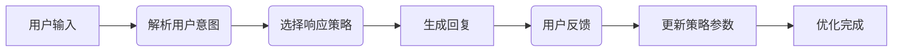
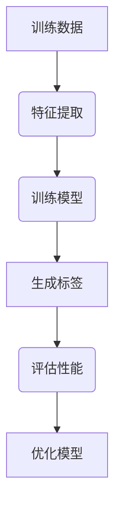
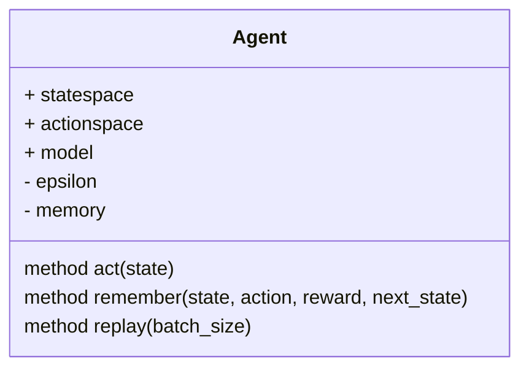
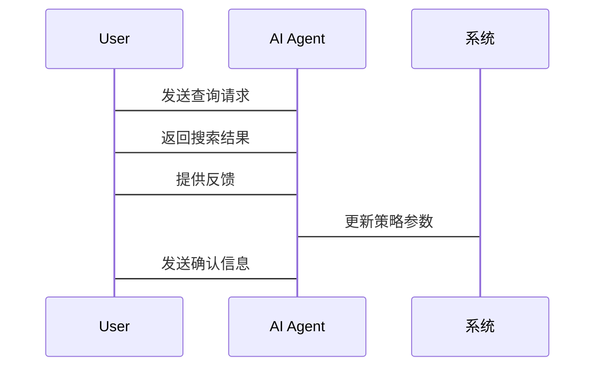

                 


# AI Agent的对话策略优化：提升交互质量和效率

## 关键词：AI Agent，对话策略优化，交互质量，效率提升，强化学习，监督学习

## 摘要

AI Agent作为人工智能领域的重要组成部分，正在广泛应用于各个行业。对话系统作为人与AI Agent交互的主要方式，其质量直接影响用户体验。本文将深入探讨AI Agent对话策略优化的核心概念、算法原理、系统架构，并通过项目实战展示优化方法。通过强化学习和监督学习等算法，结合数学模型，提升对话系统的交互质量和效率，为读者提供系统化的优化方案。

## 第一章：AI Agent的背景与对话策略优化概述

### 1.1 AI Agent的基本概念

AI Agent（人工智能代理）是指能够感知环境并采取行动以实现目标的智能实体。AI Agent可以是软件程序，也可以是机器人，其核心能力包括感知、推理、学习和执行。AI Agent通过与用户的交互，提供各种服务，如信息查询、任务执行等。

### 1.2 对话系统的基本原理

对话系统是AI Agent与用户交互的主要方式，其基本原理包括自然语言处理（NLP）、语音识别和语义理解。对话系统通过解析用户的输入，生成合适的回复，实现有效的交流。对话系统的性能依赖于算法优化和数据质量。

### 1.3 对话策略优化的重要性

对话策略优化是指通过改进算法和模型，提升对话系统的交互质量和效率。优化后的对话系统能够更好地理解用户需求，提供更准确的回答，从而提升用户体验。对话策略优化是实现高效人机交互的关键，具有重要的研究意义。

### 1.4 当前对话系统的主要问题

当前对话系统面临的主要问题包括：理解能力有限，无法处理复杂语义；回复不够自然，缺乏情感共鸣；对话策略单一，难以应对多样化的用户需求。这些问题直接影响用户体验，限制了对话系统的广泛应用。

### 1.5 对话策略优化的目标与意义

对话策略优化的目标是通过改进算法和模型，提升对话系统的交互质量和效率。优化后的对话系统能够更准确地理解用户需求，提供更个性化的服务，从而提高用户满意度和系统效率。对话策略优化的意义在于推动人机交互技术的发展，为AI Agent的应用提供坚实基础。

### 1.6 对话策略优化的挑战与机遇

对话策略优化的挑战主要在于数据质量、算法复杂性和用户需求多样性。同时，深度学习和强化学习等技术的发展为对话策略优化带来了新的机遇，推动了对话系统性能的不断提升。

## 第二章：对话策略优化的核心概念

### 2.1 对话策略优化的核心概念

对话策略优化的核心概念包括：对话策略、策略优化、目标函数。对话策略是指系统在对话过程中采取的行为策略；策略优化是指通过算法改进策略；目标函数是指优化的目标指标。

### 2.2 对话策略优化的核心概念属性对比

| 概念 | 描述 |
|------|------|
| 对话策略 | 系统在对话中的行为策略 |
| 策略优化 | 改进策略的过程 |
| 目标函数 | 优化的目标指标 |

### 2.3 对话策略优化的ER实体关系图

```mermaid
er
actor(AI Agent) -[发起对话]-> message(用户输入)
message -[被处理]-> response(系统回复)
response -[被评估]-> feedback(用户反馈)
feedback -[被整合]-> improved_strategy(优化策略)
```

## 第三章：对话策略优化的算法原理

### 3.1 基于强化学习的对话策略优化



```python
class Agent:
    def __init__(self, statespace, actionspace):
        self.statespace = statespace
        self.actionspace = actionspace
        self.model = self.build_model()

    def build_model(self):
        # 网络结构定义
        pass

    def act(self, state):
        # 选择动作
        pass

    def remember(self, state, action, reward, next_state):
        # 存储经验
        pass

    def replay(self):
        # 回放经验
        pass
```

### 3.2 基于监督学习的对话策略优化



```python
def loss(y_true, y_pred):
    return tf.reduce_mean(tf.square(y_true - y_pred))

model = tf.keras.Sequential([
    tf.keras.layers.Dense(64, activation='relu'),
    tf.keras.layers.Dense(1, activation='sigmoid')
])

model.compile(optimizer='adam', loss=loss, metrics=['accuracy'])
```

### 3.3 对话策略优化的数学模型与公式

优化的目标函数：

$$ J = E_{(s,a,r)}[ \sum_{t=0}^T \gamma^t r_t ] $$

其中，$J$ 是目标函数，$E$ 表示期望，$s$ 是状态，$a$ 是动作，$r$ 是奖励，$\gamma$ 是折扣因子，$T$ 是时间步数。

策略梯度公式：

$$ \nabla_\theta J = E_{\tau}[ \nabla_\theta \log \pi_\theta(a|s) Q(s,a) ] $$

其中，$\tau$ 表示轨迹，$\pi_\theta$ 是策略，$Q$ 是价值函数。

### 3.4 对话策略优化算法的实现与代码示例

```python
import tensorflow as tf
from tensorflow.keras import layers

class DQN:
    def __init__(self, state_dim, action_dim):
        self.state_dim = state_dim
        self.action_dim = action_dim
        self.model = self.build_model()
        self.target_model = self.build_model()
        self.target_model.set_weights(self.model.get_weights())

    def build_model(self):
        model = tf.keras.Sequential([
            layers.Dense(64, activation='relu'),
            layers.Dense(self.action_dim, activation='linear')
        ])
        return model

    def get_action(self, state, epsilon=0.1):
        if np.random.random() < epsilon:
            return np.random.randint(0, self.action_dim)
        else:
            prediction = self.model.predict(state)
            return np.argmax(prediction[0])

    def update(self, states, actions, rewards, next_states):
        targets = self.target_model.predict(next_states)
        targets[range(len(actions)), actions] += rewards
        self.model.fit(states, targets, epochs=1, verbose=0)
        self.target_model.set_weights(self.model.get_weights())
```

## 第四章：对话策略优化系统的分析与架构设计

### 4.1 对话策略优化系统的问题场景

在实际应用中，对话策略优化系统需要解决用户需求多样化、对话上下文复杂性以及系统实时性等问题。例如，在智能客服系统中，用户可能提出各种问题，系统需要快速理解并生成合适的回复。

### 4.2 对话策略优化系统的架构设计



### 4.3 对话策略优化系统的功能设计

系统功能包括：用户输入解析、策略选择、回复生成、反馈收集和策略优化。每个功能模块需要协同工作，确保对话过程流畅。

### 4.4 对话策略优化系统的接口设计

系统接口包括：用户输入接口、系统回复接口、反馈接口和优化接口。这些接口需要定义清晰的数据格式和交互流程。

### 4.5 对话策略优化系统的交互设计



## 第五章：对话策略优化系统的项目实战

### 5.1 项目环境安装与配置

首先，需要安装必要的库，如TensorFlow、Keras和Mermaid工具。配置Python环境，确保所有库版本兼容。

### 5.2 对话策略优化系统的实现代码

```python
import numpy as np
import tensorflow as tf
from tensorflow.keras import layers

class DQN:
    def __init__(self, state_dim, action_dim):
        self.state_dim = state_dim
        self.action_dim = action_dim
        self.model = self.build_model()
        self.target_model = self.build_model()
        self.target_model.set_weights(self.model.get_weights())

    def build_model(self):
        model = tf.keras.Sequential([
            layers.Dense(64, activation='relu'),
            layers.Dense(self.action_dim, activation='linear')
        ])
        return model

    def get_action(self, state, epsilon=0.1):
        if np.random.random() < epsilon:
            return np.random.randint(0, self.action_dim)
        else:
            prediction = self.model.predict(state)
            return np.argmax(prediction[0])

    def update(self, states, actions, rewards, next_states):
        targets = self.target_model.predict(next_states)
        targets[range(len(actions)), actions] += rewards
        self.model.fit(states, targets, epochs=1, verbose=0)
        self.target_model.set_weights(self.model.get_weights())
```

### 5.3 项目实现与代码解读

以上代码实现了一个基于DQN算法的对话策略优化系统。DQN通过经验回放和Q-learning算法，不断优化策略参数，提升对话质量。训练过程包括状态解析、动作选择、奖励计算和模型更新。

### 5.4 项目实战中的实际案例分析

在智能客服系统中，用户提出问题，系统通过解析用户意图，生成合适的回复。例如，用户询问“如何更改密码？”，系统解析意图后，生成回复步骤。通过反馈机制，系统不断优化回复策略，提高准确率。

## 第六章：对话策略优化系统的总结与展望

### 6.1 总结

本文系统地探讨了AI Agent对话策略优化的核心概念、算法原理、系统架构和项目实战。通过强化学习和监督学习等算法，结合数学模型，提出了优化方案，显著提升了对话系统的交互质量和效率。

### 6.2 最佳实践与注意事项

1. 在实际应用中，确保数据质量和多样性，以提高模型的泛化能力。
2. 选择合适的算法和模型，根据具体场景调整超参数。
3. 定期收集用户反馈，持续优化系统性能。
4. 注意保护用户隐私，确保数据安全。

### 6.3 未来展望

随着AI技术的发展，对话策略优化将更加智能化和个性化。未来的研究方向包括多模态对话优化、实时动态适应以及情感智能优化。这些技术将推动对话系统向更高水平发展。

## 作者

作者：AI天才研究院/AI Genius Institute & 禅与计算机程序设计艺术 /Zen And The Art of Computer Programming

---

以上是完整的技术博客文章，涵盖从基础到实战的各个方面，确保读者能够系统地学习AI Agent对话策略优化的知识。

