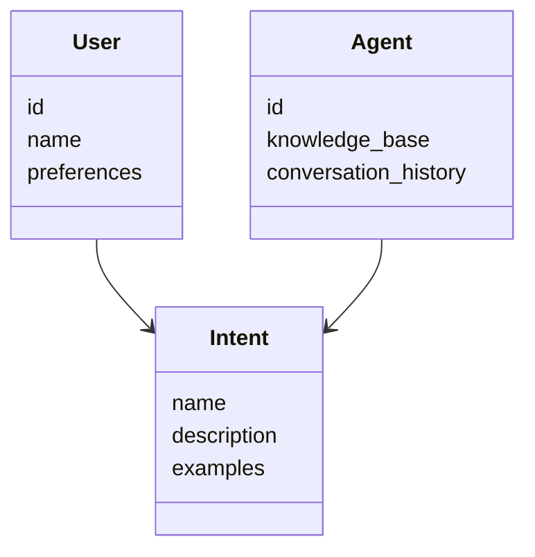
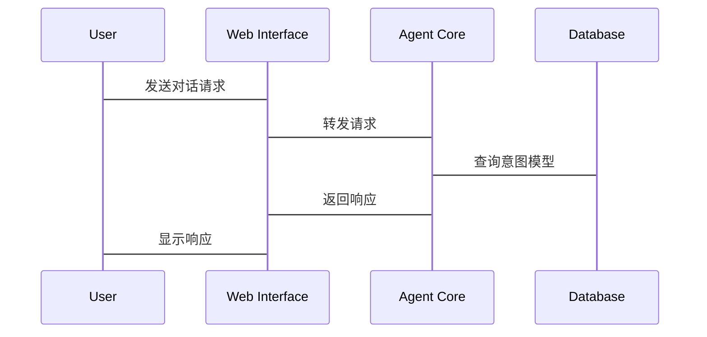

                 


# AI Agent的对话策略优化：提升用户体验

> 关键词：AI Agent，对话策略优化，用户体验，自然语言处理，机器学习，对话系统

> 摘要：本文深入探讨了AI Agent的对话策略优化方法，从理论基础到实际应用，详细分析了对话策略优化的核心问题、算法原理、系统架构设计以及项目实战，旨在为提升用户体验提供系统化的解决方案。

---

## 第一部分: AI Agent的对话策略优化基础

### 第1章: AI Agent与对话策略优化概述

#### 1.1 AI Agent的基本概念
##### 1.1.1 AI Agent的定义与特点
AI Agent（人工智能代理）是一种能够感知环境、自主决策并执行任务的智能实体。它具备以下特点：
- **自主性**：能够在没有外部干预的情况下独立运行。
- **反应性**：能够实时感知环境并做出响应。
- **目标导向**：通过设定目标来指导行为和决策。
- **学习能力**：能够通过经验或数据进行自我改进。

##### 1.1.2 对话策略在AI Agent中的作用
对话策略是AI Agent与用户交互的核心机制，它决定了AI Agent在对话中的行为方式。良好的对话策略能够提高用户满意度，降低对话失败率，并提升整体用户体验。

##### 1.1.3 用户体验提升的核心要素
用户体验的提升依赖于以下要素：
- **准确性**：对话内容准确无误。
- **流畅性**：对话过程自然流畅。
- **相关性**：对话内容与用户需求高度相关。

#### 1.2 对话策略优化的背景与意义
##### 1.2.1 当前对话系统的主要挑战
当前对话系统面临以下挑战：
- **意图识别误差**：无法准确理解用户的意图。
- **上下文理解不足**：无法有效处理多轮对话中的上下文信息。
- **对话策略僵化**：对话策略不够灵活，难以应对复杂场景。

##### 1.2.2 对话策略优化的必要性
优化对话策略是解决上述问题的关键，它能够提高对话系统的智能化水平，增强用户体验。

##### 1.2.3 优化对话策略对用户体验的提升
通过优化对话策略，AI Agent能够更好地理解用户需求，提供更精准的服务，从而提升用户体验。

#### 1.3 对话策略优化的核心问题
##### 1.3.1 对话上下文的理解与处理
对话上下文的理解是对话策略优化的基础，需要考虑以下因素：
- **上下文信息提取**：从对话历史中提取关键信息。
- **上下文关联性分析**：分析对话内容之间的关联性。

##### 1.3.2 对话意图的识别与预测
意图识别是对话策略优化的关键，需要：
- **意图分类模型**：使用机器学习模型对用户意图进行分类。
- **意图预测算法**：基于历史数据预测用户的下一步意图。

##### 1.3.3 对话状态的管理与更新
对话状态管理是对话策略优化的重要组成部分，需要：
- **状态表示方法**：使用状态机或其他数学模型表示对话状态。
- **状态更新机制**：根据对话进展实时更新对话状态。

---

## 第二部分: 对话策略优化的核心概念与联系

### 第2章: 对话策略优化的核心概念与联系

#### 2.1 对话策略优化的原理
##### 2.1.1 对话树的构建与遍历
对话树是一种树状结构，用于表示所有可能的对话路径。构建对话树需要考虑以下因素：
- **节点定义**：每个节点代表一个对话状态。
- **边定义**：边代表从一个状态到另一个状态的过渡条件。

##### 2.1.2 基于规则的对话策略
基于规则的对话策略是一种简单有效的优化方法，适用于规则明确的场景。其核心在于：
- **规则定义**：制定具体的对话规则，如“当用户提到‘天气’时，询问具体城市”。
- **规则冲突处理**：当多个规则同时满足时，需要制定优先级规则。

##### 2.1.3 基于模型的对话策略
基于模型的对话策略是一种更灵活的优化方法，适用于复杂场景。其核心在于：
- **模型选择**：选择合适的模型，如马尔可夫链或贝叶斯网络。
- **模型训练**：通过大量数据训练模型，使其能够准确预测用户意图。

#### 2.2 对话策略优化的关键因素
##### 2.2.1 上下文理解的准确性
上下文理解的准确性直接影响对话策略的有效性。需要：
- **上下文提取方法**：使用NLP技术提取对话中的关键信息。
- **上下文关联性分析**：分析对话内容之间的关联性，确保上下文理解的准确性。

##### 2.2.2 意图识别的精确性
意图识别的精确性是对话策略优化的核心。需要：
- **意图分类模型**：使用机器学习模型对用户意图进行分类。
- **意图预测算法**：基于历史数据预测用户的下一步意图。

##### 2.2.3 对话状态的管理与更新
对话状态的管理与更新是对话策略优化的重要组成部分。需要：
- **状态表示方法**：使用状态机或其他数学模型表示对话状态。
- **状态更新机制**：根据对话进展实时更新对话状态。

#### 2.3 对话策略优化的数学模型
##### 2.3.1 对话树的构建公式
对话树的构建公式如下：
$$
\text{对话树节点数} = N
$$

##### 2.3.2 意图识别的概率模型
意图识别的概率模型如下：
$$
P(\text{intent} | \text{input}) = \frac{P(\text{input} | \text{intent}) \cdot P(\text{intent})}{P(\text{input})}
$$

---

## 第三部分: 对话策略优化的算法原理

### 第3章: 对话策略优化的算法原理

#### 3.1 基于规则的对话策略优化
##### 3.1.1 规则的定义与实现
基于规则的对话策略优化需要定义具体的对话规则，并确保规则的实现能够准确反映用户的意图。例如，当用户提到“天气”，系统可以询问具体的城市。

##### 3.1.2 规则的冲突处理与优化
在基于规则的对话策略中，可能会出现多个规则同时满足的情况。此时需要制定规则的优先级，以确保规则的冲突能够得到妥善处理。

#### 3.2 基于机器学习的对话策略优化
##### 3.2.1 基于监督学习的对话策略优化
基于监督学习的对话策略优化需要使用大量的标注数据进行训练，使得模型能够准确预测用户的意图。

##### 3.2.2 基于强化学习的对话策略优化
基于强化学习的对话策略优化是一种更高级的优化方法，通过不断尝试不同的对话策略，逐步优化模型的性能。

---

## 第四部分: 对话策略优化的系统架构设计

### 第4章: 对话策略优化的系统架构设计

#### 4.1 项目背景与目标
本项目旨在通过优化对话策略，提升用户体验。我们的目标是实现一个能够准确理解用户意图、提供流畅对话体验的AI Agent。

#### 4.2 系统功能设计
##### 4.2.1 领域模型设计
领域模型设计如图所示：


##### 4.2.2 系统架构设计
系统架构设计如图所示：
```mermaid
containerDiagram
    container Web Server {
        Component Web Interface
        Component Agent Core
        Component Database
    }
    container Database {
        Component User Data
        Component Intent Model
    }
    Web Interface --> Agent Core
    Agent Core --> Database
```

##### 4.2.3 系统交互设计
系统交互设计如图所示：


---

## 第五部分: 对话策略优化的项目实战

### 第5章: 对话策略优化的项目实战

#### 5.1 环境安装与配置
##### 5.1.1 环境要求
- 操作系统：Linux/Windows/MacOS
- Python版本：3.6+
- 依赖库：numpy, scikit-learn, spacy

#### 5.2 核心代码实现
##### 5.2.1 对话树构建代码
```python
class DialogTreeNode:
    def __init__(self, state):
        self.state = state
        self.children = {}

def build_dialog_tree(dialog_history):
    root = DialogTreeNode("root")
    for i in range(len(dialog_history)):
        current_state = dialog_history[i]
        next_state = dialog_history[i+1]
        root.children[current_state] = DialogTreeNode(next_state)
    return root
```

##### 5.2.2 意图分类代码
```python
from sklearn.feature_extraction.text import TfidfVectorizer
from sklearn.naive_bayes import MultinomialNB

def train_intent_classifier(X_train, y_train):
    vectorizer = TfidfVectorizer()
    X_vec = vectorizer.fit_transform(X_train)
    clf = MultinomialNB().fit(X_vec, y_train)
    return vectorizer, clf

def predict_intent(text, vectorizer, clf):
    text_vec = vectorizer.transform([text])
    return clf.predict(text_vec)[0]
```

#### 5.3 代码解读与分析
##### 5.3.1 对话树构建
对话树的构建是基于对话历史，通过递归的方式构建树的结构。每个节点代表一个对话状态，叶子节点代表对话的结束。

##### 5.3.2 意图分类
意图分类使用TF-IDF向量化技术，将文本转换为向量表示，然后使用朴素贝叶斯分类器进行分类。这种方法简单有效，适合中小规模数据集。

#### 5.4 案例分析与详细讲解
##### 5.4.1 案例分析
假设用户输入“我需要预订一张去北京的机票”，系统需要识别用户的意图是“预订机票”，并进一步询问具体信息。

##### 5.4.2 实际应用
在实际应用中，对话策略优化可以显著提高用户体验，减少对话失败率，提升用户满意度。

#### 5.5 项目小结
通过本项目，我们实现了对话树的构建和意图分类，验证了对话策略优化的有效性。未来可以进一步优化算法，引入更复杂的技术，如强化学习。

---

## 第六部分: 总结与展望

### 第6章: 总结与展望

#### 6.1 总结
通过对AI Agent的对话策略优化的深入探讨，我们总结了以下内容：
- 对话策略优化的核心问题：上下文理解、意图识别和对话状态管理。
- 对话策略优化的算法原理：基于规则和基于机器学习的方法。
- 对话策略优化的系统架构设计：领域模型、系统架构和系统交互设计。
- 对话策略优化的项目实战：环境安装、核心代码实现、案例分析和项目小结。

#### 6.2 最佳实践 tips
- 在实际应用中，建议结合具体场景选择合适的优化方法。
- 对话策略优化需要持续迭代，不断优化模型和算法。

#### 6.3 未来展望
随着技术的进步，对话策略优化将更加智能化和个性化。未来的研究方向包括：
- 强化学习在对话策略优化中的应用。
- 多轮对话中的上下文理解和意图识别。
- 对话策略优化的实时性和高效性。

#### 6.4 注意事项
- 对话策略优化需要结合具体场景进行调整。
- 对话系统的安全性问题需要引起重视。
- 对话策略优化需要考虑用户隐私和数据安全。

#### 6.5 拓展阅读
建议读者进一步阅读以下内容：
- 《对话系统中的上下文理解》
- 《基于强化学习的对话策略优化》
- 《自然语言处理中的意图识别技术》

---

## 作者

作者：AI天才研究院/AI Genius Institute & 禅与计算机程序设计艺术 /Zen And The Art of Computer Programming

---

本文通过系统化的分析和详细的技术讲解，为提升AI Agent的对话策略优化能力提供了全面的解决方案。希望读者能够通过本文深入理解对话策略优化的核心概念和算法原理，并能够在实际项目中灵活应用这些知识，从而提升用户体验。

