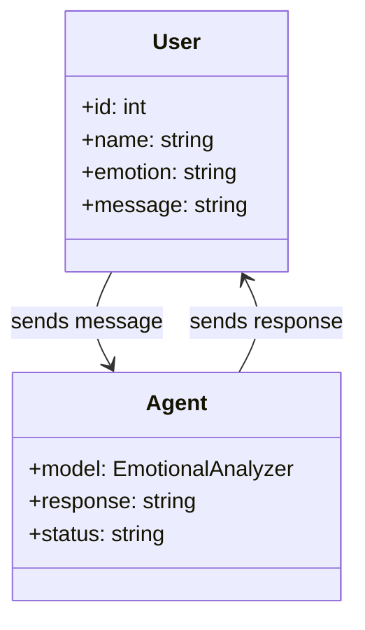
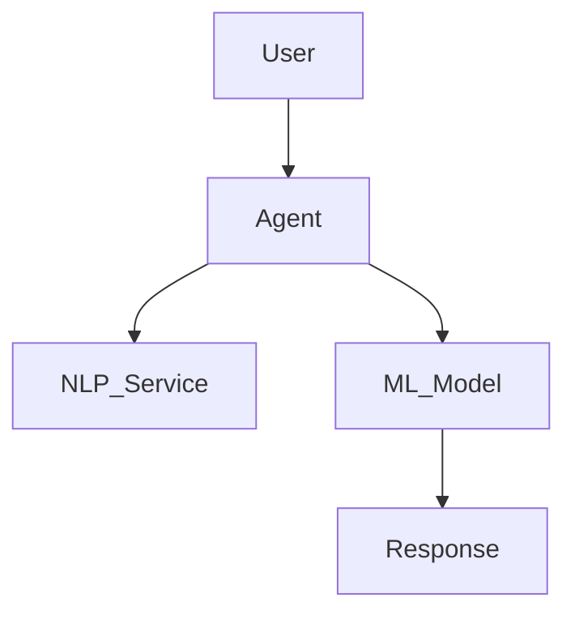
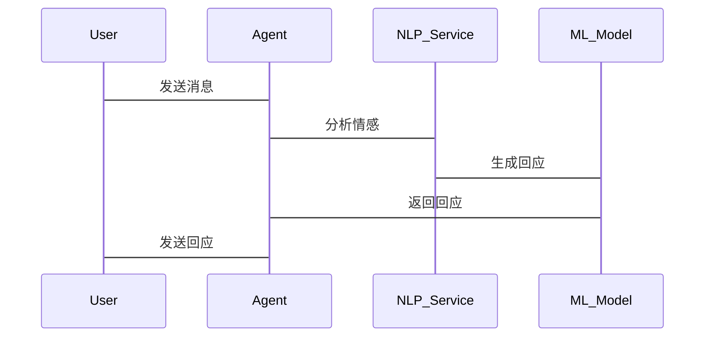

                 


# AI Agent的对话策略在心理咨询中的应用

## 关键词
AI Agent, 对话策略, 心理咨询, 人工智能, 自然语言处理

## 摘要
本文探讨了AI Agent在心理咨询中的对话策略应用，分析了其背景、核心概念、算法原理、系统架构，并通过项目实战展示了如何实现这些策略。文章详细阐述了AI Agent如何通过自然语言处理和情感计算技术，提升心理咨询的效率和效果，为心理咨询领域提供了新的可能性。

---

# 第1章 AI Agent的对话策略在心理咨询中的应用背景

## 1.1 问题背景

### 1.1.1 心理咨询的现状与挑战
心理咨询作为一种重要的心理健康服务，目前面临着资源有限、覆盖范围不足以及咨询师工作强度高等问题。传统心理咨询依赖于人工，咨询师需要具备深厚的专业知识和技能，但其数量和覆盖范围有限，难以满足日益增长的需求。

### 1.1.2 AI技术在心理咨询中的潜力
随着人工智能技术的快速发展，AI Agent（智能体）在多个领域的应用逐渐成熟。在心理咨询领域，AI Agent可以通过自然语言处理技术，模拟人类的对话方式，为用户提供即时、个性化的心理支持，从而缓解心理咨询资源不足的问题。

### 1.1.3 对话策略在心理咨询中的重要性
在心理咨询中，对话策略是建立信任、引导用户表达情感、解决问题的关键。AI Agent通过设计合理的对话策略，可以更有效地理解用户的情感需求，提供有针对性的反馈，从而提升心理咨询的效果。

---

## 1.2 问题描述

### 1.2.1 心理咨询中的对话特点
心理咨询中的对话通常具有情感性、隐私性和专业性。用户可能会分享敏感信息，因此对话需要高度的情感共鸣和专业判断。

### 1.2.2 当前心理咨询中的对话策略局限性
传统心理咨询中，对话策略主要依赖咨询师的个人经验和直觉，这导致了咨询效果的不一致性和资源的有限性。此外，用户在非工作时间可能无法及时获得心理咨询师的帮助。

### 1.2.3 AI Agent在对话策略中的应用需求
AI Agent可以通过24/7的可用性、快速响应和个性化的对话策略，弥补传统心理咨询的不足，为用户提供及时的心理支持。

---

## 1.3 问题解决

### 1.3.1 AI Agent在对话策略中的优势
AI Agent可以处理大量数据，通过机器学习算法不断优化对话策略，提供更精准的支持。此外，AI Agent可以同时服务多个用户，解决了资源有限的问题。

### 1.3.2 AI Agent如何提升心理咨询的效果
通过自然语言处理和情感计算，AI Agent可以准确识别用户的情感状态，提供针对性的反馈和建议，帮助用户缓解压力、改善情绪。

### 1.3.3 AI Agent在对话策略中的实现路径
实现路径包括数据采集与分析、对话策略的设计与优化、以及系统的集成与测试。

---

## 1.4 边界与外延

### 1.4.1 AI Agent在心理咨询中的应用边界
AI Agent目前主要适用于初步的心理支持和情绪疏导，对于复杂的心理问题，仍需要专业心理咨询师的介入。

### 1.4.2 对话策略的适用范围与限制
对话策略适用于标准化的心理咨询场景，但对于特殊情况，如严重抑郁症或复杂的人际关系问题，AI Agent可能难以提供足够的支持。

### 1.4.3 心理咨询与AI Agent结合的未来发展
随着技术的进步，AI Agent在心理咨询中的应用将更加广泛，可能包括个性化诊断、实时监测和长期支持等。

---

## 1.5 概念结构与核心要素

### 1.5.1 AI Agent的基本构成
AI Agent通常包括感知层（如自然语言处理）、决策层（如机器学习模型）和执行层（如对话生成）。

### 1.5.2 对话策略的核心要素
对话策略包括情感识别、话题引导、反馈生成等关键环节。

### 1.5.3 心理咨询中的对话策略模型
模型通常包括用户输入、情感分析、策略选择和反馈生成四个步骤。

---

# 第2章 AI Agent的核心概念与原理

## 2.1 AI Agent的基本原理

### 2.1.1 AI Agent的定义与分类
AI Agent是指能够感知环境并采取行动以实现目标的智能实体。根据应用场景的不同，AI Agent可以分为服务型、决策型和社交型。

### 2.1.2 AI Agent的核心算法
常用算法包括自然语言处理（NLP）、机器学习（ML）和深度学习（DL）。

### 2.1.3 AI Agent的决策机制
基于预设规则或机器学习模型，AI Agent可以做出最优决策。

---

## 2.2 对话策略的核心概念

### 2.2.1 对话策略的定义与分类
对话策略是指在对话中选择合适的回应方式以达到特定目标。根据目标不同，可以分为情感支持型和问题解决型。

### 2.2.2 对话策略的关键要素
包括情感识别、上下文理解和个性化回应。

### 2.2.3 对话策略的实现方法
通过自然语言处理技术和机器学习模型实现。

---

## 2.3 心理咨询中的对话策略

### 2.3.1 心理咨询对话的特点
心理咨询对话注重情感共鸣和专业性，通常涉及情绪支持和问题解决。

### 2.3.2 心理咨询中的常见对话策略
包括倾听、反馈、引导和建议。

### 2.3.3 对话策略在心理咨询中的效果评估
通过用户反馈、对话内容分析和效果指标（如情绪改善度）进行评估。

---

## 2.4 AI Agent与对话策略的结合

### 2.4.1 AI Agent在对话策略中的作用
AI Agent通过自动化处理和数据分析，优化对话策略的效果。

### 2.4.2 对话策略在AI Agent中的实现
通过机器学习模型训练对话策略，提升AI Agent的对话能力。

---

# 第3章 算法原理讲解

## 3.1 算法原理概述

### 3.1.1 对话策略的核心算法
常用的算法包括情感分析、意图识别和对话生成。

### 3.1.2 情感分析算法
使用深度学习模型（如LSTM）进行情感分类。

### 3.1.3 对话生成算法
基于Transformer的模型（如GPT）生成对话回复。

---

## 3.2 算法实现步骤

### 3.2.1 数据预处理
包括文本清洗、分词和标注。

### 3.2.2 模型训练
使用训练数据训练情感分析和对话生成模型。

### 3.2.3 模型优化
通过调整超参数和引入反馈机制提升模型性能。

---

## 3.3 代码实现

```python
import torch
import torch.nn as nn

class EmotionalAnalyzer(nn.Module):
    def __init__(self, vocab_size, embedding_dim, hidden_dim):
        super(EmotionalAnalyzer, self).__init__()
        self.embedding = nn.Embedding(vocab_size, embedding_dim)
        self.lstm = nn.LSTM(embedding_dim, hidden_dim, batch_first=True)
        self.fc = nn.Linear(hidden_dim, 2)  # 分为积极和消极

    def forward(self, input_ids):
        embeds = self.embedding(input_ids)
        out, _ = self.lstm(embeds)
        out = self.fc(out[:, -1, :])
        return out

# 示例使用
vocab_size = 10000
embedding_dim = 300
hidden_dim = 128
model = EmotionalAnalyzer(vocab_size, embedding_dim, hidden_dim)
```

---

## 3.4 案例分析

### 3.4.1 情感分析案例
输入文本：“我感到非常沮丧。”，模型识别出情感为“消极”。

### 3.4.2 对话生成案例
用户输入：“最近工作压力很大。”，AI Agent回复：“可以具体说说是什么事情让你感到压力吗？”

---

# 第4章 系统分析与架构设计方案

## 4.1 问题场景介绍
设计一个基于AI Agent的心理咨询系统，提供24/7的情感支持服务。

## 4.2 项目介绍
项目名称：AI心理咨询助手。

## 4.3 系统功能设计

### 4.3.1 领域模型类图


### 4.3.2 系统架构图


### 4.3.3 系统交互序列图


---

## 4.4 项目实战

### 4.4.1 环境安装
安装Python、TensorFlow和Keras。

### 4.4.2 核心实现代码
```python
def心理咨询助手():
    while True:
        用户输入 = input("请输入您的问题：")
        情感分析结果 = 分析情感(用户输入)
        生成回应 = 生成对话(用户输入, 情感分析结果)
        print("AI助手:", 生成回应)
```

### 4.4.3 案例分析
用户输入：“我最近总是感到焦虑。”，AI助手回复：“这可能与您的工作压力有关，您最近的工作情况如何？”

---

## 4.5 最佳实践 tips

### 4.5.1 注意事项
- 确保数据隐私和用户 confidentiality。
- 定期更新模型，提升对话质量。

### 4.5.2 项目小结
通过AI Agent实现的心理咨询系统，能够有效缓解资源不足的问题，为用户提供及时的情感支持。

### 4.5.3 未来发展
随着技术进步，AI Agent在心理咨询中的应用将更加智能化和个性化。

---

# 作者：AI天才研究院/AI Genius Institute & 禅与计算机程序设计艺术 /Zen And The Art of Computer Programming

---

本文通过详细分析AI Agent在心理咨询中的对话策略，探讨了其背景、核心概念、算法原理和系统架构，并通过项目实战展示了其应用潜力。未来，随着技术的发展，AI Agent将为心理咨询领域带来更多创新和突破。

