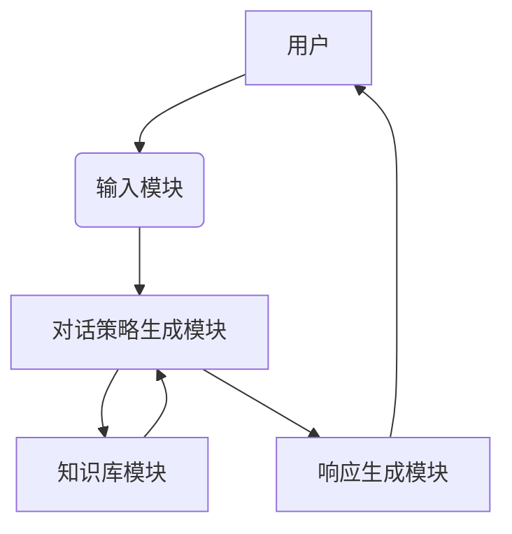

                 


# AI Agent的对话策略在教育辅导中的应用

> 关键词：AI Agent, 对话策略, 教育辅导, 个性化学习, 自然语言处理, 人工智能

> 摘要：本文系统地探讨了AI Agent在教育辅导中的对话策略应用，从基本概念、实现原理到系统设计和项目实战，全面分析了AI Agent如何通过对话策略优化教育辅导过程，提升学习效果。文章结合理论与实践，为教育技术领域提供了有价值的参考。

---

# 第一部分: AI Agent的对话策略在教育辅导中的应用概述

## 第1章: AI Agent与教育辅导的背景介绍

### 1.1 AI Agent的基本概念

#### 1.1.1 什么是AI Agent
AI Agent（人工智能代理）是一种能够感知环境、自主决策并执行任务的智能实体。它可以是软件程序、机器人或其他智能系统，通过传感器和执行器与环境交互。

#### 1.1.2 AI Agent的特点与优势
- **自主性**：AI Agent能够自主决策，无需人工干预。
- **反应性**：能够实时感知环境并做出反应。
- **学习能力**：通过数据和经验不断优化自身行为。
- **适应性**：能够适应不同环境和用户需求。

#### 1.1.3 AI Agent在教育领域的潜力
AI Agent可以通过自然语言处理、机器学习等技术，为学生提供个性化的学习支持，帮助解决学习中的问题，优化学习过程。

### 1.2 教育辅导的基本需求

#### 1.2.1 学生学习中的常见问题
- 学习目标不明确
- 学习方法不当
- 知识点理解困难
- 学习动力不足

#### 1.2.2 教育辅导的核心目标
- 提供个性化学习支持
- 解决学习中的具体问题
- 提高学习效率和效果
- 增强学生的学习兴趣和信心

#### 1.2.3 传统教育辅导的局限性
- 资源有限，难以覆盖所有学生
- 教学方式单一，难以满足个性化需求
- 辅导效率低，难以及时解决问题

### 1.3 AI Agent在教育辅导中的应用前景

#### 1.3.1 AI Agent在教育辅导中的优势
- 24/7可用，随时提供帮助
- 个性化学习支持，满足不同学生的需求
- 数据驱动，提供精准的学习建议

#### 1.3.2 AI Agent在教育辅导中的潜在应用场景
- 个性化学习计划制定
- 学习难点解析
- 学习效果评估
- 学习资源推荐

#### 1.3.3 AI Agent在教育辅导中的挑战与机遇
- 挑战：数据隐私、技术局限性、用户体验优化
- 机遇：技术进步、教育需求多样化、个性化学习趋势

---

## 第2章: AI Agent的对话策略基础

### 2.1 对话策略的基本概念

#### 2.1.1 对话策略的定义
对话策略是指AI Agent在与用户交互过程中，根据用户输入和上下文，选择合适的回应方式和内容的策略。

#### 2.1.2 对话策略的核心要素
- 用户意图识别
- 上下文理解
- 响应生成
- 对话流程控制

#### 2.1.3 对话策略的分类
- 基于规则的对话策略
- 基于机器学习的对话策略
- 基于深度学习的对话策略

### 2.2 AI Agent对话策略的设计原则

#### 2.2.1 用户需求分析
- 明确用户的真实需求
- 理解用户的语言习惯和表达方式
- 预测用户的后续需求

#### 2.2.2 对话逻辑设计
- 设计对话流程
- 确定对话中的关键节点
- 处理对话中的异常情况

#### 2.2.3 对话内容优化
- 提供准确的知识解答
- 使用通俗易懂的语言
- 保持对话的连贯性和逻辑性

### 2.3 常见对话策略技术

#### 2.3.1 基于规则的对话策略
- 通过预定义的规则匹配用户输入，生成响应。
- 适用于简单对话场景，如FAQ解答。

#### 2.3.2 基于机器学习的对话策略
- 使用机器学习模型（如SVM、随机森林）进行意图识别和对话管理。
- 适用于复杂对话场景，如学习辅导中的问题解答。

#### 2.3.3 基于深度学习的对话策略
- 使用深度学习模型（如LSTM、Transformer）进行对话生成和管理。
- 适用于高度个性化和复杂的对话场景。

---

## 第3章: AI Agent对话策略的实现原理

### 3.1 对话系统的整体架构

#### 3.1.1 对话系统的模块划分
- 用户输入解析模块
- 对话策略生成模块
- 知识库查询模块
- 响应生成模块

#### 3.1.2 对话系统的数据流分析
用户输入 → 用户意图识别 → 对话策略生成 → 知识库查询 → 响应生成 → 用户输出

#### 3.1.3 对话系统的性能优化
- 提高意图识别的准确率
- 优化对话流程控制
- 提升响应生成的效率

### 3.2 对话策略的算法实现

#### 3.2.1 基于规则的对话策略实现
```python
def rule_based_response(user_input):
    if "问题1" in user_input:
        return "答案1"
    elif "问题2" in user_input:
        return "答案2"
    else:
        return "抱歉，我无法回答您的问题"
```

#### 3.2.2 基于机器学习的对话策略实现
```python
from sklearn.svm import SVC

# 训练数据
X = [...]  # 特征向量
y = [...]  # 对应的标签（意图）

# 训练模型
model = SVC()
model.fit(X, y)

# 预测意图
def ml_based_response(user_input):
    features = extract_features(user_input)
    intent = model.predict(features)
    return generate_response(intent)
```

#### 3.2.3 基于深度学习的对话策略实现
```python
import tensorflow as tf
from tensorflow.keras import layers

# 定义模型
model = tf.keras.Sequential()
model.add(layers.Embedding(input_dim=..., output_dim=...))
model.add(layers.LSTM(units=64))
model.add(layers.Dense(units=1, activation='sigmoid'))
model.compile(optimizer='adam', loss='binary_crossentropy', metrics=['accuracy'])
```

### 3.3 对话策略的数学模型

#### 3.3.1 对话策略的概率模型
$$ P(y|x) = \frac{P(x|y)P(y)}{P(x)} $$

其中，$x$ 是用户输入，$y$ 是系统响应。

#### 3.3.2 基于深度学习的对话模型
$$ \text{Decoder}(x) = \argmax_y P(y|x) $$

其中，$\text{Decoder}$ 是解码器，用于生成系统的响应。

---

## 第4章: AI Agent在教育辅导中的对话策略应用

### 4.1 教育辅导中的对话场景

#### 4.1.1 学生提问
- 学生提出具体问题，AI Agent提供解答。
- 示例：学生问“如何解这个数学题？”

#### 4.1.2 学习计划制定
- AI Agent帮助学生制定个性化学习计划。
- 示例：AI Agent询问学生的学习目标和时间安排。

#### 4.1.3 学习效果评估
- AI Agent通过对话了解学生的学习进展。
- 示例：AI Agent问“最近的学习效果如何？”

### 4.2 对话策略在教育辅导中的优化

#### 4.2.1 用户需求分析
- 理解学生的语言习惯和表达方式。
- 识别学生的真实需求。

#### 4.2.2 对话流程设计
- 设计合理的对话流程，确保问题逐步解决。
- 示例：从问题理解到解答再到总结。

#### 4.2.3 知识库优化
- 构建专业的知识库，确保回答的准确性。
- 定期更新知识库，保持内容的时效性。

### 4.3 实际案例分析

#### 4.3.1 案例背景
- 学生在学习数学时遇到困难，向AI Agent提问。

#### 4.3.2 对话过程
1. 学生问：“如何解这个方程组？”
2. AI Agent解析问题，提供分步解答。
3. 学生确认理解后，AI Agent总结关键点。

#### 4.3.3 案例分析
- 对话策略的成功关键在于准确理解学生需求和提供清晰的解答。
- 知识库的完善性和对话流程的合理性直接影响用户体验。

---

## 第5章: 系统设计与优化

### 5.1 系统架构设计

#### 5.1.1 系统功能模块
- 用户输入模块
- 对话策略生成模块
- 知识库模块
- 响应生成模块

#### 5.1.2 系统架构图


### 5.2 系统接口设计

#### 5.2.1 系统接口定义
- 输入接口：接收用户输入
- 输出接口：返回系统响应

#### 5.2.2 系统接口交互流程
1. 用户输入问题
2. 系统解析问题
3. 系统生成响应
4. 系统返回响应

### 5.3 系统优化策略

#### 5.3.1 性能优化
- 提高意图识别的准确率
- 优化对话流程的效率

#### 5.3.2 可扩展性优化
- 知识库的模块化设计
- 对话策略的可扩展性设计

---

## 第6章: 项目实战

### 6.1 环境安装

#### 6.1.1 安装Python
```bash
python --version
```

#### 6.1.2 安装必要的库
```bash
pip install numpy
pip install scikit-learn
pip install tensorflow
```

### 6.2 系统核心实现

#### 6.2.1 对话策略实现
```python
def generate_response(user_input):
    # 实现对话策略
    pass
```

#### 6.2.2 知识库实现
```python
def query_knowledge_base(question):
    # 查询知识库
    pass
```

### 6.3 代码应用解读与分析

#### 6.3.1 代码功能模块
- 用户输入处理模块
- 对话策略生成模块
- 知识库查询模块
- 响应生成模块

#### 6.3.2 代码实现细节
- 使用预训练模型进行意图识别
- 基于规则或机器学习进行对话管理

### 6.4 实际案例分析

#### 6.4.1 案例背景
- 学生学习数学中的方程组问题。

#### 6.4.2 对话过程
1. 学生输入问题：“如何解这个方程组？”
2. 系统解析问题，调用知识库。
3. 系统生成分步解答。
4. 学生确认理解，系统总结关键点。

#### 6.4.3 代码实现
```python
def solve_equation(user_input):
    # 实现方程组求解
    pass
```

### 6.5 项目小结

#### 6.5.1 项目总结
- 成功实现AI Agent在教育辅导中的对话策略应用
- 提供了个性化学习支持

#### 6.5.2 项目意义
- 推动教育技术的发展
- 提高学习效率和效果

---

## 第7章: 总结与展望

### 7.1 总结

#### 7.1.1 核心内容回顾
- AI Agent在教育辅导中的对话策略应用
- 系统设计与优化
- 项目实战经验

#### 7.1.2 本文的创新点
- 结合理论与实践，提供系统的解决方案
- 提出优化建议和未来发展方向

### 7.2 展望

#### 7.2.1 未来技术发展
- 更先进的自然语言处理技术
- 更强大的机器学习模型

#### 7.2.2 教育技术的融合
- 与其他教育技术的结合
- 更广泛的应用场景

---

# 作者：AI天才研究院/AI Genius Institute & 禅与计算机程序设计艺术/Zen And The Art of Computer Programming

---

**注意事项**：
- 本文内容基于现有技术，未来可能会有更新和改进。
- 代码示例仅供参考，具体实现需根据实际情况调整。
- 本文中的算法和模型可以根据具体需求进行优化和扩展。

**拓展阅读**：
- 《Deep Learning》
- 《自然语言处理实战》
- 《教育技术的发展与应用》

