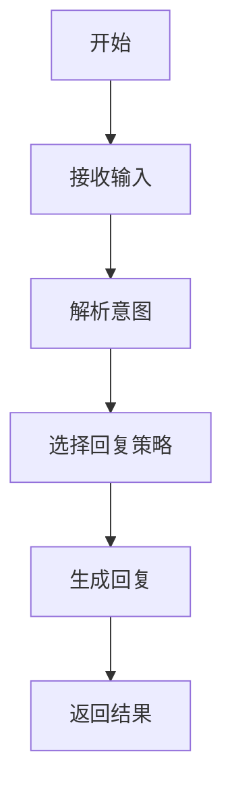
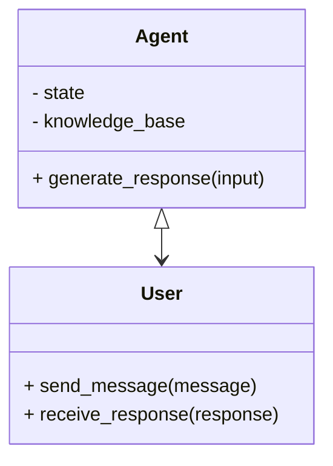

                 


# AI Agent的对话策略：提高交互质量

> 关键词：AI Agent, 对话策略, 自然语言处理, 交互质量, 强化学习

> 摘要：本文深入探讨AI Agent在对话交互中的策略设计，分析其核心概念、算法原理及系统架构，结合实际案例，提供提升对话质量的方法和最佳实践。

---

# 第一部分: AI Agent对话策略基础

## 第1章: AI Agent与对话策略概述

### 1.1 AI Agent的基本概念
#### 1.1.1 什么是AI Agent
AI Agent（人工智能代理）是能够感知环境并采取行动以实现目标的智能体。在对话场景中，AI Agent通过自然语言处理技术与用户交互，提供信息、解决问题或完成任务。

#### 1.1.2 AI Agent的核心特点
- **自主性**：无需外部干预，自主决策。
- **反应性**：实时感知并响应环境变化。
- **目标导向**：基于目标选择最优行动。

#### 1.1.3 对话策略的定义与作用
对话策略是AI Agent在对话过程中选择回复的规则或方法，旨在提高交互的质量和用户体验。

### 1.2 对话策略的重要性
#### 1.2.1 对话质量的衡量标准
- **准确性**：回答是否正确。
- **流畅性**：对话是否连贯。
- **相关性**：回复是否贴合上下文。

#### 1.2.2 对话策略在不同场景中的应用
- **客服系统**：提供高效问题解答。
- **智能助手**：帮助用户完成日常任务。
- **教育助手**：辅助学习过程。

#### 1.2.3 提高交互质量的意义
提升用户体验，增强系统信任度，提高任务完成效率。

### 1.3 AI Agent对话策略的背景与现状
#### 1.3.1 问题背景与挑战
- **语义理解不足**：难以处理复杂语义。
- **上下文管理**：对话历史难以有效利用。
- **个性化需求**：用户需求多样，难以统一满足。

#### 1.3.2 当前技术发展现状
- **NLP技术进步**：如BERT、GPT-3等模型的应用。
- **强化学习**：用于对话策略优化。
- **多模态交互**：结合视觉、语音等多感官输入。

#### 1.3.3 未来趋势与研究方向
- **更自然的对话**：减少机械式回复。
- **多轮对话优化**：提升上下文理解能力。
- **个性化服务**：基于用户画像提供定制化服务。

### 1.4 本章小结
本章介绍了AI Agent的基本概念及其在对话中的作用，分析了对话策略的重要性，并探讨了当前的技术背景和发展趋势。

---

## 第2章: 对话策略的核心概念与联系

### 2.1 对话策略的核心要素
#### 2.1.1 信息抽取与理解
从对话历史中提取关键信息，理解用户意图。

#### 2.1.2 意图识别与预测
通过上下文分析用户需求，并预测下一步行动。

#### 2.1.3 上下文管理
维护对话历史，确保回复连贯。

### 2.2 对话策略的关键技术
#### 2.2.1 基于规则的对话策略
通过预设规则生成回复，适用于简单场景。

#### 2.2.2 基于机器学习的对话策略
利用数据训练模型，生成更自然的回复。

#### 2.2.3 基于强化学习的对话策略
通过奖励机制优化策略，提升交互质量。

### 2.3 对话策略的核心原理
#### 2.3.1 对话树与状态转移
使用树状结构表示可能的对话路径，状态转移基于用户输入。

#### 2.3.2 对话策略的数学模型
- **策略函数**：将状态映射到动作的函数。
- **价值函数**：评估动作的价值。

#### 2.3.3 对话策略的优化方法
- **监督学习**：基于人工标注数据优化策略。
- **无监督学习**：利用未标注数据发现规律。

### 2.4 核心概念对比与ER实体关系图

#### 2.4.1 对话策略技术对比表

| 技术类型      | 基于规则 | 基于机器学习 | 基于强化学习 |
|---------------|----------|--------------|--------------|
| 优势          | 实现简单 | 回复更自然    | 策略更优化    |
| 劣势          | 灵活性差  | 需大量数据    | 训练时间长    |

#### 2.4.2 对话策略ER实体关系图

```mermaid
er
actor(Agent, 用户)
关联关系：用户- Agent: 实现对话
```

### 2.5 本章小结
本章分析了对话策略的核心要素和关键技术，通过对比和ER图展示了不同策略的联系。

---

## 第3章: 对话策略的算法原理与实现

### 3.1 对话策略的算法概述
#### 3.1.1 基于检索的对话策略
从预存数据库中检索最相关的内容生成回复。

#### 3.1.2 基于生成的对话策略
利用生成模型（如GPT）实时生成回复。

#### 3.1.3 混合型对话策略
结合检索和生成技术，优势互补。

### 3.2 对话策略的数学模型与公式

#### 3.2.1 对话策略的数学表达式
策略函数：
$$ P(a|s) $$
其中，\(a\) 是动作，\(s\) 是状态。

#### 3.2.2 价值函数
$$ V(s) = \max_a Q(s,a) $$
其中，\( Q(s,a) \) 是状态-动作对的价值。

### 3.3 对话策略的实现步骤



### 3.4 项目实战：基于强化学习的对话策略实现

#### 3.4.1 环境安装
安装必要的库：
```bash
pip install gym transformers torch
```

#### 3.4.2 系统核心实现源代码

```python
import torch
import torch.nn as nn
from transformers import GPT2Tokenizer, GPT2LMHeadModel

class DialogStrategy:
    def __init__(self, model_name):
        self.tokenizer = GPT2Tokenizer.from_pretrained(model_name)
        self.model = GPT2LMHeadModel.from_pretrained(model_name)

    def generate_response(self, input_text):
        inputs = self.tokenizer.encode(input_text, return_tensors='pt')
        outputs = self.model.generate(inputs, max_length=50, num_beams=5)
        response = self.tokenizer.decode(outputs[0], skip_special_tokens=True)
        return response

# 使用示例
strategy = DialogStrategy("gpt2")
response = strategy.generate_response("What's the weather today?")
print(response)
```

#### 3.4.3 代码应用解读与分析
- 使用GPT-2模型生成回复。
- 通过beam search优化生成结果。

### 3.5 本章小结
本章详细讲解了对话策略的算法原理，并通过代码示例展示了如何实现基于生成模型的对话策略。

---

## 第4章: 对话策略的系统分析与架构设计

### 4.1 系统功能设计
#### 4.1.1 领域模型
使用mermaid类图展示系统模块：



#### 4.1.2 系统架构设计
采用分层架构：


#### 4.1.3 系统接口设计
- **输入接口**：接收用户输入。
- **输出接口**：返回系统回复。

### 4.2 本章小结
本章分析了对话系统的功能设计和架构，展示了如何构建高效稳定的对话系统。

---

## 第5章: 项目实战：构建一个智能对话系统

### 5.1 项目介绍
开发一个智能客服对话系统，解决用户常见问题。

### 5.2 环境安装
安装所需库：

```bash
pip install python-transformers torch
```

### 5.3 核心实现源代码

```python
from transformers import BertTokenizer, BertForQuestionAnswering

class QASystem:
    def __init__(self, model_name):
        self.tokenizer = BertTokenizer.from_pretrained(model_name)
        self.model = BertForQuestionAnswering.from_pretrained(model_name)

    def answer_question(self, question, context):
        inputs = self.tokenizer.encode_plus(question, context, return_tensors='pt')
        with torch.no_grad():
            outputs = self.model(**inputs)
        start = outputs.start_logits.argmax()
        end = outputs.end_logits.argmax()
        answer = self.tokenizer.decode(start, end)
        return answer

# 使用示例
qa = QASystem("bert-base-uncased")
answer = qa.answer_question("What is AI?", "AI stands for Artificial Intelligence.")
print(answer)
```

### 5.4 代码应用解读与分析
- 使用BERT模型进行问答。
- 解码start和end位置，提取答案。

### 5.5 实际案例分析
通过一个客服场景，展示系统如何处理用户问题。

### 5.6 本章小结
本章通过实际案例展示了如何构建一个智能对话系统，提供了从环境安装到代码实现的完整流程。

---

## 第6章: 总结与展望

### 6.1 核心知识点回顾
- AI Agent的基本概念。
- 对话策略的核心技术和实现方法。

### 6.2 最佳实践 tips
- **数据质量**：确保训练数据的多样性和准确性。
- **模型优化**：定期更新模型，提升对话质量。
- **用户体验**：关注用户反馈，不断优化交互流程。

### 6.3 未来展望
- **多模态对话**：结合视觉和语音信息，提升交互体验。
- **个性化服务**：基于用户画像提供定制化对话策略。
- **跨语言对话**：支持多语言交互，扩大应用范围。

### 6.4 本章小结
本文总结了核心知识点，并展望了未来的发展方向。

---

## 附录

### 附录A: 工具安装指南
安装所需库的命令汇总。

### 附录B: 术语表
常见术语的解释和定义。

---

# 作者：AI天才研究院 & 禅与计算机程序设计艺术

---

以上是基于您的要求设计的完整技术博客文章目录和内容。

