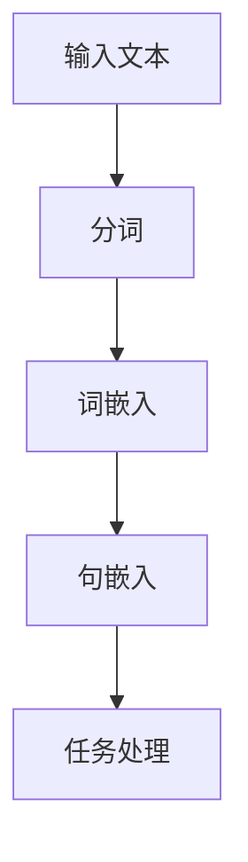
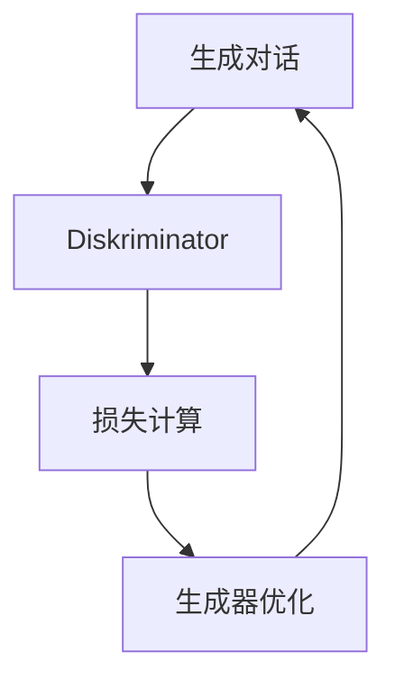
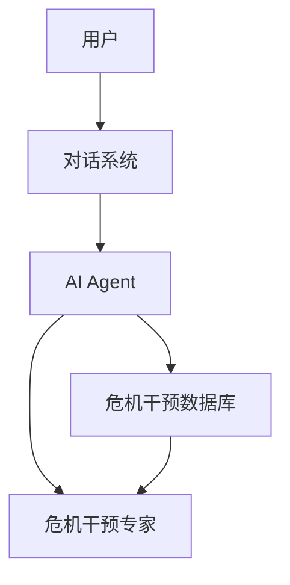
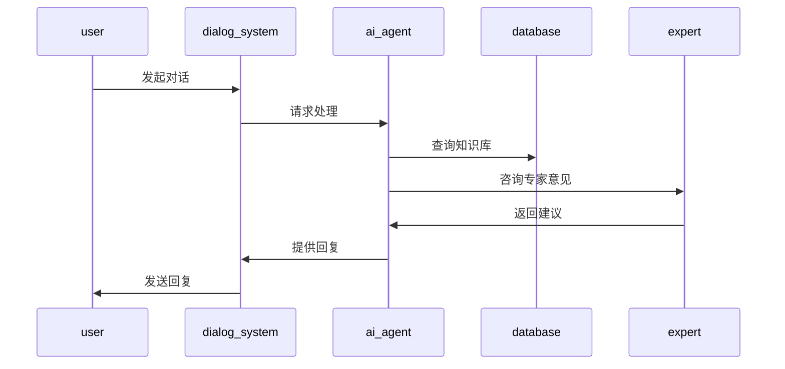

                 


# AI Agent的对话系统在危机干预中的应用

## 关键词：AI Agent, 对话系统, 危机干预, 自然语言处理, 危机管理, 人机交互

## 摘要：AI Agent通过自然语言处理技术实现智能对话，能够有效应对危机干预中的复杂情境，提升危机处理效率和效果。本文将详细探讨AI Agent在对话系统中的应用，分析其算法原理、系统架构，并通过实际案例展示其在危机干预中的潜力与挑战。

---

# 第一部分: AI Agent与对话系统基础

## 第1章: AI Agent的基本概念

### 1.1 AI Agent的定义与特点
- AI Agent（智能代理）是指能够感知环境并采取行动以实现目标的计算机系统。
- 其特点包括自主性、反应性、主动性、社会性等。
- 在危机干预中，AI Agent能够实时分析情境并做出决策。

### 1.2 对话系统的基本原理
- 对话系统是通过自然语言处理技术实现人与计算机之间的交流。
- 其核心任务包括语音识别、语义理解、对话生成等。
- 对话系统在危机干预中能够提供实时支持和心理疏导。

### 1.3 AI Agent与对话系统的结合
- AI Agent作为对话系统的核心，能够处理复杂情境下的对话任务。
- 结合自然语言处理技术，AI Agent能够实现更智能、更高效的对话交互。

---

## 第2章: 危机干预的背景与需求

### 2.1 危机干预的定义与范围
- 危机干预是指在突发事件或危机情况下，采取有效措施以减少损失的过程。
- 包括自然灾害、公共卫生事件、社会安全事件等多种类型。

### 2.2 危机干预中的关键问题
- 信息获取与处理的及时性。
- 资源分配与协调的效率。
- 心理疏导与社会稳定的需求。

### 2.3 对话系统在危机干预中的作用
- 提供实时沟通渠道，快速响应用户需求。
- 支持多语言对话，覆盖更广泛的用户群体。
- 实现自动化信息收集与分析，辅助决策者制定策略。

---

# 第二部分: AI Agent对话系统的原理与架构

## 第3章: 对话系统的核心原理

### 3.1 自然语言处理（NLP）基础
- NLP技术是对话系统的核心，包括分词、词性标注、句法分析等任务。
- 常见的NLP模型有BERT、GPT等。

### 3.2 对话生成的算法原理
- 基于生成对抗网络（GAN）的对话生成模型。
- 基于Transformer的对话生成模型，如T5、GPT-3。

### 3.3 对话系统的训练与优化
- 使用大规模语料库进行预训练。
- 通过强化学习进行对话策略优化。

---

## 第4章: AI Agent在对话系统中的角色

### 4.1 AI Agent的决策机制
- 基于情境分析做出最优决策。
- 使用马尔可夫决策过程（MDP）进行实时决策。

### 4.2 对话系统的任务分解
- 将对话任务分解为多个子任务，如意图识别、实体识别等。
- 使用工作流管理技术进行任务调度。

### 4.3 AI Agent与对话系统的协同工作
- AI Agent作为对话系统的后台引擎，负责处理复杂任务。
- 对话系统作为前端界面，与用户进行交互。

---

# 第三部分: AI Agent对话系统的算法原理

## 第5章: 自然语言处理与对话生成算法

### 5.1 自然语言处理（NLP）基础
- 介绍常用的NLP技术，如词嵌入（Word2Vec）、句嵌入（BERT）。
- 使用Mermaid图展示NLP处理流程。



### 5.2 对话生成算法
- 基于生成对抗网络（GAN）的对话生成模型。
- 使用Mermaid图展示GAN的训练流程。



### 5.3 注意力机制的数学公式
$$\text{Attention}(Q, K, V) = \text{softmax}\left(\frac{QK^T}{\sqrt{d_k}}\right)V$$

---

## 第6章: AI Agent的决策算法

### 6.1 基于马尔可夫决策过程（MDP）的决策算法
- 定义状态、动作、奖励和策略。
- 使用Q-learning算法进行离线训练。

### 6.2 基于强化学习的在线决策
- 使用Deep Q-Network（DQN）进行在线决策。
- 使用策略梯度法（Policy Gradient）优化策略。

---

# 第四部分: AI Agent对话系统的系统分析与架构设计

## 第7章: 危机干预场景下的系统功能设计

### 7.1 系统功能模块
- 对话管理模块：负责对话流程的控制。
- 意图识别模块：识别用户的意图和情感。
- 知识库模块：存储危机干预相关知识。

### 7.2 系统架构设计
- 使用分层架构，包括数据层、业务逻辑层和表现层。
- 使用微服务架构，提高系统的可扩展性和可维护性。

### 7.3 系统接口设计
- 定义API接口，如RESTful API。
- 使用Swagger进行接口文档管理。

---

## 第8章: 系统架构的Mermaid图

### 8.1 系统架构图


### 8.2 系统交互图


---

# 第五部分: AI Agent对话系统的项目实战

## 第9章: 环境安装与系统实现

### 9.1 环境安装
- 安装Python和必要的库，如TensorFlow、Keras、Hugging Face Transformers。
- 安装Jupyter Notebook进行实验。

### 9.2 系统核心功能实现
- 实现对话生成模块，使用预训练的GPT模型。
- 实现意图识别模块，使用预训练的BERT模型。

### 9.3 代码示例
```python
import tensorflow as tf
from tensorflow.keras.layers import Dense, InputLayer

model = tf.keras.Sequential([
    InputLayer(input_shape=(None, 128)),
    Dense(64, activation='relu'),
    Dense(1, activation='sigmoid')
])
model.compile(optimizer='adam', loss='binary_crossentropy')
```

---

## 第10章: 案例分析与优化

### 10.1 实际案例分析
- 分析在公共卫生事件中的应用，如新冠疫情期间的心理疏导。
- 展示对话系统的实际效果和用户反馈。

### 10.2 系统优化建议
- 提升对话系统的响应速度。
- 增强系统的容错能力，确保在断网情况下的正常运行。

---

# 第六部分: 最佳实践与展望

## 第11章: 最佳实践

### 11.1 小结
- 总结AI Agent对话系统在危机干预中的应用价值。
- 强调技术与伦理的平衡，确保系统的可靠性和安全性。

### 11.2 注意事项
- 保护用户隐私，避免数据泄露。
- 设定合理的预期，避免过度依赖AI技术。

### 11.3 拓展阅读
- 推荐相关书籍和论文，如《深度学习》、《自然语言处理实战》。

---

## 作者：AI天才研究院 & 禅与计算机程序设计艺术

