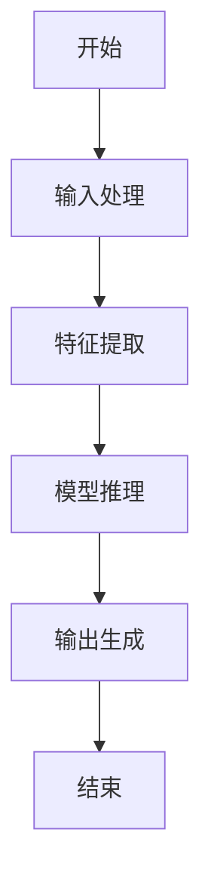
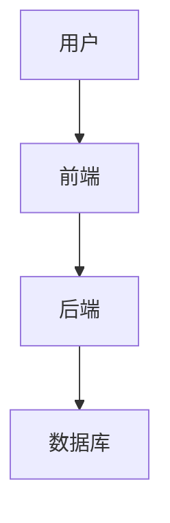
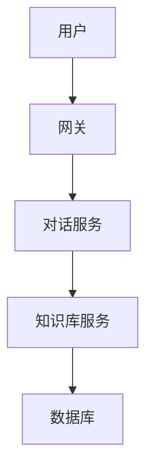

                 


---

# AI Agent的对话系统在智能客服中的进阶应用

> **关键词**：AI Agent、对话系统、智能客服、自然语言处理、深度学习

> **摘要**：  
> 本文深入探讨了AI Agent在对话系统中的应用，特别是其在智能客服领域的进阶应用。文章从AI Agent和对话系统的概念出发，分析了其算法原理、系统架构，并通过实际案例展示了AI Agent在智能客服中的具体实现。本文旨在为读者提供从理论到实践的全面指导，帮助他们理解并掌握AI Agent在智能客服中的核心技术和应用方法。

---

# 第一部分：AI Agent的对话系统基础

## 第1章：AI Agent与对话系统概述

### 1.1 问题背景与描述

#### 1.1.1 智能客服的发展历程  
传统客服以人工服务为主，存在效率低、成本高等问题。随着技术进步，智能客服逐步引入自动化的解决方案，经历了从规则匹配到深度学习的演变。  

#### 1.1.2 当前智能客服的主要挑战  
- 用户需求多样，对话复杂性高；  
- 对话系统理解能力不足，容易出现偏差；  
- 对话系统缺乏个性化和情境感知能力。  

#### 1.1.3 AI Agent在智能客服中的应用价值  
AI Agent通过自然语言处理和机器学习技术，能够实现高效、个性化的客服服务，显著提升用户体验和企业效率。  

---

### 1.2 AI Agent的核心概念与定义

#### 1.2.1 AI Agent的基本定义  
AI Agent是一种智能体，能够感知环境、理解用户需求，并通过自主决策提供服务。  

#### 1.2.2 对话系统的定义与分类  
对话系统是实现人与机器之间自然对话的系统，分为基于规则、统计和深度学习的对话系统。  

#### 1.2.3 AI Agent与对话系统的关联  
AI Agent通过对话系统与用户交互，利用自然语言处理技术理解用户需求，并通过对话生成技术提供反馈。  

---

### 1.3 AI Agent对话系统的边界与外延

#### 1.3.1 对话系统的功能边界  
- 用户身份验证；  
- 信息检索与查询；  
- 用户意图识别与需求分析。  

#### 1.3.2 AI Agent的应用场景外延  
- 电商客服；  
- 银行客服；  
- 医疗咨询。  

#### 1.3.3 对话系统的性能指标  
- 响应时间：系统对用户输入的响应速度；  
- 对话准确率：系统理解用户需求的准确性；  
- 用户满意度：用户对服务的满意程度。  

---

### 1.4 对话系统的概念结构与核心要素

#### 1.4.1 对话系统的组成要素  
- 用户：对话的发起者；  
- 系统：对话的核心处理单元；  
- 数据：对话所需的信息资源。  

#### 1.4.2 AI Agent的核心功能模块  
- 用户意图识别模块；  
- 对话管理模块；  
- 知识库管理模块。  

#### 1.4.3 对话系统的整体架构  
对话系统由输入处理、理解、生成和输出四个阶段组成，形成一个完整的对话循环。  

---

## 1.5 本章小结  
本章从AI Agent和对话系统的概念出发，分析了其在智能客服中的应用价值，并明确了对话系统的功能边界和整体架构。  

---

# 第二部分：AI Agent对话系统的算法原理

## 第2章：自然语言处理基础

### 2.1 自然语言处理的核心算法

#### 2.1.1 词袋模型  
词袋模型是一种简单有效的文本表示方法，将文本表示为词的集合。  

#### 2.1.2 TF-IDF算法  
TF-IDF（Term Frequency-Inverse Document Frequency）用于衡量词在文档中的重要性。  

#### 2.1.3 Word2Vec与GloVe  
Word2Vec通过神经网络学习词向量，GloVe基于全局词向量的优化。  

---

### 2.2 对话生成模型

#### 2.2.1 基于规则的对话生成  
通过预设规则和模板生成对话，适用于简单场景。  

#### 2.2.2 基于统计的对话生成  
利用统计方法预测对话的下一步，常见于马尔可夫链模型。  

#### 2.2.3 基于深度学习的对话生成  
使用循环神经网络（RNN）或Transformer模型生成对话，效果更自然。  

---

### 2.3 算法原理与流程图

#### 2.3.1 对话生成算法的流程图  


---

### 2.4 数学模型与公式

#### 2.4.1 词袋模型的概率计算  
$$ P(word) = \frac{count(word)}{total\_words} $$  

#### 2.4.2 TF-IDF公式  
$$ TF-IDF = TF \times IDF $$  

---

## 2.5 本章小结  
本章介绍了自然语言处理的核心算法及其在对话生成中的应用，重点分析了基于深度学习的对话生成模型。  

---

# 第三部分：AI Agent对话系统的系统架构

## 第3章：智能客服系统分析

### 3.1 问题场景介绍

#### 3.1.1 智能客服的典型场景  
用户通过对话系统咨询产品信息、售后服务等。  

#### 3.1.2 用户需求分析  
用户希望获得快速、准确、个性化的服务体验。  

#### 3.1.3 系统目标设定  
实现高效、智能的对话交互，提升用户体验和企业效率。  

---

### 3.2 系统功能设计

#### 3.2.1 用户意图识别模块  
通过自然语言处理技术识别用户需求，如查询订单状态。  

#### 3.2.2 对话管理模块  
负责对话的流程控制和上下文管理。  

#### 3.2.3 知识库管理模块  
存储和管理产品信息、常见问题等知识。  

---

### 3.3 系统架构设计

#### 3.3.1 分层架构设计  


#### 3.3.2 微服务架构设计  


---

### 3.4 系统接口设计

#### 3.4.1 系统接口设计  
定义API接口，如POST /api/v1/dialog。  

#### 3.4.2 系统交互设计  
使用序列图展示对话流程：  
```mermaid
sequenceDiagram
    participant 用户
    participant 系统
    用户 ->> 系统：查询订单状态  
    系统 ->> 数据库：获取订单信息  
    系统 ->> 用户：返回订单详情  
```

---

## 3.5 本章小结  
本章分析了智能客服系统的场景，设计了系统的功能模块和架构，并通过图表展示了系统的交互流程。  

---

# 第四部分：AI Agent对话系统的项目实战

## 第4章：电商客服系统的实现

### 4.1 项目介绍

#### 4.1.1 项目背景  
电商客服系统用于处理用户咨询、订单查询等事务。  

#### 4.1.2 项目目标  
实现一个高效、智能的电商客服系统。  

---

### 4.2 环境安装

#### 4.2.1 安装Python  
安装Python 3.8及以上版本。  

#### 4.2.2 安装依赖库  
使用pip安装：  
```bash
pip install numpy tensorflow transformers
```

---

### 4.3 核心代码实现

#### 4.3.1 对话生成模型代码  
```python
import tensorflow as tf
from tensorflow.keras import layers

# 模型定义
class DialogGenerator(tf.keras.Model):
    def __init__(self, vocab_size):
        super(DialogGenerator, self).__init__()
        self.embedding = layers.Embedding(vocab_size, 100)
        self.rnn = layers.LSTM(128, return_sequences=True)
        self.dense = layers.Dense(vocab_size, activation='softmax')

    def call(self, inputs):
        embedded = self.embedding(inputs)
        output = self.rnn(embedded)
        output = self.dense(output)
        return output
```

#### 4.3.2 对话管理模块代码  
```python
import json

def save_dialog_history(history):
    with open('dialog_history.json', 'w') as f:
        json.dump(history, f)
```

---

### 4.4 代码应用解读与分析

#### 4.4.1 对话生成模型的训练  
使用训练数据对模型进行训练，优化对话生成的准确率。  

#### 4.4.2 知识库的更新与维护  
定期更新知识库中的产品信息，确保系统准确性。  

---

## 4.5 本章小结  
本章通过电商客服系统的实现，展示了AI Agent对话系统的实际应用，详细讲解了代码实现和系统优化方法。  

---

# 第五部分：AI Agent对话系统的最佳实践

## 第5章：经验总结与优化建议

### 5.1 本章小结  
总结AI Agent对话系统的实现要点和优化方向。  

### 5.2 注意事项  
- 数据质量：确保训练数据的多样性和准确性；  
- 模型优化：定期更新模型，提升对话准确率；  
- 用户体验：注重对话的流畅性和个性化。  

### 5.3 拓展阅读  
推荐相关书籍和论文，供读者深入学习。  

---

# 结语  
AI Agent对话系统在智能客服中的应用前景广阔，随着技术的不断进步，其在提升用户体验和企业效率方面将发挥更大的作用。  

---

**作者：AI天才研究院/AI Genius Institute & 禅与计算机程序设计艺术/Zen And The Art of Computer Programming**

