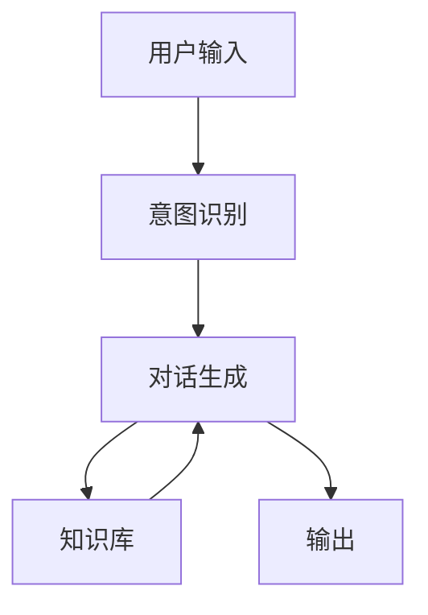

                 


# AI Agent的对话系统在虚拟助手中的进阶应用

> 关键词：AI Agent，对话系统，虚拟助手，自然语言处理，深度学习，生成对抗网络，强化学习

> 摘要：本文深入探讨了AI Agent在对话系统中的应用，特别是其在虚拟助手中的进阶应用。文章从AI Agent和对话系统的概念出发，分析了对话系统的分类与应用场景，详细讲解了对话系统的数学模型与算法原理，设计了AI Agent对话系统的架构，并通过项目实战展示了具体实现过程。最后，文章总结了最佳实践和未来发展方向。

---

## 第一部分: AI Agent的对话系统基础

### 第1章: AI Agent与对话系统概述

#### 1.1 AI Agent的基本概念

##### 1.1.1 AI Agent的定义与特点
AI Agent（人工智能代理）是指能够感知环境并采取行动以实现目标的智能体。AI Agent的特点包括自主性、反应性、目标导向和社交能力。AI Agent能够通过传感器获取信息，利用推理机制做出决策，并通过执行器与环境互动。

##### 1.1.2 对话系统的核心概念
对话系统是一种能够让机器理解和生成人类语言的技术。它包括自然语言理解（NLU）和自然语言生成（NLG）两个主要部分。对话系统的目的是通过模拟人类对话方式，提供更自然、更高效的交互体验。

##### 1.1.3 AI Agent与对话系统的关联
AI Agent可以通过对话系统与用户进行交互，理解用户的需求并提供相应的服务。对话系统为AI Agent提供了与人类交互的能力，而AI Agent则为对话系统提供了决策和执行的能力。

#### 1.2 对话系统的分类与应用场景

##### 1.2.1 基于规则的对话系统
基于规则的对话系统通过预定义的规则来匹配用户的输入，并生成相应的回复。这种系统简单易懂，适用于特定场景，如简单的客服对话。

##### 1.2.2 基于统计的对话系统
基于统计的对话系统利用概率模型来预测用户的意图，并生成相应的回复。这种系统能够处理更多的场景，但仍然受到数据质量和多样性的限制。

##### 1.2.3 基于深度学习的对话系统
基于深度学习的对话系统利用神经网络模型（如循环神经网络和变换器）来理解和生成对话内容。这种系统能够处理更复杂和多样化的对话，提供更自然的交互体验。

#### 1.3 虚拟助手的发展历程

##### 1.3.1 虚拟助手的起源与演变
虚拟助手的概念起源于20世纪90年代的语音助手，随着自然语言处理和机器学习技术的发展，虚拟助手逐渐从简单的指令处理发展为复杂的对话系统。

##### 1.3.2 当前主流虚拟助手的技术特点
当前主流的虚拟助手（如Siri、Alexa、Google Assistant）基于深度学习技术，能够理解上下文、进行多轮对话，并提供丰富的服务集成能力。

##### 1.3.3 虚拟助手的未来发展趋势
未来的虚拟助手将更加智能化、个性化，并具备更强的跨平台和多模态交互能力。

### 第2章: 对话系统的数学模型与算法原理

#### 2.1 对话系统的数学模型

##### 2.1.1 语言模型的数学基础
语言模型通过概率分布来描述词序列的可能性。常见的语言模型包括n-gram模型和基于神经网络的语言模型。

##### 2.1.2 对话系统的概率模型
对话系统的概率模型通过计算给定上下文和用户输入的条件下，生成合适回复的概率。常用的概率模型包括马尔可夫链和贝叶斯网络。

##### 2.1.3 基于图论的对话生成模型
基于图论的对话生成模型将对话过程视为图结构，通过节点和边来表示对话的状态和转移。

#### 2.2 常见对话算法原理

##### 2.2.1 基于生成对抗网络的对话生成
生成对抗网络（GAN）由生成器和判别器组成，生成器通过对抗训练生成逼真的对话内容，判别器则用于评估生成内容的真实性。

##### 2.2.2 基于变换器的对话生成
变换器模型通过自注意力机制和前馈网络来生成对话内容，能够捕捉长距离依赖关系，并具有并行计算的优势。

##### 2.2.3 基于强化学习的对话优化
强化学习通过奖励机制来优化对话系统的回复质量，通常使用策略梯度方法或Q-learning方法进行训练。

#### 2.3 对话系统的评价指标

##### 2.3.1 对话生成的评价指标
常见的对话生成评价指标包括BLEU、ROUGE和METEOR，这些指标基于生成文本与参考文本的相似性进行评估。

##### 2.3.2 对话理解的评价指标
对话理解的评价指标包括准确率、召回率和F1值，用于衡量系统对用户意图的理解程度。

##### 2.3.3 综合评价指标与优化方法
综合评价指标结合生成和理解的指标，通常采用加权平均的方法进行评估，并通过调参和模型优化来提升性能。

---

### 第3章: AI Agent的对话系统架构设计

#### 3.1 对话系统的整体架构

##### 3.1.1 用户意图识别模块
用户意图识别模块通过自然语言理解技术，识别用户的意图和需求，并将其转化为系统的内部表示。

##### 3.1.2 对话生成模块
对话生成模块基于用户意图和上下文信息，生成符合语境的回复内容。

##### 3.1.3 知识库与上下文管理模块
知识库存储对话相关的知识和信息，上下文管理模块负责维护对话的上下文信息，确保对话的连贯性和一致性。

#### 3.2 系统功能设计

##### 3.2.1 用户意图识别的功能设计
用户意图识别功能包括关键词匹配、句法分析和语义理解，能够处理用户的多样化的输入方式。

##### 3.2.2 对话生成的功能设计
对话生成功能包括回复生成、回复优化和多轮对话管理，确保生成的回复符合用户需求和对话逻辑。

##### 3.2.3 知识库与上下文管理的功能设计
知识库管理功能包括知识的存储、检索和更新，上下文管理功能包括对话历史记录和状态维护。

#### 3.3 系统架构图


---

### 第4章: 对话系统的算法实现

#### 4.1 基于生成对抗网络的对话生成

##### 4.1.1 GAN的基本原理
生成对抗网络由生成器和判别器组成，生成器通过对抗训练生成逼真的对话内容，判别器则用于评估生成内容的真实性。

##### 4.1.2 对话生成的GAN模型设计
对话生成的GAN模型包括生成器和判别器，生成器使用循环神经网络生成回复，判别器使用判别网络判断生成回复的真实性。

##### 4.1.3 模型训练与优化
GAN模型的训练采用交替优化策略，生成器和判别器轮流进行训练，通过梯度下降方法优化模型参数。

#### 4.2 基于变换器的对话生成

##### 4.2.1 变换器的基本结构
变换器模型包括编码器和解码器，编码器将输入序列转换为表示向量，解码器将表示向量生成目标序列。

##### 4.2.2 对话生成的变换器模型设计
对话生成的变换器模型在解码器部分引入自注意力机制，能够捕捉对话的长距离依赖关系。

##### 4.2.3 模型训练与优化
变换器模型的训练采用自回归策略，解码器在生成每个词时依赖于之前的生成结果。

#### 4.3 基于强化学习的对话优化

##### 4.3.1 强化学习的基本原理
强化学习通过奖励机制优化对话系统的回复质量，通常使用策略梯度方法或Q-learning方法进行训练。

##### 4.3.2 对话优化的强化学习模型设计
对话优化的强化学习模型将对话过程视为马尔可夫决策过程，通过状态、动作和奖励的定义进行模型设计。

##### 4.3.3 模型训练与优化
强化学习模型的训练采用策略梯度方法，通过梯度上升优化策略参数，最大化累计奖励。

---

### 第5章: 对话系统的项目实战

#### 5.1 环境搭建

##### 5.1.1 开发环境的选择与安装
推荐使用Python 3.8及以上版本，安装必要的开发工具和库，如Jupyter Notebook、PyCharm等。

##### 5.1.2 依赖库的安装与配置
安装必要的依赖库，如TensorFlow、Keras、PyTorch等，并配置环境变量。

#### 5.2 核心代码实现

##### 5.2.1 用户意图识别模块的实现
使用自然语言处理库（如spaCy或jieba）进行中文分词和词性标注，结合预训练模型进行意图分类。

##### 5.2.2 对话生成模块的实现
基于预训练的对话模型（如GPT-2或BERT）进行微调，实现对话生成功能。

##### 5.2.3 知识库与上下文管理模块的实现
使用数据库或知识图谱存储对话相关的知识和信息，通过上下文管理模块维护对话的连贯性。

#### 5.3 代码实现示例

##### 5.3.1 用户意图识别的代码示例
```python
import spacy

nlp = spacy.load("zh_core_web_sm")

def get_intent(text):
    doc = nlp(text)
    # 进行意图分类的逻辑
    return "intent"
```

##### 5.3.2 对话生成的代码示例
```python
import torch
import torch.nn as nn

class Transformer(nn.Module):
    def __init__(self, embed_dim, num_heads):
        super(Transformer, self).__init__()
        self.self_attention = nn.MultiheadAttention(embed_dim, num_heads)
    
    def forward(self, x, mask):
        out = self.self_attention(x, x, mask)
        return out
```

#### 5.4 案例分析与实际应用

##### 5.4.1 项目案例分析
通过具体的项目案例，分析对话系统的实现过程，包括数据准备、模型训练和系统集成等步骤。

##### 5.4.2 实际应用中的挑战与解决方案
讨论实际应用中可能遇到的挑战，如数据稀疏性、对话上下文的理解和维护等问题，并提出相应的解决方案。

#### 5.5 项目小结

##### 5.5.1 核心技术总结
总结对话系统的核心技术，包括自然语言理解、对话生成和知识库管理等。

##### 5.5.2 实践中的经验与教训
分享项目实施过程中的经验与教训，提出改进建议和未来发展方向。

---

## 第二部分: 总结与展望

### 第6章: 总结与最佳实践

#### 6.1 总结
总结本文的主要内容，包括AI Agent与对话系统的概念、对话系统的分类与应用场景、对话系统的数学模型与算法原理、AI Agent对话系统的架构设计以及项目实战等内容。

#### 6.2 最佳实践
提出一些实际应用中的最佳实践，如数据准备、模型优化、系统集成和用户体验设计等方面。

#### 6.3 小结
简要回顾本文的核心内容，强调AI Agent在对话系统中的重要性，以及其在虚拟助手中的广泛应用。

### 第7章: 未来展望

#### 7.1 未来的技术发展
预测对话系统和AI Agent技术的未来发展趋势，包括更先进的算法、更强大的计算能力和更广泛的应用场景。

#### 7.2 挑战与机遇
分析对话系统在实际应用中面临的挑战，如数据隐私、多语言支持和跨平台集成等问题，同时指出这些挑战也带来了新的机遇。

#### 7.3 结束语
总结全文，强调对话系统在AI Agent和虚拟助手中的重要作用，展望未来的应用前景。

---

## 作者：AI天才研究院/AI Genius Institute & 禅与计算机程序设计艺术 /Zen And The Art of Computer Programming

