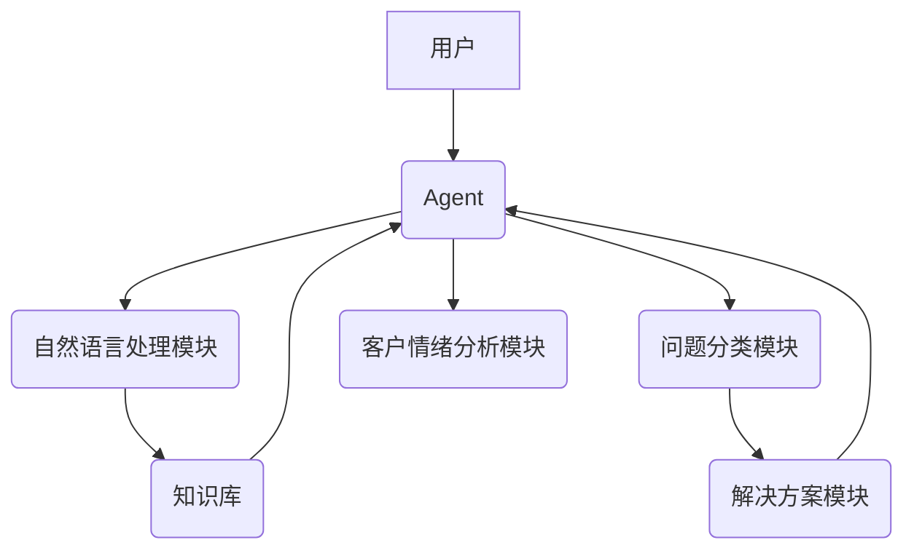
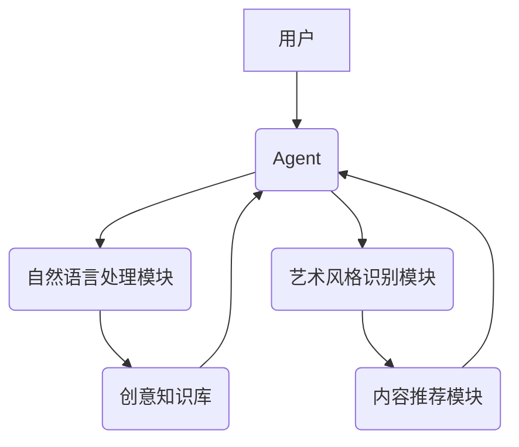
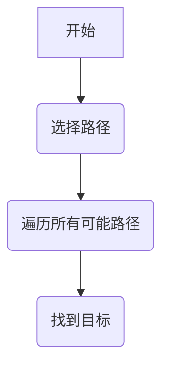
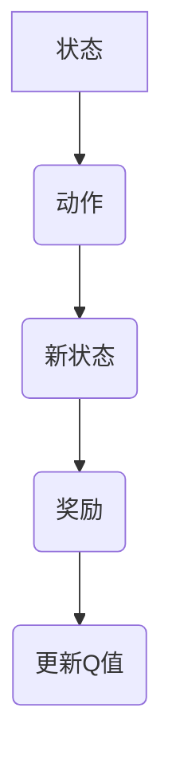
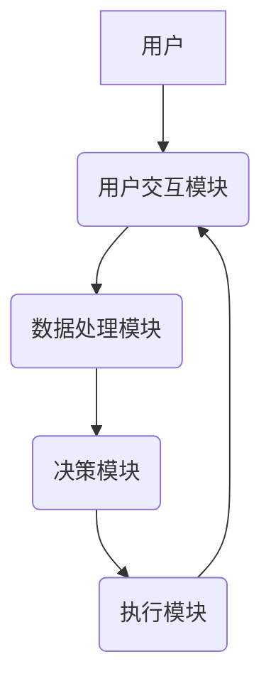

                 


# AI Agent的应用场景：从客服到创意助手

> 关键词：AI Agent、人工智能、智能客服、创意助手、应用场景、系统架构

> 摘要：本文探讨AI Agent在客服和创意助手中的应用场景，分析其背后的技术原理和系统架构，结合实际案例和项目实战，全面解析AI Agent在不同领域的应用价值与实现方案。

---

## 第一章: AI Agent的核心概念与应用场景

### 1.1 AI Agent的基本定义

AI Agent，即人工智能代理，是一种能够感知环境、自主决策并执行任务的智能系统。AI Agent通过接收输入、分析数据、做出决策并执行操作，为用户提供智能化的服务。AI Agent的应用范围广泛，包括客服、推荐系统、智能助手等领域。

### 1.2 AI Agent的核心特征

AI Agent具有以下核心特征：
1. **自主性**：AI Agent能够自主决策，无需人工干预。
2. **反应性**：能够实时感知环境并做出反应。
3. **学习能力**：通过数据和经验不断优化性能。
4. **交互性**：能够与用户进行自然语言交流。

### 1.3 AI Agent的应用场景

AI Agent在多个领域都有广泛应用，包括：
1. **智能客服**：通过自然语言处理技术为用户提供24/7的咨询服务。
2. **推荐系统**：基于用户行为推荐个性化的内容或产品。
3. **创意助手**：帮助用户生成创意内容，如文案、设计灵感等。

### 1.4 AI Agent的技术背景

AI Agent的实现依赖于多种人工智能技术，包括：
1. **自然语言处理（NLP）**：用于理解和生成人类语言。
2. **机器学习（ML）**：用于模型训练和优化。
3. **强化学习（RL）**：用于决策优化和策略调整。

---

## 第二章: AI Agent在客服中的应用

### 2.1 客服领域的痛点与需求

传统客服系统存在以下问题：
1. **效率低**：人工客服处理问题速度慢，响应时间长。
2. **成本高**：需要大量人工投入，运营成本高。
3. **覆盖不足**：难以实现24/7的全天候服务。

AI Agent的引入可以有效解决这些问题，提供更高效、更智能的客服服务。

### 2.2 AI Agent在客服中的具体应用

#### 2.2.1 智能问答系统

AI Agent通过自然语言处理技术，能够理解用户的问题并提供准确的答案。例如，用户询问产品信息或售后服务，AI Agent可以快速匹配知识库中的相关信息并生成回答。

#### 2.2.2 自动化问题解决

AI Agent能够根据用户描述的问题，自动识别问题类型并调用相应的解决方案。例如，用户反馈订单问题，AI Agent可以直接调用订单管理系统进行处理。

#### 2.2.3 客户情绪分析

AI Agent可以通过分析用户的语言和语气，识别客户的情绪状态。例如，当用户表现出不满时，AI Agent可以优先处理并升级问题到人工客服。

### 2.3 客服AI Agent的实现案例

#### 2.3.1 系统架构设计

以下是客服AI Agent的系统架构设计：



#### 2.3.2 核心功能模块

1. **自然语言处理模块**：负责理解和生成自然语言。
2. **知识库**：存储产品信息、常见问题解答等。
3. **问题分类模块**：根据问题类型调用相应的解决方案。
4. **客户情绪分析模块**：分析客户情绪并调整响应策略。

---

## 第三章: AI Agent在创意助手中的应用

### 3.1 创意领域的痛点与需求

传统创意过程存在以下问题：
1. **效率低下**：创意人员需要花费大量时间寻找灵感和素材。
2. **资源不足**：缺乏足够的数据支持，创意输出受限。
3. **个性化不足**：难以满足不同用户的个性化需求。

AI Agent的引入可以为创意人员提供智能化的支持，帮助他们更高效地完成创意工作。

### 3.2 AI Agent在创意助手中的具体应用

#### 3.2.1 文案生成与优化

AI Agent可以根据用户提供的关键词生成文案，并根据反馈不断优化内容。例如，用户输入“健康生活”，AI Agent可以生成相关的健康生活方式文案。

#### 3.2.2 艺术创作辅助

AI Agent可以通过分析用户提供的艺术风格，生成相应的艺术作品。例如，用户选择“梵高风格”，AI Agent可以生成类似梵高的绘画风格的作品。

#### 3.2.3 内容推荐系统

AI Agent可以根据用户的兴趣和行为，推荐相关的内容。例如，用户喜欢科技类文章，AI Agent可以推荐相关的科技新闻和深度分析。

### 3.3 创意AI Agent的实现案例

#### 3.3.1 系统架构设计

以下是创意助手AI Agent的系统架构设计：



#### 3.3.2 核心功能模块

1. **自然语言处理模块**：负责理解和生成自然语言。
2. **创意知识库**：存储艺术风格、文案模板等。
3. **艺术风格识别模块**：根据用户输入识别艺术风格。
4. **内容推荐模块**：根据用户兴趣推荐相关内容。

---

## 第四章: AI Agent的算法原理

### 4.1 AI Agent的算法选择

AI Agent的算法选择取决于具体应用场景。常见的算法包括：
1. **搜索算法**：用于任务规划和路径搜索。
2. **强化学习**：用于决策优化和策略调整。

### 4.2 搜索算法原理

搜索算法通过生成可能的解决方案并选择最优解。以下是深度优先搜索（DFS）的示例：



### 4.3 强化学习原理

强化学习通过奖励机制优化决策策略。以下是Q-learning算法的示例：



### 4.4 算法实现案例

以下是搜索算法的Python代码示例：

```python
def dfs(current_path, visited, target):
    if current_path[-1] == target:
        return current_path
    for neighbor in neighbors[current_path[-1]]:
        if neighbor not in visited:
            visited.add(neighbor)
            result = dfs(current_path + [neighbor], visited, target)
            if result:
                return result
    return None
```

---

## 第五章: AI Agent的系统架构设计

### 5.1 系统功能设计

AI Agent的系统功能设计包括：
1. **用户交互模块**：负责与用户进行交互。
2. **数据处理模块**：负责数据的采集和处理。
3. **决策模块**：负责根据数据做出决策。

### 5.2 系统架构设计

以下是AI Agent的系统架构设计：



### 5.3 接口设计

AI Agent的接口设计包括：
1. **用户接口**：用于用户与AI Agent交互。
2. **数据接口**：用于数据的输入和输出。
3. **第三方接口**：用于调用外部服务。

---

## 第六章: 项目实战

### 6.1 客服系统实战

#### 6.1.1 环境安装

安装所需的Python库：

```bash
pip install python-dotenv
pip install transformers
pip install numpy
```

#### 6.1.2 核心代码实现

以下是客服系统的Python代码示例：

```python
from transformers import AutoTokenizer, AutoModelForSeq2Seq
import torch

tokenizer = AutoTokenizer.from_pretrained('facebook/bart-large')
model = AutoModelForSeq2Seq.from_pretrained('facebook/bart-large')

def generate_response(input_text):
    inputs = tokenizer.encode(input_text, return_tensors='pt')
    outputs = model.generate(inputs, max_length=50)
    response = tokenizer.decode(outputs[0], skip_special_tokens=True)
    return response
```

#### 6.1.3 案例分析

分析用户输入并生成响应：

```python
input_text = "What is the company policy on remote work?"
response = generate_response(input_text)
print(response)
```

---

## 第七章: 总结与展望

### 7.1 总结

AI Agent在客服和创意助手中的应用展现了其强大的潜力和价值。通过自然语言处理、机器学习等技术，AI Agent能够为用户提供智能化的服务，提升效率和体验。

### 7.2 注意事项

在实际应用中，需要注意数据隐私、模型优化和用户体验等问题。

### 7.3 未来展望

随着人工智能技术的不断发展，AI Agent的应用场景将更加广泛，功能也将更加智能化和个性化。

---

## 附录

### 附录A: 术语表

1. **AI Agent**：人工智能代理。
2. **NLP**：自然语言处理。
3. **ML**：机器学习。
4. **RL**：强化学习。

### 附录B: 参考文献

1. 禅与计算机程序设计艺术
2. AI Agent相关技术文献

---

作者：AI天才研究院/AI Genius Institute & 禅与计算机程序设计艺术/Zen And The Art of Computer Programming

