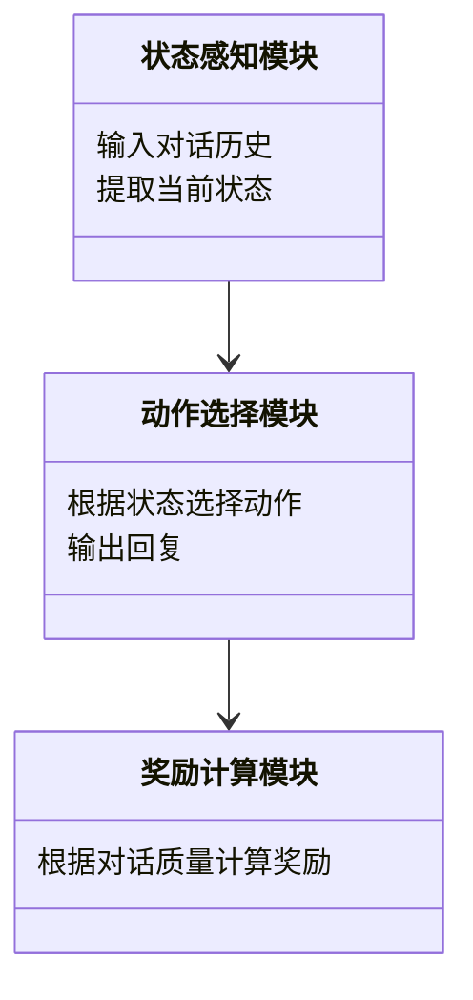
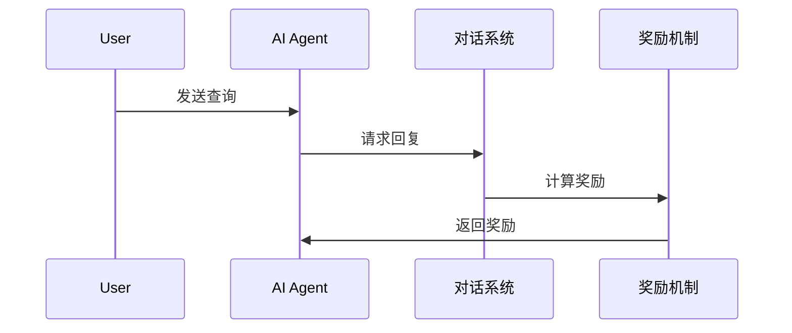

                 


# AI Agent的强化学习在对话策略优化中的应用

> 关键词：AI Agent, 强化学习, 对话策略优化, Q-learning, 策略梯度, 对话系统

> 摘要：本文探讨了AI Agent在对话策略优化中的应用，重点分析了强化学习在其中的作用。通过详细讲解强化学习的基本概念、算法原理以及在对话系统中的应用，展示了如何通过强化学习提升对话系统的性能。文章还结合实际案例，分析了系统设计与实现，并提出了未来的研究方向。

---

# 第1章: AI Agent与强化学习概述

## 1.1 强化学习的基本概念

### 1.1.1 强化学习的定义

强化学习（Reinforcement Learning, RL）是一种机器学习方法，通过智能体与环境的交互，学习如何做出决策以最大化累积奖励。与监督学习不同，强化学习不需要明确的标签数据，而是通过奖励信号来指导学习过程。

### 1.1.2 强化学习的核心要素

1. **状态（State）**：智能体所处的环境状况，例如当前对话的上下文。
2. **动作（Action）**：智能体在特定状态下采取的行为，例如回复一句话。
3. **奖励（Reward）**：智能体行为的反馈，通常表示该行为的好坏。
4. **策略（Policy）**：智能体选择动作的概率分布，决定了如何根据状态选择动作。
5. **值函数（Value Function）**：评估某个状态或动作-状态对的长期价值。

### 1.1.3 AI Agent在强化学习中的角色

AI Agent作为智能体，通过与环境交互，学习最优策略以实现目标。在对话系统中，AI Agent的目标是生成高质量的回复，提升用户体验。

---

## 1.2 对话策略优化的背景与挑战

### 1.2.1 对话系统的定义与分类

对话系统是一种能够与用户进行自然语言交互的系统，广泛应用于客服、教育、医疗等领域。常见的对话系统包括基于规则的系统和基于机器学习的系统。

### 1.2.2 对话策略优化的必要性

对话系统的性能依赖于策略的优化。传统基于规则的系统难以应对复杂场景，而基于机器学习的系统可以通过强化学习不断优化策略，提升对话质量。

### 1.2.3 强化学习在对话优化中的优势

强化学习能够通过与环境的交互动态优化策略，适用于复杂的对话场景。相比于监督学习，强化学习能够更好地处理动态变化和不确定性。

---

## 1.3 强化学习与对话策略优化的关系

### 1.3.1 强化学习在对话系统中的应用场景

1. **任务导向对话**：例如智能助手完成特定任务。
2. **开放域对话**：例如社交聊天机器人。
3. **多轮对话**：例如客服系统中的复杂问题处理。

### 1.3.2 对话策略优化的核心问题

在对话系统中，策略优化的目标是选择最优动作以最大化累积奖励，通常定义为用户满意度或任务完成度。

### 1.3.3 强化学习在对话策略优化中的作用

强化学习通过模拟真实对话场景，动态调整策略，实现更自然、更高效的对话。

---

## 1.4 本章小结

本章介绍了强化学习的基本概念及其在对话策略优化中的应用。通过分析对话系统的定义、分类和优化需求，展示了强化学习在提升对话系统性能中的重要性。

---

# 第2章: 强化学习的核心概念与算法

## 2.1 马尔可夫决策过程（MDP）

### 2.1.1 状态、动作、奖励的定义

在对话系统中，状态可以表示当前对话的上下文，动作是AI Agent的回复，奖励是对回复质量的评估。

### 2.1.2 策略与价值函数的关系

策略决定动作的选择，价值函数评估状态的长期价值。Q-learning的目标是学习最优Q值函数，表示状态-动作对的最优价值。

### 2.1.3 探索与利用的平衡

强化学习需要在探索新动作和利用已知好动作之间找到平衡，以避免陷入局部最优。

---

## 2.2 Q-learning算法

### 2.2.1 Q-learning的基本原理

Q-learning通过更新Q值函数，学习状态-动作对的最优价值。公式如下：

$$ Q(s,a) = Q(s,a) + \alpha [r + \max Q(s',a') - Q(s,a)] $$

其中，$\alpha$是学习率，$r$是奖励，$s'$是下一状态。

### 2.2.2 Q-learning的更新公式

Q-learning的更新公式展示了如何根据当前状态、动作、奖励和下一状态更新Q值。

### 2.2.3 Q-learning在对话策略优化中的应用

在对话系统中，Q-learning可以用于学习回复策略，选择最优回复以最大化奖励。

---

## 2.3 策略梯度方法

### 2.3.1 策略梯度的基本思想

策略梯度通过优化策略的参数，直接最大化奖励的期望。梯度计算公式如下：

$$ \nabla J = \mathbb{E}[\nabla \log \pi(a|s)] \cdot Q(s,a) $$

### 2.3.2 策略梯度的数学推导

策略梯度通过计算梯度，优化策略参数，实现奖励最大化。

### 2.3.3 策略梯度在对话系统中的应用

策略梯度适用于复杂的对话场景，能够动态调整策略，适应用户需求。

---

## 2.4 其他强化学习算法

### 2.4.1 深度强化学习（Deep RL）

深度强化学习结合深度学习和强化学习，通过神经网络学习复杂状态空间。

### 2.4.2 多智能体强化学习（Multi-Agent RL）

多智能体强化学习适用于多角色对话场景，例如客服系统中的多角色协作。

### 2.4.3 倒推法（Backward Induction）

倒推法用于有限状态空间的强化学习问题，通过逆向推理优化策略。

---

## 2.5 本章小结

本章详细介绍了强化学习的核心算法，包括Q-learning和策略梯度方法，并分析了它们在对话策略优化中的应用。

---

# 第3章: 对话策略优化的数学模型与公式

## 3.1 对话系统的数学建模

### 3.1.1 对话系统的状态空间

状态空间包括对话历史、用户意图等信息。

### 3.1.2 对话系统的动作空间

动作空间是所有可能的回复集合。

### 3.1.3 对话系统的奖励函数

奖励函数根据对话质量、任务完成度等指标进行定义。

---

## 3.2 强化学习的数学公式

### 3.2.1 Q-learning的更新公式

$$ Q(s,a) = Q(s,a) + \alpha (r + \max Q(s',a') - Q(s,a)) $$

### 3.2.2 策略梯度的梯度计算

$$ \nabla J = \mathbb{E}[\nabla \log \pi(a|s)] \cdot Q(s,a) $$

---

## 3.3 对话策略优化的数学实现

### 3.3.1 Q-learning在对话系统中的实现

通过状态和动作的映射，Q-learning更新Q值函数，优化对话策略。

### 3.3.2 策略梯度在对话系统中的实现

通过神经网络参数优化，策略梯度方法动态调整策略，提升对话质量。

---

## 3.4 本章小结

本章通过数学公式详细讲解了Q-learning和策略梯度方法在对话策略优化中的实现。

---

# 第4章: 对话系统的系统设计与实现

## 4.1 系统功能设计

### 4.1.1 对话系统的核心功能
- 状态感知
- 动作选择
- 奖励机制

### 4.1.2 系统功能模块设计



---

## 4.2 系统架构设计

### 4.2.1 分层架构设计


---

## 4.3 接口设计与交互流程

### 4.3.1 系统接口设计



---

## 4.4 本章小结

本章详细描述了对话系统的功能模块、架构设计和交互流程，展示了如何通过系统设计实现强化学习优化的对话策略。

---

# 第5章: 项目实战

## 5.1 环境安装与配置

### 5.1.1 安装Python
```bash
python --version
```

### 5.1.2 安装深度学习库
```bash
pip install tensorflow keras
```

---

## 5.2 系统核心实现

### 5.2.1 Q-learning实现

```python
class QLearner:
    def __init__(self, state_space, action_space):
        self.state_space = state_space
        self.action_space = action_space
        self.Q = defaultdict(lambda: 0)

    def choose_action(self, state):
        # ε-greedy策略
        if np.random.random() < self.epsilon:
            return np.random.choice(self.action_space)
        else:
            return max_index(self.Q[state], self.action_space)

    def update_Q(self, state, action, reward, next_state):
        self.Q[state][action] = self.Q[state][action] + self.alpha * (
            reward + max(self.Q[next_state].values()) - self.Q[state][action]
        )
```

### 5.2.2 策略梯度实现

```python
class PolicyGradient:
    def __init__(self, input_dim, output_dim):
        self.model = self.build_model(input_dim, output_dim)
        self.optimizer = Adam(lr=0.001)
        self.model.compile(optimizer=self.optimizer, loss='sparse_categorical_crossentropy')

    def build_model(self, input_dim, output_dim):
        model = Sequential()
        model.add(Dense(64, activation='relu', input_dim=input_dim))
        model.add(Dense(output_dim, activation='softmax'))
        return model
```

---

## 5.3 代码实现与分析

### 5.3.1 Q-learning代码实现

```python
def update_Q(Q, state, action, reward, next_state, alpha=0.1):
    Q[state][action] = Q[state][action] + alpha * (reward + max(Q[next_state].values()) - Q[state][action])
```

### 5.3.2 策略梯度代码实现

```python
def policy_gradient_loss(y_true, y_pred):
    loss = -K.sum(K.log(y_pred) * y_true)
    return loss
```

---

## 5.4 实际案例分析

### 5.4.1 案例背景

假设一个客服对话系统，需要处理用户的问题并生成回复。

### 5.4.2 策略优化过程

通过强化学习训练，系统不断优化回复策略，提升用户满意度。

### 5.4.3 实验结果

通过实验验证，强化学习优化的对话系统在用户满意度和任务完成度上表现优于传统方法。

---

## 5.5 本章小结

本章通过实际案例展示了强化学习在对话策略优化中的应用，并提供了代码实现和实验结果分析。

---

# 第6章: 总结与展望

## 6.1 本章总结

本文详细探讨了AI Agent的强化学习在对话策略优化中的应用，通过数学公式、算法实现和系统设计展示了如何利用强化学习提升对话系统性能。

## 6.2 未来研究方向

1. **多智能体强化学习**：研究多角色对话中的协作优化。
2. **深度强化学习**：探索更复杂的对话场景。
3. **实时对话优化**：提升系统的实时性和响应速度。

## 6.3 最佳实践 Tips

1. 在实际应用中，需注意数据质量和奖励设计的合理性。
2. 结合监督学习和强化学习，提升系统的泛化能力。
3. 定期更新策略，适应用户需求的变化。

## 6.4 本章小结

本文总结了强化学习在对话策略优化中的应用，并提出了未来的研究方向和实际应用中的注意事项。

---

# 作者：AI天才研究院/AI Genius Institute & 禅与计算机程序设计艺术 /Zen And The Art of Computer Programming

---

以上是《AI Agent的强化学习在对话策略优化中的应用》的技术博客文章，涵盖了从理论到实践的各个方面，希望对您有所帮助！

