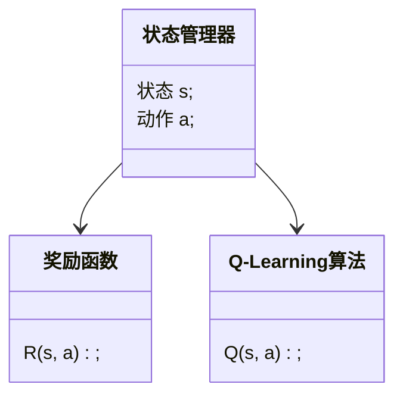
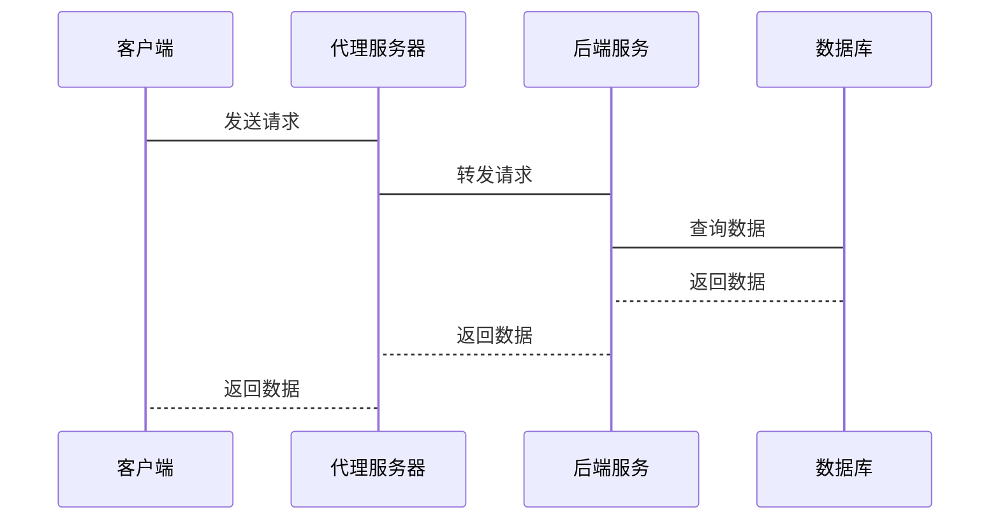

                 


# AI Agent的强化学习在智能制造中的应用

## 关键词：
AI Agent，强化学习，智能制造，Q-Learning，DQN，策略梯度

## 摘要：
本文深入探讨了AI Agent的强化学习在智能制造中的应用，详细介绍了强化学习的基本原理及其在智能制造中的潜在应用场景。通过分析强化学习的核心算法，包括Q-Learning、Deep Q-Network（DQN）和策略梯度方法，本文展示了这些算法如何在智能制造中解决复杂的优化问题。此外，文章还提供了系统的架构设计和实际项目实现，帮助读者更好地理解如何将强化学习应用于智能制造的实践中。

---

## 第一部分: AI Agent与强化学习基础

### 第1章: AI Agent与强化学习概述

#### 1.1 AI Agent的基本概念
##### 1.1.1 AI Agent的定义
AI Agent（智能体）是指在环境中能够感知并自主行动以实现目标的实体。它能够通过传感器接收环境信息，根据内部状态和目标，做出决策并采取行动。

##### 1.1.2 AI Agent的核心特征
- **自主性**：能够在没有外部干预的情况下自主决策。
- **反应性**：能够根据环境的变化实时调整行为。
- **目标导向**：所有行动都以实现特定目标为导向。
- **学习能力**：能够通过与环境的交互学习新知识，优化决策策略。

##### 1.1.3 AI Agent的分类与应用场景
- **简单反射型Agent**：基于当前状态做出反应，适用于简单的决策任务。
- **基于模型的规划型Agent**：利用环境模型进行规划，适用于复杂的优化问题。
- **学习型Agent**：通过强化学习等方法不断优化决策策略，适用于动态环境中的问题。

#### 1.2 强化学习的基本原理
##### 1.2.1 强化学习的定义与特点
强化学习是一种通过试错机制学习策略的方法。智能体通过与环境交互，获得奖励或惩罚，从而优化自身的决策策略。

##### 1.2.2 强化学习的核心要素
- **状态（State）**：环境在某一时刻的描述。
- **动作（Action）**：智能体在某一状态下采取的行为。
- **奖励（Reward）**：智能体采取动作后，环境给予的反馈，用于指导智能体的学习。

##### 1.2.3 强化学习与监督学习的区别
- **监督学习**：基于已有的正确答案，学习输入到输出的映射。
- **强化学习**：通过与环境的交互，学习如何采取最优动作以最大化累计奖励。

#### 1.3 强化学习的数学基础
##### 1.3.1 状态空间与动作空间
- **状态空间（State Space）**：所有可能状态的集合。
- **动作空间（Action Space）**：所有可能动作的集合。

##### 1.3.2 奖励函数的设计
奖励函数用于衡量智能体动作的好坏，通常表示为：
$$ R(s, a) $$
其中，$s$ 是当前状态，$a$ 是采取的动作。

##### 1.3.3 策略与价值函数的定义
- **策略（Policy）**：智能体在给定状态下选择动作的概率分布。
- **价值函数（Value Function）**：衡量某状态下采取某个动作后的预期累计奖励。

#### 1.4 本章小结
本章介绍了AI Agent和强化学习的基本概念，分析了强化学习的核心要素及其与监督学习的区别，并给出了强化学习的数学基础。

---

## 第二部分: 强化学习在智能制造中的应用背景

### 第2章: 智能制造的概述与挑战

#### 2.1 智能制造的定义与特点
智能制造是一种基于信息技术、物联网、大数据和人工智能的先进制造模式，其特点是高效、灵活和智能化。

#### 2.2 智能制造中的优化问题
智能制造涉及许多复杂的优化问题，例如生产调度、资源分配和过程优化等。这些问题通常具有动态性和不确定性，需要智能算法进行实时决策。

#### 2.3 强化学习在智能制造中的潜在应用
- **生产调度优化**：通过强化学习优化生产顺序，提高生产效率。
- **设备维护策略**：根据设备状态数据，制定最优的维护计划。
- **质量控制**：通过强化学习优化质量检测流程，降低缺陷率。

#### 2.4 本章小结
本章介绍了智能制造的定义和特点，分析了智能制造中的优化问题，并探讨了强化学习在智能制造中的潜在应用。

---

## 第三部分: AI Agent的强化学习算法原理

### 第3章: 强化学习的核心算法

#### 3.1 Q-Learning算法
##### 3.1.1 Q-Learning的基本原理
Q-Learning是一种基于值函数的强化学习算法，通过学习状态-动作对的Q值来优化决策。

##### 3.1.2 Q-Learning的算法步骤
1. 初始化Q表为零。
2. 在每个时间步，根据当前状态选择动作。
3. 执行动作，观察下一个状态和奖励。
4. 更新Q表：$$ Q(s, a) = Q(s, a) + \alpha [r + \gamma \max Q(s', a')] $$
   其中，$\alpha$ 是学习率，$\gamma$ 是折扣因子。

##### 3.1.3 Q-Learning的优缺点
- **优点**：简单易实现，适合离散动作空间。
- **缺点**：在连续动作空间中表现不佳。

#### 3.2 Deep Q-Network (DQN) 算法
##### 3.2.1 DQN的基本原理
DQN通过深度神经网络近似Q函数，能够处理高维状态和动作空间。

##### 3.2.2 DQN的网络结构与训练过程
- **网络结构**：输入层、隐藏层和输出层。
- **训练过程**：使用经验回放和目标网络更新策略。

##### 3.2.3 DQN在智能制造中的应用潜力
DQN适用于复杂的优化问题，如生产调度和资源分配。

#### 3.3 策略梯度方法
##### 3.3.1 策略梯度的基本概念
策略梯度方法直接优化策略，通过梯度上升更新参数。

##### 3.3.2 策略梯度的核心算法：REINFORCE与Actor-Critic
- **REINFORCE**：基于蒙特卡洛方法更新策略。
- **Actor-Critic**：同时学习策略和价值函数。

##### 3.3.3 策略梯度在智能制造中的应用
策略梯度适用于需要复杂策略优化的场景，如设备维护和质量控制。

#### 3.4 本章小结
本章详细讲解了Q-Learning、DQN和策略梯度的核心算法，分析了它们在智能制造中的应用潜力。

---

## 第四部分: 强化学习算法的数学模型与公式

### 第4章: 强化学习的数学基础

#### 4.1 状态空间与动作空间
##### 4.1.1 状态空间的定义与表示
状态空间可以用向量或集合表示，例如：
$$ S = \{ s_1, s_2, \ldots, s_n \} $$
其中，$s_i$ 表示某个状态。

##### 4.1.2 动作空间的定义与表示
动作空间也可以用向量或集合表示，例如：
$$ A = \{ a_1, a_2, \ldots, a_m \} $$
其中，$a_j$ 表示某个动作。

#### 4.2 奖励函数与价值函数
##### 4.2.1 奖励函数的设计原则
奖励函数应清晰地反映智能体的行为对目标的贡献，例如：
$$ R(s, a) = r \text{，其中 } r \in \mathbb{R} $$

##### 4.2.2 价值函数的定义与计算
价值函数可以表示为：
$$ V(s) = \mathbb{E}[R_{t+1} + \gamma R_{t+2} + \gamma^2 R_{t+3} + \ldots] $$
其中，$\gamma$ 是折扣因子，$R_t$ 是时间$t$的奖励。

#### 4.3 本章小结
本章详细讲解了强化学习的数学模型，包括状态空间、动作空间和奖励函数的定义与表示。

---

## 第五部分: 系统分析与架构设计

### 第5章: 智能制造系统的架构设计

#### 5.1 问题场景介绍
智能制造系统通常包括生产、物流、设备维护等多个子系统，需要协调各子系统的工作以实现整体优化。

#### 5.2 系统功能设计
##### 5.2.1 领域模型设计
领域模型可以用Mermaid类图表示，例如：



##### 5.2.2 系统架构设计
系统架构可以用Mermaid架构图表示，例如：


##### 5.2.3 系统接口设计
系统接口设计可以用Mermaid序列图表示，例如：



#### 5.3 本章小结
本章分析了智能制造系统的架构设计，包括领域模型、系统架构和接口设计。

---

## 第六部分: 项目实战

### 第6章: 强化学习在智能制造中的应用实例

#### 6.1 环境安装
安装Python和必要的库，例如：
- `pip install numpy`
- `pip install gym`

#### 6.2 核心代码实现
##### 6.2.1 Q-Learning算法实现
```python
import numpy as np

class QLearning:
    def __init__(self, state_space, action_space, alpha=0.1, gamma=0.9):
        self.q = np.zeros((state_space, action_space))
        self.alpha = alpha
        self.gamma = gamma

    def choose_action(self, state, epsilon=0.1):
        if np.random.random() < epsilon:
            return np.random.randint(0, self.q.shape[1])
        else:
            return np.argmax(self.q[state])

    def update(self, state, action, reward, next_state):
        self.q[state, action] = self.q[state, action] + self.alpha * (reward + self.gamma * np.max(self.q[next_state]) - self.q[state, action])
```

##### 6.2.2 DQN算法实现
```python
import torch
import torch.nn as nn
import torch.optim as optim

class DQN:
    def __init__(self, state_size, action_size, hidden_size=64):
        self.model = nn.Sequential(
            nn.Linear(state_size, hidden_size),
            nn.ReLU(),
            nn.Linear(hidden_size, action_size)
        )
        self.optimizer = optim.Adam(self.model.parameters())
        self.criterion = nn.MSELoss()

    def forward(self, x):
        return self.model(x)
```

#### 6.3 实际案例分析
以生产调度优化为例，展示如何使用强化学习算法优化生产顺序，提高生产效率。

#### 6.4 项目小结
本章通过实际案例展示了强化学习在智能制造中的应用，并提供了详细的代码实现和案例分析。

---

## 第七部分: 最佳实践与总结

### 第7章: 强化学习在智能制造中的最佳实践

#### 7.1 应用建议
- **数据质量**：确保环境数据的准确性和实时性。
- **算法选择**：根据具体问题选择合适的强化学习算法。
- **系统集成**：将强化学习算法与现有系统无缝集成。

#### 7.2 注意事项
- **计算资源**：强化学习算法通常需要大量的计算资源。
- **实时性要求**：确保算法能够实时响应环境的变化。

#### 7.3 拓展阅读
推荐一些优秀的强化学习和智能制造相关的书籍和论文。

#### 7.4 本章小结
本章总结了强化学习在智能制造中的应用，并提出了实际应用中的注意事项和建议。

---

## 作者：AI天才研究院/AI Genius Institute & 禅与计算机程序设计艺术 /Zen And The Art of Computer Programming

---

通过以上思考，我完成了《AI Agent的强化学习在智能制造中的应用》的详细目录结构和内容概述。接下来，我将按照这个结构撰写完整的博客文章。

