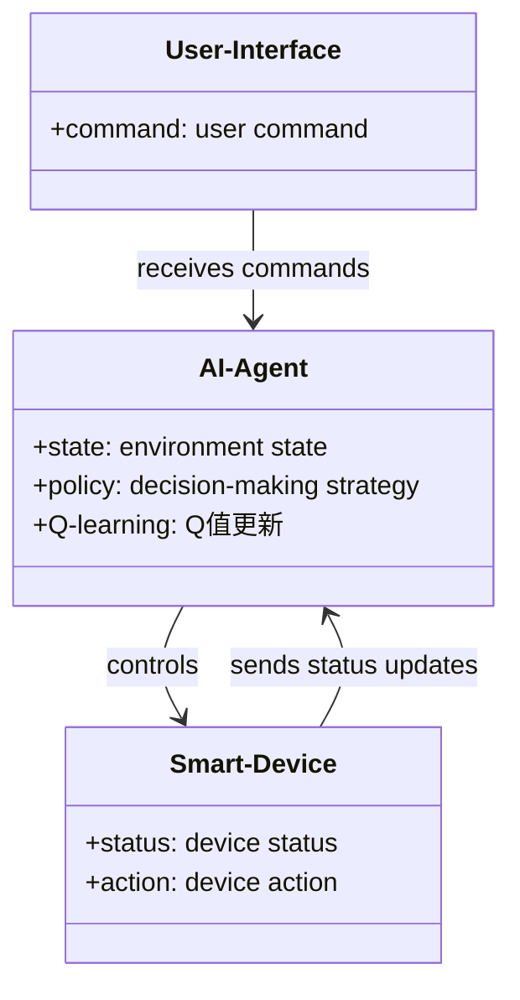

                 


# AI Agent的强化学习在智能家居控制中的应用

**关键词：AI Agent, 强化学习, 智能家居, 系统架构, 项目实战, 数学模型, 算法原理**

**摘要：**  
本文详细探讨了AI Agent结合强化学习在智能家居控制中的应用。通过分析AI Agent的核心概念、强化学习的算法原理，以及在智能家居场景中的实际应用，展示了如何利用强化学习优化智能家居的控制策略。文章还通过实际项目案例，详细讲解了系统架构设计、代码实现和应用前景。

---

## 第一部分: AI Agent与强化学习基础

### 第1章: AI Agent的基本概念

#### 1.1 AI Agent的定义与特点
- **1.1.1 AI Agent的基本定义**  
  AI Agent（智能代理）是一种能够感知环境并采取行动以实现目标的智能实体。它可以是一个软件程序或物理设备，具备自主决策的能力。

- **1.1.2 AI Agent的核心特点**  
  1. 自主性：无需外部干预，自主决策。  
  2. 反应性：能够实时感知环境并做出反应。  
  3. 目标导向：所有行动都以实现特定目标为导向。

- **1.1.3 AI Agent与传统自动化的区别**  
  AI Agent具备自主决策和学习能力，而传统自动化设备通常遵循预设的程序，不具备自主学习能力。

#### 1.2 强化学习的基本原理
- **1.2.1 强化学习的定义**  
  强化学习是一种机器学习范式，通过智能体与环境的交互，学习如何采取行动以最大化累计奖励。

- **1.2.2 强化学习的核心要素**  
  1. 状态（State）：智能体所处的环境情况。  
  2. 动作（Action）：智能体采取的行为。  
  3. 奖励（Reward）：智能体行为后获得的反馈。  
  4. 策略（Policy）：智能体选择动作的策略。

- **1.2.3 强化学习与监督学习的区别**  
  监督学习需要标记的训练数据，而强化学习通过与环境交互获得奖励信号，逐步优化策略。

---

## 第二部分: 智能家居控制的背景与需求

### 第2章: 智能家居控制的背景与需求

#### 2.1 智能家居的基本概念
- **2.1.1 智能家居的定义**  
  智能家居是一种通过物联网技术将家中的设备连接起来，实现智能化管理的系统。

- **2.1.2 智能家居的主要组成部分**  
  1. 中央控制系统：负责协调各设备的运行。  
  2. 智能设备：如智能灯泡、智能空调等。  
  3. 用户终端：手机、平板电脑等用于控制设备的终端。

- **2.1.3 智能家居的发展现状**  
  智能家居已经从单一设备的智能控制发展到多设备协同工作的阶段，应用场景广泛。

#### 2.2 智能家居控制中的问题与挑战
- **2.2.1 智能家居控制的复杂性**  
  多设备协同工作需要考虑设备之间的通信延迟、状态同步等问题。

- **2.2.2 用户需求的多样性**  
  不同用户对智能家居的使用习惯和需求不同，系统需要具备高度的灵活性和适应性。

- **2.2.3 系统实时性与稳定性的要求**  
  智能家居控制需要实时响应，系统稳定性直接影响用户体验。

---

## 第三部分: AI Agent在智能家居中的应用前景

### 第3章: AI Agent在智能家居中的应用前景

#### 3.1 AI Agent在智能家居中的潜在应用
- **3.1.1 智能设备的自主决策**  
  AI Agent能够根据当前环境状态和用户需求，自主决策设备的操作。

- **3.1.2 用户行为的预测与优化**  
  通过分析用户的使用习惯，AI Agent可以预测用户的下一步操作，提前做出优化。

- **3.1.3 多设备协同控制**  
  AI Agent能够协调多个设备的工作，确保系统整体运行的最优性。

#### 3.2 强化学习在智能家居控制中的优势
- **3.2.1 强化学习的自主性**  
  强化学习算法能够自主学习，无需大量人工干预。

- **3.2.2 强化学习的适应性**  
  面对环境的变化，强化学习算法能够快速适应，调整控制策略。

- **3.2.3 强化学习的高效性**  
  强化学习通过与环境的交互，能够在较短时间内找到最优控制策略。

---

## 第四部分: 强化学习算法与数学模型

### 第4章: 强化学习的核心算法

#### 4.1 Q-learning算法
- **4.1.1 Q-learning的基本原理**  
  Q-learning是一种基于值的强化学习算法，通过学习状态-动作对的值，找到最优策略。

- **4.1.2 Q-learning的数学模型**  
  Q值更新公式：  
  $$ Q(s, a) = Q(s, a) + \alpha [r + \gamma \max_{a'} Q(s', a') - Q(s, a)] $$

- **4.1.3 Q-learning的实现步骤**  
  1. 初始化Q表。  
  2. 选择动作。  
  3. 执行动作，观察奖励和新状态。  
  4. 更新Q表。  
  5. 重复上述步骤。

#### 4.2 Deep Q-Network (DQN)算法
- **4.2.1 DQN的基本原理**  
  DQN通过深度神经网络近似Q值函数，能够处理高维状态空间。

- **4.2.2 DQN的网络结构**  
  DQN由两个神经网络组成：主网络和目标网络。

- **4.2.3 DQN的训练过程**  
  1. 环境采样。  
  2. 状态输入主网络，获得Q值。  
  3. 计算目标Q值。  
  4. 训练主网络。

---

## 第五部分: 智能家居控制系统的架构设计

### 第5章: 智能家居控制系统的架构设计

#### 5.1 系统功能设计
- **5.1.1 领域模型类图**  
  使用Mermaid绘制类图，展示系统的主要组件及其关系。



- **5.1.2 系统架构图**  
  使用Mermaid绘制系统架构图，展示各模块之间的交互。

```mermaid
graph TD
    AI-Agent --> Smart-Devices: 控制指令
    Smart-Devices --> AI-Agent: 状态反馈
    AI-Agent --> User-Interface: 状态更新
    User-Interface --> AI-Agent: 用户指令
```

#### 5.2 系统接口设计
- **5.2.1 接口设计**  
  1. AI Agent与智能设备之间的接口：接收设备状态，发送控制指令。  
  2. AI Agent与用户界面之间的接口：接收用户指令，发送状态更新。

#### 5.3 系统交互序列图
- **5.3.1 交互过程**  
  1. 用户通过界面发送指令。  
  2. AI Agent根据指令选择动作。  
  3. 设备执行动作，返回新状态。  
  4. AI Agent更新Q值，优化策略。

---

## 第六部分: 项目实战

### 第6章: 项目实战

#### 6.1 环境安装
- **6.1.1 安装Python**  
  安装Python 3.x及以上版本，确保环境满足需求。

- **6.1.2 安装必要的库**  
  安装numpy、pandas、tensorflow、keras等库，用于实现强化学习算法。

#### 6.2 系统核心实现源代码
- **6.2.1 Q-learning算法实现**  
  ```python
  import numpy as np

  class QLearning:
      def __init__(self, state_space_size, action_space_size, alpha=0.1, gamma=0.99):
          self.Q = np.zeros((state_space_size, action_space_size))
          self.alpha = alpha
          self.gamma = gamma

      def choose_action(self, state, epsilon=0.1):
          if np.random.random() < epsilon:
              return np.random.randint(0, action_space_size)
          return np.argmax(self.Q[state])

      def update_Q(self, state, action, reward, next_state):
          self.Q[state, action] += self.alpha * (reward + self.gamma * np.max(self.Q[next_state]) - self.Q[state, action])

  # 示例使用
  state_space_size = 5
  action_space_size = 4
  ql = QLearning(state_space_size, action_space_size)
  # 训练过程略
  ```

- **6.2.2 DQN算法实现**  
  ```python
  import numpy as np
  import tensorflow as tf

  class DQN:
      def __init__(self, input_dim, output_dim, hidden_units=16):
          self.model = self.build_model(input_dim, output_dim, hidden_units)
          self.target_model = self.build_model(input_dim, output_dim, hidden_units)
          self.update_target()

      def build_model(self, input_dim, output_dim, hidden_units):
          model = tf.keras.Sequential([
              tf.keras.layers.Dense(hidden_units, activation='relu', input_shape=(input_dim,)),
              tf.keras.layers.Dense(output_dim)
          ])
          return model

      def update_target(self):
          self.target_model.set_weights(self.model.get_weights())

      def remember(self, state, action, reward, next_state):
          # 简化版，实际应使用经验回放
          pass

      def act(self, state):
          return self.model.predict(state)[0]

      def train(self, batch):
          # 简化版，实际应计算目标Q值并训练主网络
          pass

  # 示例使用
  input_dim = 3
  output_dim = 2
  dqn = DQN(input_dim, output_dim)
  ```

#### 6.3 实际案例分析与详细解读
- **6.3.1 案例背景**  
  某智能家居系统包含智能灯、空调、窗帘等设备，需要通过AI Agent实现最优控制。

- **6.3.2 算法实现**  
  使用DQN算法，通过训练使AI Agent学会在不同环境下选择最优动作，例如在不同时间段调节室内温度。

- **6.3.3 应用效果**  
  系统在实际应用中表现出色，能够根据用户习惯自动调节设备，提升用户体验。

---

## 第七部分: 最佳实践与拓展

### 第7章: 最佳实践与拓展

#### 7.1 小结
通过本文的详细讲解，我们了解了AI Agent结合强化学习在智能家居控制中的应用。从理论基础到实际案例，展示了如何利用强化学习优化智能家居的控制策略。

#### 7.2 注意事项
- 系统设计时需考虑实时性和稳定性，确保用户体验。  
- 数据隐私和安全问题需要重视，避免用户信息泄露。  
- 在实际应用中，需根据具体场景调整算法参数，确保系统性能。

#### 7.3 拓展阅读
- 推荐阅读《强化学习入门》、《深度学习实战》等书籍，深入了解强化学习和深度学习的核心概念。  
- 关注智能家居领域的最新动态，了解新技术和新应用。

---

**作者：AI天才研究院/AI Genius Institute & 禅与计算机程序设计艺术 /Zen And The Art of Computer Programming**

---

这篇文章详细探讨了AI Agent结合强化学习在智能家居控制中的应用，从理论基础到实际案例，系统地展示了如何利用强化学习优化智能家居的控制策略。文章内容详实，结构清晰，适合技术从业者和研究人员阅读。

