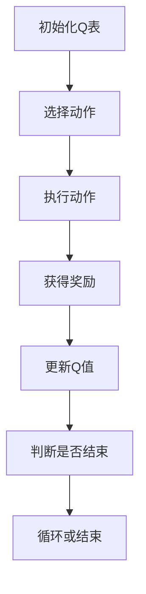
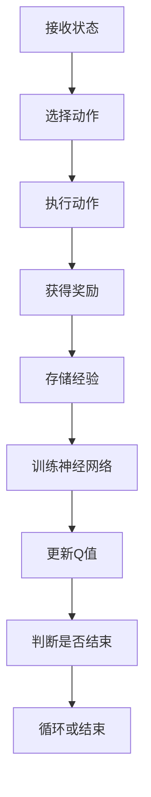
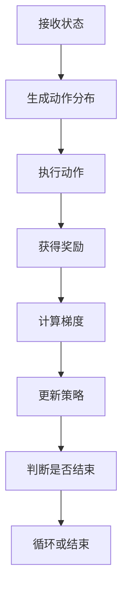
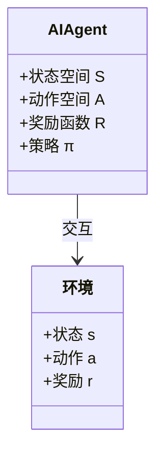
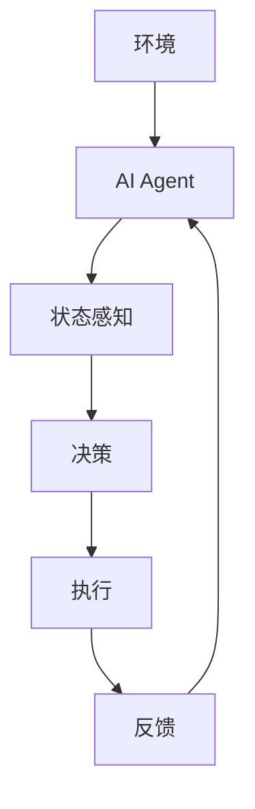

                 


# AI Agent的强化学习在智能控制中的应用

## 关键词：
AI Agent、强化学习、智能控制、数学模型、算法原理、系统架构、项目实战

## 摘要：
本文探讨了AI Agent在智能控制中的应用，重点分析了强化学习在其中的关键作用。通过详细讲解强化学习的算法原理、数学模型和系统架构，结合实际项目案例，展示了AI Agent如何通过强化学习实现高效的智能控制。文章内容丰富，结构清晰，适合对AI和智能控制感兴趣的读者阅读。

---

# 第1章: AI Agent与强化学习概述

## 1.1 AI Agent的基本概念
### 1.1.1 AI Agent的定义
AI Agent（人工智能代理）是指在计算机系统中能够感知环境并采取行动以实现目标的实体。它可以是一个软件程序，也可以是一个物理设备，通过与环境交互来完成特定任务。

### 1.1.2 AI Agent的核心特征
- **自主性**：能够在没有外部干预的情况下自主决策。
- **反应性**：能够感知环境并实时做出反应。
- **目标导向**：所有行动都以实现特定目标为导向。
- **学习能力**：能够通过经验改进自身性能。

### 1.1.3 AI Agent与强化学习的关系
AI Agent需要通过与环境交互来优化其行为，而强化学习正是通过这种交互机制来实现目标。强化学习为AI Agent提供了学习策略和决策方法。

---

## 1.2 强化学习的基本原理
### 1.2.1 强化学习的定义
强化学习（Reinforcement Learning, RL）是一种机器学习方法，通过智能体与环境的交互，智能体通过试错的方式学习如何采取行动以最大化累积奖励。

### 1.2.2 强化学习的核心要素
- **状态（State）**：智能体所处的环境状况。
- **动作（Action）**：智能体在某一状态下采取的行为。
- **奖励（Reward）**：智能体采取行动后所获得的反馈，用于评估行动的好坏。
- **策略（Policy）**：智能体在某一状态下选择行动的概率分布。
- **值函数（Value Function）**：衡量某状态下行动的好坏程度。

### 1.2.3 强化学习与监督学习的区别
| 特性 | 监督学习 | 强化学习 |
|------|----------|----------|
| 数据 | 标签数据 | 奖励信号 |
| 反馈 | 立即反馈 | 延时反馈 |
| 目标 | 最小化误差 | 最大化奖励 |

---

## 1.3 AI Agent在智能控制中的应用
### 1.3.1 智能控制的基本概念
智能控制是一种基于人工智能技术的控制方法，通过感知、决策和执行三个环节实现对系统的智能调控。

### 1.3.2 AI Agent在智能控制中的作用
AI Agent作为智能控制的核心，负责系统的感知、决策和执行。它能够根据环境变化动态调整控制策略，从而实现最优控制。

### 1.3.3 AI Agent与强化学习的结合
通过强化学习，AI Agent能够从环境中获得反馈，不断优化自身的决策策略，从而在智能控制中实现更高效、更智能的控制。

---

## 1.4 本章小结
本章介绍了AI Agent和强化学习的基本概念，并阐述了它们在智能控制中的重要性。AI Agent通过强化学习实现智能控制，是一种高效、自适应的控制方法。

---

# 第2章: 强化学习的核心算法

## 2.1 Q-Learning算法
### 2.1.1 Q-Learning的基本原理
Q-Learning是一种基于值函数的强化学习算法，通过更新Q值表来学习最优策略。

### 2.1.2 Q-Learning的算法流程


### 2.1.3 Q-Learning的优缺点
- **优点**：简单易实现，适用于离线学习。
- **缺点**：在动态环境中表现不佳，需要较大的状态空间。

---

## 2.2 Deep Q-Network (DQN)算法
### 2.2.1 DQN的基本原理
DQN通过深度神经网络近似Q值函数，能够处理高维状态空间和动作空间。

### 2.2.2 DQN的算法流程


### 2.2.3 DQN的优缺点
- **优点**：能够处理高维状态，适用于复杂环境。
- **缺点**：训练过程需要大量数据，计算资源消耗较大。

---

## 2.3 Policy Gradient方法
### 2.3.1 Policy Gradient的基本原理
Policy Gradient直接优化策略，通过梯度上升方法最大化奖励函数。

### 2.3.2 Policy Gradient的算法流程


### 2.3.3 Policy Gradient的优缺点
- **优点**：直接优化策略，适用于连续动作空间。
- **缺点**：收敛速度较慢，需要多次迭代。

---

## 2.4 算法对比与选择
### 2.4.1 Q-Learning与DQN的对比
| 特性 | Q-Learning | DQN |
|------|-------------|-----|
| 状态空间 | 离散 | 高维 |
| 动作空间 | 离散 | 离散或连续 |
| 计算资源 | 低 | 高 |

### 2.4.2 Policy Gradient与Q-Learning的对比
| 特性 | Q-Learning | Policy Gradient |
|------|-------------|----------------|
| 优化目标 | Q值函数 | 策略 |
| 收敛速度 | 较快 | 较慢 |
| 应用场景 | 离散动作 | 连续动作 |

### 2.4.3 算法选择的考虑因素
- **环境复杂度**：复杂环境选择DQN或Policy Gradient。
- **计算资源**：资源有限选择Q-Learning。
- **动作空间**：连续动作选择Policy Gradient。

---

## 2.5 本章小结
本章详细介绍了几种常用的强化学习算法，包括Q-Learning、DQN和Policy Gradient，并分析了它们的优缺点及适用场景。

---

# 第3章: 强化学习的数学模型

## 3.1 状态空间与动作空间
### 3.1.1 状态空间的定义
状态空间是所有可能的状态的集合，每个状态表示智能体所处的环境状况。

### 3.1.2 动作空间的定义
动作空间是所有可能动作的集合，每个动作表示智能体在某一状态下可以采取的行为。

### 3.1.3 状态和动作的表示方法
- **离散表示**：使用编号或符号表示状态和动作。
- **连续表示**：使用实数范围表示状态和动作。

---

## 3.2 奖励函数与值函数
### 3.2.1 奖励函数的定义
奖励函数是对智能体在某一状态下采取某个动作后所获得的反馈，用于指导智能体的行为。

### 3.2.2 值函数的定义
值函数衡量的是在某一状态下采取某一动作后的期望累积奖励。

### 3.2.3 奖励函数与值函数的关系
值函数通过奖励函数和状态转移模型来预测未来的累积奖励。

---

## 3.3 动作价值函数（Q值）的计算
### 3.3.1 Q值的定义
$$ Q(s, a) = \mathbb{E}[R | s, a] $$
其中，$s$ 是状态，$a$ 是动作，$R$ 是未来的累积奖励。

### 3.3.2 Q值的更新公式
$$ Q(s, a) = Q(s, a) + \alpha (r + \gamma \max Q(s', a') - Q(s, a)) $$
其中，$\alpha$ 是学习率，$\gamma$ 是折扣因子。

### 3.3.3 Q值的计算示例
假设当前状态为$s$，动作$a$，获得奖励$r$，下一个状态为$s'$，则：
$$ Q(s, a) = Q(s, a) + \alpha (r + \gamma \max Q(s', a') - Q(s, a)) $$

---

## 3.4 本章小结
本章详细讲解了强化学习中的数学模型，包括状态空间、动作空间、奖励函数和Q值函数的定义及计算方法。

---

# 第4章: AI Agent的强化学习在智能控制中的应用

## 4.1 应用场景
### 4.1.1 自动驾驶
AI Agent通过强化学习优化驾驶策略，实现自动驾驶。

### 4.1.2 家庭机器人
AI Agent通过强化学习优化家务决策，实现智能服务。

---

## 4.2 系统功能设计
### 4.2.1 领域模型设计


### 4.2.2 系统架构设计


---

## 4.3 项目实战
### 4.3.1 环境安装
安装Python和相关库：
```bash
pip install gym numpy matplotlib
```

### 4.3.2 核心代码实现
```python
import gym
import numpy as np

env = gym.make('CartPole-v0')
env.seed(42)

# 初始化Q表
Q = np.zeros([env.observation_space.shape[0], env.action_space.n])

# 参数设置
LEARNING_RATE = 0.01
DISCOUNT_FACTOR = 0.99

# Q-Learning算法
for episode in range(1000):
    state = env.reset()
    for _ in range(1000):
        # 选择动作
        action = np.argmax(Q[state])
        # 执行动作
        next_state, reward, done, _ = env.step(action)
        # 更新Q值
        Q[state][action] += LEARNING_RATE * (reward + DISCOUNT_FACTOR * np.max(Q[next_state]) - Q[state][action])
        state = next_state
        if done:
            break
```

### 4.3.3 案例分析
通过上述代码实现的Q-Learning算法，可以训练AI Agent在CartPole环境中保持平衡。

### 4.3.4 项目小结
通过实际项目，验证了强化学习算法在智能控制中的有效性。

---

## 4.4 本章小结
本章通过实际案例展示了AI Agent的强化学习在智能控制中的应用，详细讲解了系统的功能设计和项目实现过程。

---

# 第5章: 最佳实践与未来展望

## 5.1 小结
强化学习为AI Agent在智能控制中的应用提供了有力支持，通过不断优化策略，实现了高效、自适应的控制。

## 5.2 注意事项
- **算法选择**：根据具体场景选择合适的算法。
- **计算资源**：确保有足够的计算资源支持算法训练。
- **环境设计**：合理设计环境以提高训练效率。

## 5.3 未来趋势
- **多智能体协作**：研究多个AI Agent协作的强化学习方法。
- **实时应用**：探索强化学习在实时控制中的应用。
- **模型轻量化**：优化模型以降低计算资源消耗。

## 5.4 拓展阅读
推荐阅读《Reinforcement Learning: Theory and Algorithms》和《Deep Reinforcement Learning》等书籍。

---

# 作者：AI天才研究院 & 禅与计算机程序设计艺术

