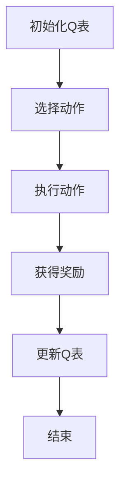
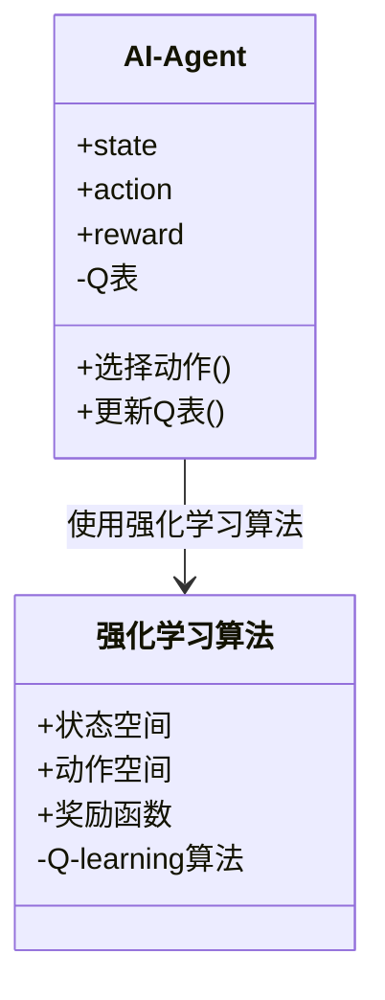
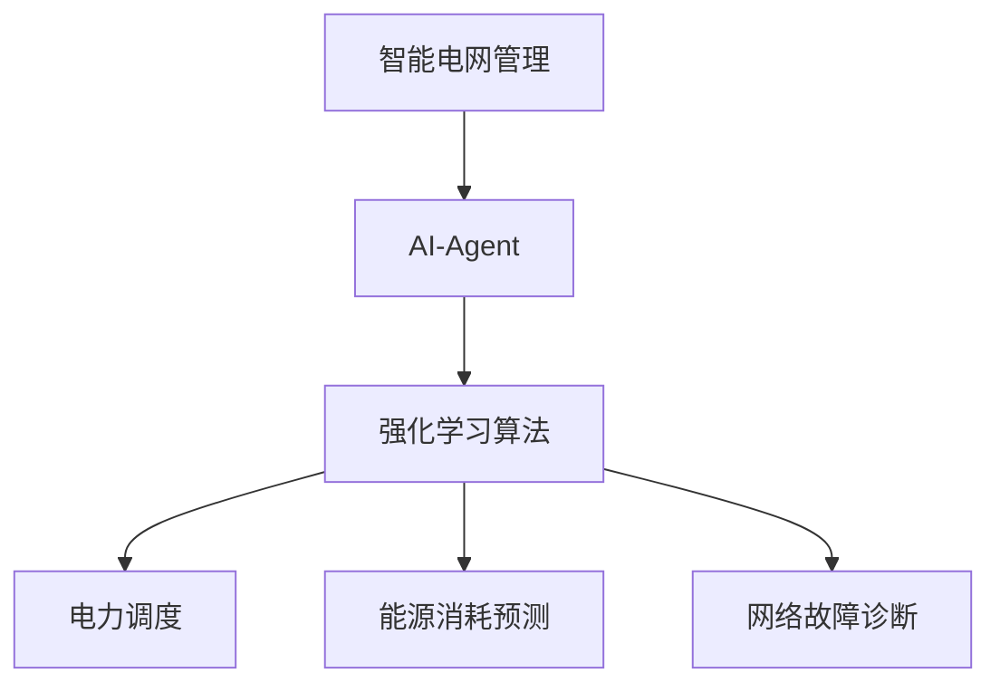
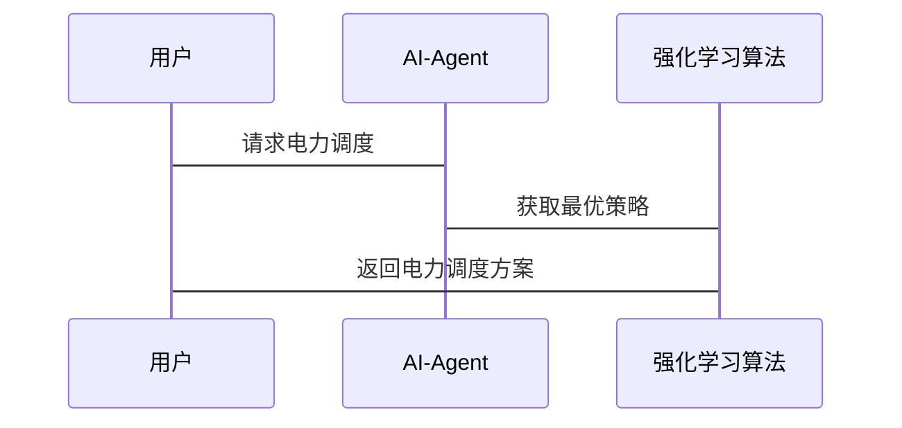

                 


# AI Agent的强化学习在智能电网管理中的应用

> 关键词：AI Agent，强化学习，智能电网，能源管理，电力调度，系统优化

> 摘要：本文深入探讨AI Agent在智能电网管理中的应用，特别是强化学习在电力调度、能源消耗预测和网络故障诊断等关键问题中的应用。通过分析强化学习的算法原理、系统架构设计和实际案例，本文为智能电网的优化管理提供了新的思路和解决方案。

---

## 第1章 AI Agent与强化学习概述

### 1.1 AI Agent的基本概念
AI Agent（人工智能代理）是指能够感知环境并采取行动以实现目标的智能实体。它具有以下核心特点：
1. **自主性**：能够在没有外部干预的情况下独立决策。
2. **反应性**：能够实时感知环境并做出响应。
3. **目标导向**：所有行动都围绕实现特定目标展开。

AI Agent与传统AI的区别在于，传统AI注重数据处理和模式识别，而AI Agent更强调与环境的交互和自主决策能力。

### 1.2 强化学习的基本原理
强化学习是一种机器学习范式，通过智能体与环境的交互，学习如何采取最优行动以最大化累积奖励。其核心要素包括：
1. **状态空间**：智能体所处的环境状态。
2. **动作空间**：智能体可执行的动作。
3. **奖励函数**：用于衡量智能体行动的好坏。
4. **策略**：智能体在给定状态下选择动作的概率分布。

强化学习与监督学习的区别在于，监督学习依赖于标签数据，而强化学习依赖于环境的反馈（奖励或惩罚）。

---

## 第2章 智能电网管理的背景与需求

### 2.1 智能电网的基本概念
智能电网是以计算机技术和信息通信技术为基础，整合电力生产、传输、分配和消费的智能化电力系统。它包括以下几个组成部分：
1. **发电端**：包括各种发电方式（如风能、太阳能等）。
2. **输电网**：负责电力的长距离传输。
3. **配电网**：负责电力的分配和配送。
4. **用户端**：包括工业、商业和居民用户。

智能电网的优势在于其高效性、可靠性和环保性。

### 2.2 智能电网管理中的问题与挑战
智能电网管理面临以下问题与挑战：
1. **电力调度的复杂性**：需要在保证电力供应的同时，优化电力分配。
2. **能源消耗预测的准确性**：需要准确预测用户的电力需求，以避免浪费和 shortages。
3. **网络的稳定性和安全性**：需要防止网络攻击和物理损坏。

---

## 第3章 AI Agent在智能电网管理中的应用背景

### 3.1 AI Agent在智能电网中的潜在应用
AI Agent在智能电网中的潜在应用包括：
1. **自动化电力调度**：通过AI Agent实现电力的自动分配和调度。
2. **能源消耗预测**：通过强化学习预测用户的电力需求。
3. **网络故障诊断**：通过AI Agent实时监测电网状态，发现并诊断故障。

### 3.2 强化学习在智能电网管理中的优势
强化学习在智能电网管理中的优势包括：
1. **自主决策能力**：强化学习可以通过与环境的交互，自动学习最优决策策略。
2. **适应性与优化能力**：强化学习能够根据环境的变化，动态调整策略，以实现最优目标。
3. **实时性与动态性**：强化学习能够实时处理数据，适用于动态变化的电网环境。

---

## 第4章 AI Agent的核心概念与联系

### 4.1 AI Agent与强化学习的关系
AI Agent作为决策主体，强化学习作为决策机制，两者协同作用，共同实现智能电网的优化管理。

### 4.2 AI Agent与强化学习的核心要素对比
以下是一个对比表格：

| 核心要素       | AI Agent                          | 强化学习                        |
|----------------|-----------------------------------|---------------------------------|
| 目标           | 实现特定目标                      | 最大化累积奖励                  |
| 决策方式       | 基于规则或经验                    | 基于奖励反馈                    |
| 适应性         | 较低                             | 较高                            |

以下是一个ER实体关系图：

```mermaid
er
    entity AI-Agent {
        id
        target
        rules
    }
    entity 强化学习 {
        id
        rewards
        actions
    }
    AI-Agent --> 强化学习: 使用强化学习算法
```

---

## 第5章 强化学习的算法原理

### 5.1 Q-learning算法原理
Q-learning是一种经典的强化学习算法，其数学模型如下：

$$ Q(s,a) = Q(s,a) + \alpha (r + \gamma \max Q(s',a') - Q(s,a)) $$

其中：
- $s$ 是当前状态
- $a$ 是当前动作
- $r$ 是奖励
- $s'$ 是下一个状态
- $\alpha$ 是学习率
- $\gamma$ 是折扣因子

以下是一个Q-learning算法的流程图：



以下是一个Q-learning算法的Python代码示例：

```python
import numpy as np

class QLearning:
    def __init__(self, state_space, action_space, alpha=0.1, gamma=0.9):
        self.state_space = state_space
        self.action_space = action_space
        self.alpha = alpha
        self.gamma = gamma
        self.Q = np.zeros((state_space, action_space))

    def choose_action(self, state):
        return np.argmax(self.Q[state])

    def learn(self, state, action, reward, next_state):
        self.Q[state, action] += self.alpha * (reward + self.gamma * np.max(self.Q[next_state]) - self.Q[state, action])
```

---

## 第6章 强化学习的数学模型与公式

### 6.1 Q-learning的数学模型
Q-learning的数学模型如下：

$$ Q(s,a) = Q(s,a) + \alpha (r + \gamma \max Q(s',a') - Q(s,a)) $$

以下是一个Q-learning算法的数学推导：

$$ Q(s,a) \leftarrow Q(s,a) + \alpha (r + \gamma \max Q(s',a') - Q(s,a)) $$

---

## 第7章 系统分析与架构设计方案

### 7.1 问题场景介绍
智能电网管理的场景包括电力调度、能源消耗预测和网络故障诊断。

### 7.2 项目介绍
本项目旨在通过AI Agent和强化学习优化智能电网的管理。

### 7.3 系统功能设计
以下是一个领域模型类图：



### 7.4 系统架构设计
以下是一个系统架构图：



### 7.5 系统接口设计
以下是系统接口设计的示意图：



---

## 第8章 项目实战

### 8.1 环境安装
需要安装以下环境：
1. Python
2. NumPy
3. Matplotlib
4. Mermaid

### 8.2 系统核心实现源代码
以下是一个AI Agent的实现代码：

```python
class AI-Agent:
    def __init__(self, state_space, action_space):
        self.state_space = state_space
        self.action_space = action_space
        self.Q = np.zeros((state_space, action_space))

    def choose_action(self, state):
        return np.argmax(self.Q[state])

    def update_Q(self, state, action, reward, next_state):
        self.Q[state, action] += self.alpha * (reward + self.gamma * np.max(self.Q[next_state]) - self.Q[state, action])
```

### 8.3 实际案例分析
以下是一个实际案例分析：

假设智能电网中有三个发电厂和五个用户，AI Agent需要优化电力分配。通过强化学习算法，AI Agent能够根据实时电力需求和发电厂的生产能力，动态调整电力分配策略。

### 8.4 项目小结
通过本项目，我们实现了AI Agent在智能电网管理中的应用，验证了强化学习在电力调度和能源消耗预测中的有效性。

---

## 第9章 总结与展望

### 9.1 最佳实践 tips
1. 在智能电网管理中，AI Agent和强化学习的应用需要结合实际场景。
2. 强化学习算法的选择需要根据具体问题进行调整。
3. 系统的实时性和安全性需要重点关注。

### 9.2 小结
本文深入探讨了AI Agent在智能电网管理中的应用，特别是强化学习在电力调度、能源消耗预测和网络故障诊断中的应用。通过算法原理和系统设计的详细讲解，本文为智能电网的优化管理提供了新的思路和解决方案。

### 9.3 注意事项
1. AI Agent和强化学习的应用需要结合实际场景。
2. 系统的实时性和安全性需要重点关注。
3. 在实际应用中，需要考虑数据的实时性和准确性。

### 9.4 拓展阅读
1. 《强化学习：算法与应用》
2. 《智能电网：原理与实践》
3. 《AI Agent：理论与应用》

---

作者：AI天才研究院/AI Genius Institute & 禅与计算机程序设计艺术 /Zen And The Art of Computer Programming

