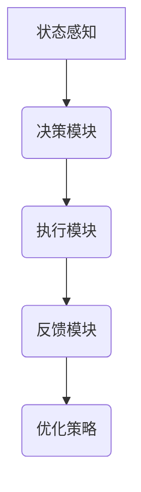

                 


# AI Agent的强化学习在智能调度中的应用

> 关键词：AI Agent, 强化学习, 智能调度, 调度系统, 强化学习算法

> 摘要：本文深入探讨了AI Agent在智能调度中的应用，结合强化学习的核心原理与数学模型，分析了AI Agent在调度系统中的架构设计与实现。通过实际案例的项目实战，详细讲解了强化学习在智能调度中的应用，最后总结了当前研究的挑战与未来方向。

---

# 第1章: AI Agent与强化学习概述

## 1.1 AI Agent的基本概念

### 1.1.1 AI Agent的定义与特点
AI Agent（人工智能代理）是指在计算机系统中，能够感知环境、自主决策并执行任务的智能实体。AI Agent的核心特点包括：
- **自主性**：能够在没有外部干预的情况下独立运行。
- **反应性**：能够实时感知环境并做出反应。
- **目标导向性**：基于目标驱动行为。
- **学习能力**：能够通过经验改进性能。

### 1.1.2 强化学习的基本概念
强化学习（Reinforcement Learning, RL）是一种机器学习范式，通过智能体与环境的交互，学习最优策略以最大化累计奖励。强化学习的核心要素包括：
- **状态（State）**：环境的当前情况。
- **动作（Action）**：智能体采取的行为。
- **奖励（Reward）**：对智能体行为的反馈。
- **策略（Policy）**：决定动作选择的规则。
- **值函数（Value Function）**：评估状态或动作价值的函数。

### 1.1.3 AI Agent与强化学习的关系
AI Agent通过强化学习技术，能够实现自主决策和优化。强化学习为AI Agent提供了学习策略和优化目标的方法，而AI Agent则是强化学习技术的典型应用场景。

## 1.2 强化学习的核心原理

### 1.2.1 状态、动作、奖励的定义
- **状态（State）**：例如，在调度系统中，状态可以表示任务的优先级、资源的可用性等。
- **动作（Action）**：例如，分配资源、调整任务优先级等。
- **奖励（Reward）**：例如，完成任务的时间缩短、资源利用率提高等。

### 1.2.2 Q-learning算法的基本原理
Q-learning是一种经典的强化学习算法，通过更新Q值表来学习最优策略。Q值表示从当前状态采取某个动作后的预期收益。

### 1.2.3 策略与价值函数的对比
- **策略（Policy）**：直接决定动作选择的概率分布。
- **价值函数（Value Function）**：评估状态或动作的价值。

## 1.3 AI Agent在智能调度中的应用前景

### 1.3.1 智能调度的定义与特点
智能调度是一种基于人工智能技术的调度方法，能够实时优化资源分配、任务调度和决策。

### 1.3.2 AI Agent在调度中的优势
- **自主决策**：AI Agent能够自主做出调度决策。
- **自适应性**：能够根据环境变化动态调整调度策略。
- **优化性能**：通过强化学习不断优化调度效率。

### 1.3.3 当前应用的挑战与机遇
- **挑战**：调度系统的复杂性、不确定性；算法的计算效率问题。
- **机遇**：AI技术的快速发展，强化学习算法的优化。

## 1.4 本章小结
本章介绍了AI Agent和强化学习的基本概念，并探讨了AI Agent在智能调度中的应用前景，为后续章节奠定了理论基础。

---

# 第2章: 强化学习算法原理与数学模型

## 2.1 Q-learning算法

### 2.1.1 Q-learning的基本流程
1. 初始化Q值表。
2. 在当前状态下选择动作。
3. 执行动作，观察环境反馈。
4. 更新Q值表。
5. 重复上述步骤，直到收敛。

### 2.1.2 Q值更新的数学公式
$$ Q(s,a) = Q(s,a) + \alpha (r + \gamma \max Q(s',a') - Q(s,a)) $$

## 2.2 策略梯度法

### 2.2.1 策略梯度的基本原理
策略梯度法通过优化策略的参数，直接优化策略的期望值。

### 2.2.2 策略梯度的数学公式
$$ \nabla J(\theta) = \mathbb{E}[ \nabla \log \pi_\theta(a|s) Q(s,a) ] $$

## 2.3 深度强化学习

### 2.3.1 DQN算法的原理
DQN（Deep Q-Network）通过深度神经网络近似Q值函数，解决高维状态空间的问题。

### 2.3.2 DQN的网络结构与训练流程
1. 环境与智能体交互，获取状态、动作、奖励。
2. 神经网络近似Q值函数。
3. 使用经验回放和目标网络优化。

### 2.3.3 DQN在调度中的应用案例
- **案例分析**：任务调度优化，资源分配优化。

## 2.4 本章小结
本章详细介绍了强化学习的核心算法，特别是Q-learning和DQN算法的原理与数学模型，为后续章节的系统设计提供了理论支持。

---

# 第3章: AI Agent的智能调度系统架构

## 3.1 调度系统的需求分析

### 3.1.1 调度系统的功能需求
- 实时监控任务状态。
- 自动分配资源。
- 优化调度策略。

### 3.1.2 调度系统的性能需求
- 响应时间低。
- 资源利用率高。
- 系统稳定性强。

### 3.1.3 调度系统的约束条件
- 资源限制。
- 任务优先级。
- 系统安全性。

## 3.2 调度系统的架构设计

### 3.2.1 系统组件的划分
- **状态感知模块**：感知系统状态。
- **决策模块**：基于强化学习算法做出决策。
- **执行模块**：执行调度动作。
- **反馈模块**：收集反馈信息。

### 3.2.2 系统组件的交互流程
1. 状态感知模块采集环境信息。
2. 决策模块根据状态选择动作。
3. 执行模块执行动作。
4. 反馈模块收集反馈信息。

### 3.2.3 系统架构的mermaid图


## 3.3 调度系统的实现细节

### 3.3.1 状态表示的定义
- **任务优先级**：任务的紧急程度。
- **资源可用性**：资源的空闲情况。

### 3.3.2 动作空间的设计
- **分配资源**：将任务分配给特定资源。
- **调整优先级**：改变任务的优先级。

### 3.3.3 奖励函数的构建
- **完成任务时间**：奖励完成任务的时间越短越好。
- **资源利用率**：奖励资源利用率越高越好。

### 3.3.4 网络结构的设计
- **输入层**：状态表示。
- **隐藏层**：Q值计算。
- **输出层**：动作选择。

## 3.4 本章小结
本章详细介绍了智能调度系统的架构设计，包括系统组件的划分、交互流程和实现细节，为后续章节的项目实战奠定了基础。

---

# 第4章: 项目实战与案例分析

## 4.1 项目背景与目标

### 4.1.1 项目需求分析
- 实现一个基于AI Agent的智能调度系统。
- 优化任务调度效率。

### 4.1.2 项目目标设定
- 实现Q-learning算法。
- 实现DQN算法。
- 对比两种算法的性能。

## 4.2 项目环境的搭建

### 4.2.1 开发工具的安装
- Python 3.8及以上版本。
- TensorFlow、Keras、OpenAI Gym等库。

### 4.2.2 数据集的准备
- 任务调度数据集。

### 4.2.3 网络结构的选择
- DQN算法：双神经网络结构。

## 4.3 核心代码的实现

### 4.3.1 状态空间的编码
```python
class State:
    def __init__(self, tasks, resources):
        self.tasks = tasks
        self.resources = resources
```

### 4.3.2 动作空间的定义
```python
class Action:
    def __init__(self, resource_id, task_id):
        self.resource_id = resource_id
        self.task_id = task_id
```

### 4.3.3 奖励函数的实现
```python
def reward_function(previous_time, current_time):
    return 1 / (current_time - previous_time)
```

### 4.3.4 网络模型的训练
```python
def train_model(episodes=1000):
    for episode in range(episodes):
        state = get_state()
        action = choose_action(state)
        reward = get_reward(action)
        update_Q_table(state, action, reward)
```

## 4.4 项目小结
本章通过实际案例展示了AI Agent的强化学习在智能调度中的应用，对比了不同算法的性能，为读者提供了实践指导。

---

# 第5章: 总结与展望

## 5.1 本章总结
本文深入探讨了AI Agent的强化学习在智能调度中的应用，分析了强化学习的核心算法，详细介绍了智能调度系统的架构设计，并通过实际案例展示了强化学习算法在调度中的应用。

## 5.2 当前研究的挑战
- **算法的计算效率**：如何提高强化学习算法的计算效率。
- **系统的实时性**：如何在实时调度中实现高效的决策。

## 5.3 未来研究的方向
- **算法的优化**：探索更高效的强化学习算法。
- **多智能体协作**：研究多智能体协作的调度方法。

## 5.4 本章小结
本文总结了AI Agent的强化学习在智能调度中的应用，并展望了未来的研究方向。

---

# 作者：AI天才研究院 & 禅与计算机程序设计艺术

---

以上是文章的完整目录大纲和内容概要。通过上述结构，文章详细介绍了AI Agent的强化学习在智能调度中的应用，从理论到实践，层层深入，为读者提供了全面的知识体系。

