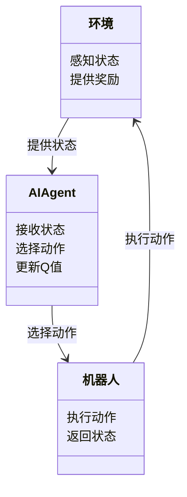
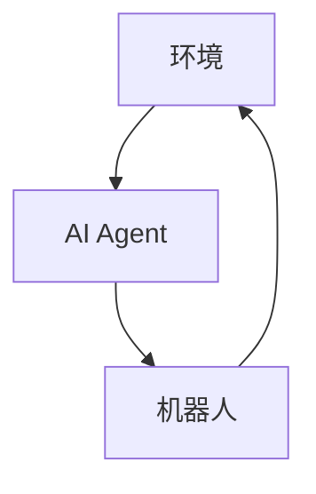
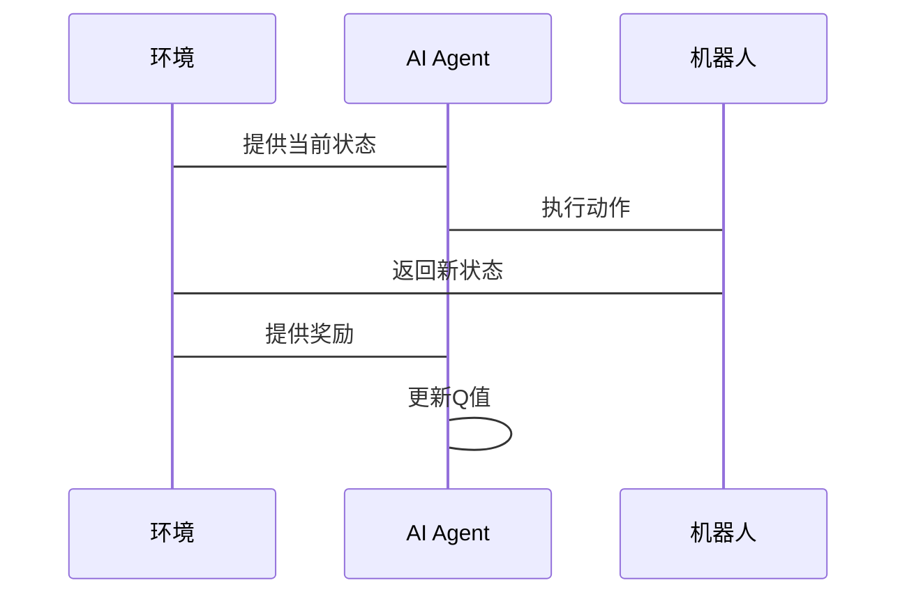

                 


# AI Agent的强化学习在机器人导航中的应用

> 关键词：AI Agent, 强化学习, 机器人导航, Q-learning, 策略梯度, 系统架构, 项目实战

> 摘要：本文系统地探讨了AI Agent在机器人导航中的强化学习应用，从基础概念到算法原理，再到系统设计和项目实现，全面分析了强化学习在机器人导航中的核心作用。通过详细阐述Q-learning、策略梯度等算法，结合实际项目案例，展示了如何将强化学习理论应用于复杂机器人导航任务中。文章最后总结了强化学习在机器人导航中的优势与挑战，并展望了未来的发展方向。

---

## 第一部分：AI Agent与强化学习基础

### 第1章：强化学习与AI Agent概述

#### 1.1 强化学习的基本概念
- **1.1.1 强化学习的定义与核心思想**
  - 强化学习是一种机器学习范式，通过智能体与环境的交互，逐步学习最优策略。
  - 核心思想：通过试错和奖励机制，优化智能体的行为策略。

- **1.1.2 AI Agent的定义与特点**
  - AI Agent：具备感知环境、决策、执行动作能力的智能实体。
  - 特点：自主性、反应性、目标导向、社交能力。

- **1.1.3 强化学习在AI Agent中的作用**
  - 强化学习为AI Agent提供决策能力，使其能够在动态环境中自主导航。

#### 1.2 机器人导航的挑战与解决方案
- **1.2.1 机器人导航的基本问题**
  - 环境感知：障碍物识别、路径规划。
  - 动作决策：路径选择、避障策略。
  - 动态环境：应对不可预测的环境变化。

- **1.2.2 强化学习在机器人导航中的优势**
  - 自适应性：智能体能够根据环境反馈调整策略。
  - 实时性：强化学习适用于动态环境下的实时决策。

- **1.2.3 AI Agent在机器人导航中的应用场景**
  - 室内服务机器人：自动导航、避障。
  - 工业机器人：复杂环境下的精准操作。
  - 自动驾驶：路径规划与避障。

---

## 第二部分：强化学习的核心概念与算法原理

### 第2章：强化学习的数学模型与算法

#### 2.1 强化学习的核心概念
- **状态、动作与奖励**
  - 状态（State）：环境的当前情况。
  - 动作（Action）：智能体的选择。
  - 奖励（Reward）：环境对动作的反馈。

- **马尔可夫决策过程（MDP）**
  - 定义：一个由状态、动作、转移概率和奖励函数组成的四元组。
  - 公式：$$ P(s'|s,a) = \text{从状态}s和动作$a转移到状态$s'$的概率} $$

- **策略与价值函数**
  - 策略（Policy）：从状态到动作的映射。
  - 价值函数（Value Function）：评估状态或动作的价值。

#### 2.2 强化学习算法
- **Q-learning算法**
  - **Q-learning的基本原理**
    - 动态规划思想：通过迭代更新Q值，逼近最优策略。
    - 更新公式：$$ Q(s,a) = (1-\alpha)Q(s,a) + \alpha (r + \gamma \max Q(s',a')) $$
    - 参数解释：$\alpha$为学习率，$\gamma$为折扣因子。

  - **Q-learning的优缺点**
    | 特性       | 优点                       | 缺点                       |
    |------------|---------------------------|---------------------------|
    | 离线学习    | 简单易实现                 | 无法实时更新               |
    | 状态空间   | 适用于离散状态空间           | 不适用于连续状态空间         |
    | 探索与利用 | 平衡探索与利用               | 需要平衡$\epsilon$策略       |

- **策略梯度方法**
  - **策略梯度的基本原理**
    - 直接优化策略，通过梯度上升法更新参数。
    - 更新公式：$$ \theta = \theta + \alpha \nabla_\theta J(\theta) $$
    - $J(\theta)$为策略的期望收益。

  - **策略梯度的优缺点**
    | 特性       | 优点                       | 缺点                       |
    |------------|---------------------------|---------------------------|
    | 离线学习    | 适用于连续动作空间           | 需要处理梯度计算复杂性       |
    | 实时性      | 可以实时更新策略             | 计算资源消耗较大             |

---

## 第三部分：系统架构与设计

### 第3章：机器人导航系统的架构设计

#### 3.1 系统功能设计
- **领域模型设计**
  - 使用Mermaid绘制系统类图，展示系统各模块之间的关系。



- **系统架构设计**
  - 使用Mermaid绘制系统架构图，展示各模块之间的交互。



- **系统交互设计**
  - 使用Mermaid绘制序列图，展示系统交互流程。



---

## 第四部分：项目实战

### 第4章：强化学习在机器人导航中的实现

#### 4.1 项目环境与安装
- **环境要求**
  - Python 3.8+
  - gym库：pip install gym
  - numpy库：pip install numpy
  - matplotlib库：pip install matplotlib

#### 4.2 核心代码实现

```python
import gym
import numpy as np
import matplotlib.pyplot as plt

# 初始化环境
env = gym.make('CartPole-v0')
env.seed(1)
np.random.seed(1)

# 参数设置
epsilon = 0.1
alpha = 0.8
gamma = 0.9
num_actions = env.action_space.n
num_states = env.observation_space.shape[0]

# 初始化Q表
Q = np.zeros((num_states, num_actions))

# Q-learning算法实现
def q_learning():
    rewards = []
    for episode in range(1000):
        state = env.reset()
        total_reward = 0
        while True:
            # 探索与利用策略
            if np.random.random() < epsilon:
                action = np.random.randint(num_actions)
            else:
                action = np.argmax(Q[state])
            
            # 执行动作
            next_state, reward, done, _ = env.step(action)
            total_reward += reward
            
            # 更新Q值
            Q[state][action] = (1 - alpha) * Q[state][action] + alpha * (reward + gamma * np.max(Q[next_state]))
            
            state = next_state
            if done:
                break
        rewards.append(total_reward)
        epsilon = max(epsilon * 0.99, 0.01)
    
    plt.plot(rewards)
    plt.xlabel('Episode')
    plt.ylabel('Total Reward')
    plt.show()

q_learning()
```

#### 4.3 代码分析与优化
- **代码功能解读**
  - 初始化环境和参数。
  - Q-learning算法实现：通过不断迭代更新Q值，优化策略。
  - 奖励曲线绘制：展示每轮的总奖励，验证算法效果。

- **优化建议**
  - 增加经验回放：减少探索次数，加速收敛。
  - 调整学习率：动态调整$\alpha$和$\gamma$值，提高学习效率。

---

## 第五部分：总结与展望

### 第5章：总结与未来展望

#### 5.1 全文总结
- 本文详细探讨了AI Agent在机器人导航中的强化学习应用，从理论基础到算法实现，再到系统设计，全面分析了强化学习在机器人导航中的核心作用。
- 通过Q-learning和策略梯度等算法的实现，验证了强化学习在动态环境下的有效性。

#### 5.2 未来展望
- **算法优化**：结合深度学习，提升强化学习的泛化能力。
- **多智能体协作**：研究多AI Agent协作下的机器人导航问题。
- **实时性提升**：优化算法，提高强化学习的实时性，适应更复杂的动态环境。

---

## 作者信息

作者：AI天才研究院/AI Genius Institute & 禅与计算机程序设计艺术 /Zen And The Art of Computer Programming

