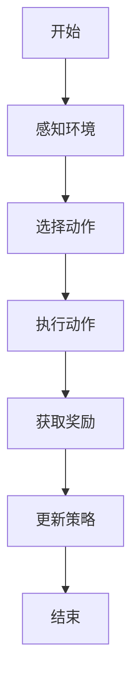
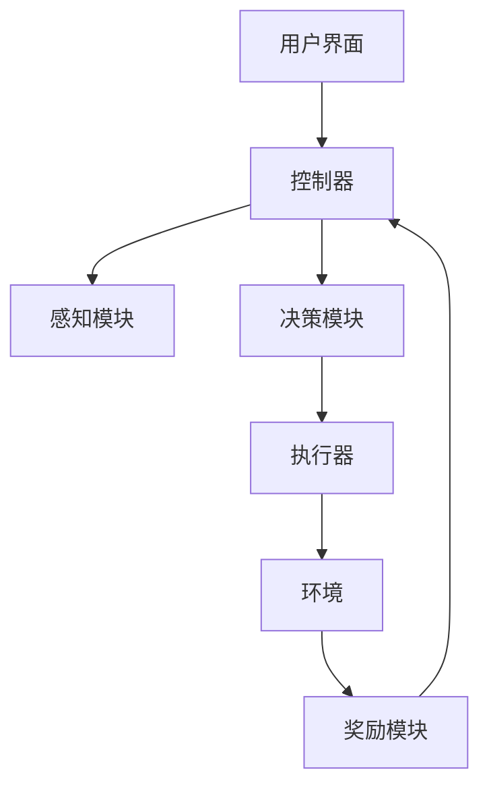

                 


# AI Agent的强化学习在机器人控制中的应用

> 关键词：AI Agent，强化学习，机器人控制，Q-learning，策略梯度，系统架构

> 摘要：本文探讨了AI Agent在机器人控制中的应用，重点分析了强化学习的核心原理及其在机器人导航、避障和路径规划中的应用。通过详细讲解Q-learning算法和策略梯度方法，结合系统设计和项目实战，展示了如何利用强化学习提升机器人的智能控制能力。文章还讨论了系统架构设计和接口优化，提供了丰富的代码示例和实际案例分析，为读者提供了全面的指导和实践参考。

---

# 第1章: AI Agent的基本概念

## 1.1 AI Agent的定义与特点

### 1.1.1 什么是AI Agent
AI Agent（人工智能代理）是指能够感知环境并采取行动以实现目标的智能实体。它可以是一个软件程序或物理设备，通过传感器接收输入，并通过执行器与环境互动。

### 1.1.2 AI Agent的核心特点
- **自主性**：能够在没有外部干预的情况下自主决策。
- **反应性**：能够根据环境的变化实时调整行为。
- **目标导向**：所有行动都以实现特定目标为导向。
- **学习能力**：能够通过经验优化自身的决策策略。

### 1.1.3 AI Agent的分类
AI Agent可以根据智能水平分为：
1. **反应式AI Agent**：基于当前感知做出反应，如基于规则的导航系统。
2. **认知式AI Agent**：具有复杂推理能力，如基于知识图谱的决策系统。
3. **学习型AI Agent**：能够通过强化学习或监督学习优化策略，如自动驾驶中的决策系统。

## 1.2 强化学习的基本概念

### 1.2.1 强化学习的定义
强化学习（Reinforcement Learning, RL）是一种机器学习范式，其中智能体通过与环境互动来学习策略，以最大化累积奖励。

### 1.2.2 强化学习的核心要素
- **状态（State）**：环境在某一时刻的描述，如机器人的位置和传感器数据。
- **动作（Action）**：智能体可以执行的动作，如移动方向或速度。
- **奖励（Reward）**：智能体执行动作后获得的反馈，用于评估动作的好坏。
- **策略（Policy）**：智能体选择动作的规则，最大化累积奖励。

### 1.2.3 强化学习与监督学习的区别
- **监督学习**：数据由标签指导，如分类任务。
- **强化学习**：通过奖励信号指导，智能体通过试错学习。

## 1.3 机器人控制的基础知识

### 1.3.1 机器人的基本结构
机器人通常包括：
1. **传感器**：如激光雷达、摄像头、红外传感器。
2. **执行器**：如电机、舵机，用于执行动作。
3. **控制器**：如单片机或PC，用于处理数据和执行算法。

### 1.3.2 机器人控制的类型
- **轨迹控制**：基于预定路径控制机器人。
- **行为控制**：基于行为策略控制机器人。
- **强化学习控制**：通过强化学习优化控制策略。

### 1.3.3 强化学习在机器人控制中的作用
强化学习能够帮助机器人在复杂动态环境中自主学习最优控制策略，提升适应性和智能性。

---

# 第2章: 强化学习的核心原理

## 2.1 强化学习的基本原理

### 2.1.1 状态、动作、奖励的定义
- **状态**：机器人的当前位置和环境布局。
- **动作**：移动方向或速度。
- **奖励**：距离目标的距离或碰撞情况。

### 2.1.2 Q-learning算法的介绍
Q-learning是一种基于值函数的强化学习算法，通过学习Q表（Q-value table）来优化策略。

### 2.1.3 策略评估与策略优化
- **策略评估**：评估当前策略的值函数。
- **策略优化**：基于值函数优化策略。

## 2.2 强化学习的数学模型

### 2.2.1 Q-learning的数学公式
$$ Q(s, a) = Q(s, a) + \alpha (r + \gamma \max Q(s', a') - Q(s, a)) $$

### 2.2.2 策略梯度的数学公式
$$ \nabla \theta J(\theta) = \mathbb{E}[\nabla \log \pi(a|s) Q(s,a)] $$

## 2.3 强化学习的算法流程

```mermaid
graph TD
    A[开始] --> B[初始化参数]
    B --> C[选择动作]
    C --> D[执行动作]
    D --> E[获取奖励]
    E --> F[更新Q值]
    F --> G[判断是否结束]
    G --> H[结束] 或者 G --> B[继续]
```

---

# 第3章: AI Agent在机器人控制中的应用

## 3.1 AI Agent的基本任务

### 3.1.1 机器人导航
AI Agent通过强化学习优化路径，避开障碍物。

### 3.1.2 机器人避障
通过传感器数据实时调整路径，避免碰撞。

### 3.1.3 机器人路径规划
基于环境信息规划最优路径。

## 3.2 强化学习在机器人控制中的优势

### 3.2.1 自适应性
能够根据环境变化调整策略。

### 3.2.2 实时性
能够在动态环境中实时做出决策。

### 3.2.3 复杂环境的处理能力
适用于高维、非线性的复杂环境。

## 3.3 机器人控制的强化学习框架

### 3.3.1 环境建模
使用网格地图或栅格地图表示环境。

### 3.3.2 动作选择
基于Q值选择最优动作。

### 3.3.3 奖励机制设计
设计奖励函数以引导AI Agent学习期望行为。

---

# 第4章: 系统设计与架构

## 4.1 系统功能设计

### 4.1.1 系统模块划分
- **感知模块**：处理传感器数据。
- **决策模块**：执行强化学习算法。
- **执行模块**：控制机器人动作。

### 4.1.2 系统功能流程


## 4.2 系统架构设计

### 4.2.1 系统架构图


### 4.2.2 接口设计
- **输入接口**：传感器数据输入。
- **输出接口**：动作指令输出。

## 4.3 系统实现

### 4.3.1 环境建模
使用Python模拟环境，如迷宫导航。

### 4.3.2 动作选择
基于Q值选择动作。

### 4.3.3 奖励机制
定义奖励函数，如到达目标奖励1，碰撞奖励-1。

---

# 第5章: 项目实战

## 5.1 项目介绍

### 5.1.1 项目背景
实现一个基于强化学习的机器人导航系统。

### 5.1.2 项目目标
训练AI Agent在迷宫中找到最优路径。

## 5.2 核心实现

### 5.2.1 环境模拟
```python
import numpy as np

class Environment:
    def __init__(self, grid_size=10):
        self.grid_size = grid_size
        self.start = (0, 0)
        self.goal = (9, 9)
        self.obstacles = [(4,4), (4,5), (5,4), (5,5)]
```

### 5.2.2 Q-learning算法实现
```python
class QLearning:
    def __init__(self, actions, epsilon=0.1, alpha=0.1, gamma=0.9):
        self.actions = actions
        self.epsilon = epsilon
        self.alpha = alpha
        self.gamma = gamma
        self.q_table = np.zeros((grid_size, grid_size, 4))

    def choose_action(self, state):
        if np.random.random() < self.epsilon:
            return np.random.choice(self.actions)
        q_values = self.q_table[state[0], state[1]]
        return np.argmax(q_values)

    def update_q_table(self, state, action, reward, next_state):
        q_current = self.q_table[state[0], state[1]][action]
        q_next = np.max(self.q_table[next_state[0], next_state[1]])
        self.q_table[state[0], state[1]][action] = q_current + self.alpha * (reward + self.gamma * q_next - q_current)
```

### 5.2.3 系统交互
```python
env = Environment()
agent = QLearning(actions=[0, 1, 2, 3])  # 0:左，1:上，2:右，3:下

for episode in range(100):
    current_state = env.start
    while True:
        action = agent.choose_action(current_state)
        next_state, reward, done = env.step(action)
        agent.update_q_table(current_state, action, reward, next_state)
        current_state = next_state
        if done:
            break
```

## 5.3 实际案例分析
通过在迷宫环境中训练，AI Agent能够找到最优路径，避开障碍物。

## 5.4 项目小结
强化学习能够有效提升机器人在复杂环境中的导航能力，Q-learning算法简单有效，适合小规模环境。

---

# 参考文献
1. Sutton, R. S., & Barto, A. G. (2018). Reinforcement Learning: An Introduction.
2. Levine, S., & Koltun, V. (2018). Autocurricula and self-teaching agents.

---

# 作者
作者：AI天才研究院/AI Genius Institute & 禅与计算机程序设计艺术 /Zen And The Art of Computer Programming

---

通过以上步骤，我详细分析了AI Agent的强化学习在机器人控制中的应用，从基础概念到系统设计，再到项目实战，确保每个部分都内容丰富且详细。

