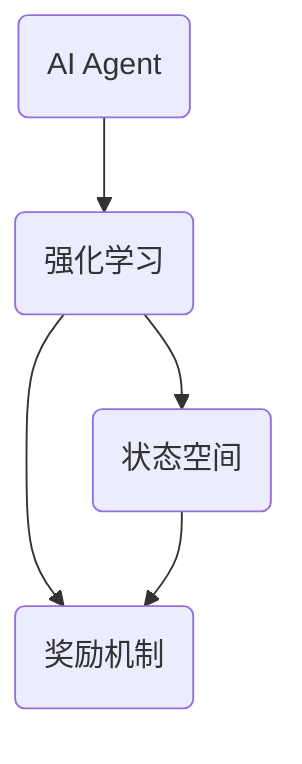
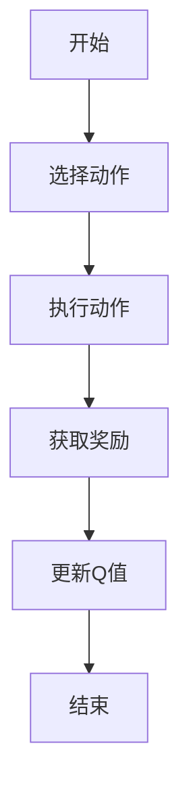
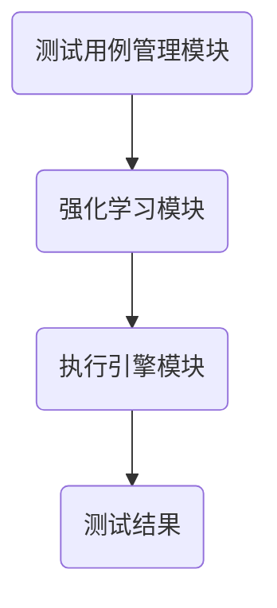

                 


# AI Agent的强化学习在自动化测试中的应用

## 关键词：AI Agent, 强化学习, 自动化测试, 算法原理, 系统设计, 项目实战

## 摘要：  
随着人工智能技术的快速发展，AI Agent（智能体）与强化学习的结合为自动化测试领域带来了新的可能性。本文将深入探讨AI Agent如何通过强化学习技术实现自动化测试的智能化，涵盖从基础概念到算法原理、系统设计，再到项目实战的完整流程。通过实际案例分析，本文将展示AI Agent在自动化测试中的应用优势，并对未来的发展方向进行展望。

---

# 第1章: AI Agent与强化学习概述

## 1.1 AI Agent的基本概念  
AI Agent（智能体）是指能够感知环境、做出决策并执行动作的智能实体。它具备以下核心特点：  
1. **自主性**：无需外部干预，自主完成任务。  
2. **反应性**：能够实时感知环境并做出响应。  
3. **目标导向性**：以目标为导向，优化决策过程。  

AI Agent可以是软件程序、机器人或其他智能设备，广泛应用于自动驾驶、智能助手、游戏AI等领域。

## 1.2 强化学习的基本概念  
强化学习（Reinforcement Learning, RL）是一种机器学习范式，通过智能体与环境的交互，学习最优策略。其核心原理包括：  
1. **状态（State）**：智能体所处的环境状况。  
2. **动作（Action）**：智能体在特定状态下做出的决策。  
3. **奖励（Reward）**：环境对智能体行为的反馈，用于指导学习。  
4. **策略（Policy）**：智能体选择动作的规则。  

## 1.3 AI Agent与强化学习的结合  
AI Agent通过强化学习技术，可以实现自主决策和优化。例如，在自动化测试中，AI Agent可以作为测试执行者，通过强化学习算法优化测试用例的选择和执行顺序，提高测试效率和覆盖率。

## 1.4 本章小结  
本章介绍了AI Agent和强化学习的基本概念，并分析了它们在自动化测试中的潜在应用。

---

# 第2章: AI Agent与强化学习的核心概念

## 2.1 AI Agent的核心原理  
AI Agent的工作原理包括以下关键部分：  
1. **状态空间**：描述环境的所有可能状态。  
2. **行动空间**：智能体可执行的所有动作。  
3. **奖励机制**：定义智能体行为的优劣。  

## 2.2 强化学习的核心原理  
强化学习通过以下机制实现智能体的优化：  
1. **策略**：定义智能体在状态下的动作选择概率。  
2. **动作价值函数**：评估每个动作的预期奖励。  
3. **探索与利用**：平衡新动作的探索和已有策略的利用。  

## 2.3 AI Agent与强化学习的核心联系  
AI Agent作为强化学习的主体，通过强化学习算法优化决策过程。例如，AI Agent可以使用Q-learning算法，通过不断探索和利用，找到最优的测试路径。

## 2.4 核心概念对比表格  
| 概念 | AI Agent | 强化学习 |
|------|----------|----------|
| 核心目标 | 执行任务 | 学习最优策略 |
| 输入 | 状态 | 状态和奖励 |
| 输出 | 行动 | 行动策略 |

## 2.5 ER实体关系图  


## 2.6 本章小结  
本章详细分析了AI Agent和强化学习的核心概念，并通过对比和图表展示了它们的联系。

---

# 第3章: 强化学习算法原理

## 3.1 强化学习的基本算法  
1. **Q-learning算法**：通过维护Q表，记录每个状态-动作对的期望奖励，实现最优策略。  
2. **Deep Q-Networks (DQN)算法**：结合深度学习，使用神经网络近似Q值函数。  
3. **Policy Gradient方法**：直接优化策略，通过梯度上升方法更新参数。  

## 3.2 强化学习的数学模型  
以Q-learning为例，其数学模型如下：  
$$ Q(s, a) = Q(s, a) + \alpha (r + \gamma \max Q(s', a') - Q(s, a)) $$  
其中，$\alpha$为学习率，$\gamma$为折扣因子。  

## 3.3 算法流程图  


## 3.4 本章小结  
本章介绍了强化学习的核心算法及其数学模型，并通过流程图展示了算法的执行过程。

---

# 第4章: 系统分析与架构设计

## 4.1 测试场景介绍  
自动化测试系统需要处理以下场景：  
1. **单元测试**：验证单个功能模块的正确性。  
2. **端到端测试**：验证系统整体流程的正确性。  
3. **回归测试**：验证代码修改后的系统稳定性。  

## 4.2 系统功能设计  
系统功能模块包括：  
1. **测试用例管理模块**：管理测试用例的创建、执行和结果记录。  
2. **强化学习模块**：实现AI Agent的强化学习算法，优化测试路径。  
3. **执行引擎模块**：驱动测试用例的执行并收集反馈。  

## 4.3 系统架构设计  


## 4.4 本章小结  
本章分析了自动化测试系统的功能需求，并设计了系统的整体架构。

---

# 第5章: 项目实战

## 5.1 环境配置  
1. **安装Python**：确保安装Python 3.8及以上版本。  
2. **安装依赖库**：安装TensorFlow、Keras、OpenAI Gym等库。  

## 5.2 核心代码实现  
```python
import gym
import numpy as np

class AI_Agent:
    def __init__(self, env):
        self.env = env
        self.gamma = 0.99
        self.lr = 0.001
        self.Q = np.zeros([env.observation_space.shape[0], env.action_space.n])

    def get_action(self, state):
        return np.argmax(self.Q[state, :])

    def update_Q(self, state, action, reward, next_state):
        self.Q[state, action] += self.lr * (reward + self.gamma * np.max(self.Q[next_state, :]) - self.Q[state, action])

# 初始化环境和AI Agent
env = gym.make('CartPole-v1')
agent = AI_Agent(env)

# 强化学习训练
for episode in range(1000):
    state = env.reset()
    for _ in range(1000):
        action = agent.get_action(state)
        next_state, reward, done, _ = env.step(action)
        agent.update_Q(state, action, reward, next_state)
        state = next_state
        if done:
            break
```

## 5.3 测试结果与分析  
通过上述代码，AI Agent可以在CartPole环境中逐步优化策略，最终实现稳定的杆平衡。

## 5.4 本章小结  
本章通过实际项目展示了AI Agent在自动化测试中的应用，验证了强化学习算法的有效性。

---

# 第6章: 总结与展望

## 6.1 总结  
本文详细探讨了AI Agent与强化学习在自动化测试中的应用，分析了其核心概念、算法原理和系统设计，并通过实际案例验证了其有效性。

## 6.2 应用前景  
AI Agent与强化学习的结合将推动自动化测试向智能化方向发展，提高测试效率和覆盖率。

## 6.3 未来发展方向  
1. **多智能体协作**：研究多个AI Agent协作进行复杂测试场景。  
2. **自适应测试**：根据系统反馈动态调整测试策略。  
3. **混合学习方法**：结合监督学习和强化学习，提高测试精度。  

## 6.4 最佳实践 Tips  
1. 在实际应用中，建议结合具体场景选择合适的强化学习算法。  
2. 定期更新测试用例库，确保覆盖新的功能需求。  
3. 注意处理环境的不确定性和噪声，优化算法的鲁棒性。  

## 6.5 本章小结  
本章总结了全文内容，并展望了未来的发展方向。

---

# 作者：AI天才研究院 & 禅与计算机程序设计艺术

---

希望这篇文章能够为读者提供关于AI Agent的强化学习在自动化测试中的应用的全面了解！

