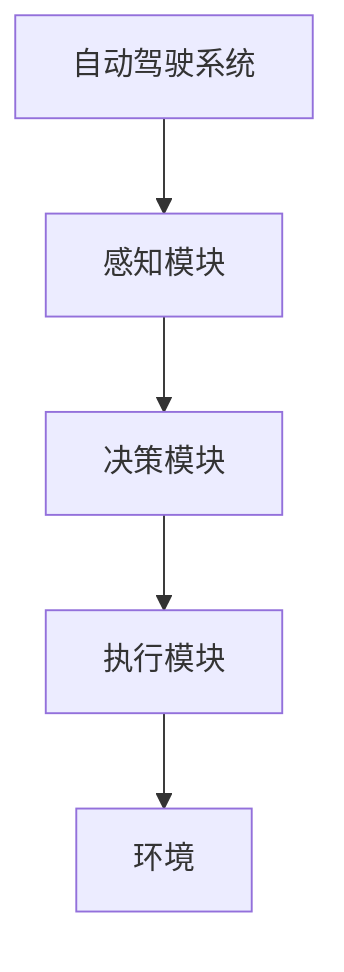
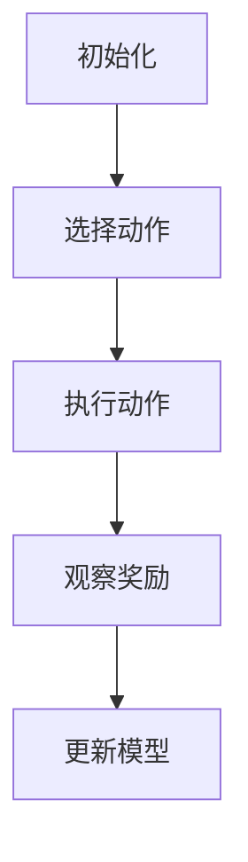

                 


# AI Agent的强化学习在自动驾驶中的应用

## 关键词：
自动驾驶、AI Agent、强化学习、Q-learning、DQN算法

## 摘要：
本文深入探讨了AI Agent在自动驾驶中的应用，特别是强化学习技术在智能决策中的作用。通过分析强化学习的基本原理、算法实现、系统架构设计以及实际应用案例，本文详细阐述了AI Agent如何通过强化学习实现自动驾驶系统中的智能决策，解决了传统控制方法在复杂场景下的局限性。文章还提供了丰富的数学模型、算法流程图和代码实现，帮助读者全面理解强化学习在自动驾驶中的实际应用。

---

# 第一部分: 引言

## 第1章: 自动驾驶的发展与挑战

### 1.1 自动驾驶的定义与分类
自动驾驶技术是一种通过传感器、计算机视觉、人工智能和机器学习等技术实现的智能驾驶系统。根据自动化程度的不同，自动驾驶可以分为L0到L5六个等级，其中L5代表完全无人驾驶。

### 1.2 自动驾驶的核心技术
自动驾驶的核心技术包括：
1. **传感器技术**：如激光雷达（LiDAR）、摄像头、雷达等，用于感知环境。
2. **定位技术**：如GPS、SLAM（同步定位与地图构建）。
3. **路径规划**：基于感知数据，规划车辆行驶路径。
4. **决策控制**：通过AI算法做出驾驶决策并控制车辆执行。

### 1.3 自动驾驶面临的挑战
1. **复杂环境感知**：在复杂交通环境中，如何准确识别障碍物、行人和交通信号。
2. **决策不确定性**：在动态环境中，如何做出最优决策。
3. **安全与可靠性**：自动驾驶系统必须在极端情况下保证安全。

---

# 第二部分: AI Agent与强化学习的核心概念

## 第2章: AI Agent的基本概念

### 2.1 AI Agent的定义
AI Agent是一种智能体，能够通过感知环境并采取行动来实现特定目标。在自动驾驶中，AI Agent通常负责车辆的决策和控制。

### 2.2 AI Agent的特点
1. **自主性**：能够在没有外部干预的情况下自主决策。
2. **反应性**：能够实时感知环境并做出反应。
3. **学习能力**：通过强化学习等技术，AI Agent可以不断优化自己的决策策略。

## 第3章: 强化学习的基本原理

### 3.1 强化学习的定义
强化学习是一种机器学习范式，通过智能体与环境的交互，智能体通过试错的方式学习如何采取最优动作以最大化累计奖励。

### 3.2 强化学习的核心要素
1. **状态（State）**：环境当前的状况。
2. **动作（Action）**：智能体采取的行为。
3. **奖励（Reward）**：智能体采取动作后获得的反馈，用于指导学习。

### 3.3 强化学习与监督学习的区别
| 特性 | 监督学习 | 强化学习 |
|------|----------|----------|
| 数据来源 | 标签数据 | 奖励信号 |
| 反馈机制 | 立即反馈 | 延时反馈 |
| 应用场景 | 分类、回归 | 游戏、机器人控制 |

---

# 第三部分: 强化学习算法在自动驾驶中的应用

## 第4章: 基于Q-learning的强化学习算法

### 4.1 Q-learning算法的流程
1. 初始化Q表。
2. 选择动作。
3. 执行动作并观察奖励。
4. 更新Q值。
5. 循环直到终止条件。

### 4.2 Q-learning的数学模型
Q值更新公式：
$$ Q(s, a) = Q(s, a) + \alpha (r + \gamma \max Q(s', a') - Q(s, a)) $$
其中：
- $\alpha$ 是学习率。
- $\gamma$ 是折扣因子。

### 4.3 Q-learning在自动驾驶中的应用
以一个简单的避障任务为例，AI Agent通过Q-learning学习如何在不同状态下采取最优动作。

## 第5章: DQN算法的实现

### 5.1 DQN算法的核心思想
DQN（Deep Q-Network）通过深度神经网络近似Q值函数，解决Q-learning中Q表维度高的问题。

### 5.2 DQN算法的Python实现
```python
import numpy as np
import gym

class DQN:
    def __init__(self, env):
        self.env = env
        self.model = self.build_model()
    
    def build_model(self):
        # 简单的神经网络结构，可根据实际需求扩展
        model = Sequential()
        model.add(Dense(64, activation='relu', input_dim=self.env.observation_space.shape[0]))
        model.add(Dense(64, activation='relu'))
        model.add(Dense(self.env.action_space.n, activation='linear'))
        model.compile(optimizer=Adam(learning_rate=0.001), loss='mse')
        return model

    def remember(self, state, action, reward, next_state):
        # 简单的内存实现，可根据实际需求扩展
        pass

    def act(self, state):
        # 根据当前状态选择动作
        pass

    def train(self, batch_size):
        # 训练网络
        pass
```

### 5.3 DQN算法的数学模型
状态值函数：
$$ Q(s, a) = w \cdot \phi(s, a) $$
其中：
- $w$ 是权重参数。
- $\phi(s, a)$ 是状态动作的特征向量。

---

# 第四部分: 系统架构与实现

## 第6章: 自动驾驶系统的架构设计

### 6.1 系统功能模块
1. **感知模块**：处理传感器数据，识别障碍物和行人。
2. **决策模块**：基于强化学习算法，做出驾驶决策。
3. **执行模块**：将决策转化为具体的控制指令。

### 6.2 系统架构图


### 6.3 决策模块的强化学习实现


---

# 第五部分: 项目实战与案例分析

## 第7章: 强化学习在自动驾驶中的实际应用

### 7.1 项目环境搭建
1. 安装Python和相关库（如TensorFlow、Keras、OpenAI Gym）。
2. 配置开发环境（如Jupyter Notebook）。

### 7.2 代码实现
```python
import gym
import numpy as np
from tensorflow.keras import layers

# 定义环境
env = gym.make('CartPole-v1')

# 定义神经网络
model = layers.Sequential([
    layers.Dense(64, activation='relu', input_shape=(env.observation_space.shape[0],)),
    layers.Dense(64, activation='relu'),
    layers.Dense(env.action_space.n, activation='linear')
])

# 编译模型
model.compile(optimizer='adam', loss='mse')

# 训练过程
for episode in range(1000):
    state = env.reset()
    total_reward = 0
    done = False
    while not done:
        # 预测动作
        prediction = model.predict(np.array([state]))[0]
        action = np.argmax(prediction)
        # 执行动作
        next_state, reward, done, info = env.step(action)
        # 更新Q值
        target = reward + 0.99 * np.max(model.predict(np.array([next_state]))[0])
        target = target * 0.99 + reward
        target = target * 0.1 + prediction[action] * 0.9
        model.fit(np.array([state]), np.array([target]), epochs=1, verbose=0)
        state = next_state
        total_reward += reward
    print(f"Episode {episode}, Total Reward: {total_reward}")
```

### 7.3 案例分析
以CartPole问题为例，AI Agent通过强化学习算法，能够在较短时间内掌握平衡杆的任务。

---

# 第六部分: 最佳实践与总结

## 第8章: 强化学习在自动驾驶中的最佳实践

### 8.1 实践总结
1. **算法选择**：根据具体场景选择合适的强化学习算法（如Q-learning、DQN）。
2. **环境设计**：合理设计奖励函数，确保学习目标与任务一致。
3. **模型优化**：通过神经网络结构优化和超参数调整提升性能。

### 8.2 注意事项
1. **数据质量**：强化学习依赖高质量的环境反馈。
2. **安全问题**：自动驾驶系统必须确保在极端情况下的安全性。
3. **计算资源**：深度强化学习需要大量计算资源。

### 8.3 拓展阅读
1. Mnih, V., et al. "Human-level control through deep reinforcement learning." Nature, 2015.
2. 王飞跃. 《强化学习：算法与应用》. 北京: 清华大学出版社, 2018.

---

# 作者：AI天才研究院/AI Genius Institute & 禅与计算机程序设计艺术 /Zen And The Art of Computer Programming

