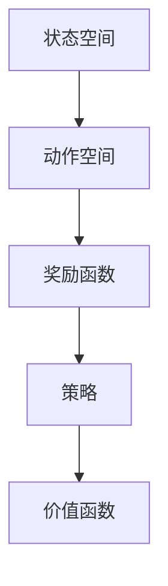

                 


# AI Agent的强化学习应用

> 关键词：AI Agent, 强化学习, 算法, 应用场景, 系统架构

> 摘要：本文探讨了AI Agent与强化学习的结合，分析了强化学习的核心原理及其在AI Agent中的应用，详细讲解了相关算法的实现与优化，并通过实际案例展示了AI Agent强化学习的应用场景及系统设计。

---

## 第1章: AI Agent与强化学习概述

### 1.1 强化学习的基本概念

强化学习（Reinforcement Learning, RL）是一种机器学习范式，其中智能体通过与环境交互来学习如何采取最优行动以最大化累积奖励。与监督学习不同，强化学习不需要标记的训练数据，而是通过试错和奖励机制来优化策略。

### 1.2 AI Agent的定义与特点

AI Agent（人工智能代理）是指在环境中能够感知并自主行动以实现目标的智能实体。AI Agent的特点包括自主性、反应性、主动性、社会性和学习性。

### 1.3 AI Agent与强化学习的结合

强化学习为AI Agent提供了学习最优策略的能力，使其能够在动态和不确定的环境中自主决策。通过强化学习，AI Agent能够在与环境交互的过程中不断优化其行为策略。

---

## 第2章: 强化学习的数学模型与算法

### 2.1 强化学习的数学模型

强化学习的核心概念包括状态空间、动作空间、奖励函数、策略和价值函数。状态空间是智能体可能遇到的所有状态的集合；动作空间是智能体在每个状态下可能执行的所有动作；奖励函数定义了智能体在每个状态下采取某个动作后获得的奖励；策略定义了智能体在每个状态下选择动作的概率分布；价值函数则衡量了从某个状态开始的期望累积奖励。

### 2.2 策略梯度方法

策略梯度方法通过直接优化策略的参数来最大化累积奖励。其数学公式可以表示为：

$$ \nabla \theta = \frac{\partial}{\partial \theta} \mathbb{E}[R] $$

其中，$\theta$ 是策略的参数，$R$ 是累积奖励。

### 2.3 深度强化学习

深度强化学习将深度神经网络与强化学习结合，用于处理高维状态空间和动作空间。DQN（Deep Q-Network）算法通过使用两个神经网络分别估计当前状态和目标状态的Q值，并通过经验回放和目标网络来稳定训练过程。

---

## 第3章: AI Agent强化学习的核心概念与联系

### 3.1 AI Agent强化学习的核心概念

在AI Agent强化学习中，核心概念包括状态、动作、奖励、策略和价值函数。这些概念相互关联，共同构成了强化学习的基本框架。

### 3.2 AI Agent强化学习的实体关系图

通过以下Mermaid图，可以清晰地理解AI Agent强化学习的核心实体及其关系：



---

## 第4章: AI Agent的强化学习应用

### 4.1 游戏AI

在游戏领域，强化学习被广泛应用于游戏AI的开发。例如，使用DQN算法训练AI在游戏环境中自主决策，以实现最优策略。

### 4.2 机器人控制

AI Agent强化学习在机器人控制中也有重要应用。通过强化学习，机器人能够在动态环境中自主调整其动作策略，以实现高效的目标达成。

### 4.3 自动驾驶

在自动驾驶领域，强化学习被用于训练自动驾驶系统在复杂交通环境中做出最优决策。通过模拟真实交通场景，自动驾驶系统可以在虚拟环境中不断优化其驾驶策略。

---

## 第5章: 项目实战

### 5.1 环境安装与配置

为了实现AI Agent的强化学习应用，首先需要安装必要的库，如TensorFlow、Keras和OpenAI Gym。以下是环境安装代码：

```bash
pip install tensorflow keras openai-gym
```

### 5.2 代码实现与分析

以下是一个简单的Q-learning算法实现：

```python
import numpy as np

class QLearner:
    def __init__(self, state_space, action_space, learning_rate=0.1, gamma=0.99):
        self.state_space = state_space
        self.action_space = action_space
        self.learning_rate = learning_rate
        self.gamma = gamma
        self.q_table = np.zeros((state_space, action_space))

    def choose_action(self, state):
        return np.argmax(self.q_table[state])

    def learn(self, state, action, reward, next_state):
        target = reward + self.gamma * np.max(self.q_table[next_state])
        self.q_table[state][action] += self.learning_rate * (target - self.q_table[state][action])

# 示例使用
learner = QLearner(5, 2)
learner.learn(0, 1, 1, 2)
```

### 5.3 案例分析

通过上述代码实现，我们可以看到Q-learning算法的基本流程：初始化Q表、选择动作、执行动作、获取奖励、更新Q值。在实际应用中，可以根据具体场景对算法进行优化和调整。

---

## 第6章: 总结与展望

### 6.1 本章小结

本文详细探讨了AI Agent的强化学习应用，从基本概念到算法实现，再到实际应用案例，全面解析了强化学习在AI Agent中的重要作用。

### 6.2 未来展望

随着深度学习和强化学习的不断发展，AI Agent在各个领域的应用前景广阔。未来，可以通过多智能体协作、强化学习与生成模型的结合等方向进一步优化AI Agent的性能。

---

## 作者：AI天才研究院/AI Genius Institute & 禅与计算机程序设计艺术 /Zen And The Art of Computer Programming

