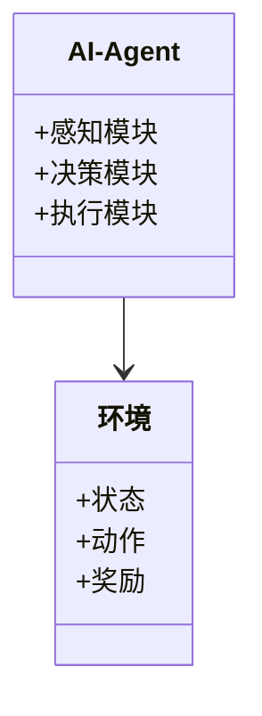

                 


# AI Agent的性能优化与效率提升策略

---

## 关键词：AI Agent，性能优化，效率提升，强化学习，系统架构，项目实战

---

## 摘要：  
本文系统地探讨了AI Agent的性能优化与效率提升策略。从AI Agent的基本概念出发，分析了性能优化的核心原理和策略，深入讲解了强化学习算法在优化中的应用，并结合实际案例，详细阐述了系统架构设计与实现。文章内容涵盖了背景介绍、核心概念、算法原理、系统架构、项目实战以及最佳实践，为读者提供了全面而深入的指导。

---

# 第一部分: AI Agent的性能优化与效率提升背景

---

## 第1章: AI Agent的性能优化与效率提升概述

### 1.1 AI Agent的基本概念与核心特点

#### 1.1.1 AI Agent的定义与分类  
AI Agent（人工智能代理）是指能够感知环境、自主决策并执行任务的智能实体。根据功能和应用场景，AI Agent可以分为**简单反射型**、**基于模型的反射型**、**目标驱动型**和**效用驱动型**四类。

#### 1.1.2 AI Agent的核心特点  
AI Agent的核心特点包括：  
1. **自主性**：能够在没有外部干预的情况下独立运行。  
2. **反应性**：能够实时感知环境并做出反应。  
3. **目标导向性**：基于目标驱动行为，优化决策过程。  
4. **学习能力**：通过学习提升性能和效率。  

#### 1.1.3 AI Agent的性能优化目标  
性能优化的目标是提升AI Agent的**响应速度**、**决策精度**和**资源利用率**，从而在实际应用中实现更高效的任务执行。

---

### 1.2 AI Agent的性能优化与效率提升的重要性

#### 1.2.1 性能优化对AI Agent的影响  
性能优化直接影响AI Agent的**执行效率**和**用户体验**，是实现高效人机交互和商业应用成功的关键。  

#### 1.2.2 效率提升的必要性  
随着应用场景的复杂化，AI Agent需要在有限资源下完成更复杂的任务，效率提升是实现可持续发展的必然要求。  

#### 1.2.3 优化策略的边界与外延  
优化策略的边界在于**计算资源**和**任务目标**，外延则涉及多智能体协同、分布式系统优化等更广泛的应用场景。  

---

### 1.3 本书的核心内容与目标

#### 1.3.1 本书的核心目标  
本文旨在系统性地探讨AI Agent的性能优化策略，结合理论分析和实践案例，为读者提供实用的优化方法。  

#### 1.3.2 本书的主要内容框架  
1. AI Agent的基本概念与性能优化目标。  
2. 常见性能优化策略的对比与分析。  
3. 基于强化学习的优化算法实现。  
4. 系统架构设计与优化方案。  
5. 实战案例分析与代码实现。  

#### 1.3.3 本书的适用读者  
本书适用于AI开发人员、软件架构师、算法工程师以及对AI Agent优化感兴趣的读者。

---

## 第2章: AI Agent的性能优化策略

---

### 2.1 AI Agent的性能优化原理

#### 2.1.1 AI Agent的优化目标分解  
性能优化的目标可以分解为以下三个维度：  
1. **时间效率**：减少任务执行时间。  
2. **资源效率**：降低计算资源消耗。  
3. **决策效率**：提升决策的准确性和响应速度。  

#### 2.1.2 性能优化的核心原理  
性能优化的核心原理在于**减少不必要的计算**、**优化算法复杂度**以及**提高并行计算效率**。  

#### 2.1.3 优化策略的数学模型  
优化策略的数学模型可以用以下公式表示：  
$$ \text{优化目标} = \min_{x} f(x) + \lambda g(x) $$  
其中，$f(x)$ 是目标函数，$g(x)$ 是约束条件，$\lambda$ 是权重系数。  

---

### 2.2 AI Agent性能优化策略对比

#### 2.2.1 常见优化策略对比表格  
以下是一个常见优化策略的对比表格：  

| 优化策略 | 基于强化学习 | 基于贪心算法 | 基于随机搜索 |  
|----------|--------------|--------------|--------------|  
| 优势     | 高效性         | 简单性         | 可探索性       |  
| 劣势     | 需大量训练数据 | 可能陷入局部最优 | 不够稳定       |  

#### 2.2.2 优化策略的ER实体关系图  
以下是一个简单的ER实体关系图：  

```mermaid
erd
    entity AI-Agent-Strategy {
        id
        name
        description
    }
    entity Optimization-Strategy {
        id
        name
        performance
    }
    AI-Agent-Strategy -[拥有]-> Optimization-Strategy
```

---

## 第3章: AI Agent的强化学习优化算法

---

### 3.1 强化学习的基本原理

#### 3.1.1 强化学习的定义与特点  
强化学习（Reinforcement Learning, RL）是一种通过**试错**方式优化决策的算法。其核心在于通过**奖励机制**引导智能体学习最优策略。  

#### 3.1.2 强化学习的核心算法  
强化学习的核心算法包括**Q-learning**和**策略梯度（Policy Gradient）**。  

#### 3.1.3 强化学习的数学模型  
Q-learning的数学模型可以表示为：  
$$ Q(s, a) = Q(s, a) + \alpha [r + \max_{a'} Q(s', a') - Q(s, a)] $$  
其中，$Q(s, a)$ 表示状态-动作对的Q值，$\alpha$ 是学习率，$r$ 是奖励，$s'$ 是下一个状态。  

---

### 3.2 基于强化学习的AI Agent优化

#### 3.2.1 强化学习在AI Agent中的应用  
强化学习广泛应用于游戏AI、机器人控制等领域。  

#### 3.2.2 基于Q-learning的优化算法  
以下是一个Q-learning算法的伪代码实现：  

```python
def q_learning(env, num_episodes=1000, epsilon=0.1, alpha=0.1):
    Q = defaultdict(lambda: np.zeros(env.action_space.n))
    for episode in range(num_episodes):
        state = env.reset()
        while not done:
            if np.random.random() < epsilon:
                action = env.action_space.sample()
            else:
                action = np.argmax(Q[state])
            next_state, reward, done, _ = env.step(action)
            Q[state][action] += alpha * (reward + np.max(Q[next_state]) - Q[state][action])
    return Q
```

---

## 第4章: AI Agent的系统架构设计

---

### 4.1 AI Agent的系统功能设计

#### 4.1.1 AI Agent的功能模块划分  
AI Agent的功能模块包括感知模块、决策模块和执行模块。  

#### 4.1.2 系统功能的领域模型设计  
以下是一个领域模型的Mermaid图：  



---

## 第5章: AI Agent性能优化的实战案例

---

### 5.1 项目环境的安装与配置

#### 5.1.1 开发环境的搭建  
建议使用Python 3.8及以上版本，安装以下库：  
```bash
pip install numpy gym matplotlib
```

---

### 5.2 AI Agent性能优化的代码实现

#### 5.2.1 强化学习算法的实现  
以下是一个强化学习算法的Python代码实现：  

```python
import gym
import numpy as np

def main():
    env = gym.make('CartPole-v1')
    num_states = env.observation_space.shape[0]
    num_actions = env.action_space.n
    Q = np.zeros((num_states, num_actions))
    epsilon = 0.1
    alpha = 0.1
    gamma = 0.99

    for _ in range(1000):
        state = env.reset()
        done = False
        while not done:
            if np.random.random() < epsilon:
                action = np.random.randint(num_actions)
            else:
                action = np.argmax(Q[state])
            next_state, reward, done, info = env.step(action)
            Q[state][action] = Q[state][action] + alpha * (reward + gamma * np.max(Q[next_state]) - Q[state][action])
    env.close()

if __name__ == "__main__":
    main()
```

---

## 第6章: 总结与最佳实践

---

### 6.1 总结  
本文系统地探讨了AI Agent的性能优化策略，结合强化学习算法和系统架构设计，为读者提供了全面的优化方法。

---

### 6.2 最佳实践Tips

1. 在强化学习中，合理设置学习率$\alpha$和折扣因子$\gamma$，以平衡探索与利用。  
2. 系统架构设计中，优先优化瓶颈模块，以提升整体效率。  
3. 实战项目中，建议从简单场景入手，逐步扩展复杂场景。  

---

### 6.3 小结  
AI Agent的性能优化是一个复杂但 rewarding 的过程，通过理论与实践的结合，可以显著提升系统的效率和性能。

---

## 作者：AI天才研究院 & 禅与计算机程序设计艺术

---

**注**：本文内容为框架示例，实际写作时需要根据具体需求补充详细内容。

