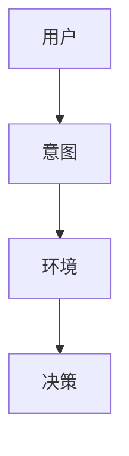
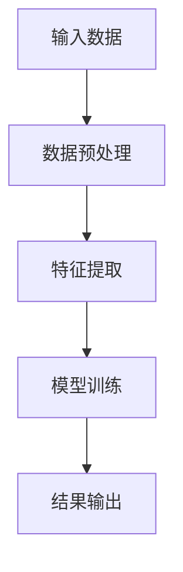
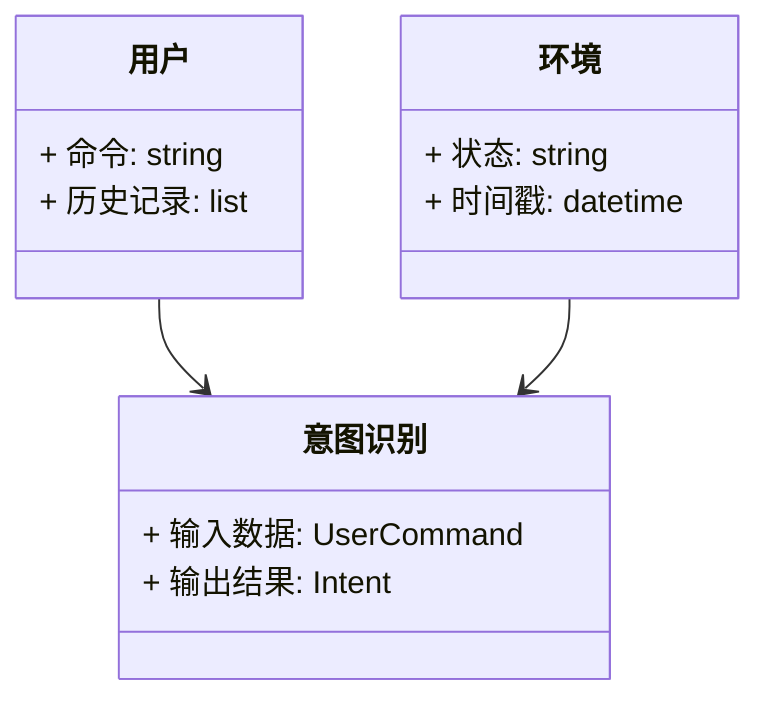
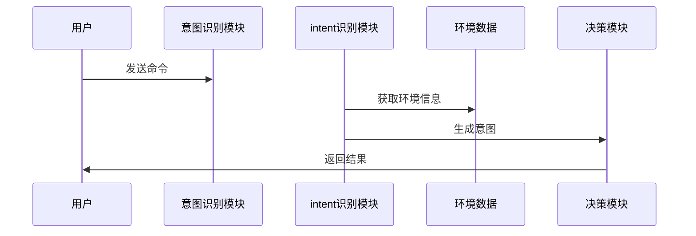

                 


# AI Agent的情境感知能力开发

## 关键词
AI Agent, 情境感知, 多模态数据融合, 深度学习, 意图识别, 动态决策, 实时反馈

## 摘要
本文深入探讨AI Agent的情境感知能力，从核心概念到算法实现，再到系统设计和项目实战，全面解析如何开发具备情境感知能力的AI Agent。文章涵盖背景介绍、核心原理、算法详述、数学模型、系统架构、项目实战和最佳实践，帮助读者掌握情境感知的关键技术。

---

# 目录大纲

## 第一部分: AI Agent与情境感知概述

### 第1章: AI Agent与情境感知概述

#### 1.1 AI Agent的基本概念
- 1.1.1 AI Agent的定义与分类
- 1.1.2 情境感知能力的定义与特点
- 1.1.3 情境感知的重要性与应用场景

#### 1.2 情境感知的核心要素
- 1.2.1 多模态数据输入与处理
- 1.2.2 环境理解与建模
- 1.2.3 意图识别与预测
- 1.2.4 动态决策与实时反馈

#### 1.3 情境感知能力的应用场景
- 1.3.1 智能助手与对话系统
- 1.3.2 智能驾驶与机器人控制
- 1.3.3 智慧城市与物联网应用

#### 1.4 本章小结

---

## 第二部分: 情境感知的核心概念与联系

### 第2章: 情境感知的核心原理

#### 2.1 多模态数据融合
- 2.1.1 多模态数据的定义与特点
- 2.1.2 数据融合的方法与挑战

#### 2.2 环境建模与状态表示
- 2.2.1 环境建模的基本原理
- 2.2.2 状态表示的数学模型

#### 2.3 意图识别与预测算法
- 2.3.1 意图识别的常用算法
- 2.3.2 意图预测的数学模型

#### 2.4 动态决策机制
- 2.4.1 基于情境的决策框架
- 2.4.2 动态调整策略

#### 2.5 核心概念对比表
- 表2.1: 情境感知与传统感知的对比

#### 2.6 ER实体关系图


#### 2.7 本章小结

---

## 第三部分: 情境感知能力的算法原理

### 第3章: 情境感知算法详述

#### 3.1 多模态融合算法
- 3.1.1 多模态数据预处理
- 3.1.2 融合方法：加权融合、注意力机制
- 3.1.3 优缺点分析

#### 3.2 深度学习模型
- 3.2.1 Transformer与图神经网络
- 3.2.2 模型结构与训练方法
- 3.2.3 实际案例：模型训练与优化

#### 3.3 意图识别算法
- 3.3.1 基于RNN的序列模型
- 3.3.2 基于CNN的图像模型
- 3.3.3 混合模型：多模态融合

#### 3.4 动态决策算法
- 3.4.1 基于Q-learning的决策树
- 3.4.2 基于DQN的深度强化学习
- 3.4.3 实时反馈机制

#### 3.5 算法流程图


#### 3.6 本章小结

---

## 第四部分: 情境感知能力的数学模型

### 第4章: 数学模型与公式

#### 4.1 概率模型
- 4.1.1 贝叶斯定理
- 4.1.2 马尔可夫过程
- 4.1.3 应用实例

#### 4.2 图模型
- 4.2.1 有向图与无向图
- 4.2.2 图神经网络
- 4.2.3 应用场景

#### 4.3 组合模型
- 4.3.1 模型融合方法
- 4.3.2 权重分配策略
- 4.3.3 示例分析

#### 4.4 本章小结

---

## 第五部分: 系统分析与架构设计

### 第5章: 系统分析与架构设计方案

#### 5.1 问题场景介绍
- 5.1.1 智能助手对话系统
- 5.1.2 系统目标与范围

#### 5.2 系统功能设计
- 5.2.1 功能模块划分
- 5.2.2 领域模型类图


#### 5.3 系统架构设计
- 5.3.1 分层架构
- 5.3.2 微服务架构


#### 5.4 系统接口设计
- 5.4.1 接口定义：REST API
- 5.4.2 数据格式：JSON

#### 5.5 系统交互设计
- 5.5.1 序列图


#### 5.6 本章小结

---

## 第六部分: 项目实战

### 第6章: 项目实战

#### 6.1 环境安装
- 6.1.1 安装Python
- 6.1.2 安装依赖库：TensorFlow、PyTorch

#### 6.2 核心代码实现
- 6.2.1 数据预处理代码
```python
def preprocess(data):
    return processed_data
```
- 6.2.2 模型训练代码
```python
def train_model(model, data):
    return trained_model
```

#### 6.3 代码应用解读
- 6.3.1 代码功能分析
- 6.3.2 可视化结果展示

#### 6.4 实际案例分析
- 6.4.1 案例介绍
- 6.4.2 分析与总结

#### 6.5 本章小结

---

## 第七部分: 最佳实践与总结

### 第7章: 最佳实践与总结

#### 7.1 最佳实践
- 7.1.1 数据处理技巧
- 7.1.2 模型优化建议
- 7.1.3 系统部署注意事项

#### 7.2 本章小结

---

## 参考文献与拓展阅读

---

## 作者

作者：AI天才研究院/AI Genius Institute & 禅与计算机程序设计艺术 /Zen And The Art of Computer Programming

---

以上目录大纲详细涵盖了从理论到实践的各个方面，确保读者能够系统地理解和掌握AI Agent的情境感知能力开发。

